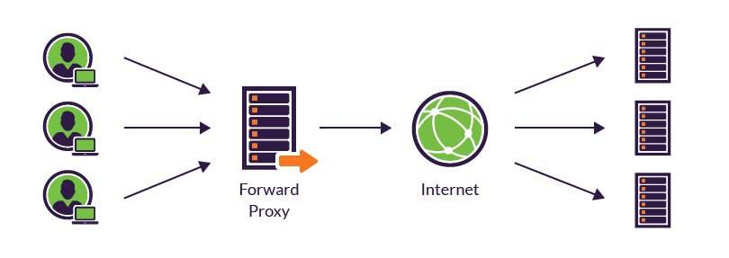
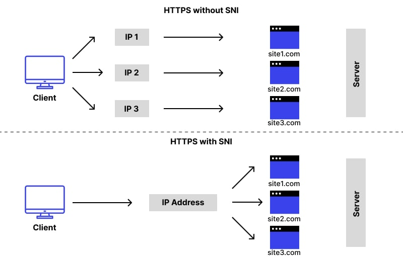

Table of Contents
=================

* [Proxy types](#proxy-types)
   * [Forward proxy](#forward-proxy)
   * [Reverse proxy](#reverse-proxy)
   * [Receiving proxy vs Loadbalancer](#receiving-proxy-vs-loadbalancer)
      * [Reverse proxy](#reverse-proxy-1)
      * [Loadbalancer](#loadbalancer)
   * [Layer 4 Loadbalancer](#layer-4-loadbalancer)
   * [Layer 7 Loadbalancer](#layer-7-loadbalancer)
* [HAProxy](#haproxy)
   * [HAProxy features](#haproxy-features)
   * [Things HAProxy is not](#things-haproxy-is-not)
   * [Install HAProxy](#install-haproxy)
      * [1. <strong>Linux (Debian/Ubuntu)</strong>](#1-linux-debianubuntu)
      * [2. <strong>Linux (Red Hat/CentOS)</strong>](#2-linux-red-hatcentos)
      * [3. <strong>Compile from Source</strong>](#3-compile-from-source)
      * [4. <strong>Docker</strong>](#4-docker)
      * [5. <strong>Configuration</strong>](#5-configuration)
   * [HAProxy configuration](#haproxy-configuration)
   * [HAProxy modes](#haproxy-modes)
   * [HAProxy Error responses](#haproxy-error-responses)
      * [Basic Syntax](#basic-syntax)
      * [Example](#example)
      * [Additional Notes](#additional-notes)
      * [Example Configuration Snippet](#example-configuration-snippet)
   * [HAProxy timeouts](#haproxy-timeouts)
   * [HAProxy Access Control List (ACL) and fetching samples <a href="http://docs.haproxy.org/2.8/configuration.html#7" rel="nofollow">[Official Documentation]</a>](#haproxy-access-control-list-acl-and-fetching-samples-official-documentation)
      * [Basic ACL Syntax](#basic-acl-syntax)
      * [Example](#example-1)
      * [Using ACLs in Configuration](#using-acls-in-configuration)
      * [Types of ACL Conditions](#types-of-acl-conditions)
      * [Combining ACLs](#combining-acls)
      * [HAProxy Matching Methods](#haproxy-matching-methods)
      * [Path-related criteria in HAProxy ACLs](#path-related-criteria-in-haproxy-acls)
      * [Fetching Samples](#fetching-samples)
      * [Combined Example](#combined-example)
   * [Directives in HAProxy](#directives-in-haproxy)
      * [Example Configuration Snippet](#example-configuration-snippet-1)
   * [HAProxy stickiness](#haproxy-stickiness)
      * [Basic Stickiness Configuration](#basic-stickiness-configuration)
      * [Additional Stickiness Options](#additional-stickiness-options)
      * [Example with Cookie Stickiness](#example-with-cookie-stickiness)
   * [Health checks in HAProxy](#health-checks-in-haproxy)
      * [1. <strong>Backend Server Health Checks</strong>](#1-backend-server-health-checks)
      * [2. <strong>option httpchk Directive</strong>](#2-option-httpchk-directive)
      * [3. <strong>option tcp-check Directive</strong>](#3-option-tcp-check-directive)
      * [4. <strong>http-check expect Directive</strong>](#4-http-check-expect-directive)
      * [5. <strong>server ... check Directive</strong>](#5-server--check-directive)
      * [6. <strong>Health Check Intervals</strong>](#6-health-check-intervals)
      * [7. <strong>rise and fall Parameters</strong>](#7-rise-and-fall-parameters)
      * [8. <strong>Custom Health Check Scripts</strong>](#8-custom-health-check-scripts)
   * [HAProxy Load Balancing Algorithms](#haproxy-load-balancing-algorithms)
      * [Basic Usage](#basic-usage)
      * [Use Cases](#use-cases)
      * [Without whole Keyword](#without-whole-keyword)
   * [HAProxy disabled otption](#haproxy-disabled-otption)
      * [Common Use Cases](#common-use-cases)
      * [Enabling a Disabled Server](#enabling-a-disabled-server)
   * [Redirections](#redirections)
      * [1. HTTP Redirection using http-request redirect](#1-http-redirection-using-http-request-redirect)
      * [2. SSL/TLS Redirection](#2-ssltls-redirection)
      * [3. Path-Based Redirection](#3-path-based-redirection)
      * [4. Custom Redirection Logic](#4-custom-redirection-logic)
      * [5. Using errorfile for Redirection](#5-using-errorfile-for-redirection)
      * [6. Dynamically Computed Redirects](#6-dynamically-computed-redirects)
   * [http-request](#http-request)
   * [set-header](#set-header)
      * [Syntax](#syntax)
      * [Examples](#examples)
         * [1. Basic Header Modification](#1-basic-header-modification)
         * [2. Conditional Header Modification](#2-conditional-header-modification)
         * [3. Using Variables](#3-using-variables)
         * [4. Combining Conditions](#4-combining-conditions)
   * [Backup backend](#backup-backend)
   * [cookies](#cookies)
   * [Stick table](#stick-table)
         * [Scenario](#scenario)
   * [Runnig HAProxy multi-thread](#runnig-haproxy-multi-thread)
   * [Logging](#logging)
      * [Explainging log directive](#explainging-log-directive)
      * [Log formating](#log-formating)
         * [Exapmle](#exapmle)
      * [Send HAProxy logs to rsyslog](#send-haproxy-logs-to-rsyslog)
         * [HAProxy Configuration](#haproxy-configuration-1)
         * [rsyslog Configuration](#rsyslog-configuration)
   * [TLS/SSL](#tlsssl)
      * [Obtaining a certificate from Let's Encrypt using Certbot](#obtaining-a-certificate-from-lets-encrypt-using-certbot)
         * [Prerequisites](#prerequisites)
         * [Obtaining a Let's Encrypt Certificate](#obtaining-a-lets-encrypt-certificate)
         * [Configuring Your Web Server](#configuring-your-web-server)
      * [SSL Types](#ssl-types)
         * [1. <strong>SSL Termination</strong>](#1-ssl-termination)
         * [2. <strong>SSL Passthrough</strong>](#2-ssl-passthrough)
         * [3. <strong>SSL Re-encryption (or SSL Re-termination)</strong>](#3-ssl-re-encryption-or-ssl-re-termination)
         * [Pros and Cons](#pros-and-cons)
      * [Use certificate in HAProxy](#use-certificate-in-haproxy)
         * [Example for TCP Mode (non-SSL)](#example-for-tcp-mode-non-ssl)
         * [Example for HTTP Mode (SSL/TLS Termination)](#example-for-http-mode-ssltls-termination)
         * [Important Note](#important-note)
         * [HAProxy configuration](#haproxy-configuration-2)
         * [Certbot command](#certbot-command)
      * [HAProxy SSL/TLS Security](#haproxy-ssltls-security)
         * [Set SSL/TSL restriction](#set-ssltsl-restriction)
         * [Set cypher](#set-cypher)
   * [URL rewriting](#url-rewriting)
   * [Tips](#tips)

# Proxy types
## Forward proxy

Forward proxies are typically used internally by large organizations, such as universities and enterprises, to:
1. Block employees to visit certain website
1. Monitoring employees online activity
1. Block malicious traffic from reaching an origin server
1. Improve the user experience by caching external site content



## Reverse proxy
1. Receiving a user connection request
1. Completing a TCP thee-way handshake, terminating the initial connection
1. Connecting with the origin server and forwarding the original request


## Receiving proxy vs Loadbalancer

###  Reverse proxy:

A reverse proxy accepts a request from a client, forwards it to a server
that can fulfill it, and returns the server's response to the client.

* Increase security
* Increase scalability and flexibility
* Compression
* SSL termination
* Caching

### Loadbalancer

A load balancer distributes incoming client requests amount a group of
servers, in each case returning the response from the selected server to
appropriate client.

* Are most commonly deployed when a site needs multiple servers because
  the volume of requests is too much for a single server to handle
  efficiently 


## Layer 4 Loadbalancer

Forwards packets based on basic rules, if only knows `IP` and `Port`
and perhaps latency of the target service. That is what is available at
Layer 3/4. This load balancer doesn't look at the content so it doesn't
know the protocol whether its HTTP or not, it doesn't know the URL or
the path or the resource you are consuming or whether you are using
`GET` or `POST`

> A Layer 4 load balancer operates at the transport layer of the OSI
> model, making routing decisions based on factors like
> source/destination IP addresses and port numbers. It distributes
> incoming traffic across multiple servers, focusing on network and
> transport layer information (e.g., TCP or UDP). Unlike Layer 7 load
> balancers, Layer 4 balancers don't inspect application layer data,
> making them efficient for simple connection-based load balancing.

| **Pros of Layer 4 Load Balancers**      | **Cons of Layer 4 Load Balancers**          |
|---------------------------------------|--------------------------------------------|
| Efficient for basic load balancing.    | Limited application awareness.             |
| Low latency, suitable for performance-sensitive applications. | Inability to differentiate content types. |
| Versatile, can handle various types of traffic (TCP, UDP). | Less granular control over traffic routing. |
| Simple configuration and management.   | No SSL termination; backend servers handle encryption. |
| Effective for network layer decisions (IP addresses, port numbers). | Challenges in handling heterogeneous applications. |

## Layer 7 Loadbalancer

The load balancing operates at the high-level application layer, which
is responsible for the actual contents of the message. Layer 7 load
balancers route network traffic in a more complex manner, usually
applicable to TCP-Based traffic like HTTP. Unlike Layer 4, a Layer 7
load balancer terminates the network traffic and reads the message
within. It makes a decision based on the content of the message.
Afterwhich, it makes a new TCP connection to the selected upstream
server and writes the request to the server. It can also cache, Layer 4
isn't capable of doing so as it has no clue of what's in the packets.

| **Pros of Layer 7 Load Balancers** | **Cons of Layer 7 Load Balancers** |
|-------------------------------------|-------------------------------------|
| Application Awareness               | Higher processing overhead         |
| Content-Based Routing               | Potential for increased latency     |
| SSL Termination                     | Complex configuration              |
| Adaptability                        | Resource intensiveness              |
| Advanced Load Balancing Algorithms  | May not handle high connection counts as efficiently |


# HAProxy

## HAProxy features

* Layer 4 (TCP) and Layer 7 (HTTP) load balancing
* URL Rewriting
* Rate limiting
* SSL/TLS termination
* Gzip compression
* Proxy protocol support
* Health checking
* Connection and HTTP message logging
* HTTP/2
* Multithreading
* Hitless reload
* Lua and SPOE support
* API support
* Syslog (UDP, TCP)
* Cache
* Hatop and state socket manage
* Status page

## Things HAProxy is not 


HAProxy is also not a Web server in the way that IIS, Apache and NGINX
are. It doesn't generate Web pages or respond to requests using Web
frameworks like Ruby on Rails or ASP.NET. It will, however, forward
requests to the appropriate Web servers and relay their responses.
HAProxy's biggest value comes in its ability to provide scalability and
high availability for your servers.

HAProxy is not a firewall. It can protect your servers from some threats
like clients requesting too much data all at once. However, it is not
designed to filter traffic between networks, detect and stop
sophisticated attacks like cross-site scripting, or grant access to
ports. There are other tools, such as ModSecurity and Citrix NetScaler,
that act as that kind of security barrier. HAProxy works well alongside
these tools.

Finally, HAProxy is not a forward proxy, like Squid is, that's used to
hide your identity on the Web or to block employees from accessing
certain websites. A forward proxy sits closer to the client, forwarding
their requests to the Internet. HAProxy is a reverse proxy, which relays
traffic for servers.


## Install HAProxy

### 1. **Linux (Debian/Ubuntu):**

   - **Using APT:**
     ```bash
     sudo apt-get update
     sudo apt-get install haproxy
     ```

   - **Using Snap:**
     ```bash
     sudo snap install haproxy
     ```
> **Note:** For install specific version use [this site](https://haproxy.debian.net/)

### 2. **Linux (Red Hat/CentOS):**

   - **Using YUM:**
     ```bash
     sudo yum install haproxy
     ```

### 3. **Compile from Source:**

   - Download the source code from the official HAProxy website (http://www.haproxy.org/).
   - Extract the source tarball and navigate into the source directory.
   - Compile and install:
     ```bash
     make clean
     make -j $(nproc) TARGET=linux-glibc \
                USE_OPENSSL=1 USE_LUA=1 USE_PCRE=1 USE_SYSTEMD=1
     sudo make install
     ```
> **Note:** For more information read the [official documentation](https://github.com/haproxy/haproxy/blob/master/INSTALL)

### 4. **Docker:**

   - Pull the official HAProxy Docker image:
     ```bash
     docker pull haproxy
     ```

   - You can then run HAProxy as a Docker container, customizing the configuration and settings as needed.

### 5. **Configuration:**

After installation, you'll need to configure HAProxy based on your requirements. The configuration file is usually located at `/etc/haproxy/haproxy.cfg` on Linux systems.

## HAProxy configuration

The HAProxy configuration file is organized into different sections, each responsible for defining specific aspects of the load balancer's behavior. Here's an explanation of the main parts of an HAProxy configuration file:

1. **Global Section:**
   - The `global` section contains settings that apply globally to the entire HAProxy configuration.
   - It includes parameters like the maximum number of allowed connections, default log levels, and other global settings.
   - Example:
     ```plaintext
     global
       log /dev/log local0
       log /dev/log local1 notice
       user haproxy
       group haproxy
       maxconn 4096
       daemon
     ```

2. **Defaults Section:**
   - The `defaults` section sets default parameters for frontends and backends if specific values are not defined in those sections.
   - It includes parameters like timeouts, logging settings, and default load balancing algorithm.
   - Example:
     ```plaintext
     defaults
       log global
       mode http
       timeout connect 5000ms
       timeout client 50000ms
       timeout server 50000ms
     ```

3. **Frontend Section:**
   - The `frontend` section defines a logical entry point for incoming traffic.
   - It specifies how to process incoming requests, such as listening on a specific IP and port, defining ACLs (Access Control Lists), and associating a backend for further processing.
   - Example:
     ```plaintext
     frontend web_frontend
       bind *:80
       mode http
       acl is_api path_beg /api
       use_backend api_backend if is_api
       default_backend web_backend
     ```

4. **Backend Section:**
   - The `backend` section configures the behavior of servers handling requests that have been through a frontend.
   - It includes server definitions, load balancing algorithms, health checks, and other backend-specific settings.
   - Example:
     ```plaintext
     backend web_backend
       mode http
       balance roundrobin
       server web_server1 192.168.1.10:8080 check
       server web_server2 192.168.1.11:8080 check
     ```

5. **Listen Section:**
   - The `listen` section is a combination of frontend and backend definitions. It is a simpler way to define both the frontend and backend configurations in a single block.
   - Example:
     ```plaintext
     listen web_listen
       bind *:80
       mode http
       balance roundrobin
       server web_server1 192.168.1.10:8080 check
       server web_server2 192.168.1.11:8080 check
     ```

6. **User-Defined Sections:**
   - Beyond the standard sections, you can define your custom sections for specific purposes.
   - For example, you might create a section for custom Lua scripts, advanced ACL configurations, or any other specific requirements.

These sections collectively define how HAProxy handles incoming traffic, routes requests to appropriate backends, and manages the overall behavior of the load balancer. The configuration syntax is typically declarative, specifying what behavior is desired rather than how to achieve it. Each section has its own parameters and settings, allowing for fine-grained control over HAProxy's behavior.

## HAProxy modes

HAProxy supports different modes, each catering to specific use cases. The two primary modes are TCP mode and HTTP mode, and they determine how HAProxy processes and handles traffic.

1. **TCP Mode:**
   - In TCP mode, HAProxy operates at the transport layer (Layer 4 of the OSI model).
   - It works with TCP and UDP protocols, making it suitable for a wide range of applications beyond HTTP.
   - TCP mode is often used for generic TCP load balancing where the content of the packets is not inspected at the application layer.
   - Example configuration:
     ```plaintext
     mode tcp
     ```

2. **HTTP Mode:**
   - In HTTP mode, HAProxy operates at the application layer (Layer 7 of the OSI model).
   - It is specifically designed for processing and load balancing HTTP and HTTPS traffic.
   - In HTTP mode, HAProxy can inspect and manipulate HTTP headers, perform content-based routing, and support features like SSL termination for HTTPS traffic.
   - Example configuration:
     ```plaintext
     mode http
     ```

3. **TCP and HTTP Hybrid Mode:**
   - HAProxy also supports a hybrid mode where it can intelligently switch between TCP and HTTP modes based on the content of the initial data from the client.
   - This is useful when HAProxy needs to handle a mix of HTTP and non-HTTP traffic on the same port.
   - Example configuration:
     ```plaintext
     mode http
     option http-server-close
     option httplog
     timeout connect 5s
     timeout client 5s
     timeout server 5s
     tcp-request inspect-delay 5s
     tcp-request content accept if HTTP
     ```

The choice between TCP mode and HTTP mode depends on the type of traffic
your application handles. If you're dealing with generic TCP or UDP
traffic, TCP mode is suitable. If you're specifically dealing with
HTTP/HTTPS traffic and need application-layer features like
content-based routing, SSL termination, and HTTP header manipulation,
then HTTP mode is the appropriate choice.

It's important to note that once the mode is set in the configuration,
it affects how HAProxy processes the traffic. For instance, in TCP mode,
HAProxy doesn't inspect or manipulate HTTP content, and in HTTP mode, it
provides additional features specific to HTTP traffic. Hybrid mode can
be advantageous when dealing with mixed traffic types on the same port.

## HAProxy Error responses

The `errorfile` directive in HAProxy's configuration is used to specify a custom HTML file that will be displayed to users when a particular HTTP error response is generated. This directive allows you to provide a more user-friendly and branded error page instead of the default error message that the browser generates.

Here's a breakdown of how to use the `errorfile` directive in an HAProxy configuration:

### Basic Syntax:

```plaintext
errorfile <code> <file>
```

- `<code>`: The HTTP status code for which the custom error file should be displayed.
- `<file>`: The path to the HTML file containing the custom error page.

### Example:

```plaintext
errorfile 503 /etc/haproxy/errors/503_custom.html
```

In this example, when HAProxy generates a 503 (Service Unavailable) error response, it will display the custom error page located at `/etc/haproxy/errors/503_custom.html`.

### Additional Notes:

1. **Status Codes:**
   - You can use the `errorfile` directive for various HTTP status codes (e.g., 404 for Not Found, 500 for Internal Server Error, etc.).

2. **Default Error Files:**
   - HAProxy comes with default error files for common status codes. If you don't specify a custom error file, the default browser-generated error page will be displayed.

3. **Path to Error Files:**
   - Ensure that the path specified in `<file>` is correct and accessible by HAProxy.

4. **HTML Content:**
   - The custom error file should be an HTML document containing the content you want to display to users when the specified error occurs.

### Example Configuration Snippet:

```plaintext
frontend web_frontend
  bind *:80
  mode http
  default_backend web_servers

backend web_servers
  mode http
  server server1 192.168.1.10:80 check

  # Custom error file for 503 Service Unavailable
  errorfile 503 /etc/haproxy/errors/503_custom.html
```

A simple example of a custom HTML file (`503_custom.html`) that you
might use for a 503 (Service Unavailable) error page in HAProxy. This
example includes a basic message informing users that the service is
currently unavailable and some additional information or instructions.

```html
<!DOCTYPE html>
<html lang="en">
<head>
    <meta charset="UTF-8">
    <meta http-equiv="X-UA-Compatible" content="IE=edge">
    <meta name="viewport" content="width=device-width, initial-scale=1.0">
    <title>503 Service Unavailable</title>
    <style>
        body {
            font-family: Arial, sans-serif;
            background-color: #f5f5f5;
            text-align: center;
            padding: 50px;
        }

        h1 {
            color: #333;
        }

        p {
            color: #666;
            margin-top: 20px;
        }
    </style>
</head>
<body>
    <h1>503 Service Unavailable</h1>
    <p>We apologize for the inconvenience, but the service is currently unavailable. Please try again later.</p>
    <p>If the issue persists, contact support for assistance.</p>
</body>
</html>
```

## HAProxy `timeout`s

Timeouts determine the maximum duration that HAProxy will wait
for certain events during the lifecycle of a connection. These timeouts
help control how long HAProxy will allow certain operations to take
before considering them timed out.

1. **`timeout connect`**: 
   - This timeout defines how long HAProxy will wait for a connection to be established to a backend server. If a connection cannot be established within this timeframe, HAProxy considers it a timeout.
   - Example: `timeout connect 5s` sets the connect timeout to 5 seconds.

2. **`timeout client`**: 
   - This timeout controls the maximum time a client (the end-user) is allowed to be inactive. If the client does not send any data within this timeframe, the connection is considered idle, and HAProxy may close it.
   - Example: `timeout client 50s` sets the client timeout to 50 seconds.

3. **`timeout server`**: 
   - Similar to `timeout client`, this timeout controls the maximum time a server (backend) is allowed to be inactive. If no data is received from the server within this timeframe, the connection is considered idle, and HAProxy may close it.
   - Example: `timeout server 50s` sets the server timeout to 50 seconds.

4. **`timeout check`**: 
   - This timeout is specific to health checks. It defines the maximum time that HAProxy waits for a health check to complete. If the health check does not return within this time, it is considered failed.
   - Example: `timeout check 5s` sets the health check timeout to 5 seconds.

5. **`timeout http-request`**: 
   - Defines how long HAProxy will wait for an HTTP request to be fully received from the client. If the client does not send a complete request within this time, the request is considered timed out.
   - Example: `timeout http-request 10s` sets the HTTP request timeout to 10 seconds.

6. **`timeout http-keep-alive`**: 
   - Determines the maximum time a connection can remain open for additional requests in HTTP keep-alive mode. If no new request is received within this time, the connection may be closed.
   - Example: `timeout http-keep-alive 30s` sets the HTTP keep-alive timeout to 30 seconds.

It's important to adjust these timeouts based on your specific
application's behavior and requirements. Setting appropriate timeout
values can help improve the overall performance and reliability of your
HAProxy deployment. The values should be chosen based on the expected
response times of your backend servers and the characteristics of your
application.

> **Note:** Usually you need to set a large amount of timeout for
> databases.

## HAProxy Access Control List (ACL) and fetching samples [\[Official Documentation\]](http://docs.haproxy.org/2.8/configuration.html#7)

Access Control Lists (ACLs) are used to define conditions that help in
making routing and forwarding decisions based on various factors such as
client IP addresses, HTTP headers, URL paths, or other request
attributes. ACLs allow you to apply different rules and actions to
traffic depending on whether certain conditions are met.

### Basic ACL Syntax:

```plaintext
acl <name> <criterion> <value>
```

- `<name>`: A user-defined name for the ACL.
- `<criterion>`: The condition or test to be applied.
- `<value>`: The value against which the condition is evaluated.

### Example:

```plaintext
acl is_secure_traffic hdr(X-Forwarded-Proto) https
```

In this example, the ACL named `is_secure_traffic` checks whether the value of the `X-Forwarded-Proto` HTTP header is `https`.

> `X-Forwarded-Proto` is an HTTP header that is typically used to convey
> information about the protocol (HTTP or HTTPS) that a client used to
> connect to a proxy or a load balancer. This header is particularly
> useful in scenarios where the client communicates with a frontend
> server using a different protocol than what is used between the
> frontend server and backend servers.

### Using ACLs in Configuration:

Once an ACL is defined, it can be used in combination with other HAProxy
directives to determine the flow of traffic. For example:

```plaintext
use_backend secure_backend if is_secure_traffic
use_backend regular_backend if !is_secure_traffic
```

In this example, if the `is_secure_traffic` ACL condition is true, traffic will be sent to the `secure_backend`; otherwise, it will be sent to the `regular_backend`.

### Types of ACL Conditions:

1. **IP-based ACLs:**
   - Conditions based on the client's IP address.
   - Example: `acl is_internal src 192.168.1.0/24`

2. **HTTP Header ACLs:**
   - Conditions based on the values of HTTP headers.
   - Example: `acl is_mobile hdr(User-Agent) -i Mobile`
   
   > **Note** You can use `req.hdr` for requests headers and `res.hdr`
   for response headers

3. **URL Path ACLs:**
   - Conditions based on the URL path of the request.
   - Example: `acl is_api path_beg /api`

   ```plaintext
   frontend websrv
       bind *:80
       mode http
       acl path_check1 path -m beg -i /api/v1
       acl path_check2 path -m beg -i /api/v2
       #acl path_check2 path_beg -i /api/v2
       use_backend bakend1 if path_check1
       use_backend bakend2 if path_check2
       use_backend bakend3 if {-m beg -i /api/v3}
   ```

   > **Note:** `acl`s should declare in `frontend`s
   
   > **Note:** `-i` stands for case insensitive, `-m` stands for using
   > `matching method`

4. **SSL/TLS ACLs:**
   - Conditions based on SSL/TLS parameters.
   - Example: `acl is_ssl ssl_fc`

5. **Connection-related ACLs:**
   - Conditions based on connection-related factors.
   - Example: `acl is_slow_connection sc0_conn_rate(5) gt 10`

### Combining ACLs:

You can combine multiple ACLs using logical operators (`and`, `or`, `not`) to create more complex conditions. For example:

```plaintext
acl is_mobile hdr(User-Agent) -i Mobile
acl is_secure_path path_beg /secure

use_backend mobile_secure_backend if is_mobile and is_secure_path
```

In this example, the traffic will be sent to `mobile_secure_backend` if
both the `is_mobile` and `is_secure_path` conditions are true.

ACLs provide a powerful mechanism for traffic routing and
decision-making in HAProxy configurations. They allow you to implement
fine-grained control over how requests are processed based on various
attributes and conditions.

### HAProxy Matching Methods

Here is a table summarizing some common matching methods in HAProxy, often used in Access Control Lists (ACLs) for making decisions based on request characteristics:

| Matching Method        | Description                                                                                                        | Example                                                                                     |
|------------------------|--------------------------------------------------------------------------------------------------------------------|---------------------------------------------------------------------------------------------|
| `hdr` (Header)          | Matches against an HTTP header.                                                                                    | `acl is_mobile hdr(User-Agent) -i mobile`                                                 |
| `path`                 | Matches against the path portion of the URI.                                                                     | `acl is_api path_beg /api`                                                                  |
| `url_param`            | Matches against a specific parameter in the URL.                                                                  | `acl has_session_id url_param(sessionid) -m found`                                         |
| `src` (Source IP)      | Matches against the source IP address of the client.                                                              | `acl is_local src 192.168.0.0/16`                                                          |
| `ssl_fc`               | Matches when SSL is used.                                                                                        | `acl is_secure ssl_fc`                                                                       |
| `method`               | Matches against the HTTP method (GET, POST, etc.).                                                               | `acl is_post method POST`                                                                   |
| `cookie`               | Matches against the presence or value of a cookie.                                                                | `acl has_auth_cookie cook(auth) -m found`                                                  |
| `host`                 | Matches against the host header in the HTTP request.                                                              | `acl is_subdomain hdr(host) -i sub.example.com`                                            |
| `payload`              | Matches against the request payload. Requires `http-request inspect-delay` to inspect payload.                    | `acl has_keyword payload(0,100) -m sub keyword`                                           |
| `ssl_fc_sni`           | Matches against the Server Name Indication (SNI) in SSL/TLS connections.                                          | `acl is_domain_ssl ssl_fc_sni -i domain.com`                                               |
| `ssl_fc_has_crt`       | Matches if an SSL certificate was presented by the client.                                                        | `acl has_client_cert ssl_fc_has_crt`                                                       |
| `url_beg`              | Matches the beginning of the URL.                                                                                 | `acl is_homepage url_beg /`                                                                 |
| `url_dir`              | Matches if the URL is a directory.                                                                               | `acl is_directory url_dir /path/`                                                          |
| `url_reg`              | Matches against a regular expression applied to the entire URL.                                                  | `acl matches_pattern url_reg ^/pattern/`                                                  |
| `base`                 | Matches the base64-encoded value of the specified header or payload position. Requires `http-request inspect-delay`. | `acl is_base64 base64(payload(0,100)) -m sub Zm9vYg==`                                     |
| `converter`            | Matches using a converter, allowing advanced string manipulation.                                                | `acl is_lowercase converter(lower)(hdr(host)) -i subdomain`                               |
| `req.fhdr`             | Matches against the first occurrence of a header in a request.                                                    | `acl has_custom_header req.fhdr(X-Custom-Header) -m found`                                 |
| `res.hdr`              | Matches against a response header.                                                                               | `acl has_cache_control res.hdr(Cache-Control) -i max-age=3600`                              |
| `res.fhdr`             | Matches against the first occurrence of a header in a response.                                                   | `acl has_custom_res_header res.fhdr(X-Custom-Res-Header) -m found`                         |
| `tcp-request connection`| Matches against properties of the TCP connection.                                                                | `acl is_ipv6 tcp-request connection reject if !{ src -f ipv6_whitelist.lst }`              |

### Path-related criteria in HAProxy ACLs:

| Criterion     | Description                                                | Example                                           |
|---------------|------------------------------------------------------------|---------------------------------------------------|
| `path_beg`    | Matches if the URI path begins with a specific string.     | `acl is_api path_beg /api`                        |
| `path_end`    | Matches if the URI path ends with a specific string.       | `acl is_static path_end .html`                   |
| `path`        | Matches if the entire URI path is exactly equal to a string.| `acl is_homepage path /`                         |
| `path_dir`    | Matches if the URI path is a directory or starts with a directory.| `acl is_directory path_dir /images/`         |
| `path_sub`    | Matches if the URI path contains a specified substring.    | `acl has_version path_sub /v1/`                 |
| `path_reg`    | Matches if the URI path matches a specified regular expression.| `acl is_dynamic path_reg ^/dynamic/[0-9]+$`  |

### Fetching Samples:

1. **Definition:**
   - Fetching samples involve extracting specific information from a request or response for use in ACLs or other configuration settings.

   Example:
   ```plaintext
   http-request set-var(req.backend_name) hdr(Host),lower
   ```

2. **Variables:**
   - HAProxy uses variables to store fetched samples, allowing you to reference them in ACLs or other sections of the configuration.

   Example:
   ```plaintext
   acl is_admin var(txn.txnhost) -m reg -i ^admin\.example\.com$
   ```

3. **Usage:**
   - Fetched samples can be used in ACLs to make decisions based on specific extracted values.

   Example:
   ```plaintext
   frontend my_frontend
     bind *:80
     http-request set-var(txn.txnhost) hdr(Host),lower
     acl is_admin var(txn.txnhost) -m reg -i ^admin\.example\.com$
     use_backend admin_servers if is_admin
   ```

### Combined Example:

Here's an example that combines ACLs and fetching samples:

```plaintext
frontend my_frontend
  bind *:80

  # Extract the path and store it in a variable
  http-request set-var(txn.txnpath) path

  # Use ACLs based on the extracted path
  acl is_api var(txn.txnpath) -m beg /api
  acl is_static var(txn.txnpath) -m reg \.html$

  # Route requests based on ACLs
  use_backend api_servers if is_api
  use_backend static_content_servers if is_static
  default_backend default_servers
```

In this example, the request path is extracted and stored in the `txn.txnpath` variable. ACLs (`is_api` and `is_static`) are then used to make decisions based on the extracted path. The requests are routed to different backends accordingly.


## Directives in HAProxy
A directive is a keyword or command used in the configuration file to
define and configure various aspects of the load balancer's behavior.
Directives provide a way to specify settings, options, conditions, and
actions within the HAProxy configuration.

Here are some key points about directives in HAProxy:

1. **Syntax:**
   - Directives are written in a specific syntax within the configuration file.
   - They are often followed by parameters or arguments that provide additional information or values.

2. **Scope:**
   - Directives can have different scopes, affecting either the global configuration (applied to the entire HAProxy instance) or specific sections (such as `defaults`, `frontend`, or `backend` sections).

3. **Configuration Sections:**
   - Directives are typically used within specific sections of the configuration file to define settings for global behavior, frontends, or backends.
   - For example, `timeout client` is a directive used to set the client timeout, and it is commonly found in the `defaults` or `frontend` sections.

4. **Purpose:**
   - Directives serve various purposes, including configuring timeouts, defining access control rules (ACLs), specifying load balancing algorithms, setting up SSL termination, and more.
   - They allow administrators to fine-tune HAProxy's behavior according to the specific requirements of their applications and infrastructure.

5. **Examples:**
   - Here are a few examples of HAProxy directives:
     - `mode`: Sets the operating mode of HAProxy (e.g., `mode tcp` or `mode http`).
     - `timeout client`: Sets the maximum time a client is allowed to be inactive.
     - `option http-server-close`: Closes the connection to the server after each request.
     - `balance`: Specifies the load balancing algorithm to be used (e.g., `balance roundrobin`).

6. **Customization:**
   - HAProxy provides a wide range of directives, allowing administrators to customize the load balancer's behavior based on their specific needs and the characteristics of their applications.

### Example Configuration Snippet:

```plaintext
global
  log /dev/log local0
  log /dev/log local1 notice
  maxconn 4096
  daemon

defaults
  log global
  mode http
  timeout connect 5000ms
  timeout client 50000ms
  timeout server 50000ms

frontend web_frontend
  bind *:80
  mode http
  default_backend web_servers

backend web_servers
  mode http
  balance roundrobin
  server server1 192.168.1.10:8080 check
  server server2 192.168.1.11:8080 check
```

In this example, `global`, `defaults`, `frontend`, and `backend` are
sections, and the lines within each section contain directives that
define various settings for the HAProxy configuration. Each directive
plays a role in specifying how HAProxy should handle incoming traffic,
manage connections, and distribute requests across backend servers.

> In the other words, each line of the config file is a directive.

## HAProxy stickiness

Stickiness, often referred to as session persistence or affinity, is a
feature that allows you to associate a client with a specific server in
a backend and ensure that subsequent requests from that client are
consistently directed to the same server. Stickiness is beneficial when
you want to maintain stateful connections, such as those involving user
sessions, and ensure that related requests are handled by the same
server in a backend.

In TCP mode, stickiness is commonly achieved using the `stick` directive and related options. Here's a basic overview:

### Basic Stickiness Configuration:

```plaintext
backend my_backend
  mode tcp
  balance roundrobin
  stick-table type ip size 10k
  stick on src
  server server1 192.168.1.10:8080
  server server2 192.168.1.11:8080
```

- `stick-table`: Declares the creation of a stick table that will store sticky session information.
- `type ip`: Specifies that stickiness is based on IP addresses.
- `size 10k`: Sets the size of the stick table to accommodate a certain number of entries.
- `stick on src`: Defines that stickiness is based on the source IP address of the client.

In this example, the `stick on src` directive instructs HAProxy to use the client's source IP address as the key for stickiness. This means that once a client establishes a connection and is directed to a specific server, subsequent connections from the same client (based on the source IP address) will be consistently directed to the same server.

### Additional Stickiness Options:

1. **`stick store-request` and `stick store-response`**:
   - These options allow you to customize the data used for stickiness. You can store specific parts of the request or response in the stick table.

2. **`cookie`**:
   - In addition to IP-based stickiness, you can use cookies to maintain session persistence. The `cookie` option allows you to extract a session ID from a cookie and use it for stickiness.

3. **`timeout`**:
   - Specifies the duration for which stickiness information should be retained in the stick table.

4. **`mode`**:
   - The `mode` option can be set to `http` or `tcp` to specify the mode for stickiness.

### Example with Cookie Stickiness:

```plaintext
backend my_backend
  mode tcp
  balance roundrobin
  stick-table type string len 32 size 10k expire 30m
  stick on cookie(sessionid)
  server server1 192.168.1.10:8080 cookie server1 check
  server server2 192.168.1.11:8080 cookie server2 check
```

In this example, stickiness is based on a cookie named `sessionid`, and the stick table is configured to store string values.

Stickiness in TCP mode ensures that connections with the same key (such as IP address or cookie value) are consistently directed to the same server, maintaining session persistence across multiple requests.

## Health checks in HAProxy

Health checks in HAProxy refer to the process of regularly monitoring
the status and availability of backend servers. The purpose of health
checks is to ensure that HAProxy is sending traffic only to healthy
servers, improving the overall reliability and availability of the
application.

Here are the key components and concepts related to health checks in HAProxy:

### 1. **Backend Server Health Checks:**
   - Health checks involve periodically testing the health of each
     backend server in a backend pool.
   - HAProxy sends test requests to the servers and evaluates their
     responses to determine if the servers are healthy.

### 2. **`option httpchk` Directive:**
   - The `option httpchk` directive is used to enable HTTP health
     checks. It specifies that HAProxy should perform an HTTP health
     check by sending an HTTP request and checking the response.
   - Example:
     ```plaintext
     option httpchk GET /healthcheck HTTP/1.1\r\nHost:\ example.com
     ```

### 3. **`option tcp-check` Directive:**
   - The `option tcp-check` directive is used for TCP health checks. It
     sends a basic TCP connection request and checks if the connection
     is successful.
   - Example:
     ```plaintext
     option tcp-check
     ```

### 4. **`http-check expect` Directive:**
   - The `http-check expect` directive specifies the expected response from the server for a successful health check.
   - Example:
     ```plaintext
     http-check expect status 200
     ```

### 5. **`server ... check` Directive:**
   - The `check` keyword is used within a `server` line to enable health checks for a specific server.
   - Example:
     ```plaintext
     server web_server1 192.168.1.10:8080 check
     ```

### 6. **Health Check Intervals:**
   - Health checks are performed at regular intervals, and the interval is configurable using the `inter` and `fastinter` options.
   - Example:
     ```plaintext
     server web_server1 192.168.1.10:8080 check inter 5000 rise 2 fall 3
     ```
     - `inter 5000`: Checks are performed every 5 seconds.
     - `rise 2`: The server is considered healthy after two consecutive successful health checks.
     - `fall 3`: The server is considered unhealthy after three consecutive failed health checks.

### 7. **`rise` and `fall` Parameters:**
   - The `rise` and `fall` parameters define the number of consecutive successful and failed health checks required to change the server's status.
   - Example:
     ```plaintext
     server web_server1 192.168.1.10:8080 check rise 2 fall 3
     ```

### 8. **Custom Health Check Scripts:**
   - HAProxy also allows you to use custom scripts for health checks. This provides flexibility in defining complex health checks tailored to your application.
   - Example:
     ```plaintext
     server web_server1 192.168.1.10:8080 check check-sni ssl_fc_sni
     ```

Health checks play a critical role in maintaining the availability and
reliability of applications by ensuring that traffic is directed to
healthy servers. Configuring health checks in HAProxy involves a
combination of directives and parameters to define the check type,
expected responses, and the conditions for considering a server healthy
or unhealthy.

> **Note:**
>
> The `default_server` option is used within a backend
> configuration to designate a default server that will be used when no
> other server in the backend matches the criteria specified in the load
> balancing algorithm or other conditions.
> 
> ```plaintext
> backend your_backend
>     mode http
>     balance roundrobin
> 
>     server server1 192.168.1.10:80 check
>     server server2 192.168.1.11:80 check
>     server server3 192.168.1.12:80 check backup
>     server server4 192.168.1.13:80 check backup
> 
>     default-server inter 3s fall 3 rise 2
> ```
> 
> In this example:
> 
> - The `server` directives define multiple backend servers (`server1`,
>   `server2`, `server3`, `server4`) with their respective IP addresses
>   and ports.
> 
> - Two of the servers (`server3` and `server4`) are designated as
>   backup servers using the `backup` keyword.
> - The `default-server` line specifies default settings for servers
>   within the backend. In this case, it sets parameters for server
>   health checks. The `inter 3s` option specifies that health checks
>   are performed every 3 seconds.
 
## HAProxy Load Balancing Algorithms

HAProxy supports various load balancing algorithms, also known as load
balancing methods or strategies, to distribute incoming traffic across
multiple servers in a backend. The choice of a load balancing algorithm
affects how HAProxy selects a server from the backend pool for each new
connection. Here are some commonly used load balancing algorithms in
HAProxy:

1. **Round Robin (`balance roundrobin`):**
   - The default load balancing algorithm.
   - Requests are distributed to servers in a circular sequence.
   - Suitable for general use when all servers are relatively equal in capacity.

   Example:
   ```plaintext
   balance roundrobin
   ```
   > **Note:**
   >
   > In `roundrobin` load balancing algorithm, each server in the
   > backend is given an equal opportunity to handle incoming requests.
   > However, you can use the `weight` parameter to assign different
   > weights to servers, influencing the distribution of traffic among
   > them. The `weight` parameter allows you to proportionally control the
   > share of requests each server receives based on its assigned weight.
   > 
   > ### Basic Usage:
   > 
   > ```plaintext
   > backend my_backend
   >   balance roundrobin
   >   server server1 192.168.1.10:8080 weight 3
   >   server server2 192.168.1.11:8080 weight 2
   >   server server3 192.168.1.12:8080 weight 1
   > ```
   > 
   > In this example:
   > 
   > The weights represent the relative proportions of traffic that each
   > server will receive. In this case, Server1 is expected to receive
   > approximately three times as much traffic as Server3, and Server2 is
   > expected to receive twice as much traffic as Server3.
   >
   > $Server Requensts={Server Weight \over Total Servers Weight}$
   >
   > For example
   >
   > $Server3 Requensts = {1 \over (1 + 2 + 3)} = {1 \over 6}$
   >
   > * Server1 weight is 3
   > * Server2 weight is 2
   > * Server3 weight is 1

2. **Least Connections (`balance leastconn`):**
   - Requests are sent to the server with the fewest active connections.
   - Ideal for situations where servers have different capacities or resource availability.

   Example:
   ```plaintext
   balance leastconn
   server web1  192.168.1.10:80 weight 1 maxconn 20 slowstart 10m
   server web2  192.168.1.11:80 weight 3 maxconn 40
   ```
   > **Note:** The `maxconn` is the maximum number of connections the server can establish

   > **Note:** The `slowstart` parameter is used to implement
   > a gradual increase in the traffic directed to a newly added or
   > recovered server in a backend.


3. **Source IP (`balance source`):**
   - Distributes requests based on the client's source IP address.
   - Ensures that requests from the same client are consistently sent to the same server.
   - Useful for maintaining session persistence.

   Example:
   ```plaintext
   balance source
   ```

4. **IP Hash (`balance ip-hash`):**
   - Uses a hash of the client's IP address to determine the server.
   - Provides session persistence while distributing traffic across servers.

   Example:
   ```plaintext
   balance ip-hash
   ```

5. **URI (`balance uri`):**
   - Distributes requests based on the URI path.
   - Useful when different servers handle different paths or services.

   Example:
   ```plaintext
   balance uri
   #balance uri whole
   ```

   > **Note:** 
   >
   > The `balance uri whole` line indicates that the uri
   > algorithm should consider the entire URI when distributing requests
   > among servers. This means that the full URI, including the path and
   > any query parameters, will be taken into account for load balancing
   > decisions.
   >
   > ### Use Cases:
   > 
   > 1. **Handling Different Services or Applications:**
   >    - If different servers in the backend handle distinct services
   >      or applications based on the URI, using `whole` with the `uri`
   >      algorithm ensures that requests are directed to the
   >      appropriate server.
   > 
   >    ```plaintext
   >    backend my_backend
   >      balance uri whole
   >      server api_server 192.168.1.10:8080 check
   >      server web_server 192.168.1.11:8080 check
   >    ```
   > 
   >    - In this example, requests with different URIs (e.g., "/api" and "/web") will be directed to the appropriate servers.
   > 
   > 2. **Consideration of Query Parameters:**
   >    - If query parameters in the URI are significant for load
   >      balancing decisions, using `whole` with `uri` ensures that the
   >      entire URI, including query parameters, is taken into account.
   > 
   >    ```plaintext
   >    backend my_backend
   >      balance uri whole
   >      server search_server 192.168.1.10:8080 check
   >      server catalog_server 192.168.1.11:8080 check
   >    ```
   > 
   >    - In this example, requests with different query parameters may
   >      be directed to different servers based on the `uri` algorithm.
   > 
   > ### Without `whole` Keyword:
   > 
   > If the `whole` keyword is not used with the `uri` balance
   > algorithm, HAProxy considers only the path part of the URI
   > (excluding query parameters) when making load balancing decisions.
   > For example:
   > 
   > ```plaintext
   > backend my_backend
   >   balance uri
   >   server server1 192.168.1.10:8080 check
   >   server server2 192.168.1.11:8080 check
   > ```
   > 
   > In this case, only the path of the URI (e.g., "/path") is
   > considered, and any query parameters are ignored for load balancing
   > decisions.
   > 
   > The use of `whole` with the `uri` algorithm provides flexibility in
   > handling scenarios where the entire URI, including both the path
   > and query parameters, is significant for routing requests to the
   > appropriate backend servers.

6. **URL Parameter (`balance url_param`):**
   - Distributes requests based on specific parameters in the URL.
   - Suitable when certain parameters determine the service or resource to be accessed.

   Example:
   ```plaintext
   balance url_param sessionid
   ```

7. **Header (`balance hdr`):**
   - Distributes requests based on the value of a specific HTTP header.
   - Useful when different servers handle requests for different domains or applications.

   Example:
   ```plaintext
   balance hdr(host)
   ```

8. **Least Time (`balance leastime`):**
   - Distributes requests to the server with the least response time.
   - Takes into account the time taken by servers to process and respond to requests.

   Example:
   ```plaintext
   balance leastime
   ```

9. **Random (`balance random`):**
   - Randomly selects a server for each new connection.
   - Provides a simple form of load balancing.

   Example:
   ```plaintext
   balance random
   ```

10. **Custom Load Balancing with ACLs:**
    - HAProxy allows you to create custom load balancing rules using Access Control Lists (ACLs). You can define conditions based on various criteria and route traffic accordingly.

   Example:
   ```plaintext
   acl is_api path_beg /api
   use_backend api_servers if is_api
   default_backend regular_servers
   ```

These load balancing algorithms offer flexibility in distributing traffic based on different criteria, and the choice depends on the characteristics of your application and the goals you want to achieve. The appropriate load balancing algorithm often depends on factors such as server capacity, session persistence requirements, and the nature of the incoming requests.

## HAProxy `disabled` otption

The `disabled` option is used to mark a server as temporarily
unavailable for traffic. When a server is disabled, HAProxy will not
route new requests to that server, but existing connections are allowed
to complete. This feature is useful when you need to take a server out
of rotation for maintenance, troubleshooting, or any other reason
without completely removing it from the configuration.

Here's how you can use the `disabled` option in a `server` line:

```plaintext
backend my_backend
  balance roundrobin
  server server1 192.168.1.10:8080 check
  server server2 192.168.1.11:8080 check disabled
  server server3 192.168.1.12:8080 check
```

In this example, `server2` is marked as `disabled`, indicating that it should not receive new requests. Servers marked as disabled are excluded from the normal rotation during load balancing.

### Common Use Cases:

1. **Maintenance:**
   - Temporarily disable a server during maintenance activities without removing it from the configuration.

   ```plaintext
   server maintenance_server 192.168.1.20:8080 check disabled
   ```

2. **Troubleshooting:**
   - Disable a server for troubleshooting purposes without affecting the entire service.

   ```plaintext
   server troubleshooting_server 192.168.1.30:8080 check disabled
   ```

3. **Gradual Rollout:**
   - Introduce a new server gradually by initially marking it as disabled and then enabling it when confident about its stability.

   ```plaintext
   server new_server 192.168.1.40:8080 check disabled
   ```

### Enabling a Disabled Server:

You can dynamically enable a disabled server during runtime using HAProxy's runtime control (via `socat`, `nc`, or a management tool like `haproxyctl`). For example:

```plaintext
echo "enable server my_backend/server2" | socat stdio /var/run/haproxy.sock
```

This command dynamically enables the `server2` that was previously disabled.

The `disabled` option provides a flexible way to control the availability of servers in real-time without modifying the configuration file. It is a helpful feature for managing server lifecycle events, ensuring smooth operations during maintenance, and providing a controlled rollout for new servers.

## Redirections

Redirection refers to the process of instructing the client to navigate
to a different location. This can be done for various reasons, such as
redirecting to a different domain, enforcing HTTPS, handling URL
rewrites, or sending users to a maintenance page. HAProxy provides
several mechanisms for performing redirections, and the choice of method
depends on the specific use case.

Here are a few ways to implement redirection in HAProxy:

### 1. HTTP Redirection using `http-request redirect`:

```plaintext
frontend http_frontend
  bind *:80
  http-request redirect location https://example.com%[capture.req.uri] code 301 if !{ ssl_fc }
```

Explanation:
- Redirects any HTTP request to the corresponding HTTPS URL.
- `%[capture.req.uri]` captures the requested URI and appends it to the target URL.
- `code 301` indicates a permanent redirect.

### 2. SSL/TLS Redirection:

```plaintext
frontend https_frontend
  bind *:443 ssl crt /etc/ssl/private/example.pem
  http-request redirect scheme https if !{ ssl_fc }
```

Explanation:
- Redirects any request received on port 443 to the HTTPS scheme if it's not already using SSL/TLS.

### 3. Path-Based Redirection:

```plaintext
frontend http_frontend
  bind *:80
  acl is_old_path path_beg /oldpath
  http-request redirect location /newpath%[capture.req.uri] if is_old_path
```

Explanation:
- Redirects requests starting with "/oldpath" to "/newpath" while preserving the rest of the path.

### 4. Custom Redirection Logic:

```plaintext
frontend http_frontend
  bind *:80
  acl is_legacy_host hdr(host) -i legacy.example.com
  http-request redirect location https://new.example.com%[capture.req.uri] code 301 if is_legacy_host
```

Explanation:
- Redirects requests with the host "legacy.example.com" to "https://new.example.com."

### 5. Using `errorfile` for Redirection:

```plaintext
frontend http_frontend
  bind *:80
  acl is_old_path path_beg /oldpath
  errorfile 301 /etc/haproxy/errors/301-custom.http if is_old_path
```

Explanation:
- Sends a custom 301 HTTP response for requests matching the condition using the specified error file.

### 6. Dynamically Computed Redirects:

```plaintext
frontend http_frontend
  bind *:80
  use_backend %[req.hdr(Host),lower,map_dom(/etc/haproxy/domain_redirect.map)] if { req.hdr(Host),lower,map_dom(/etc/haproxy/domain_redirect.map) -m found }
```

Explanation:
- Uses a map file (`domain_redirect.map`) to dynamically compute the target backend based on the Host header for redirection.

These are just a few examples, and the choice of redirection method depends on the specific requirements of your application or infrastructure. Always refer to the HAProxy documentation for the most up-to-date and comprehensive information: [HAProxy Documentation](http://www.haproxy.org/#docs).


#### `prefix`, `location`, and `scheme` directives

1. **`prefix` Directive:**
   - The `prefix` directive is used to specify a prefix for a
     redirection. It allows you to define a fixed string that will be
     prepended to the requested URI during redirection.

     ```plaintext
     frontend http_frontend
       bind *:80
       http-request redirect prefix /newpath if { path_beg /oldpath }
     ```

     In this example, requests with a path beginning with "/oldpath" will be redirected to "/newpath" plus the rest of the original URI.

2. **`location` Directive:**
   - The `location` directive is used to specify the target location to
     which the client should be redirected. It can include variables and
     captures to dynamically compute the redirection URL.

     ```plaintext
     frontend http_frontend
       bind *:80
       http-request redirect location /newpath%[capture.req.uri] if { path_beg /oldpath }
     ```

     In this example, requests with a path beginning with "/oldpath" will be redirected to "/newpath" plus the rest of the original URI.

3. **`scheme` Directive:**
   - The `scheme` directive is used to specify the scheme (HTTP or
     HTTPS) for a redirection.

     ```plaintext
     frontend http_frontend
       bind *:80
       http-request redirect scheme https if { hdr(Host) -i www.example.com } !{ ssl_fc }
     ```

     In this example, requests with the host header "www.example.com" and not using SSL/TLS will be redirected to the HTTPS scheme.

**Combining `prefix`, `location`, and `scheme` for Redirection:**

```plaintext
frontend http_frontend
  bind *:80
  http-request redirect scheme https code 301 if !{ ssl_fc }

frontend https_frontend
  bind *:443 ssl crt /etc/ssl/private/example.pem
  http-request redirect location /secure%[capture.req.uri] code 301 if !{ path_beg /secure } !{ ssl_fc }
```

Explanation:
- The first frontend (`http_frontend`) redirects HTTP traffic to HTTPS using the `scheme` directive.
- The second frontend (`https_frontend`) handles HTTPS traffic and redirects requests with a path starting with "/secure" to the same path under the "/secure" prefix.

These directives provide flexibility for implementing various redirection scenarios based on the specific needs of your application or infrastructure. Always refer to the official HAProxy documentation for the most up-to-date and comprehensive information: [HAProxy Documentation](http://www.haproxy.org/#docs).


| Directive    | Description                                   | Example                                                                                                          |
|--------------|-----------------------------------------------|------------------------------------------------------------------------------------------------------------------|
| `prefix`     | Specifies a fixed prefix for redirection.      | `http-request redirect prefix /newpath if { path_beg /oldpath }`                                                 |
| `location`   | Specifies the target location for redirection. | `http-request redirect location /newpath%[capture.req.uri] if { path_beg /oldpath }`                               |
| `scheme`     | Specifies the scheme (HTTP or HTTPS) for redirection. | `http-request redirect scheme https code 301 if !{ ssl_fc }`                                                    |

**Use Cases:**

1. **Changing URI Path:**
   - Use `prefix` or `location` when you want to change or add a fixed prefix to the URI path during redirection.

2. **Dynamic Path with Captures:**
   - Use `location` when you need to construct the redirection target
     dynamically based on variables or captured content from the
     original request.

3. **Scheme Redirection:**
   - Use `scheme` when you want to redirect requests to a different scheme (e.g., from HTTP to HTTPS).

**Example:**

Consider an example where HTTP requests to "/oldpath" are redirected to HTTPS and the URI path is changed to "/newpath":

```plaintext
frontend http_frontend
  bind *:80
  http-request redirect scheme https code 301 if !{ ssl_fc }

frontend https_frontend
  bind *:443 ssl crt /etc/ssl/private/example.pem
  http-request redirect location /newpath%[capture.req.uri] if { path_beg /oldpath }
```

In this example, `scheme` is used in the HTTP frontend to enforce HTTPS,
and `location` is used in the HTTPS frontend to construct the
redirection target dynamically with a new path.

[HAProxy Documentation](http://www.haproxy.org/#docs).


## `http-request`

`http-request` directive is used to perform actions based on HTTP
requests. It allows you to define conditions and take specific actions
when those conditions are met. This directive is commonly used within
frontend or backend sections of the HAProxy configuration file.

Here's a basic syntax of the `http-request` directive:

```plaintext
http-request action [ [ if | unless ] condition ]
```

- **`action`:** Specifies the action to be performed. This could be
  various things, such as adding headers, redirecting requests, blocking
  requests, etc.

- **`if` or `unless`:** Optional keywords that introduce a condition.
  The action is executed only if the specified condition is true (`if`)
  or false (`unless`). If neither `if` nor `unless` is provided, the
  action is always executed.

- **`condition`:** Specifies a condition that, if true, triggers the
  execution of the specified action. Conditions can be based on various
  factors like ACLs (Access Control Lists), request headers, request
  methods, etc.

Here are a few examples to illustrate the use of `http-request`:

1. **Adding a custom header:**
   
   ```plaintext
   http-request add-header X-Example-Header "Hello, World!"
   ```

   This adds a custom HTTP header (`X-Example-Header`) with the value "Hello, World!" to every HTTP request.

2. **Blocking requests from a specific IP:**

   ```plaintext
   http-request deny if { src -f /etc/haproxy/ip_blacklist.lst }
   ```

   This denies requests from IP addresses listed in the file `/etc/haproxy/ip_blacklist.lst`.

3. **Redirecting HTTP to HTTPS:**

   ```plaintext
   http-request redirect scheme https if !{ ssl_fc }
   ```

   This redirects HTTP requests to HTTPS if they are not already secured.

4. **Custom ACL-based condition:**

   ```plaintext
   acl is_mobile hdr_sub(user-agent) -i Mobile
   http-request set-header X-Device-Type mobile if is_mobile
   ```

   This sets a custom header (`X-Device-Type`) to "mobile" if the
   request's User-Agent header indicates a mobile device.

## `set-header`

The `set-header` directive in HAProxy is used to modify or add HTTP
headers in the request or response. It allows you to customize the
headers based on certain conditions. Here is a detailed explanation of
the `set-header` directive:

### Syntax:

```plaintext
http-request | http-response set-header header_name value [if condition]
```

- **`http-request` or `http-response`:** Specifies whether the action is
  applied to the request or response phase.
- **`set-header`:** Indicates that the directive is used to modify or
  set an HTTP header.
- **`header_name`:** Specifies the name of the HTTP header to be
  modified or added.
- **`value`:** Specifies the new value for the header.
- **`if condition`:** (Optional) Specifies a condition under which the
  header modification should occur.

### Examples:

#### 1. Basic Header Modification:

```plaintext
http-request set-header X-Custom-Header "Hello, World!"
```

This sets the `X-Custom-Header` to the value "Hello, World!" in every HTTP request.

#### 2. Conditional Header Modification:

```plaintext
http-request set-header X-Forwarded-Proto https if { ssl_fc }
```

This example sets the `X-Forwarded-Proto` header to "https" if the
connection is using SSL (HTTPS). The condition `{ ssl_fc }` checks if
the request came over SSL.

#### 3. Using Variables:

```plaintext
http-request set-header X-User-Role %[hdr(User-Role)]
```

This sets the `X-User-Role` header to the value of the `User-Role` header in the incoming request.

#### 4. Combining Conditions:

```plaintext
http-request set-header X-Device-Type mobile if { hdr_sub(User-Agent) -i Mobile }
```

This sets the `X-Device-Type` header to "mobile" if the User-Agent
header indicates a mobile device. The condition checks if the User-Agent
header contains the substring "Mobile."

> Notes:
> 
> - You can use multiple `set-header` directives in a single
>   configuration.
> - Conditions can be based on various factors, including ACLs (Access
>   Control Lists), request headers, and other variables.
> - Always ensure that modifications align with your application's
>   requirements and adhere to HTTP standards.
> - Verify the HAProxy version's documentation, as syntax or features
>   may vary between versions.

## Backup backend

`backup` designates a server as a backup server, meaning it will
only be used if all the non-backup servers are unavailable.

```plaintext
backend your_backend
    mode http
    balance roundrobin

    server server1 192.168.1.10:80 check
    server server2 192.168.1.11:80 check
    server server3 192.168.1.12:80 check backup
```

> **Note:** If you have several `backup`s and you want to use all of
them, add `option allbackups`directive.

In this example:

- `server server1 192.168.1.10:80 check`: This is a regular server
  definition without the `backup`.
- `server server2 192.168.1.11:80 check`: Another regular server.
- `server server3 192.168.1.12:80 check backup`: This server is
  designated as a backup server using the `backup`.

With this configuration:

- If both `server1` and `server2` are available, requests will be
  distributed between them using the specified balancing algorithm
  (round-robin in this case).
- If either `server1` or `server2` becomes unavailable, HAProxy will
  start routing traffic to the `server3` backup server.
- If both `server1` and `server2` are unavailable, all traffic will be
  sent to `server3` until one of the primary servers becomes available
  again.

Using the `backup` is particularly useful when you have servers
with different capacities, and you want to use the backup server only
when necessary, minimizing its usage when the primary servers are
operational. It helps ensure that resources are used efficiently while
providing a failover mechanism when needed.

## `nbsrv` method

The `nbsrv()` function in HAProxy is used to obtain the number of active
servers within a backend that are currently considered available or
healthy. It returns the count of servers that are not marked as "down"
or "maintenance."

Here's the basic syntax of the `nbsrv()` function:

```plaintext
nbsrv(<backend_name>)
```

- `<backend_name>`: Specifies the name of the backend for which you want to get the number of active servers.

The `nbsrv()` function is typically used within HAProxy ACLs (Access Control Lists) or in combination with other directives to make decisions based on the availability of servers. For example, it can be used to conditionally route traffic, depending on the number of healthy servers in a backend.

Here's a simple example where the `nbsrv()` function is used to redirect traffic if there is only one active server in the backend:

```plaintext
frontend your_frontend
    bind :80

    acl single_server nbsrv(your_backend) eq 1
    use_backend redirect_backend if single_server

backend your_backend
    mode http
    balance roundrobin
    server server1 192.168.1.10:80 check
    server server2 192.168.1.11:80 check

backend redirect_backend
    mode http
    server redirect_server 192.168.1.20:80
```

In this example:

- The `acl single_server nbsrv(your_backend) eq 1` ACL checks if there
  is only one active server in the `your_backend` backend.
- The `use_backend redirect_backend if single_server` directive
  redirects traffic to the `redirect_backend` if the condition of having
  a single active server is met.

## `srv_is_up()` method 

`srv_is_up()` can be used within ACLs (Access Control Lists) to check
whether a specific server in a backend is considered "up" or available.

```plaintext
frontend your_frontend
    bind :80

    acl server_up_1 if srv_is_up(your_backend/server1)
    acl server_up_2 if srv_is_up(your_backend/server2)

    use_backend backend_server1 if server_up_1
    use_backend backend_server2 if server_up_2

backend your_backend
    mode http
    balance roundrobin
    server server1 192.168.1.10:80 check
    server server2 192.168.1.11:80 check

backend backend_server1
    mode http
    server server1 192.168.1.10:80 check

backend backend_server2
    mode http
    server server2 192.168.1.11:80 check
```

In this example:

- The ACLs `server_up_1` and `server_up_2` use `srv_is_up()` to check if
  `server1` and `server2`, respectively, are considered "up" in the
  `your_backend` backend.
- The `use_backend` directives then conditionally route traffic based on
  the availability of the servers.


## `cookies`

In HAProxy, a cookie option refers to a configuration directive that
allows you to manage and manipulate HTTP cookies in the context of load
balancing. The `cookie` option in HAProxy can be used in various ways to
influence the behavior of load balancing based on the information
present in HTTP cookies. Here are some common use cases:

1. **Session Persistence (Stickiness):** HAProxy can be configured to
   use cookies to ensure that a user's requests are consistently
   directed to the same server. This is useful for applications that
   require session persistence, such as those that store user session
   information on a specific server.

   Example:
   ```plaintext
   backend my_backend
       balance roundrobin
       cookie JSESSIONID prefix
       server server1 192.168.1.10:80 cookie server1 check
       server server2 192.168.1.11:80 cookie server2 check
   ```

   In this example, the `cookie JSESSIONID prefix` line instructs
   HAProxy to use the "JSESSIONID" cookie for session persistence.

2. **Inserting Cookies:** HAProxy can insert cookies into the HTTP
   response to the client. This can be used for various purposes, such
   as tracking, analytics, or custom application behavior.

   Example:
   ```plaintext
   backend my_backend
       balance roundrobin
       cookie insert indirect
       server server1 192.168.1.10:80 check
       server server2 192.168.1.11:80 check
   ```

   Here, the `cookie insert indirect` line tells HAProxy to insert a
   cookie into the response.

3. **Cookie-Based Routing:** You can configure HAProxy to use the value
   of a specific cookie for routing decisions, allowing you to direct
   traffic based on specific criteria stored in cookies.

   Example:
   ```plaintext
   backend my_backend
       balance hdr(cookie) -i server1
       server server1 192.168.1.10:80 check
       server server2 192.168.1.11:80 check
   ```

   In this case, HAProxy uses the value of the "cookie" header to
   determine the target server.

### `cookie` modes

In HAProxy, cookies can work in different modes depending on the desired
behavior and use case. The `cookie` option can be configured with
different modes to achieve specific functionalities. Here are some
common modes for the `cookie` option in HAProxy:

1. **Insert Mode (`insert`):** In this mode, HAProxy inserts a cookie
   into the response sent to the client. This can be useful for tracking
   or maintaining session information on the client side.

   Example:
   ```plaintext
   cookie insert indirect
   ```

2. **Prefix Mode (`prefix`):** In this mode, HAProxy extracts the value
   of a cookie from the request and uses it as a prefix for server
   assignment. This is often used for session persistence, ensuring that
   requests with the same prefix are directed to the same server.

   Example:
   ```plaintext
   cookie JSESSIONID prefix
   ```

3. **Rewrite Mode (`rewrite`):** This mode allows HAProxy to rewrite the
   value of a cookie in the request. It is useful for modifying cookie
   values before making a load balancing decision.

   Example:
   ```plaintext
   cookie SERVERID rewrite
   ```

4. **Dynamic Mode (`dynamic`):** In dynamic mode, HAProxy dynamically
   generates a cookie value if it is not present in the client's
   request. This can be used for scenarios where you want to assign a
   cookie only if it's not already set by the client.

   Example:
   ```plaintext
   cookie dynamic
   ```

5. **Indirect Mode (`indirect`):** In this mode, HAProxy inserts a
   cookie into the response, and subsequent requests from the client
   include the cookie. This is often used for session persistence.

   Example:
   ```plaintext
   cookie insert indirect
   ```

6. **Learn Mode (`learn`):** Learn mode allows HAProxy to learn the
   association between clients and servers based on the first request
   from the client. It then uses this information for subsequent
   requests.

   Example:
   ```plaintext
   cookie learn
   ```

## Stick table

A stick table in HAProxy is a mechanism for storing and tracking
information about clients and their interactions with the server. It is
used to maintain stateful information across multiple requests and is
often employed for scenarios like session persistence or rate limiting.
Stick tables allow HAProxy to make load balancing decisions and apply
specific actions based on the stored information.

Here are some key points about stick tables in HAProxy:

1. **Stateful Information:** Stick tables enable HAProxy to maintain
   stateful information about clients, servers, or both. This
   information is retained and can be used for making load balancing
   decisions.

2. **Session Persistence:** One common use of stick tables is for
   achieving session persistence (also known as session affinity or
   sticky sessions). This ensures that requests from the same client are
   consistently directed to the same server.

   Example for session persistence:
   ```plaintext
   stick-table type ip size 100k expire 30m
   stick on src
   ```

   > **Note:** You can use the following command instead of `stick on
   > src`:
   >
   > ```plaintext
   > stick match src
   > stick store-request src
   > ```

   This example creates a stick table (which naming exactly equivalent
   ot the backend name) for IP addresses and assigns the client's source
   IP address to the corresponding server.

3. **Rate Limiting:** Stick tables can be used to implement rate
   limiting, allowing you to control the rate of requests from clients
   based on certain criteria.

   Example for rate limiting:
   ```plaintext
   stick-table type ip size 100k expire 1m store http_req_rate(10s)
   acl is_abuser sc_http_req_rate gt 10
   tcp-request content reject if is_abuser
   ```

   In this example, the stick table is used to store the request rate
   for each IP address, and clients exceeding a specified rate are
   rejected.

4. **Dynamic Configuration:** Stick tables can be dynamically configured
   and updated based on the characteristics of incoming traffic. This
   allows for flexibility in adapting to changing conditions.

   Example for dynamic configuration:
   ```plaintext
   stick-table type string len 32 size 100k expire 30s store conn_rate(3s)
   tcp-request content track-sc0 src
   tcp-request connection reject if { sc0_get_gpc0 gt 0 }
   ```

   Here, the stick table tracks the connection rate for each client and
   rejects connections if the rate exceeds a certain threshold.

> **Note:** `stick-table` works in `tcp` mode


### `stick-table` paramethers


| Option                     | Description                                                                                             | Example                                               |
|----------------------------|---------------------------------------------------------------------------------------------------------|-------------------------------------------------------|
| `type`                     | Specifies the type of the stick table (e.g., `ip`, `integer`, `string`).                                | `stick-table type ip size 100k`                      |
| `size`                     | Defines the maximum number of entries in the stick table.                                                | `stick-table type ip size 100k`                      |
| `expire`                   | Sets the expiration time for entries in the stick table.                                                 | `stick-table type ip size 100k expire 30m`            |
| `store`                    | Specifies which data to store in the stick table (e.g., `conn_rate`, `http_req_rate`).                    | `stick-table type ip size 100k store conn_rate(10s)`  |
| `peers`                    | Enables synchronization of stick tables across multiple HAProxy instances (requires peer nodes).        | `stick-table type ip size 100k peers my_peers`        |
| `nopurge`                  | Disables the automatic purging of old entries from the stick table.                                      | `stick-table type ip size 100k nopurge`              |
| `key`                      | Defines a key used for lookups in the stick table (e.g., `src`, `hdr(X-Custom-Header)`).                  | `stick-table type string len 32 size 100k key src`   |
| `source`                   | Specifies the source used to populate the stick table (e.g., `tcp-request`, `http-request`).            | `stick-table type ip size 100k source tcp-request`   |
| `const`                    | Provides a fixed constant value for certain operations in the stick table.                              | `stick-table type ip size 100k const 42`             |
| `incr` / `decr`            | Increments or decrements the value associated with an entry in the stick table.                           | `stick-table type ip size 100k incr conn_cur(3s)`    |
| `aggregator`               | Defines an aggregation method for values stored in the stick table.                                      | `stick-table type ip size 100k aggregator sum`      |
| `match`                    | Specifies a condition to be matched for updating the stick table.                                        | `stick-table type ip size 100k match src`            |
| `on-pxname` / `on-pxname-i`| Associates stick table entries with a specific proxy name (case-sensitive or case-insensitive).         | `stick-table type ip size 100k on-pxname my_proxy`   |
| `on-pxname` / `on-pxname-i`| Associates stick table entries with a specific proxy name (case-sensitive or case-insensitive).         | `stick-table type ip size 100k on-pxname my_proxy`   |


### `stick-table` error handling with `redispatch`


The `redispatch` option is not directly related to stick tables in
HAProxy. Instead, it's a global option that affects how HAProxy handles
server failures and the redistribution of traffic when a server becomes
unavailable. The `redispatch` option primarily influences the behavior
of the load balancer at a global level, and it doesn't specifically
interact with stick tables.

However, it can be uesed to implement session persistence or
stickiness using stick tables, and you can maintain some form of
connection affinity even during server failures.

**Scenario**

You have a stick table that tracks client-server associations (e.g.,
based on source IP) and you experience a server failure, the absence of
the `redispatch` option would mean that existing connections continue to
be directed to the failed server until their completion or timeout, but
new connections are sent to healthy servers.

If you enable `redispatch`, it doesn't directly impact stick tables but
rather influences how HAProxy redistributes traffic among healthy
servers after a failure. In the context of stick tables, `redispatch`
might be used to ensure that, after a server failure, the load balancer
actively redistributes existing connections based on the stickiness
information stored in the stick table.

Here's an example of how you might use stick tables and `redispatch` together:

```plaintext
backend my_backend
    balance roundrobin
    stick-table type ip size 100k expire 30m
    stick on src
    option redispatch
    server server1 192.168.1.10:80 check
    server server2 192.168.1.11:80 check
```

In this example:

- `stick-table type ip size 100k expire 30m`: Defines a stick table to
  store client-server associations based on source IP.
- `stick on src`: Specifies that stickiness is based on the source IP of
  the client.
- `option redispatch`: Enables the `redispatch` option to actively
  redistribute connections after a server failure.

The combination of stick tables and `redispatch` allows you to achieve
both session persistence and a more balanced distribution of traffic in
the event of a server failure.

## Runnig HAProxy multi-thread 

In HAProxy, `nbproc`, `nbthread`, and `cpu-map` are configuration
options related to multiprocessing and multithreading. They are used to
control how HAProxy utilizes multiple processor cores or threads to
handle incoming traffic. These options help optimize performance by
distributing the workload across multiple CPU resources.

1. **`nbproc`:** This option is used to configure the number of
   processes that HAProxy will run. Each process is independent and can
   handle its own set of connections. Running multiple processes can be
   beneficial for parallelizing the handling of connections and
   increasing overall throughput.

   Example:
   ```plaintext
   nbproc 4
   ```

   In this example, HAProxy is configured to run four independent
   processes.

2. **`nbthread`:** This option is used to configure the number of
   threads per process. Each thread within a process can handle its own
   connections. Running multiple threads within a process can be useful
   for handling concurrency within each process.

   Example:
   ```plaintext
   nbthread 2
   ```

   In this example, HAProxy is configured to run two threads within each
   process.

3. **`cpu-map`:** This option is used to map processes and threads to
   specific CPU cores. It allows you to define the CPU affinity for each
   process and thread, specifying which cores they should run on. This
   can help optimize performance by minimizing cache misses and
   improving overall CPU utilization.

   Example:
   ```plaintext
   cpu-map auto:1-4 0-3
   ```

   In this example, the `cpu-map` option is used to map the processes
   and threads to specific CPU cores. The `auto` keyword indicates
   automatic CPU mapping, and `1-4` refers to the process IDs, while
   `0-3` refers to the CPU core IDs.

## Logging

The `log` directive in HAProxy is used to control logging of information
related to requests and responses. It allows you to specify the format
and destination of log entries generated by HAProxy. Logging is crucial
for monitoring, troubleshooting, and analyzing the behavior of the load
balancer and the applications it serves.

Here is a basic example of using the `log` directive in an HAProxy configuration:

```plaintext
defaults
    log global
    mode http
    option httplog
    option dontlognull

frontend my_frontend
    bind :80
    default_backend my_backend

backend my_backend
    server server1 192.168.1.10:80 check
    server server2 192.168.1.11:80 check
```

In this example:

- `log global`: Specifies that log entries should be sent to the global
  logging facility.
- `mode http`: Indicates that the frontend operates in HTTP mode.
- `option httplog`: Enables detailed HTTP request and response logging.
- `option dontlognull`: Prevents logging of requests with no response.

The `log` directive can be used in various sections of the configuration
to control different aspects of logging. Commonly, it is found in the
`defaults` section or within specific frontend and backend sections.

### Explainging `log` directive

```plaintext
log /dev/log local1 notice
```

1. **`log`:** This is the keyword that indicates the beginning of the
   logging configuration.

2. **`/dev/log`:** This part specifies the destination where the log
   messages will be sent. In this case, it is set to `/dev/log`, which
   is a common UNIX system path representing the local syslog daemon.
   Syslog is a standard logging protocol used by Unix-like systems to
   collect and process log messages. `/dev/log` is typically a socket
   file used for local logging.

3. **`local1`:** This is the facility code used in syslog. Syslog
   facilities are used to categorize messages. `local1` is one of the
   local facilities (local0 through local7), which can be configured to
   handle application-specific messages independently.

4. **`notice`:** This is the severity level of the log messages. It
   specifies the minimum severity level of messages to be logged. In
   this case, it's set to `notice`, which includes messages of severity
   notice and higher (e.g., warning, error, critical, alert, emergency).

> **HAProxy log levels**
>
> | Log Level | Description                           |
> |-----------|---------------------------------------|
> | emerg     | System is unusable (highest severity)  |
> | alert     | Action must be taken immediately       |
> | crit      | Critical conditions                    |
> | err       | Error conditions                       |
> | warning   | Warning conditions                     |
> | notice    | Normal but significant condition       |
> | info      | Informational messages                 |
> | debug     | Debug-level messages (lowest severity) |
> 
> **Usage:** 
>
> ```plaintext
> log /dev/log local1 err
> ```


### Log formating

You can customize the log format using the `log-format` option or by
specifying a custom log format string. The log format string can include
various placeholders, representing different pieces of information about
the request, response, and connection.

Here is an example of a custom log format string:

```plaintext log-format "%ci:%cp [%t] %ft %b/%s %Tw/%Tc/%Tt %B %ts
%ac/%fc/%bc/%sc/%rc %sq/%bq %hr %hs %{+Q}r"
```

This log format includes various placeholders such as client IP (`%ci`),
client port (`%cp`), request time (`%t`), frontend (`%ft`), backend
(`%b`), and others.

#### Exapmle

```plaintext


# Define a custom log format named "custom_log" 
log-format custom_log %[date] %[frontend_name] %[backend_name]
%[server_name] \ %[src] %[dst] %{+Q}r %ST %B %Ts %Tr %Tt %Hs %Hr %Ht %Tq
%Tw %Tc %Tr %Tt %Tt


# Use the defined custom log format in a frontend or backend section
frontend example_frontend
    bind *:80
    default_backend example_backend
    log global
    log-format custom_log

backend example_backend
    server server1 192.168.1.1:8080
    server server2 192.168.1.2:8080
    log global
    log-format custom_log
```

> **Explanation of the log format elements:**
> 
> - `%[date]`: Current date in local time.
> - `%[frontend_name]`: Name of the frontend.
> - `%[backend_name]`: Name of the backend.
> - `%[server_name]`: Name of the server.
> - `%[src]`: Source IP address.
> - `%[dst]`: Destination IP address.
> - `%{+Q}r`: Request line (URL) in double-quotes.
> - `%ST`: HTTP status code.
> - `%B`: Bytes read from the client.
> - `%Ts`: Start time of the session.
> - `%Tr`: Response time.
> - `%Tt`: Total time.
> - `%Hs`: Number of requests in session.
> - `%Hr`: Number of responses in session.
> - `%Ht`: Total number of requests and responses in session.
> - `%Tq`: Total time waiting for the client request.
> - `%Tw`: Total time in queues.
> - `%Tc`: Total time waiting for the connection to establish to the final server.
> - `%Tr`: Total time to receive the response from the final server.
> - `%Tt`: Total time of the session.
>
> For more information look [here](http://docs.haproxy.org/2.8/configuration.html#8)

### Send HAProxy logs to `rsyslog`

To send HAProxy logs to rsyslog, you need to configure the HAProxy
logging settings and ensure that rsyslog is properly configured to
receive and process these logs. Here are the general steps:

#### HAProxy Configuration:

In your HAProxy configuration file, you can use the `log` directive to
specify the syslog server and the desired facility and log level.

```plaintext
log <syslog_server> local1 <log_level>
```

Example:

```plaintext
log 192.168.1.2 local1 info
```

This directs HAProxy to send logs to the rsyslog server at IP address
192.168.1.2 using the `local1` facility with an `info` log level.

#### rsyslog Configuration:

On the rsyslog server, you need to configure rsyslog to receive logs
from the specified facility and log level and store them in a file or
process them further.

1. Open the rsyslog configuration file, typically located at
   `/etc/rsyslog.conf` or `/etc/rsyslog.d/`.

2. Add a new configuration to specify how to handle logs from the
   `local1` facility at the desired log level.

   Example:

   ```plaintext
   if $syslogfacility-text == 'local1' and $syslogseverity == 'info' then /var/log/haproxy.log
   ```

   This example instructs rsyslog to write logs from the `local1`
   facility with an `info` severity level to the file
   `/var/log/haproxy.log`. Adjust the path and conditions as needed.

3. Restart rsyslog to apply the changes.

   ```bash
   sudo systemctl restart rsyslog
   ```

> **Note:**
>
> In syslog, facilities are used to categorize messages and direct them
> to the appropriate log files or destinations. Here's a list of the
> standard facilities in syslog:
> 
> 1. **`auth` (Security/Authorization):** Messages related to security
>    and authorization, such as authentication failures.
> 2. **`authpriv` (Private Security/Authorization):** Private security
>    and authorization messages.
> 3. **`cron` (Cron/Time-related):** Messages related to cron jobs and
>    time-related tasks.
> 4. **`daemon` (System Daemons):** Messages from system daemons.
> 5. **`ftp` (FTP Server):** Messages related to the FTP server.
> 6. **`kern` (Kernel):** Kernel messages.
> 7. **`lpr` (Line Printer):** Messages related to the line printer
>    system.
> 8. **`mail` (Mail System):** Messages related to the mail system.
> 9. **`news` (USENET News):** Messages related to USENET news.
> 10. **`syslog` (Syslog Daemon):** Internal syslog messages.
> 11. **`user` (User-Level Messages):** Generic user-level messages.
> 12. **`uucp` (UUCP):** Messages related to the UUCP subsystem.
> 13. **`local0` through `local7` (Local Use):** These facilities are
>     not predefined and can be used for local customization.
> 
> Each facility is associated with a specific numerical code, and
> applications can choose the appropriate facility based on the type of
> messages they generate.
> 
> In the context of HAProxy, the `log` directive often allows you to
> specify a facility code (e.g., `local0`, `local1`, etc.) to categorize
> and route log messages to the appropriate facility. For example:
> 
> ```plaintext
> log /dev/log local3 info
> ```
> 
> This directive specifies that log messages should be sent to the local
> syslog daemon using the `local3` facility, and only messages with a
> severity level of `info` and higher will be logged.

## TLS/SSL

### Obtaining a certificate from Let's Encrypt using Certbot

#### Prerequisites:

1. **Domain and DNS Configuration:**
   - Make sure your domain is correctly set up, and its DNS records
     point to the server where you plan to install the certificate.

2. **Certbot Installation:**
   - Ensure Certbot is installed on your Ubuntu server. You can install
     it using the package manager:

     ```bash
     sudo apt-get update
     sudo apt-get install certbot
     ```

#### Obtaining a Let's Encrypt Certificate:

3. **Run Certbot:**
   - Use Certbot to request a certificate. The command might look like this:

     ```bash
     sudo certbot certonly --webroot -w /path/to/your/website/root -d yourdomain.com -d www.yourdomain.com
     # or
     sudo certbot certonly --standalone --http-01-port 8080 --rsa-key-size 4096 -d -d yourdomain.com
     ```

     - Replace `/path/to/your/website/root` with the actual path to your
       website's root directory.
     - Replace `yourdomain.com` and `www.yourdomain.com` with your
       actual domain names.

4. **Follow the Instructions:**
   - Certbot will prompt you to agree to the terms of service and ask
     for your email address for renewal notifications. Follow the
     on-screen instructions.

5. **Automatic Renewal (Optional but Recommended):**
   - Certificates obtained from Let's Encrypt are typically valid for 90
     days. To automate the renewal process, you can set up a cron job to
     periodically run Certbot. Certbot usually takes care of renewal
     automatically, but it's a good idea to add a cron job to ensure it
     happens without manual intervention.

     ```bash
     sudo crontab -e
     ```

     Add the following line to run Certbot twice a day:

     ```bash
     0 */12 * * * certbot renew
     ```

     Save and exit.

#### Configuring Your Web Server:

6. **Configure Your Web Server to Use the Certificate:**
   - Once you have the certificate, update your web server configuration
     to use the newly obtained certificates. The paths to the
     certificates will be in the `/etc/letsencrypt/live/yourdomain.com/`
     directory.

   - For example, in an Apache server, you might modify the virtual host
     configuration:

     ```apache
     SSLCertificateFile /etc/letsencrypt/live/yourdomain.com/fullchain.pem
     SSLCertificateKeyFile /etc/letsencrypt/live/yourdomain.com/privkey.pem
     ```

   - For Nginx, you might modify the server block:

     ```nginx
     ssl_certificate /etc/letsencrypt/live/yourdomain.com/fullchain.pem;
     ssl_certificate_key /etc/letsencrypt/live/yourdomain.com/privkey.pem;
     ```

7. **Restart Your Web Server:**
   - After making changes to your web server configuration, restart the server to apply the changes.

     ```bash
     sudo service apache2 restart   # For Apache
     sudo service nginx restart    # For Nginx
     ```

### SSL Types

#### 1. **SSL Termination:**

   - In SSL termination, SSL/TLS encryption is terminated at a network
     device, typically a load balancer, reverse proxy, or an application
     delivery controller (ADC). The termination point is responsible for
     decrypting the incoming SSL/TLS traffic and forwarding the
     decrypted traffic to the backend servers in plain HTTP. This allows
     the backend servers to handle the requests without the overhead of
     SSL/TLS encryption.
   - SSL termination is commonly used to offload the resource-intensive
     process of SSL/TLS decryption from backend servers to specialized
     devices, improving overall performance and simplifying certificate
     management.
   
   > SSL termination in HAProxy involves terminating the SSL/TLS connection
   > at the load balancer and forwarding the decrypted traffic to the
   > backend servers. Below is a basic example of an HAProxy configuration
   > for SSL termination:
   > 
   > ```plaintext
   > frontend my_frontend
   >     bind *:443 ssl crt /path/to/combined.pem
   >     mode http
   >     option httplog
   >     default_backend my_backend
   > 
   > backend my_backend
   >     mode http
   >     server backend_server1 192.168.1.10:80 check
   >     server backend_server2 192.168.1.11:80 check
   > ```
   > 
   > Explanation:
   > 
   > - `bind *:443 ssl crt /path/to/combined.pem`: Binds the frontend to
   >   port 443 with SSL enabled and specifies the path to the combined PEM
   >   file containing certificates. Ensure that this file includes the
   >   private key, server certificate, and any necessary intermediate or
   >   chain certificates.
   > - `mode http`: Indicates that the frontend and backend operate in HTTP
   >   mode.
   > - `option httplog`: Enables detailed HTTP request and response
   >   logging.
   > - `default_backend my_backend`: Directs traffic to the specified
   >   backend if it doesn't match any other frontend rules.
   > - `backend my_backend`: Represents the backend server pool.
   >   - `mode http`: Indicates that the backend operates in HTTP mode.
   >   - `server backend_server1 192.168.1.10:80 check`: Defines a backend
   >     server with its IP address and port. Adjust the details based on
   >     your actual backend servers.
   > 
   > After updating your HAProxy configuration, restart HAProxy to apply the changes:
   > 
   > ```bash
   > sudo systemctl restart haproxy
   > ```
   > 
   > Remember to replace `/path/to/combined.pem` with the actual path to
   > your combined PEM file.
   > 
   > This example assumes that you are terminating SSL at the load balancer
   > and forwarding traffic to backend servers over HTTP.
   
#### 2. **SSL Passthrough:**

   - In SSL passthrough (or SSL offload), SSL/TLS encryption is
     maintained end-to-end, and the SSL/TLS traffic is passed through
     the load balancer or proxy without decryption. The SSL/TLS
     termination occurs at the backend servers. This approach is
     suitable when the load balancer or proxy is not responsible for
     handling SSL/TLS encryption but needs to distribute the encrypted
     traffic to different backend servers.
   - SSL passthrough is beneficial when end-to-end encryption is a
     strict requirement, and the load balancer or proxy is primarily
     responsible for routing traffic based on IP addresses or other
     non-HTTP parameters.

   > SSL passthrough in HAProxy involves passing the SSL/TLS traffic
   > directly to the backend servers without terminating the SSL/TLS
   > connection at the load balancer. Here's a basic example of an
   > HAProxy configuration for SSL passthrough:
   > 
   > ```plaintext
   > frontend my_frontend
   >     bind *:443
   >     mode tcp
   >     option tcplog
   >     tcp-request inspect-delay 5s
   >     tcp-request content accept if { req_ssl_hello_type 1 }
   > 
   >     use_backend my_backend
   > 
   > backend my_backend
   >     mode tcp
   >     server backend_server1 192.168.1.10:443 check
   >     server backend_server2 192.168.1.11:443 check
   > ```
   > 
   > Explanation:
   > 
   > - `bind *:443`: Binds the frontend to port 443 without specifying
   >   SSL or certificates.
   > - `mode tcp`: Indicates that the frontend and backend operate in
   >   TCP mode.
   > - `option tcplog`: Enables detailed TCP-level logging.
   > - `tcp-request inspect-delay 5s`: Delays inspection of the TCP
   >   payload for 5 seconds to allow enough time to inspect the SSL
   >   handshake.
   > - `tcp-request content accept if { req_ssl_hello_type 1 }`: Accepts
   >   the connection only if the first message in the TCP payload is an
   >   SSL ClientHello message, indicating an SSL handshake.
   > - `use_backend my_backend`: Directs the traffic to the specified
   >   backend.
   > - `backend my_backend`: Represents the backend server pool.
   >   - `mode tcp`: Indicates that the backend operates in TCP mode.
   >   - `server backend_server1 192.168.1.10:443 check`: Defines a
   >     backend server with its IP address and port. Adjust the details
   >     based on your actual backend servers.
   > 
   > After updating your HAProxy configuration, restart HAProxy to apply
   > the changes:
   > 
   > ```bash
   > sudo systemctl restart haproxy
   > ```
   > 
   > With this configuration, HAProxy is configured to perform SSL
   > passthrough, meaning it forwards SSL/TLS traffic directly to the
   > backend servers without decrypting it. Ensure that your backend
   > servers are configured to handle SSL/TLS traffic appropriately. The
   > servers in the backend pool should be set up to handle SSL/TLS
   > termination themselves, as HAProxy does not perform SSL termination
   > in this configuration.
   
#### 3. **SSL Re-encryption (or SSL Re-termination):**

   - SSL re-encryption is a hybrid approach that combines elements of
     SSL termination and SSL passthrough. In this scenario, SSL/TLS
     traffic is initially terminated at the load balancer or proxy,
     decrypted, and then re-encrypted before being sent to the backend
     servers. The backend servers handle the re-encrypted traffic.
   - SSL re-encryption provides a balance between offloading the SSL/TLS
     decryption process and maintaining end-to-end encryption for
     traffic between the load balancer and backend servers. It allows
     the load balancer to inspect and potentially modify the decrypted
     traffic before re-encrypting it for secure transmission to the
     backend.

   > If you want to perform SSL/TLS re-encryption in HAProxy, meaning
   > that HAProxy terminates the incoming SSL/TLS connection, inspects
   > the traffic, and then re-encrypts it before forwarding it to the
   > backend servers, you can use a configuration similar to the SSL
   > termination example, but with an additional `server` line in the
   > backend section. Here's an example:
   > 
   > ```plaintext
   > frontend my_frontend
   >     bind *:443 ssl crt /path/to/combined.pem
   >     mode http
   >     option httplog
   >     default_backend my_backend
   > 
   > backend my_backend
   >     mode http
   >     server backend_server1 192.168.1.10:443 ssl verify none check
   >     server backend_server2 192.168.1.11:443 ssl verify none check
   > ```
   > 
   > Explanation:
   > - `bind *:443 ssl crt /path/to/combined.pem`: Binds the frontend to
   >   port 443 with SSL enabled and specifies the path to the combined
   >   PEM file containing certificates.
   > - `mode http`: Indicates that the frontend and backend operate in
   >   HTTP mode.
   > - `option httplog`: Enables detailed HTTP request and response
   >   logging.
   > - `default_backend my_backend`: Directs traffic to the specified
   >   backend.
   > - `backend my_backend`: Represents the backend server pool.
   >   - `mode http`: Indicates that the backend operates in HTTP mode.
   >   - `server backend_server1 192.168.1.10:443 ssl verify none
   >     check`: Defines a backend server with its IP address and port.
   >     The `ssl verify none` option is used to disable SSL certificate
   >     verification. Adjust the details based on your actual backend
   >     servers.
   >   - `server backend_server2 192.168.1.11:443 ssl verify none
   >     check`: Another backend server definition. Adjust the details
   >     based on your actual backend servers.
   > 
   > After updating your HAProxy configuration, restart HAProxy to apply
   > the changes:
   > 
   > ```bash
   > sudo systemctl restart haproxy
   > ```
   > 
   > This configuration will perform SSL termination at HAProxy and then
   > re-encrypt the traffic before forwarding it to the backend servers.
   > The backend servers should be configured to handle plain HTTP
   > traffic (not SSL/TLS). Adjust the configuration based on your
   > specific requirements and backend server configurations.

In summary:

- **SSL Termination:** Decrypts SSL/TLS traffic at the load balancer,
  forwarding plain HTTP to backend servers.
- **SSL Passthrough:** Maintains end-to-end encryption, passing through
  encrypted SSL/TLS traffic to backend servers.
- **SSL Re-encryption:** Decrypts SSL/TLS traffic at the load balancer,
  performs any necessary operations, and then re-encrypts the traffic
  before sending it to backend servers.

#### Pros and Cons

| Aspect                    | SSL Termination                    | SSL Passthrough                   | SSL Re-encryption                  |
|---------------------------|------------------------------------|------------------------------------|------------------------------------|
| **Pros**                  |                                   |                                    |                                    |
| Simplified Backend         | ✓ Offloads SSL/TLS processing from backend servers, reducing their resource requirements. | ✓ Maintains end-to-end encryption without decrypting traffic at the load balancer. | ✓ Balances between offloading SSL/TLS processing and maintaining end-to-end encryption. |
| Performance Improvement    | ✓ Improves overall performance as backend servers handle plain HTTP traffic. | ✗ Performance overhead on the load balancer due to handling encrypted traffic. | ✓ Offloads SSL/TLS processing from backend servers, improving their performance. |
| Certificate Management     | ✓ Centralized management of SSL/TLS certificates at the load balancer. | ✓ SSL/TLS certificates managed directly on backend servers. | ✓ Centralized certificate management at the load balancer. |
| Inspection and Modification | ✓ Allows load balancer to inspect and modify plain HTTP traffic before forwarding to backend servers. | ✗ Limited ability to inspect or modify encrypted traffic; mainly forwards it. | ✓ Allows load balancer to inspect and modify decrypted traffic before re-encrypting. |
| **Cons**                  |                                   |                                    |                                    |
| End-to-End Encryption      | ✗ Breaks end-to-end encryption as SSL/TLS traffic is decrypted at the load balancer. | ✓ Maintains end-to-end encryption, but load balancer has limited visibility into traffic content. | ✗ Breaks end-to-end encryption, as SSL/TLS traffic is decrypted and re-encrypted. |
| Complexity                | ✗ Introduces complexity at the load balancer, which needs to handle SSL/TLS decryption. | ✓ Simplifies load balancer, but backend servers must handle SSL/TLS encryption. | ✓ Balances complexity between load balancer and backend servers. |
| Backend Server Visibility | ✓ Load balancer can see plain HTTP requests and responses. | ✗ Limited visibility into encrypted traffic at the load balancer. | ✓ Load balancer can see decrypted traffic before re-encryption. |
| Security Implications     | ✓ May expose plaintext traffic within the internal network. | ✓ Maintains higher security by not decrypting traffic at the load balancer. | ✓ Decrypts and re-encrypts traffic, potentially exposing plaintext within the internal network. |


### Use certificate in HAProxy

To add certificates to HAProxy, you typically use the `bind` or `ssl`
configuration directives within the `frontend` or `listen` section of
your HAProxy configuration.

#### Example for TCP Mode (non-SSL):

If you are using TCP mode and want to configure a simple TCP frontend,
you can use the `bind` directive to specify the IP address and port and
include the concatenated PEM file for certificates:

```plaintext
frontend my_frontend
    bind 0.0.0.0:443 ssl crt /path/to/combined.pem
    mode tcp
    default_backend my_backend

backend my_backend
    server backend_server 127.0.0.1:8080
```

In this example:

- `bind 0.0.0.0:443 ssl crt /path/to/combined.pem`: Binds the frontend
  to port 443 with SSL enabled, and specifies the path to the combined
  PEM file containing certificates.

#### Example for HTTP Mode (SSL/TLS Termination):

If you are using HTTP mode and want to configure SSL/TLS termination,
you can use the `bind` directive with the `ssl` option:

```plaintext
frontend my_frontend
    bind 0.0.0.0:443 ssl crt /path/to/combined.pem
    mode http
    option httplog
    default_backend my_backend

backend my_backend
    server backend_server 127.0.0.1:8080
```

In this example:

- `bind 0.0.0.0:443 ssl crt /path/to/combined.pem`: Binds the frontend
  to port 443 with SSL enabled, and specifies the path to the combined
  PEM file containing certificates.
- `mode http`: Indicates that the frontend operates in HTTP mode.

#### Important Note:

Make sure that the combined PEM file (`/path/to/combined.pem` in the
examples) includes the private key, server certificate, and any
necessary intermediate or chain certificates in the correct order. The
order should typically be: private key, server certificate, intermediate
certificates.

> * If you have self-sign certificate files like, `cert.pem` and
> `cert-key.pem`, first you have to concat them then use it in HAProxy.
>
>     ```bash
>     cat cert-key.pem cert.prm > new-cert.pem
>     ```
>
> * If you have `letsencrypt` certificate fiels, concate `fullchain.pem`
>   and privkey.pem
>   ```bash
>   cat fullchain.pem privkey.pem > net-cert.pem
>   ```

Additionally, if you have separate key and certificate files, you can
specify them separately using the `bind` directive:

```plaintext
bind 0.0.0.0:443 ssl key /path/to/private-key.pem crt /path/to/server-certificate.pem
```

Adjust the configuration based on your specific requirements and the
structure of your certificates. Always back up your HAProxy
configuration before making changes, and restart HAProxy to apply the
changes:

```bash
sudo systemctl restart haproxy
```

Ensure that the permissions on the certificate files are set correctly
to maintain security.


### `http` to `https` force redirection

To force redirect HTTP traffic to HTTPS in HAProxy, you can use the
`redirect` directive in the `frontend` section of your configuration.

```plaintext
frontend http_frontend
    bind *:80
    mode http
    redirect scheme https code 301 if !{ ssl_fc }

frontend https_frontend
    bind *:443 ssl crt /path/to/combined.pem
    mode http
    option httplog
    default_backend my_backend

backend my_backend
    server backend_server 127.0.0.1:8080
```

Explanation:

- `http_frontend`: Listens on port 80 for HTTP traffic.
  - `redirect scheme https code 301 if !{ ssl_fc }`: Redirects requests
    to the HTTPS scheme (https://) with a 301 status code if the
    connection is not already using SSL/TLS (`!{ ssl_fc }`).

- `https_frontend`: Listens on port 443 for HTTPS traffic.
  - `ssl crt /path/to/combined.pem`: Specifies the path to the combined
    PEM file containing certificates.

- `backend my_backend`: Represents the backend server pool.


This configuration ensures that all HTTP traffic is redirected to HTTPS,
providing a secure connection for clients. The `redirect` directive, in
combination with the condition `!{ ssl_fc }`, ensures that only
non-SSL/TLS traffic is redirected. The `301` status code indicates a
permanent redirect.

### `letsencrypt` acme challenge on HAProxy host

#### HAProxy configuration

If you want to redirect traffic for Let's Encrypt ACME challenges
(typically requested at the `/.well-known/acme-challenge/` path) to a
specific backend server or port (e.g., port 8080), you can use an
HAProxy rule in the `frontend` section of your configuration. Here's an
example:

```plaintext
frontend my_frontend
    bind *:80
    mode http

    acl is_acme_challenge path_beg -i /.well-known/acme-challenge/

    use_backend acme_challenge_backend if is_acme_challenge
    default_backend my_backend

backend acme_challenge_backend
    mode http
    server acme_server 127.0.0.1:8080

backend my_backend
    mode http
    server backend_server 127.0.0.1:8081  # Adjust the backend server and port as needed
```

Explanation:

- `acl is_acme_challenge path_beg -i /.well-known/acme-challenge/`:
  Defines an ACL (Access Control List) named `is_acme_challenge` that
  checks if the requested path begins with
  `/.well-known/acme-challenge/`. The `-i` flag makes the match
  case-insensitive.

- `use_backend acme_challenge_backend if is_acme_challenge`: Redirects
  traffic to the `acme_challenge_backend` if the request matches the
  ACME challenge path.

- `backend acme_challenge_backend`: Specifies the backend to which ACME
  challenge requests will be redirected.
  - `server acme_server 127.0.0.1:8080`: Defines the server for the ACME
    challenge backend, pointing to `127.0.0.1:8080`.

- `default_backend my_backend`: For all other requests, use the default
  backend (`my_backend` in this example).

Make sure to adjust the backend server (`acme_server` and
`backend_server`) and port numbers based on your actual setup.

After making changes, restart HAProxy to apply the new configuration:

```bash
sudo systemctl restart haproxy
```

#### Certbot command

To use Certbot for the ACME challenge on port 8080, you can specify the
`--preferred-challenges` option along with the `http-01` challenge type,
and additionally, you can use the `--http-01-port` option to set the
port to 8080. Here's an example:

```bash
sudo certbot certonly \
  --standalone \
  --preferred-challenges http-01 \
  --http-01-port 8080 \
  -d example.com
```

Explanation:

- `--standalone`: Uses the standalone authenticator. This is suitable
  when Certbot needs to temporarily stand alone and bind to the ports to
  respond to the ACME challenge.
- `--preferred-challenges http-01`: Specifies that the HTTP-01 challenge
  type is preferred.
- `--http-01-port 8080`: Sets the port to 8080 for the HTTP-01
  challenge. This aligns with your request to use port 8080.
- `-d example.com`: Specifies the domain for which you want to obtain
  the SSL certificate. Replace "example.com" with your actual domain.

This command assumes that port 8080 is available on your server, and
Certbot can bind to it temporarily during the challenge process.

Note: Ensure that the specified domain (`example.com` in this case) is
correctly configured in your HAProxy setup, and the ACME challenge
requests on port 8080 are correctly directed to the appropriate backend
server (as configured in HAProxy).

- [Certbot Documentation](https://certbot.eff.org/docs/)

### HAProxy SSL/TLS Security

Ignoring old SSL/TLS versions, such as SSLv3 and TLS 1.0, is generally
recommended for security reasons. These older versions have known
vulnerabilities and weaknesses that could be exploited by attackers,
putting the confidentiality and integrity of your communication at risk.
Here are some reasons why it is advisable to disable old SSL/TLS
versions:

1. **Security Vulnerabilities:**
   - **SSLv3 (SSL 3.0):** SSLv3 has known vulnerabilities, including the
     POODLE attack, which allows an attacker to decrypt the contents of
     secure connections.
   - **TLS 1.0:** TLS 1.0 is also susceptible to various attacks, such
     as BEAST (Browser Exploit Against SSL/TLS) and POODLE.

2. **Compliance Requirements:**
   - Many security standards and compliance frameworks, such as PCI DSS
     (Payment Card Industry Data Security Standard), require the
     deprecation of older SSL/TLS versions due to security concerns.

3. **Enhanced Security Features:**
   - Newer versions of TLS (TLS 1.2 and TLS 1.3) include improved
     security features and cryptographic algorithms. Enabling only the
     latest versions ensures that your systems benefit from these
     advancements.

4. **Client and Server Compatibility:**
   - While it's crucial to disable insecure versions, it's equally
     important to consider the compatibility of your clients and
     servers. Ensure that your systems support the TLS versions you
     enable, and communicate any changes to users or clients.

5. **Industry Best Practices:**
   - Following industry best practices and recommendations from security
     experts and organizations, such as the Internet Engineering Task
     Force (IETF), helps ensure a more secure and robust communication
     environment.

When configuring HAProxy or any other SSL/TLS termination point, it's
common to disable SSLv3 and TLS 1.0 and enable only the more secure TLS
versions (TLS 1.1, TLS 1.2, and TLS 1.3). This can be achieved using
configuration options such as `no-sslv3`, `no-tlsv10`, and
`ssl-default-bind-options` in HAProxy.

#### Set SSL/TSL restriction

In HAProxy, you can control the allowed SSL/TLS versions using the
`ssl-default-bind-ciphers` and `ssl-default-bind-options` directives in
the `frontend` or `listen` section of your configuration. To restrict
the SSL/TLS versions to versions later than 1.2, you can use the
`no-sslv3` and `no-tlsv10` options.

Here's an example of how you can enforce TLS versions 1.2 and above in
HAProxy:

```plaintext
frontend my_frontend
    bind *:443 ssl crt /path/to/combined.pem
    mode http
    option httplog
    ssl-default-bind-ciphers <your-cipher-list>
    ssl-default-bind-options no-sslv3 no-tlsv10
    default_backend my_backend
```

Replace `<your-cipher-list>` with the appropriate cipher suite(s) you
want to use. Additionally, you can adjust the ciphers according to your
security requirements.

The `no-sslv3` and `no-tlsv10` options explicitly disable SSL version
3.0 and TLS version 1.0, respectively. This ensures that only TLS 1.1,
TLS 1.2, TLS 1.3, or later versions are allowed.

Always make sure that your backend servers support the TLS versions you
configure in HAProxy. If the backend servers do not support TLS 1.2 or
later, you may encounter connectivity issues.

After making changes to your HAProxy configuration, remember to restart
or reload HAProxy for the changes to take effect:

```bash
sudo systemctl restart haproxy
```

#### Set cypher

In HAProxy, you can specify the cipher suites that should be used for
SSL/TLS communication using the `ssl-default-bind-ciphers` directive in
the `frontend` or `listen` section of your configuration. The
`ssl-default-bind-ciphers` directive allows you to define the allowed
cipher suites or their order of preference.

Here's an example of how you can configure cipher suites in HAProxy:

```plaintext
frontend my_frontend
    bind *:443 ssl crt /path/to/combined.pem
    mode http
    option httplog
    ssl-default-bind-ciphers ECDHE-RSA-AES128-GCM-SHA256:ECDHE-RSA-AES256-GCM-SHA384:DHE-RSA-AES128-GCM-SHA256
    default_backend my_backend
```

In this example:

- `bind *:443 ssl crt /path/to/combined.pem`: Binds the frontend to port
  443 with SSL enabled and specifies the path to the combined PEM file
  containing certificates.
- `mode http`: Indicates that the frontend operates in HTTP mode.
- `option httplog`: Enables detailed HTTP request and response logging.
- `ssl-default-bind-ciphers`: Specifies the allowed cipher suites for
  SSL/TLS connections. You can customize the cipher suites based on your
  security and compatibility requirements.

In the `ssl-default-bind-ciphers` directive, you can specify one or more
cipher suites separated by colons. The example above includes three
common cipher suites, but you can customize the list according to your
needs.

It's important to strike a balance between security and compatibility
when configuring cipher suites. Ensure that the chosen cipher suites are
supported by both the clients and servers in your environment.

After making changes to your HAProxy configuration, restart or reload
HAProxy for the changes to take effect:

```bash
sudo systemctl restart haproxy
```

## URL rewriting

In HAProxy, URL rewriting can be achieved using the `http-request`
directive, which allows you to modify the HTTP request headers based on
various conditions. URL rewriting is useful for changing, adding, or
removing parts of the URL before forwarding the request to the backend
server. Here are some examples of URL rewriting using `http-request`:

1. **Change the Path of the URL:**

   ```plaintext
   frontend my_frontend
       bind *:80
       mode http
       option httplog

       # Replace "/old-path/" with "/new-path/" in the URL
       http-request set-path /new-path%[path,regsub(^/old-path/,)]
       
       default_backend my_backend
   ```

   In this example, the `set-path` action is used to replace
   "/old-path/" with "/new-path/" in the URL.

2. **Add a Query Parameter:**

   ```plaintext
   frontend my_frontend
       bind *:80
       mode http
       option httplog

       # Add "?parameter=value" to the end of the URL
       http-request set-query %[query,regsub(,^$,?parameter=value,)]
       
       default_backend my_backend
   ```

   This example uses `set-query` to add "?parameter=value" to the end of
   the URL if there's no existing query string.

3. **Remove Query Parameters:**

   ```plaintext
   frontend my_frontend
       bind *:80
       mode http
       option httplog

       # Remove the "unwanted_parameter" from the query string
       http-request set-query %[query,regsub(&unwanted_parameter=[^&]*,)]
       
       default_backend my_backend
   ```

   Here, `set-query` is used with `regsub` to remove the "unwanted_parameter" from the query string.

4. **Conditional Rewriting:**

   ```plaintext
   frontend my_frontend
       bind *:80
       mode http
       option httplog

       # If the URL starts with "/prefix/", replace it with "/new-prefix/"
       acl is_prefixed path_beg /prefix/
       http-request set-path /new-prefix%[path,regsub(^/prefix/,)] if is_prefixed
       
       default_backend my_backend
   ```

   This example uses an ACL (`is_prefixed`) to conditionally replace "/prefix/" with "/new-prefix/" in the URL.


## Manipulate headers

In HAProxy, the `http-request` directive provides various actions that
allow you to modify HTTP headers in the request. Three commonly used
actions for header manipulation are `set-header`, `add-header`, and
`del-header`. Here's an explanation of each:

1. **set-header:**
   - The `set-header` action is used to set the value of an HTTP header
     or replace the existing value with a new one.
   - Syntax: `http-request set-header <header-name> <new-value>`
   - Example:

     ```plaintext
     frontend my_frontend
         bind *:80
         mode http
         option httplog

         # Set the "User-Agent" header to a specific value
         http-request set-header User-Agent "MyCustomUserAgent"

         default_backend my_backend
     ```

2. **add-header:**
   - The `add-header` action is used to add a new HTTP header with a
     specified value. If the header already exists, the new value is
     appended.
   - Syntax: `http-request add-header <header-name> <value>`
   - Example:

     ```plaintext
     frontend my_frontend
         bind *:80
         mode http
         option httplog

         # Add a custom header "X-Custom-Header" with value "MyValue"
         http-request add-header X-Custom-Header MyValue

         default_backend my_backend
     ```

3. **del-header:**
   - The `del-header` action is used to delete/remove a specific HTTP header.
   - Syntax: `http-request del-header <header-name>`
   - Example:

     ```plaintext
     frontend my_frontend
         bind *:80
         mode http
         option httplog

         # Remove the "X-Unwanted-Header" if present
         http-request del-header X-Unwanted-Header

         default_backend my_backend
     ```

These actions can be used in combination with ACLs (Access Control
Lists) to conditionally apply header modifications based on certain
criteria. For example, you might want to set or remove headers only for
requests matching specific paths or having certain characteristics.

## Securing headers

Securing headers in HAProxy is an important aspect of enhancing web
application security. Properly configured headers can help protect
against various attacks and ensure a more robust security posture. Here
are some tips for securing headers in HAProxy:

1. **Remove Sensitive Headers:**
   - Ensure that sensitive headers, such as `Server` and `X-Powered-By`,
     are not disclosed to clients. Attackers can use this information to
     identify server software and potential vulnerabilities.

   ```plaintext
   frontend my_frontend
       bind *:80
       mode http
       option httplog

       # Remove server version information
       http-response del-header Server
       http-response del-header X-Powered-By

       default_backend my_backend
   ```

2. **Implement Strict Transport Security (HSTS):**
   - Enforce the use of HTTPS by implementing HTTP Strict Transport
     Security (HSTS) headers. This ensures that clients communicate with
     your server over secure channels only.

   ```plaintext
   frontend my_frontend
       bind *:443 ssl crt /path/to/combined.pem
       mode http
       option httplog

       # Enable HSTS with a max-age of 1 year
       http-response set-header Strict-Transport-Security "max-age=31536000; includeSubDomains; preload"

       default_backend my_backend
   ```

3. **X-Content-Type-Options: nosniff:**
   - Prevent browsers from interpreting files as a different MIME type.
     This helps mitigate certain types of attacks, such as MIME
     sniffing.

   ```plaintext
   frontend my_frontend
       bind *:80
       mode http
       option httplog

       # Set X-Content-Type-Options header to nosniff
       http-response set-header X-Content-Type-Options nosniff

       default_backend my_backend
   ```

4. **Content Security Policy (CSP):**
   - Implement Content Security Policy headers to control the sources
     from which certain types of content can be loaded on your website,
     helping to prevent cross-site scripting (XSS) attacks.

   ```plaintext
   frontend my_frontend
       bind *:80
       mode http
       option httplog

       # Set Content Security Policy header
       http-response set-header Content-Security-Policy "default-src 'self'; script-src 'self' 'unsafe-inline'; style-src 'self' 'unsafe-inline'"

       default_backend my_backend
   ```

5. **X-Frame-Options: DENY:**
   - Prevent your web pages from being embedded into iframes. This helps
     protect against clickjacking attacks.

   ```plaintext
   frontend my_frontend
       bind *:80
       mode http
       option httplog

       # Set X-Frame-Options header to DENY
       http-response set-header X-Frame-Options DENY

       default_backend my_backend
   ```

6. **Referrer Policy:**
   - Control how much referrer information is included with requests.
     This helps protect user privacy.

   ```plaintext
   frontend my_frontend
       bind *:80
       mode http
       option httplog

       # Set Referrer-Policy header
       http-response set-header Referrer-Policy "strict-origin-when-cross-origin"

       default_backend my_backend
   ```

> **Note:** To Check headers security use this [tool](https://securityheaders.com/)

## Compression

In HAProxy, compression refers to the ability to compress HTTP responses
before sending them to clients. Compressing responses can significantly
reduce the amount of data transmitted over the network, leading to
faster page loads and improved performance. HAProxy provides the ability
to enable compression for HTTP responses using the `http-response`
directive.

Here's how you can enable compression in HAProxy:

1. **Configure HAProxy for Compression:**

   ```plaintext
   frontend my_frontend
       bind *:80
       mode http
       option httplog

       # Enable compression for responses
       http-response compress

       default_backend my_backend
   ```

   In this example:

   - `http-response compress`: This directive enables compression for
     HTTP responses. HAProxy will automatically compress responses based
     on the client's `Accept-Encoding` header, supporting common
     compression algorithms like gzip and deflate.

2. **Customize Compression Settings:**

   You can customize the compression settings based on your
   requirements. For example:

   ```plaintext
   frontend my_frontend
       bind *:80
       mode http
       option httplog

       # Enable compression for responses with a minimum size of 1024 bytes
       http-response compress if { mime_type text/html } !{ hdr_sub(Content-Encoding) gzip }
       http-response set-header Content-Encoding gzip
       http-response set-header Vary Accept-Encoding

       default_backend my_backend
   ```

   In this example:

   - `http-response compress if { mime_type text/html } !{ hdr_sub(Content-Encoding) gzip }`: This line specifies that compression should be applied only to responses with a MIME type of `text/html` and only if the `Content-Encoding` header does not already contain `gzip`.

   - `http-response set-header Content-Encoding gzip`: This line sets the `Content-Encoding` header to indicate that the response is compressed using gzip.

   - `http-response set-header Vary Accept-Encoding`: This line adds the `Vary: Accept-Encoding` header, informing caches that the response varies based on the `Accept-Encoding` header.


### 1. **Compression Algorithms:**
   - **Gzip:** Gzip (GNU zip) is one of the most commonly used
     compression algorithms for HTTP content. It works by replacing
     repetitive sequences of characters with shorter representations,
     reducing the overall size of the data. Gzip compression is widely
     supported by browsers and web servers.

   - **Deflate:** Deflate is another compression algorithm commonly used
     for HTTP. It is similar to Gzip but uses a different compression
     format. While Deflate is supported by most browsers, Gzip is
     generally preferred due to its better compression efficiency.

### 2. **Compression Types:**

   - **Static Content Compression:** Static content, such as HTML, CSS,
     and JavaScript files, can be pre-compressed and served in a
     compressed form. This reduces the load on the server during runtime
     but requires additional storage for storing pre-compressed
     versions.

   - **Dynamic Content Compression:** Dynamic content, generated
     on-the-fly by applications, can be compressed in real-time before
     being sent to clients. This requires server resources for
     compression but allows for compression of content that may change
     dynamically.

### 3. **Compression Offload:**

   - **Compression Offload (Hardware Offload):** Compression offload
     refers to the process of offloading the compression workload from
     the server's CPU to specialized hardware. Some hardware devices,
     like load balancers or dedicated compression appliances, may have
     built-in support for compression. Offloading compression to
     dedicated hardware can improve server performance by freeing up CPU
     resources for other tasks.

4. **HAProxy Compression Configuration:**
   - In HAProxy, compression can be configured using the `http-response`
     directive to enable compression for HTTP responses.
   - The `http-response compress` directive automatically compresses
     responses based on the client's `Accept-Encoding` header.
   - The `compression` setting allows you to customize compression
     settings, including the compression algorithm and minimum response
     size for compression to be applied.

   ```plaintext
   frontend my_frontend
       bind *:80
       mode http
       option httplog

       # Enable compression for responses with a minimum size of 1024 bytes
       http-response compress if { mime_type text/html } !{ hdr_sub(Content-Encoding) gzip }
       http-response set-header Content-Encoding gzip
       http-response set-header Vary Accept-Encoding

       default_backend my_backend
   ```

   - The `compression algo gzip` setting can be used to explicitly
     specify the compression algorithm (e.g., gzip) to be used.

```plaintext
   frontend my_frontend
       bind *:80
       mode http
       option httplog

       # Enable compression using gzip algorithm
       http-response compress algo gzip
       http-response set-header Vary Accept-Encoding

       default_backend my_backend
   ```

### Compression tips

1. **Enable Compression for Appropriate Content Types:**
   - Enable compression for content types that benefit the most from
     compression, such as text-based files like HTML, CSS, and
     JavaScript. Avoid compressing already compressed content types,
     such as images and binary files.

   ```plaintext
   http-response compress if { mime_type text/html text/plain text/css application/javascript }
   ```

2. **Adjust Compression Threshold:**
   - Set an appropriate minimum response size for compression. Responses
     below this size may not benefit significantly from compression and
     could result in increased CPU usage without much gain.

   ```plaintext
   http-response compress if { size > 1024 }
   ```

3. **Specify Compression Algorithms:**
   - Specify the compression algorithm based on browser compatibility
     and efficiency. Gzip is widely supported and efficient, but you can
     also consider alternatives like Brotli for modern browsers.

   ```plaintext
   http-response compress algo gzip
   ```

4. **Use Compression Offload:**
   - If your environment allows, consider offloading compression to
     specialized hardware or dedicated compression appliances. This can
     help reduce the impact on the server's CPU.

5. **Monitor Server Performance:**
   - Regularly monitor server performance, especially CPU usage, when
     compression is enabled. If compression is causing a significant
     increase in CPU usage, consider adjusting compression settings or
     upgrading hardware.

6. **Implement Caching:**
   - Implement caching mechanisms to store pre-compressed versions of
     static content. This reduces the need for on-the-fly compression
     for frequently requested resources.

7. **Set Proper Cache-Control Headers:**
   - Configure appropriate `Cache-Control` headers to control how
     browsers and intermediaries cache compressed content. This can
     impact the efficiency of compression, especially for dynamic
     content.

8. **Optimize Images Separately:**
   - Compressing images is often more efficiently done using dedicated
     image optimization tools. Consider optimizing and compressing
     images separately before serving them through your web server.

9. **Consider Content Delivery Networks (CDNs):**
   - Content Delivery Networks can perform automatic compression and
     serve content from geographically distributed servers. CDNs often
     include features to optimize and compress content for improved
     delivery.

10. **Test Across Browsers and Devices:**
    - Test your website's performance and behavior across different
      browsers and devices to ensure that compression is handled
      correctly by a diverse set of clients.

Remember to continuously monitor and optimize compression settings based
on the evolving needs of your web application. Balancing the benefits of
reduced bandwidth usage with the potential impact on server performance
is crucial for achieving optimal results.

## Basic Authentication

In HAProxy, you can implement basic authentication with a userlist to
secure access to your services. Basic authentication involves sending a
username and password encoded in the HTTP request headers. Here's how
you can set it up:

1. **Create a Userlist:**
   - Define a userlist in your HAProxy configuration. This includes
     specifying usernames and their associated passwords.

   ```plaintext
   userlist basic_auth_users
       user alice password securepassword
       user bob password anotherpassword
   ```

   In this example, we've created a userlist named `basic_auth_users`
   with two users: "alice" and "bob," each with their respective
   passwords.
    
   > In HAProxy's userlist section, you can specify different types of
   > password encryption or hashing methods for enhanced security. The
   > `password` directive in the userlist section supports various types
   > to store passwords securely. Here are some common password types in
   > HAProxy:
   > 
   > 1. **Clear Text Password:**
   >    - The password is stored in clear text. While this is the
   >      simplest method, it is not recommended for production use due
   >      to security concerns.
   > 
   >    ```plaintext
   >    userlist basic_auth_users
   >        user alice password securepassword
   >    ```
   > 
   > 2. **SHA-1 Hashed Password:**
   >    - Passwords are hashed using the SHA-1 algorithm. This provides
   >      a basic level of security compared to storing clear text
   >      passwords.
   > 
   >    ```plaintext
   >    userlist basic_auth_users
   >        user alice password {SHA}5en6G6MezRroT3XKqkdPOmY/BfQ=
   >    ```
   > 
   >    The `{SHA}` prefix indicates the SHA-1 hashing method.
   > 
   > 3. **SHA-256 and SHA-512 Hashed Passwords:**
   >    - Passwords can also be hashed using stronger algorithms like
   >      SHA-256 and SHA-512. These offer higher security compared to
   >      SHA-1.
   > 
   >    ```plaintext
   >    userlist basic_auth_users
   >        user alice password {SHA256}$5$salt$Bc9l0pJ1MMbRZ/D6Ar/9qFQDxKrLcYK/lNDsRrz8LF.
   >        user bob password {SHA512}$6$salt$P6pS2.xM7ze1IRw3JJXUBfHZesW9.hb4Y1SUOOw1UV64rFQ9F9P2MuQKvdZzAV/0zmr7uHFRWVXXEaLwrNO10/
   >    ```
   > 
   >    The `{SHA256}` and `{SHA512}` prefixes indicate the SHA-256 and
   >    SHA-512 hashing methods, respectively.
   > 
   > 4. **PBKDF2 (Password-Based Key Derivation Function 2):**
   >    - PBKDF2 is a key derivation function designed to be slow and
   >      computationally intensive, making it resistant to brute-force
   >      attacks. It uses a specified number of iterations to derive a
   >      cryptographic key from the password.
   > 
   >    ```plaintext
   >    userlist basic_auth_users
   >        user alice password {PBKDF2}10000$C8XMmckjzMv$7f5a166e6708bf6d63cb4bb9569363623780d7e47f57318a82984961e764a73d
   >    ```
   > 
   >    The `{PBKDF2}` prefix indicates the PBKDF2 hashing method. The
   >    parameters after `{PBKDF2}` include the number of iterations,
   >    salt, and the derived key.
   > 
   > Choose a password hashing method based on the security requirements
   > of your application. It is generally recommended to use stronger
   > hashing algorithms like SHA-256, SHA-512, or PBKDF2 for improved
   > security. Additionally, always use HTTPS to encrypt the
   > transmission of authentication credentials over the network.
    
2. **Apply Authentication to a Frontend or a Backend:**
   - Apply the basic authentication to a frontend or a backend
     section in your HAProxy configuration.

   ```plaintext
   frontend my_frontend
       bind *:80
       mode http
       option httplog

       # Apply basic authentication
       acl auth_users http_auth(basic_auth_users)
       http-request auth realm MyRealm if !auth_users

       # Your regular frontend configuration goes here

       default_backend my_backend
   ```

   In this example:

   - `acl auth_users http_auth(basic_auth_users)`: This ACL checks
     if the incoming request includes valid credentials from the
     `basic_auth_users` userlist.

   - `http-request auth realm MyRealm if !auth_users`: This line
     triggers basic authentication with the realm "MyRealm" if the
     user is not authenticated. The realm is the message displayed
     to the user in the authentication dialog.

3. **Complete Configuration:**
   - Complete the configuration with your regular frontend and
     backend settings.

   ```plaintext
   backend my_backend
       mode http
       server server1 192.168.1.10:80 check
       server server2 192.168.1.11:80 check
   ```

   In this section, you configure your backend servers as usual.

4. **Restart HAProxy:**
   - After making changes to your HAProxy configuration, restart or reload HAProxy for the changes to take effect.

   ```bash
   sudo systemctl restart haproxy
   ```

Now, when clients access your HAProxy frontend, they will be
prompted for basic authentication credentials. The configured
usernames and passwords in the `basic_auth_users` userlist will be
validated for access.

Please note that basic authentication sends credentials in base64
encoding, which can be intercepted if not used over HTTPS. If
security is a concern, consider using more advanced authentication
methods or combining basic authentication with secure connections
(HTTPS). Additionally, use strong and secure passwords for your
users.

## HAProxy command line (Make change on the fly)

The `stats socket` in HAProxy is used to enable the UNIX socket for
runtime statistics and management. This allows you to interact with the
HAProxy runtime API to obtain real-time information, make configuration
changes, and manage the HAProxy instance. Here's an example of how you
can configure the `stats socket`:

```plaintext
global
    stats socket /var/run/haproxy.sock mode 660 level admin

defaults
    mode http
    stats enable
    stats uri /haproxy_stats

listen my_frontend
    bind *:80
    mode http
    option httplog
    stats enable
    stats uri /haproxy_stats
    stats auth admin:admin_password

    server backend_server1 192.168.1.10:80 check
    server backend_server2 192.168.1.11:80 check
```

In this example:

- `stats socket /var/run/haproxy.sock mode 600 level admin`: This line
  enables the UNIX socket for runtime statistics and management. The
  socket file is located at `/var/run/haproxy.sock` with read-write
  permissions (`mode 600`) and requires admin-level access.

- `stats enable` and `stats uri /haproxy_stats`: These lines enable
  statistics reporting and specify the URI path for accessing the
  statistics page. In this example, the statistics page is available at
  `http://your_domain/haproxy_stats`.

- `stats auth admin:admin_password`: This line sets a username and
  password for accessing the statistics page. In this example, the
  username is "admin" and the password is "admin_password."

After configuring the `stats socket`, you can use tools like `socat` or
`nc` to interact with the UNIX socket for runtime management. For
example:

```bash
echo "show info" | socat stdio /var/run/haproxy.sock
```

`stats socket` directive supports different access levels, and `admin`
is one of them. However, note that support for access levels might vary
depending on your HAProxy version.

In HAProxy, the available access levels for the `stats socket` are:

1. **admin:** Provides full access to the runtime API, allowing
   configuration changes and access to all runtime information.

2. **operator:** Similar to `admin` but with read-only access to certain
   sections of the runtime API. It allows monitoring and limited
   configuration changes.

3. **user:** Limited access level for basic monitoring and information
   retrieval. Users with this level have restricted access compared to
   `operator` and `admin`.

Here is an example of how you can configure different access levels:

```plaintext
global
    stats socket /var/run/haproxy.sock mode 660 level admin
    stats socket /var/run/haproxy.sock mode 660 level operator
    stats socket /var/run/haproxy.sock mode 660 level user
```

In this example:

- The first line configures the UNIX socket with `admin` level access.
- The second line configures the UNIX socket with `operator` level
  access.
- The third line configures the UNIX socket with `user` level access.


### Useful commands

HAProxy provides a variety of commands that you can send to its UNIX
socket for runtime management. Here are some additional useful commands
you can use:

1. **Disable Server:**
   ```bash
   echo "disable server <backend>/<server>" | socat stdio /var/run/haproxy.sock
   ```
   This command disables a specific server within a backend. Replace
   `<backend>` with the backend name and `<server>` with the server
   name.

2. **Enable Server:**
   ```bash
   echo "enable server <backend>/<server>" | socat stdio /var/run/haproxy.sock
   ```
   This command enables a previously disabled server within a backend.
   Replace `<backend>` with the backend name and `<server>` with the
   server name.

3. **Set Weight for Server:**
   ```bash
   echo "set weight <backend>/<server> <weight>" | socat stdio /var/run/haproxy.sock
   ```
   This command sets the weight for a server within a backend. Replace
   `<backend>` with the backend name, `<server>` with the server name,
   and `<weight>` with the desired weight.

4. **Show Backend Information:**
   ```bash
   echo "show backend <backend>" | socat stdio /var/run/haproxy.sock
   ```
   This command displays detailed information about a specific backend.
   Replace `<backend>` with the backend name.

5. **Show Server State:**
   ```bash
   echo "show servers state" | socat stdio /var/run/haproxy.sock
   ```
   This command displays the runtime state of all servers.

6. **Clear Counters:**
   ```bash
   echo "clear counters" | socat stdio /var/run/haproxy.sock
   ```
   This command resets all statistics counters.

7. **Shutdown HAProxy:**
   ```bash
   echo "shutdown sessions" | socat stdio /var/run/haproxy.sock
   ```
   This command gracefully shuts down HAProxy, allowing existing
   sessions to finish before stopping.

8. **Show Map Table:**
   ```bash
   echo "show map <map_name>" | socat stdio /var/run/haproxy.sock
   ```
   This command displays the contents of a map table. Replace
   `<map_name>` with the name of the map.

9. **Show Runtime API Information:**
   ```bash
   echo "show api" | socat stdio /var/run/haproxy.sock
   ```
   This command displays information about the HAProxy Runtime API.

10. **Reload Configuration:**
    ```bash
    echo "reload" | socat stdio /var/run/haproxy.sock
    ```
    This command triggers a configuration reload. It re-reads the
    configuration file and applies changes without stopping the HAProxy
    process.


> **Note:** You can use `hatop` instead
> ```bash
> hatop -s /run/haproxy/admin.sock
> ```

## High Availability

High Availability (HA) for HAProxy can be achieved by using Keepalived
in conjunction with multiple HAProxy instances. Keepalived is a powerful
tool for creating high-availability clusters and provides a framework
for floating IP addresses between nodes to ensure continuous service
availability. 

Making HAProxy high available with Keepalived using unicast
communication involves configuring Keepalived on multiple servers to
manage a virtual IP address and ensure failover capabilities. The
unicast configuration specifies the source IP address (`unicast_src_ip`)
and the list of peers (`unicast_peer`) for communication between
Keepalived instances. Here's a step-by-step explanation:

### 1. Install HAProxy and Keepalived:

Ensure that both HAProxy and Keepalived are installed on each server in
your high-availability setup. You can use your system's package manager
to install them. For example, on a Debian-based system:

```bash
sudo apt-get update
sudo apt-get install haproxy keepalived
```

### 2. Configure HAProxy:

Create a basic HAProxy configuration (`haproxy.cfg`). For example:

```plaintext
frontend my_frontend
    bind *:80
    mode http
    default_backend my_backend

backend my_backend
    mode http
    server server1 192.168.1.10:80 check
    server server2 192.168.1.11:80 check
    # Add more servers as needed
```

### 3. Configure Keepalived:

Create a Keepalived configuration file (`keepalived.conf`) on each
server:

```plaintext
vrrp_script chk_haproxy {
    script "pidof haproxy"
    interval 2
}

vrrp_instance VI_1 {
    interface eth0  # Adjust the network interface
    state BACKUP
    priority 100
    virtual_router_id 51
    advert_int 1
    authentication {
        auth_type PASS
        auth_pass my_secret_password  # Set a strong password
    }
    virtual_ipaddress {
        192.168.1.100/24  # Floating IP
    }
    unicast_src_ip 192.168.1.10  # Source IP for unicast
    unicast_peer {
        192.168.1.11
        192.168.1.12  # IP addresses of other Keepalived nodes
    }
    track_script {
        chk_haproxy
    }
}
```

### 4. Start and Enable Services:

Start and enable both HAProxy and Keepalived services on each server:

```bash
sudo systemctl start haproxy
sudo systemctl enable haproxy

sudo systemctl start keepalived
sudo systemctl enable keepalived
```

### 5. Testing:

- Access the floating IP address (`192.168.1.100` in the example) to
  ensure that HAProxy is serving requests.
- Test failover by stopping HAProxy on the primary node. The secondary
  node should take over, and the floating IP should move to the
  secondary node.

### Important Notes:

- **Network Configuration:**
  - Ensure that the network interface specified in Keepalived
    configuration (`eth0` in the example) is appropriate for your
    environment.
- **Security:**
  - Use strong authentication passwords and consider encrypting
    communication between HAProxy nodes.
- **Monitoring:**
  - Implement monitoring solutions to alert administrators in case of
    failures or unusual behavior.
- **Keepalived Logs:**
  - Monitor Keepalived logs for any issues or warnings during startup
    and operation.
    
### Sync `haproxy.cfg` amoung all nodes

You can achive this goal with the following script

```bash
#!/bin/bash

# Define variables for the local server
LOCAL_SERVER_CONFIG_PATH="/etc/haproxy/haproxy.cfg"

# Define variables for the remote server
REMOTE_SERVER="root@192.168.1.2"
REMOTE_SERVER_CONFIG_PATH="/etc/haproxy/haproxy.cfg"
REMOTE_BACKUP_DIR="/path/to/remote/backup/directory"

# Create the remote backup directory if it doesn't exist
ssh "$REMOTE_SERVER" "[ ! -d \"$REMOTE_BACKUP_DIR\" ] && mkdir -p \"$REMOTE_BACKUP_DIR\""

# Create a timestamp for backup
TIMESTAMP=$(date +"%Y%m%d%-H%M%S")
REMOTE_BACKUP_FILE="$REMOTE_BACKUP_DIR/haproxy.cfg_backup_$TIMESTAMP"


# Reload HAProxy on the local server
echo "Reloading HAProxy on the local server..."
if service haproxy reload; then
    echo "HAProxy reloaded successfully on the local server."

    # Backup HAProxy config on the remote server
    echo "Creating a backup of HAProxy config on the remote server..."
    ssh "$REMOTE_SERVER" "cp $REMOTE_SERVER_CONFIG_PATH $REMOTE_BACKUP_FILE"

    # Copy HAProxy config to the remote server using rsync
    echo "Copying HAProxy config to the remote server..."
    rsync -avz --delete "$LOCAL_SERVER_CONFIG_PATH" "$REMOTE_SERVER:$REMOTE_SERVER_CONFIG_PATH"

    # Reload HAProxy on the remote server
    echo "Reloading HAProxy on the remote server..."
    ssh "$REMOTE_SERVER" "service haproxy reload"

    echo "HAProxy configuration and service reload completed successfully."
    echo "Remote backup saved at: $REMOTE_BACKUP_FILE"
else
    echo "Failed to reload HAProxy on the local server. Aborting..."
fi
```

> **Note:** Don't forget to sync your `cert`s

### Syncing `memory` of HAProxy nodes

#### What is `peers`

In HAProxy, the "peers" section in the configuration file is used for
inter-process communication between multiple HAProxy instances. This
feature allows multiple HAProxy processes to exchange information and
synchronize state, which is particularly useful in scenarios where you
have a high-availability setup or load balancing across multiple nodes.

Here's a brief explanation of the "peers" section:

1. **Peer Configuration Block:** In the HAProxy configuration file, you
   define a "peers" block to configure the parameters related to
   inter-process communication. The basic syntax looks like this:

   ```plaintext
   peers <peer_name>
   ```

   `<peer_name>` is a user-defined name for the group of peers. It's
   essentially a label that identifies the group.

2. **Peer Configuration Directives:** Within the "peers" block, you can
   include directives to specify the configuration details for peer
   communication. Common directives include:

   - `peer`: Defines the IP address and port of another HAProxy instance
     in the same "peers" group.
   - `listen`: Configures a listening address and port for incoming peer
     connections.
   - `bind`: Specifies the local IP address and port to bind for peer
     communication.
   - `check`: Enables health checks between peers to verify their
     availability.

   Here's an example:

   ```plaintext
   peers my_peers
   peer haproxy1 192.168.1.101:1024
   peer haproxy2 192.168.1.102:1024
   listen peers_listener
     bind 192.168.1.100:1024
     mode  tcp
     server haproxy1 192.168.1.101:1024 check
     server haproxy2 192.168.1.102:1024 check
   ```

   In this example, two HAProxy instances (haproxy1 and haproxy2) are
   part of the "my_peers" group, and they communicate over TCP on port
   1024. The "peers_listener" section configures a listener on the local
   instance to accept connections from the specified peers.

3. **Use Cases:**
   - **High Availability:** In a high-availability setup, multiple
     HAProxy instances share information about their health and can take
     over traffic in case one of them fails.
   - **Session Persistence:** HAProxy instances can share information
     about active sessions, ensuring that requests from the same client
     are consistently directed to the same server.


#### Syncing `stick-table`

To sync stick tables using peers in HAProxy, you'll need to configure
the "peers" section in your HAProxy configuration file.

1. Define the "peers" section with the necessary configuration. This
   includes specifying peers and setting up a listening address and port
   for peer communication. Additionally, you need to define the stick
   table and enable synchronization.

```plaintext
peers my_peers
  peer haproxy1 192.168.1.101:1024
  peer haproxy2 192.168.1.102:1024

listen peers_listener
  bind 192.168.1.100:1024
  mode  tcp
  server haproxy1 192.168.1.101:1024 check
  server haproxy2 192.168.1.102:1024 check

# Define the stick table
stick-table type ip size 100k peers my_peers

# Enable synchronization of the stick table
stick-table type ip size 100k peers my_peers store gpc0,gpc0_rate(60s)
```

In this example:

- `peers my_peers`: Defines the group of peers.
- `listen peers_listener`: Configures a listener for peer communication.
- `stick-table type ip size 100k peers my_peers`: Specifies the stick
  table type, size, and associates it with the "my_peers" group.
- `stick-table type ip size 100k peers my_peers store
  gpc0,gpc0_rate(60s)`: Enables synchronization and specifies the data
  elements to be stored and synchronized across peers.

2. Make sure to replace IP addresses (e.g., 192.168.1.100,
   192.168.1.101, 192.168.1.102) and port numbers with your actual
   configuration.

3. Reload or restart your HAProxy instances for the changes to take
   effect.

## Tackling with DDoS attacks

Creating a complex ACL (Access Control List) in HAProxy for a specific
application can involve various conditions and criteria based on your
application's requirements and potential threats. Below is an example of
a more comprehensive HAProxy ACL setup that takes into account different
aspects of a web application, such as IP blocking, user-agent filtering,
and URI-based restrictions:

```haproxy
frontend your_frontend
    bind *:80
    mode http
    option http-server-close
    option forwardfor

    # ACL to block requests from specific IP addresses or IP ranges
    acl block_ip src 192.168.1.1
    acl block_ip_range src -f /etc/haproxy/blocked_ip_ranges.lst
    tcp-request connection reject if block_ip block_ip_range

    # ACL to block requests with specific User-Agents
    acl bad_ua hdr_sub(User-Agent) -i bot badbot
    tcp-request connection reject if bad_ua

    # ACL to block requests to specific URIs
    acl block_uri path_beg /admin /restricted
    tcp-request connection reject if block_uri

    # ACL to limit requests per IP
    acl rate_limited src_http_req_rate(Abuse) ge 100
    tcp-request connection reject if rate_limited

    # Your regular backend configuration goes here
    default_backend your_backend

backend your_backend
    mode http
    option http-server-close
    option forwardfor

    # Your backend server configurations go here
    server backend_server1 192.168.1.1:80 maxconn 32
    server backend_server2 192.168.1.2:80 maxconn 32
```

In this example:

- `acl block_ip`: Blocks requests from a specific IP address (e.g.,
  192.168.1.1). - `acl block_ip_range`: Blocks requests from IP ranges
  listed in a file (e.g., /etc/haproxy/blocked_ip_ranges.lst).
- `acl bad_ua`: Blocks requests with specified User-Agents containing
  keywords like "bot" or "badbot."
- `acl block_uri`: Blocks requests to specific URIs (e.g., /admin,
  /restricted).
- `acl rate_limited`: Blocks requests from IPs that exceed a certain
  request rate (e.g., 100 requests per second).

## Stats page

In HAProxy, the "stats page" refers to a web-based user interface that
provides real-time monitoring and statistics about the state and
performance of the HAProxy instance. This web page is accessible through
a web browser and allows administrators to view various metrics, track
server health, and gather insights into the traffic being handled by
HAProxy.

The HAProxy stats page provides information such as:

1. **Overview:** A summary of the current status of HAProxy, including
   uptime, the number of sessions, and the current number of active and
   backup servers.
2. **Listeners:** Details about the configured listeners, their status,
   and the number of connections.
3. **Backends:** Information about the backend servers, including their
   status, the number of active and backup servers, and the current
   session and request rates.
4. **Frontends:** Details about the configured frontends, including
   their status, the number of connections, and request rates.
5. **Server Details:** Specific information about each server, such as
   its current state, the number of sessions, and response time.
6. **Runtime API:** Allows users to interact with the HAProxy runtime
   API to perform various operations, such as enabling or disabling
   servers, checking statistics, and more.

To enable the stats page in HAProxy, you need to include a section in
your configuration file with the necessary settings. Here's a basic
example:

```plaintext
listen stats
  bind :9000 # Use the desired IP and port
  mode http
  stats enable
  stats uri /haproxy_stats # URL path for accessing the stats page
  stats realm Haproxy\ Statistics
  stats auth admin:your_password # Replace with your desired username and password
  stats hide-version
  stats admin if TRUE
```

In this example:

- `listen stats`: Defines a new listener for the stats page.
- `bind :9000`: Specifies the IP address and port for accessing the
  stats page.
- `stats enable`: Enables statistics reporting.
- `stats uri /haproxy_stats`: Sets the URL path for accessing the stats
  page.
- `stats realm Haproxy\ Statistics`: Specifies the authentication realm.
- `stats auth admin:your_password`: Sets the username and password for
  accessing the stats page. Replace "admin" and "your_password" with
  your desired credentials.

After configuring the stats page, you can access it through a web browser by navigating to the specified URL (e.g., http://your_haproxy_server:9000/haproxy_stats) and logging in with the provided credentials. The stats page is a powerful tool for monitoring and troubleshooting HAProxy configurations in real-time.


```plaintext
frontend ss_frontend
  bind *:80  # Adjust the listening IP and port as needed
  mode http
  option httplog
  acl is_stats_request path_beg /ss  # ACL to identify stats requests

  use_backend stats_backend if is_stats_request

backend stats_backend
  mode http
  stats enable
  stats uri /ss  # Set the URL path for accessing the stats page
  stats realm Haproxy\ Statistics
  stats auth admin:your_password  # Replace with your desired username and password
  stats hide-version
  stats admin if TRUE
```

Explanation:

- `frontend ss_frontend`: Defines a frontend for handling incoming
  requests.
  - `bind *:80`: Binds the frontend to listen on all available network
    interfaces on port 80.
  - `mode http`: Sets the mode to handle HTTP traffic.
  - `option httplog`: Enables HTTP request logging.
  - `acl is_stats_request path_beg /ss`: Defines an ACL to identify
    requests starting with "/ss."
  - `use_backend stats_backend if is_stats_request`: Routes requests
    starting with "/ss" to the stats backend; otherwise, it routes them
    to the default backend.

- `backend stats_backend`: Defines a backend for handling stats
  requests.
  - `mode http`: Sets the mode to handle HTTP traffic.
  - `stats enable`: Enables statistics reporting.
  - `stats uri /ss`: Sets the URL path for accessing the stats page.
  - `stats realm Haproxy\ Statistics`: Specifies the authentication
    realm.
  - `stats auth admin:your_password`: Sets the username and password for
    accessing the stats page.


## Handle SNI with HAProxy

### Server Name Indiction (SNI) 

Server Name Indication (SNI) is an extension to the Transport Layer Security
(TLS) protocol, which is used to secure communication over a computer
network. SNI allows a client (such as a web browser) to indicate the
specific hostname it is attempting to connect to during the initial
stages of the TLS handshake process.

Before the introduction of SNI, the TLS handshake did not include
information about the target hostname. This posed a challenge in
situations where a single IP address hosted multiple websites, each with
its own SSL/TLS certificate. Without SNI, the server couldn't determine
which certificate to use based solely on the IP address, potentially
leading to misconfigurations or the inability to host multiple
SSL/TLS-enabled websites on a single IP address.

SNI addresses this limitation by including the hostname information in
the initial TLS handshake, allowing the server to identify the intended
target and present the appropriate SSL/TLS certificate for that specific
domain. This is particularly useful in shared hosting environments and
situations where multiple secure websites share the same IP address.
Most modern web browsers and servers support SNI, but there could be
compatibility issues with older systems that don't support this
extension.



#### Usecases

Server Name Indication (SNI) is primarily used in scenarios where
multiple websites or services are hosted on the same IP address, and
each requires its own SSL/TLS certificate. The main use cases for SNI
include:

1. **Shared Hosting Environments:**
   - In shared hosting environments, multiple websites may share the
     same IP address. SNI allows the web server to differentiate between
     these sites during the TLS handshake, enabling it to present the
     correct SSL/TLS certificate for the requested domain.

2. **Virtual Hosting:**
   - When a single server hosts multiple virtual hosts, each with its
     own domain and SSL/TLS certificate, SNI helps the server identify
     the intended domain during the TLS handshake. This is essential for
     securing communication for each virtual host independently.

3. **Cloud Hosting and Content Delivery Networks (CDNs):**
   - Cloud hosting providers and CDNs often allocate multiple customers
     or websites to a single IP address. SNI is crucial in such
     scenarios to ensure that the correct SSL/TLS certificate is
     presented for the requested domain, allowing secure communication
     for each hosted service.

4. **Wildcard and Multi-Domain SSL Certificates:**
   - While wildcard SSL certificates can secure multiple subdomains
     under a single domain, SNI is useful when different domains or
     non-wildcard certificates are hosted on the same IP address. It
     allows for flexibility in certificate management.

5. **Efficient Resource Utilization:**
   - SNI enables more efficient use of IP addresses, as it eliminates
     the need for a unique IP address for each SSL/TLS-enabled domain.
     This can be particularly important when IPv4 addresses are scarce.

6. **Support for Multiple SSL/TLS Certificates:**
   - SNI allows a single server to support multiple SSL/TLS
     certificates, facilitating the secure hosting of diverse websites
     with their own unique certificates on the same IP address.

### HAProxy Configuration

1. Add Certs path to your front, like below:
```plaintext
frontend my_frontend
		bind *:443 ssl crt /etc/haproxy/certs/ # Path to your SSL certificates
		mode http
		option httplog 
...
```

2. Name each cert name to its crosponding domain

```bash
mv /PATH/TO/CERTS/my_cert.pem	/PATH/TO/CERTS/my_domain.com.pem
```

3. Restart `haproxy` service

```bash
sudo service haproxy restart
```


## Handling client's IP address

### For `mode http`

In HAProxy, the `forwardfor` option is used to insert the original client's IP
address into the HTTP headers of the backend servers. This can be particularly
useful in scenarios where the backend servers need to know the real client's IP
address, especially when HAProxy is acting as a reverse proxy.

When the `forwardfor` option is enabled, HAProxy adds an "X-Forwarded-For"
(XFF) header to the HTTP request sent to the backend servers. This header
contains a comma-separated list of IP addresses representing the client and any
intermediate proxies that forwarded the request.

Here is an example of how to use `forwardfor` in an HAProxy configuration:

```plaintext
frontend my_frontend
    bind *:80
    mode http
    option forwardfor if-none  # Enable the forwardfor option

    default_backend my_backend

backend my_backend
    mode http
    server server1 192.168.1.10:80 check
    server server2 192.168.1.11:80 check
```

In this example:

- `option forwardfor`: Enables the insertion of the X-Forwarded-For header. 
- `default_backend my_backend`: Routes incoming requests to the specified
backend.
- `if-none`: Prevent HAProxy to override X-Forwarded-For header.

With this configuration, when a client makes an HTTP request through HAProxy,
the "X-Forwarded-For" header will be added to the request sent to the backend
servers, containing the original client's IP address.

Keep in mind that the `X-Forwarded-For` header can be manipulated by clients,
so it should not be blindly trusted for security-related decisions.
Additionally, the backend servers must be configured to interpret the
`X-Forwarded-For` header if they need to use the original client's IP address.

It's worth noting that for HTTPS traffic, you may also need to consider the
`option http-server-close` or `option httpclose` directives to close the
connection after each request, allowing HAProxy to insert the X-Forwarded-For
header in subsequent requests.

### For `mode tcp`

You can use the `send-proxy` option in HAProxy's TCP mode to pass connection
information, including the client's IP address, to the backend server. This can
be particularly useful when working with protocols that don't have built-in
support for conveying the client's IP address, such as when HAProxy is used as
a TCP or SSL/TLS proxy.

Here's an example of how to use the `send-proxy` option in HAProxy's TCP mode:

```plaintext
frontend my_frontend
    bind *:80
    mode tcp
    option tcplog
    tcp-request inspect-delay 5s
    tcp-request content accept if { req_ssl_hello_type 1 }
    use_backend my_backend if { req_ssl_hello_type 1 }

backend my_backend
    mode tcp
    option tcplog
    server server1 192.168.1.10:80 check send-proxy
    server server2 192.168.1.11:80 check send-proxy
```

Explanation:

- `option tcplog`: Enables logging of TCP connections.
- `tcp-request content accept if { req_ssl_hello_type 1 }`: This line checks
whether the connection is using SSL/TLS based on the SSL hello message. Adjust
this condition based on your specific use case. - `use_backend my_backend if {
req_ssl_hello_type 1 }`: Redirects traffic to the specified backend if the
condition is met.
- `server server1 192.168.1.10:80 check send-proxy`: Configures the backend
server to accept the PROXY protocol. The `send-proxy` keyword instructs HAProxy
to send the PROXY protocol header to the backend server, containing information
about the original client's IP address.

Make sure that your backend servers are configured to accept the PROXY
protocol. The `send-proxy` option may be supported natively by some
applications or may require additional configuration on the server side.

The PROXY protocol header includes information such as the source and
destination IP addresses and ports, allowing the backend server to obtain the
original client's IP address even in a TCP proxy scenario.


## Handling Cross-Origin

### What is Cross-Origin

Cross-origin refers to making requests or loading resources from a different
domain, protocol, or port than the one from which the current web page
originated. In the context of HTTP (Hypertext Transfer Protocol), the
same-origin policy is a security measure implemented by web browsers to
restrict web pages from making requests to a different domain than the one that
served the original web page.

The same-origin policy helps prevent various security vulnerabilities, such as
cross-site request forgery (CSRF) and cross-site scripting (XSS). However,
there are situations where you might need to make cross-origin requests or
share resources between different origins. In such cases, you need to deal with
Cross-Origin Resource Sharing (CORS).

CORS is a mechanism that allows web servers to specify which origins are
permitted to access their resources. It involves both the browser and the
server cooperating to determine if a web application running at one origin
should be allowed to access resources from a different origin.


### HAProxy Config

Handling Cross-Origin Resource Sharing (CORS) in HAProxy involves configuring
the appropriate HTTP headers to allow or restrict cross-origin requests. CORS
is a security feature implemented by web browsers that restricts web pages from
making requests to a different domain than the one that served the original web
page.

Here's an example of how you can configure HAProxy to handle CORS:

```plaintext
frontend my_frontend
    bind *:80
    mode http

    # Define ACLs for CORS-related conditions
    acl is_cors_preflight method OPTIONS
    acl is_cors_request method GET HEAD POST

    # Set CORS headers for preflight requests
    http-response set-header Access-Control-Allow-Origin %[req.hdr(Origin)]
    http-response set-header Access-Control-Allow-Methods "GET, POST, OPTIONS"
    http-response set-header Access-Control-Allow-Headers "Content-Type"

    # Handle preflight requests
    use_backend cors_preflight_backend if is_cors_preflight

    # Default backend for regular CORS requests
    default_backend my_backend

backend cors_preflight_backend
    mode http
    http-response set-header Access-Control-Allow-Origin %[req.hdr(Origin)]
    http-response set-header Access-Control-Allow-Methods "GET, POST, OPTIONS"
    http-response set-header Access-Control-Allow-Headers "Content-Type"
    http-response set-header Access-Control-Max-Age "3600"
    http-response set-status 204
    option httplog

backend my_backend
    mode http
    option httplog
    # Your regular backend configuration
    server server1 192.168.1.10:80 check
    server server2 192.168.1.11:80 check
```

Explanation:

- The ACLs `is_cors_preflight` and `is_cors_request` are used to identify CORS
preflight requests (OPTIONS method) and regular CORS requests (GET, HEAD, POST
methods).
- The `http-response set-header` lines set the necessary CORS headers for both
preflight and regular requests. The `Access-Control-Allow-Origin` header is set
based on the `Origin` header from the request.
- The `use_backend cors_preflight_backend if is_cors_preflight` line directs
preflight requests to a separate backend (`cors_preflight_backend`) that
responds with the appropriate headers and a 204 status code.
- The `default_backend my_backend` line routes regular CORS requests to your
main backend (`my_backend`).

## Using HAProxy as a Databse Loadbalancer

Using HAProxy as a database load balancer is a common use case to distribute
database queries across multiple database servers, improving performance,
scalability, and providing high availability. Below are the general steps to
set up HAProxy for database load balancing:

**Configure HAProxy:**

Create a configuration file for HAProxy (e.g., `haproxy.cfg`) and define the
backend database servers. Adjust the configuration based on your database type
(e.g., MySQL, PostgreSQL). Here's a basic example for MySQL:

```plaintext
global
    log /dev/log local0
    log /dev/log local1 notice
    chroot /var/lib/haproxy
    stats socket /run/haproxy/admin.sock mode 660 level admin
    stats timeout 30s
    user haproxy
    group haproxy
    daemon

defaults
    log global
    mode tcp
    option tcplog
    timeout connect 5000
    timeout client 50000
    timeout server 50000

listen mysql-cluster
    bind *:3306
    mode tcp
    balance roundrobin
    option tcp-check
    server db1 192.168.1.10:3306 check inter 5s fall 2 rise 2
    server db2 192.168.1.11:3306 check inter 5s fall 2 rise 2
    # Add more servers as needed
```

**Important Considerations:**

- **Connection Pooling:** Depending on your database, consider enabling
connection pooling to efficiently manage and reuse database connections.
- **SSL/TLS:** If your database connections need to be encrypted, configure
HAProxy to handle SSL/TLS termination.
- **High Availability:** Consider adding features like health checks, automatic
server recovery, and backups for high availability.

> **Note:** Fore better database loadbalancing you can use better practices
> like `proxySQL` or `MaxScle`

## Tips

* Install `vim-haproxy`
* Check `haproxy.cfg` file validity with

```bash
haproxy -c -f /etc/haproxy/haproxy.cfg
```
* You can use `and`, `or` and `Negate` a condition. For more information
  look [here](https://www.haproxy.com/documentation/haproxy-configuration-tutorials/core-concepts/acls/#logical-operators-in-conditions)

* Use HAProxy as CDN (somehow)
   * Create a `geolocaion.txt` like:
   ```plaintext
   192.168.1.0    north
   192.168.2.0    east
   192.168.3.0    wset
   192.168.4.0    south
   ```

   * Add the following directive to HAProxy
   ```plaintext
   http-request set-header X-city   %[src, map_ip(/PATH/TO/geolocaion.txt)]
   acl   is-west   req-hdr(X-city)  -i -m sub   we
   acl   is-east   req-hdr(X-city)  -i -m sub   ea
   acl   is-north  req-hdr(X-city)  -i -m sub   no
   acl   is-south  req-hdr(X-city)  -i -m sub   so

   redirect location https://west.example.com   if is-west
   redirect location https://east.example.com   if is-east
   redirect location https://north.example.com   if is-north
   redirect location https://south.example.com   if is-south

   use_backend mybackend  if is-west
   ```
* To explor haproxy logs you can use `halog` which is already exist
  beside the `haproxy` package you've installed.

  ```bash
  halog --help
  halog -srv < /var/log/haproxy.log

* To debug HAProxy you can use the following command:
  ```bash
   haproxy -d -f /etc/haproxy/haproxy.cfg
  ```
