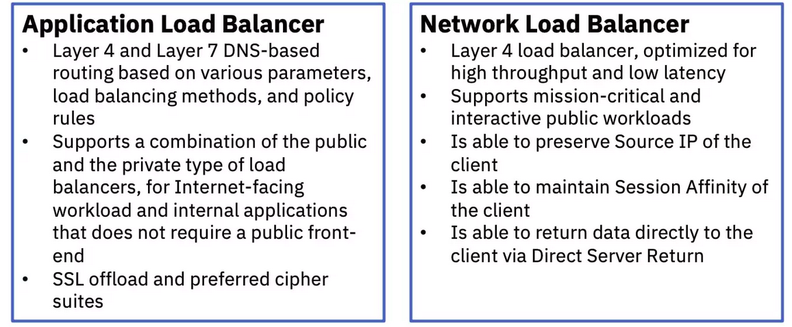

# Proxy types

* [Proxy types](#proxy-types)
   * [Forward proxy](#forward-proxy)
   * [Reverse proxy](#reverse-proxy)
   * [Receiving proxy vs Loadbalancer](#receiving-proxy-vs-loadbalancer)
      * [Reverse proxy:](#reverse-proxy-1)
      * [Loadbalancer](#loadbalancer)
   * [Layer 4 Loadbalancer](#layer-4-loadbalancer)
   * [Layer 7 Loadbalancer](#layer-7-loadbalancer)
   * [HAProxy features](#haproxy-features)
   * [Things HAProxy is not](#things-haproxy-is-not)
   * [Install HAProxy](#install-haproxy)
      * [1. <strong>Linux (Debian/Ubuntu):</strong>](#1-linux-debianubuntu)
      * [2. <strong>Linux (Red Hat/CentOS):</strong>](#2-linux-red-hatcentos)
      * [3. <strong>Compile from Source:</strong>](#3-compile-from-source)
      * [4. <strong>Docker:</strong>](#4-docker)
      * [5. <strong>Configuration:</strong>](#5-configuration)
   * [HAProxy configuration](#haproxy-configuration)
   * [HAProxy modes](#haproxy-modes)
   * [HAProxy Error responses](#haproxy-error-responses)
      * [Basic Syntax:](#basic-syntax)
      * [Example:](#example)
      * [Additional Notes:](#additional-notes)
      * [Example Configuration Snippet:](#example-configuration-snippet)
   * [HAProxy timeouts](#haproxy-timeouts)
   * [<a href="http://docs.haproxy.org/2.8/configuration.html#7" rel="nofollow">HAProxy Access Control List (ACL) and fetching samples</a>](#haproxy-access-control-list-acl-and-fetching-samples)
      * [Basic ACL Syntax:](#basic-acl-syntax)
      * [Example:](#example-1)
      * [Using ACLs in Configuration:](#using-acls-in-configuration)
      * [Types of ACL Conditions:](#types-of-acl-conditions)
      * [Combining ACLs:](#combining-acls)
         * [HAProxy Matching Methods](#haproxy-matching-methods)
         * [Path-related criteria in HAProxy ACLs:](#path-related-criteria-in-haproxy-acls)
      * [Fetching Samples:](#fetching-samples)
      * [Combined Example:](#combined-example)
   * [Directives in HAProxy](#directives-in-haproxy)
      * [Example Configuration Snippet:](#example-configuration-snippet-1)
   * [Tips](#tips)
   * [HAProxy stickiness](#haproxy-stickiness)
      * [Basic Stickiness Configuration:](#basic-stickiness-configuration)
      * [Additional Stickiness Options:](#additional-stickiness-options)
      * [Example with Cookie Stickiness:](#example-with-cookie-stickiness)
* [Health checks in HAProxy](#health-checks-in-haproxy)
      * [1. <strong>Backend Server Health Checks:</strong>](#1-backend-server-health-checks)
      * [2. <strong>option httpchk Directive:</strong>](#2-option-httpchk-directive)
      * [3. <strong>option tcp-check Directive:</strong>](#3-option-tcp-check-directive)
      * [4. <strong>http-check expect Directive:</strong>](#4-http-check-expect-directive)
      * [5. <strong>server ... check Directive:</strong>](#5-server--check-directive)
      * [6. <strong>Health Check Intervals:</strong>](#6-health-check-intervals)
      * [7. <strong>rise and fall Parameters:</strong>](#7-rise-and-fall-parameters)
      * [8. <strong>Custom Health Check Scripts:</strong>](#8-custom-health-check-scripts)
   * [HAProxy Load Balancing Algorithms](#haproxy-load-balancing-algorithms)
      * [Basic Usage:](#basic-usage)
      * [Use Cases:](#use-cases)
      * [Without whole Keyword:](#without-whole-keyword)
   * [HAProxy disabled otption](#haproxy-disabled-otption)
      * [Common Use Cases:](#common-use-cases)
      * [Enabling a Disabled Server:](#enabling-a-disabled-server)
   * [Log formatting](#log-formatting)

<!-- Created by https://github.com/ekalinin/github-markdown-toc -->

## Forward proxy

Forward proxies are typically used internally by large organizations, such as universities and enterprises, to:
1. Block employees to visit certain website
1. Monitoring employees online activity
1. Block malicious traffic from reaching an origin server
1. Improve the user experience by caching external site content


## Reverse proxy
1. Receiving a user connection request
1. Completing a TCP thee-way handshake, terminating the initial connection
1. Connecting with the origin server and forwarding the original request


## Receiving proxy vs Loadbalancer

###  Reverse proxy:

A reverse proxy accepts a request from a client, forwards it to a server
that can fulfill it, and returns the server's response to the client.

* Increase security
* Increase scalability and flexibility
* Compression
* SSL termination
* Caching

### Loadbalancer

A load balancer distributes incoming client requests amount a group of
servers, in each case returning the response from the selected server to
appropriate client.

* Are most commonly deployed when a site needs multiple servers because
  the volume of requests is too much for a single server to handle
  efficiently 


## Layer 4 Loadbalancer

Forwards packets based on basic rules, if only knows `IP` and `Port`
and perhaps latency of the target service. That is what is available at
Layer 3/4. This load balancer doesn't look at the content so it doesn't
know the protocol whether its HTTP or not, it doesn't know the URL or
the path or the resource you are consuming or whether you are using
`GET` or `POST`

> A Layer 4 load balancer operates at the transport layer of the OSI
> model, making routing decisions based on factors like
> source/destination IP addresses and port numbers. It distributes
> incoming traffic across multiple servers, focusing on network and
> transport layer information (e.g., TCP or UDP). Unlike Layer 7 load
> balancers, Layer 4 balancers don't inspect application layer data,
> making them efficient for simple connection-based load balancing.

| **Pros of Layer 4 Load Balancers**      | **Cons of Layer 4 Load Balancers**          |
|---------------------------------------|--------------------------------------------|
| Efficient for basic load balancing.    | Limited application awareness.             |
| Low latency, suitable for performance-sensitive applications. | Inability to differentiate content types. |
| Versatile, can handle various types of traffic (TCP, UDP). | Less granular control over traffic routing. |
| Simple configuration and management.   | No SSL termination; backend servers handle encryption. |
| Effective for network layer decisions (IP addresses, port numbers). | Challenges in handling heterogeneous applications. |

## Layer 7 Loadbalancer

The load balancing operates at the high-level application layer, which
is responsible for the actual contents of the message. Layer 7 load
balancers route network traffic in a more complex manner, usually
applicable to TCP-Based traffic like HTTP. Unlike Layer 4, a Layer 7
load balancer terminates the network traffic and reads the message
within. It makes a decision based on the content of the message.
Afterwhich, it makes a new TCP connection to the selected upstream
server and writes the request to the server. It can also cache, Layer 4
isn't capable of doing so as it has no clue of what's in the packets.

| **Pros of Layer 7 Load Balancers** | **Cons of Layer 7 Load Balancers** |
|-------------------------------------|-------------------------------------|
| Application Awareness               | Higher processing overhead         |
| Content-Based Routing               | Potential for increased latency     |
| SSL Termination                     | Complex configuration              |
| Adaptability                        | Resource intensiveness              |
| Advanced Load Balancing Algorithms  | May not handle high connection counts as efficiently |




## HAProxy features

* Layer 4 (TCP) and Layer 7 (HTTP) load balancing
* URL Rewriting
* Rate limiting
* SSL/TLS termination
* Gzip compression
* Proxy protocol support
* Health checking
* Connection and HTTP message logging
* HTTP/2
* Multithreading
* Hitless reload
* Lua and SPOE support
* API support
* Syslog (UDP, TCP)
* Cache
* Hatop and state socket manage
* Status page

## Things HAProxy is not 


HAProxy is also not a Web server in the way that IIS, Apache and NGINX
are. It doesn't generate Web pages or respond to requests using Web
frameworks like Ruby on Rails or ASP.NET. It will, however, forward
requests to the appropriate Web servers and relay their responses.
HAProxy's biggest value comes in its ability to provide scalability and
high availability for your servers.

HAProxy is not a firewall. It can protect your servers from some threats
like clients requesting too much data all at once. However, it is not
designed to filter traffic between networks, detect and stop
sophisticated attacks like cross-site scripting, or grant access to
ports. There are other tools, such as ModSecurity and Citrix NetScaler,
that act as that kind of security barrier. HAProxy works well alongside
these tools.

Finally, HAProxy is not a forward proxy, like Squid is, that's used to
hide your identity on the Web or to block employees from accessing
certain websites. A forward proxy sits closer to the client, forwarding
their requests to the Internet. HAProxy is a reverse proxy, which relays
traffic for servers.


## Install HAProxy

### 1. **Linux (Debian/Ubuntu):**

   - **Using APT:**
     ```bash
     sudo apt-get update
     sudo apt-get install haproxy
     ```

   - **Using Snap:**
     ```bash
     sudo snap install haproxy
     ```
> **Note:** For install specific version use [this site](https://haproxy.debian.net/)

### 2. **Linux (Red Hat/CentOS):**

   - **Using YUM:**
     ```bash
     sudo yum install haproxy
     ```

### 3. **Compile from Source:**

   - Download the source code from the official HAProxy website (http://www.haproxy.org/).
   - Extract the source tarball and navigate into the source directory.
   - Compile and install:
     ```bash
     make clean
     make -j $(nproc) TARGET=linux-glibc \
                USE_OPENSSL=1 USE_LUA=1 USE_PCRE=1 USE_SYSTEMD=1
     sudo make install
     ```
> **Note:** For more information read the [official documentation](https://github.com/haproxy/haproxy/blob/master/INSTALL)

### 4. **Docker:**

   - Pull the official HAProxy Docker image:
     ```bash
     docker pull haproxy
     ```

   - You can then run HAProxy as a Docker container, customizing the configuration and settings as needed.

### 5. **Configuration:**

After installation, you'll need to configure HAProxy based on your requirements. The configuration file is usually located at `/etc/haproxy/haproxy.cfg` on Linux systems.

## HAProxy configuration

The HAProxy configuration file is organized into different sections, each responsible for defining specific aspects of the load balancer's behavior. Here's an explanation of the main parts of an HAProxy configuration file:

1. **Global Section:**
   - The `global` section contains settings that apply globally to the entire HAProxy configuration.
   - It includes parameters like the maximum number of allowed connections, default log levels, and other global settings.
   - Example:
     ```plaintext
     global
       log /dev/log local0
       log /dev/log local1 notice
       user haproxy
       group haproxy
       maxconn 4096
       daemon
     ```

2. **Defaults Section:**
   - The `defaults` section sets default parameters for frontends and backends if specific values are not defined in those sections.
   - It includes parameters like timeouts, logging settings, and default load balancing algorithm.
   - Example:
     ```plaintext
     defaults
       log global
       mode http
       timeout connect 5000ms
       timeout client 50000ms
       timeout server 50000ms
     ```

3. **Frontend Section:**
   - The `frontend` section defines a logical entry point for incoming traffic.
   - It specifies how to process incoming requests, such as listening on a specific IP and port, defining ACLs (Access Control Lists), and associating a backend for further processing.
   - Example:
     ```plaintext
     frontend web_frontend
       bind *:80
       mode http
       acl is_api path_beg /api
       use_backend api_backend if is_api
       default_backend web_backend
     ```

4. **Backend Section:**
   - The `backend` section configures the behavior of servers handling requests that have been through a frontend.
   - It includes server definitions, load balancing algorithms, health checks, and other backend-specific settings.
   - Example:
     ```plaintext
     backend web_backend
       mode http
       balance roundrobin
       server web_server1 192.168.1.10:8080 check
       server web_server2 192.168.1.11:8080 check
     ```

5. **Listen Section:**
   - The `listen` section is a combination of frontend and backend definitions. It is a simpler way to define both the frontend and backend configurations in a single block.
   - Example:
     ```plaintext
     listen web_listen
       bind *:80
       mode http
       balance roundrobin
       server web_server1 192.168.1.10:8080 check
       server web_server2 192.168.1.11:8080 check
     ```

6. **User-Defined Sections:**
   - Beyond the standard sections, you can define your custom sections for specific purposes.
   - For example, you might create a section for custom Lua scripts, advanced ACL configurations, or any other specific requirements.

These sections collectively define how HAProxy handles incoming traffic, routes requests to appropriate backends, and manages the overall behavior of the load balancer. The configuration syntax is typically declarative, specifying what behavior is desired rather than how to achieve it. Each section has its own parameters and settings, allowing for fine-grained control over HAProxy's behavior.

## HAProxy modes

HAProxy supports different modes, each catering to specific use cases. The two primary modes are TCP mode and HTTP mode, and they determine how HAProxy processes and handles traffic.

1. **TCP Mode:**
   - In TCP mode, HAProxy operates at the transport layer (Layer 4 of the OSI model).
   - It works with TCP and UDP protocols, making it suitable for a wide range of applications beyond HTTP.
   - TCP mode is often used for generic TCP load balancing where the content of the packets is not inspected at the application layer.
   - Example configuration:
     ```plaintext
     mode tcp
     ```

2. **HTTP Mode:**
   - In HTTP mode, HAProxy operates at the application layer (Layer 7 of the OSI model).
   - It is specifically designed for processing and load balancing HTTP and HTTPS traffic.
   - In HTTP mode, HAProxy can inspect and manipulate HTTP headers, perform content-based routing, and support features like SSL termination for HTTPS traffic.
   - Example configuration:
     ```plaintext
     mode http
     ```

3. **TCP and HTTP Hybrid Mode:**
   - HAProxy also supports a hybrid mode where it can intelligently switch between TCP and HTTP modes based on the content of the initial data from the client.
   - This is useful when HAProxy needs to handle a mix of HTTP and non-HTTP traffic on the same port.
   - Example configuration:
     ```plaintext
     mode http
     option http-server-close
     option httplog
     timeout connect 5s
     timeout client 5s
     timeout server 5s
     tcp-request inspect-delay 5s
     tcp-request content accept if HTTP
     ```

The choice between TCP mode and HTTP mode depends on the type of traffic
your application handles. If you're dealing with generic TCP or UDP
traffic, TCP mode is suitable. If you're specifically dealing with
HTTP/HTTPS traffic and need application-layer features like
content-based routing, SSL termination, and HTTP header manipulation,
then HTTP mode is the appropriate choice.

It's important to note that once the mode is set in the configuration,
it affects how HAProxy processes the traffic. For instance, in TCP mode,
HAProxy doesn't inspect or manipulate HTTP content, and in HTTP mode, it
provides additional features specific to HTTP traffic. Hybrid mode can
be advantageous when dealing with mixed traffic types on the same port.

## HAProxy Error responses

The `errorfile` directive in HAProxy's configuration is used to specify a custom HTML file that will be displayed to users when a particular HTTP error response is generated. This directive allows you to provide a more user-friendly and branded error page instead of the default error message that the browser generates.

Here's a breakdown of how to use the `errorfile` directive in an HAProxy configuration:

### Basic Syntax:

```plaintext
errorfile <code> <file>
```

- `<code>`: The HTTP status code for which the custom error file should be displayed.
- `<file>`: The path to the HTML file containing the custom error page.

### Example:

```plaintext
errorfile 503 /etc/haproxy/errors/503_custom.html
```

In this example, when HAProxy generates a 503 (Service Unavailable) error response, it will display the custom error page located at `/etc/haproxy/errors/503_custom.html`.

### Additional Notes:

1. **Status Codes:**
   - You can use the `errorfile` directive for various HTTP status codes (e.g., 404 for Not Found, 500 for Internal Server Error, etc.).

2. **Default Error Files:**
   - HAProxy comes with default error files for common status codes. If you don't specify a custom error file, the default browser-generated error page will be displayed.

3. **Path to Error Files:**
   - Ensure that the path specified in `<file>` is correct and accessible by HAProxy.

4. **HTML Content:**
   - The custom error file should be an HTML document containing the content you want to display to users when the specified error occurs.

### Example Configuration Snippet:

```plaintext
frontend web_frontend
  bind *:80
  mode http
  default_backend web_servers

backend web_servers
  mode http
  server server1 192.168.1.10:80 check

  # Custom error file for 503 Service Unavailable
  errorfile 503 /etc/haproxy/errors/503_custom.html
```

A simple example of a custom HTML file (`503_custom.html`) that you
might use for a 503 (Service Unavailable) error page in HAProxy. This
example includes a basic message informing users that the service is
currently unavailable and some additional information or instructions.

```html
<!DOCTYPE html>
<html lang="en">
<head>
    <meta charset="UTF-8">
    <meta http-equiv="X-UA-Compatible" content="IE=edge">
    <meta name="viewport" content="width=device-width, initial-scale=1.0">
    <title>503 Service Unavailable</title>
    <style>
        body {
            font-family: Arial, sans-serif;
            background-color: #f5f5f5;
            text-align: center;
            padding: 50px;
        }

        h1 {
            color: #333;
        }

        p {
            color: #666;
            margin-top: 20px;
        }
    </style>
</head>
<body>
    <h1>503 Service Unavailable</h1>
    <p>We apologize for the inconvenience, but the service is currently unavailable. Please try again later.</p>
    <p>If the issue persists, contact support for assistance.</p>
</body>
</html>
```

## HAProxy `timeout`s

Timeouts determine the maximum duration that HAProxy will wait
for certain events during the lifecycle of a connection. These timeouts
help control how long HAProxy will allow certain operations to take
before considering them timed out.

1. **`timeout connect`**: 
   - This timeout defines how long HAProxy will wait for a connection to be established to a backend server. If a connection cannot be established within this timeframe, HAProxy considers it a timeout.
   - Example: `timeout connect 5s` sets the connect timeout to 5 seconds.

2. **`timeout client`**: 
   - This timeout controls the maximum time a client (the end-user) is allowed to be inactive. If the client does not send any data within this timeframe, the connection is considered idle, and HAProxy may close it.
   - Example: `timeout client 50s` sets the client timeout to 50 seconds.

3. **`timeout server`**: 
   - Similar to `timeout client`, this timeout controls the maximum time a server (backend) is allowed to be inactive. If no data is received from the server within this timeframe, the connection is considered idle, and HAProxy may close it.
   - Example: `timeout server 50s` sets the server timeout to 50 seconds.

4. **`timeout check`**: 
   - This timeout is specific to health checks. It defines the maximum time that HAProxy waits for a health check to complete. If the health check does not return within this time, it is considered failed.
   - Example: `timeout check 5s` sets the health check timeout to 5 seconds.

5. **`timeout http-request`**: 
   - Defines how long HAProxy will wait for an HTTP request to be fully received from the client. If the client does not send a complete request within this time, the request is considered timed out.
   - Example: `timeout http-request 10s` sets the HTTP request timeout to 10 seconds.

6. **`timeout http-keep-alive`**: 
   - Determines the maximum time a connection can remain open for additional requests in HTTP keep-alive mode. If no new request is received within this time, the connection may be closed.
   - Example: `timeout http-keep-alive 30s` sets the HTTP keep-alive timeout to 30 seconds.

It's important to adjust these timeouts based on your specific
application's behavior and requirements. Setting appropriate timeout
values can help improve the overall performance and reliability of your
HAProxy deployment. The values should be chosen based on the expected
response times of your backend servers and the characteristics of your
application.

## [HAProxy Access Control List (ACL) and fetching samples](http://docs.haproxy.org/2.8/configuration.html#7)

Access Control Lists (ACLs) are used to define conditions that help in
making routing and forwarding decisions based on various factors such as
client IP addresses, HTTP headers, URL paths, or other request
attributes. ACLs allow you to apply different rules and actions to
traffic depending on whether certain conditions are met.

### Basic ACL Syntax:

```plaintext
acl <name> <criterion> <value>
```

- `<name>`: A user-defined name for the ACL.
- `<criterion>`: The condition or test to be applied.
- `<value>`: The value against which the condition is evaluated.

### Example:

```plaintext
acl is_secure_traffic hdr(X-Forwarded-Proto) https
```

In this example, the ACL named `is_secure_traffic` checks whether the value of the `X-Forwarded-Proto` HTTP header is `https`.

> `X-Forwarded-Proto` is an HTTP header that is typically used to convey
> information about the protocol (HTTP or HTTPS) that a client used to
> connect to a proxy or a load balancer. This header is particularly
> useful in scenarios where the client communicates with a frontend
> server using a different protocol than what is used between the
> frontend server and backend servers.

### Using ACLs in Configuration:

Once an ACL is defined, it can be used in combination with other HAProxy
directives to determine the flow of traffic. For example:

```plaintext
use_backend secure_backend if is_secure_traffic
use_backend regular_backend if !is_secure_traffic
```

In this example, if the `is_secure_traffic` ACL condition is true, traffic will be sent to the `secure_backend`; otherwise, it will be sent to the `regular_backend`.

### Types of ACL Conditions:

1. **IP-based ACLs:**
   - Conditions based on the client's IP address.
   - Example: `acl is_internal src 192.168.1.0/24`

2. **HTTP Header ACLs:**
   - Conditions based on the values of HTTP headers.
   - Example: `acl is_mobile hdr(User-Agent) -i Mobile`
   
   > **Note** You can use `req.hdr` for requests headers and `res.hdr`
   for response headers

3. **URL Path ACLs:**
   - Conditions based on the URL path of the request.
   - Example: `acl is_api path_beg /api`

   ```plaintext
   frontend websrv
       bind *:80
       mode http
       acl path_check1 path -m beg -i /api/v1
       acl path_check2 path -m beg -i /api/v2
       #acl path_check2 path_beg -i /api/v2
       use_backend bakend1 if path_check1
       use_backend bakend2 if path_check2
       use_backend bakend3 if {-m beg -i /api/v3}
   ```

   > **Note:** `acl`s should declare in `frontend`s
   
   > **Note:** `-i` stands for case insensitive, `-m` stands for using
   > `matching method`

4. **SSL/TLS ACLs:**
   - Conditions based on SSL/TLS parameters.
   - Example: `acl is_ssl ssl_fc`

5. **Connection-related ACLs:**
   - Conditions based on connection-related factors.
   - Example: `acl is_slow_connection sc0_conn_rate(5) gt 10`

### Combining ACLs:

You can combine multiple ACLs using logical operators (`and`, `or`, `not`) to create more complex conditions. For example:

```plaintext
acl is_mobile hdr(User-Agent) -i Mobile
acl is_secure_path path_beg /secure

use_backend mobile_secure_backend if is_mobile and is_secure_path
```

In this example, the traffic will be sent to `mobile_secure_backend` if
both the `is_mobile` and `is_secure_path` conditions are true.

ACLs provide a powerful mechanism for traffic routing and
decision-making in HAProxy configurations. They allow you to implement
fine-grained control over how requests are processed based on various
attributes and conditions.

#### HAProxy Matching Methods

Here is a table summarizing some common matching methods in HAProxy, often used in Access Control Lists (ACLs) for making decisions based on request characteristics:

| Matching Method        | Description                                                                                                        | Example                                                                                     |
|------------------------|--------------------------------------------------------------------------------------------------------------------|---------------------------------------------------------------------------------------------|
| `hdr` (Header)          | Matches against an HTTP header.                                                                                    | `acl is_mobile hdr(User-Agent) -i mobile`                                                 |
| `path`                 | Matches against the path portion of the URI.                                                                     | `acl is_api path_beg /api`                                                                  |
| `url_param`            | Matches against a specific parameter in the URL.                                                                  | `acl has_session_id url_param(sessionid) -m found`                                         |
| `src` (Source IP)      | Matches against the source IP address of the client.                                                              | `acl is_local src 192.168.0.0/16`                                                          |
| `ssl_fc`               | Matches when SSL is used.                                                                                        | `acl is_secure ssl_fc`                                                                       |
| `method`               | Matches against the HTTP method (GET, POST, etc.).                                                               | `acl is_post method POST`                                                                   |
| `cookie`               | Matches against the presence or value of a cookie.                                                                | `acl has_auth_cookie cook(auth) -m found`                                                  |
| `host`                 | Matches against the host header in the HTTP request.                                                              | `acl is_subdomain hdr(host) -i sub.example.com`                                            |
| `payload`              | Matches against the request payload. Requires `http-request inspect-delay` to inspect payload.                    | `acl has_keyword payload(0,100) -m sub keyword`                                           |
| `ssl_fc_sni`           | Matches against the Server Name Indication (SNI) in SSL/TLS connections.                                          | `acl is_domain_ssl ssl_fc_sni -i domain.com`                                               |
| `ssl_fc_has_crt`       | Matches if an SSL certificate was presented by the client.                                                        | `acl has_client_cert ssl_fc_has_crt`                                                       |
| `url_beg`              | Matches the beginning of the URL.                                                                                 | `acl is_homepage url_beg /`                                                                 |
| `url_dir`              | Matches if the URL is a directory.                                                                               | `acl is_directory url_dir /path/`                                                          |
| `url_reg`              | Matches against a regular expression applied to the entire URL.                                                  | `acl matches_pattern url_reg ^/pattern/`                                                  |
| `base`                 | Matches the base64-encoded value of the specified header or payload position. Requires `http-request inspect-delay`. | `acl is_base64 base64(payload(0,100)) -m sub Zm9vYg==`                                     |
| `converter`            | Matches using a converter, allowing advanced string manipulation.                                                | `acl is_lowercase converter(lower)(hdr(host)) -i subdomain`                               |
| `req.fhdr`             | Matches against the first occurrence of a header in a request.                                                    | `acl has_custom_header req.fhdr(X-Custom-Header) -m found`                                 |
| `res.hdr`              | Matches against a response header.                                                                               | `acl has_cache_control res.hdr(Cache-Control) -i max-age=3600`                              |
| `res.fhdr`             | Matches against the first occurrence of a header in a response.                                                   | `acl has_custom_res_header res.fhdr(X-Custom-Res-Header) -m found`                         |
| `tcp-request connection`| Matches against properties of the TCP connection.                                                                | `acl is_ipv6 tcp-request connection reject if !{ src -f ipv6_whitelist.lst }`              |

#### Path-related criteria in HAProxy ACLs:

| Criterion     | Description                                                | Example                                           |
|---------------|------------------------------------------------------------|---------------------------------------------------|
| `path_beg`    | Matches if the URI path begins with a specific string.     | `acl is_api path_beg /api`                        |
| `path_end`    | Matches if the URI path ends with a specific string.       | `acl is_static path_end .html`                   |
| `path`        | Matches if the entire URI path is exactly equal to a string.| `acl is_homepage path /`                         |
| `path_dir`    | Matches if the URI path is a directory or starts with a directory.| `acl is_directory path_dir /images/`         |
| `path_sub`    | Matches if the URI path contains a specified substring.    | `acl has_version path_sub /v1/`                 |
| `path_reg`    | Matches if the URI path matches a specified regular expression.| `acl is_dynamic path_reg ^/dynamic/[0-9]+$`  |

### Fetching Samples:

1. **Definition:**
   - Fetching samples involve extracting specific information from a request or response for use in ACLs or other configuration settings.

   Example:
   ```plaintext
   http-request set-var(req.backend_name) hdr(Host),lower
   ```

2. **Variables:**
   - HAProxy uses variables to store fetched samples, allowing you to reference them in ACLs or other sections of the configuration.

   Example:
   ```plaintext
   acl is_admin var(txn.txnhost) -m reg -i ^admin\.example\.com$
   ```

3. **Usage:**
   - Fetched samples can be used in ACLs to make decisions based on specific extracted values.

   Example:
   ```plaintext
   frontend my_frontend
     bind *:80
     http-request set-var(txn.txnhost) hdr(Host),lower
     acl is_admin var(txn.txnhost) -m reg -i ^admin\.example\.com$
     use_backend admin_servers if is_admin
   ```

### Combined Example:

Here's an example that combines ACLs and fetching samples:

```plaintext
frontend my_frontend
  bind *:80

  # Extract the path and store it in a variable
  http-request set-var(txn.txnpath) path

  # Use ACLs based on the extracted path
  acl is_api var(txn.txnpath) -m beg /api
  acl is_static var(txn.txnpath) -m reg \.html$

  # Route requests based on ACLs
  use_backend api_servers if is_api
  use_backend static_content_servers if is_static
  default_backend default_servers
```

In this example, the request path is extracted and stored in the `txn.txnpath` variable. ACLs (`is_api` and `is_static`) are then used to make decisions based on the extracted path. The requests are routed to different backends accordingly.


## Directives in HAProxy
A directive is a keyword or command used in the configuration file to
define and configure various aspects of the load balancer's behavior.
Directives provide a way to specify settings, options, conditions, and
actions within the HAProxy configuration.

Here are some key points about directives in HAProxy:

1. **Syntax:**
   - Directives are written in a specific syntax within the configuration file.
   - They are often followed by parameters or arguments that provide additional information or values.

2. **Scope:**
   - Directives can have different scopes, affecting either the global configuration (applied to the entire HAProxy instance) or specific sections (such as `defaults`, `frontend`, or `backend` sections).

3. **Configuration Sections:**
   - Directives are typically used within specific sections of the configuration file to define settings for global behavior, frontends, or backends.
   - For example, `timeout client` is a directive used to set the client timeout, and it is commonly found in the `defaults` or `frontend` sections.

4. **Purpose:**
   - Directives serve various purposes, including configuring timeouts, defining access control rules (ACLs), specifying load balancing algorithms, setting up SSL termination, and more.
   - They allow administrators to fine-tune HAProxy's behavior according to the specific requirements of their applications and infrastructure.

5. **Examples:**
   - Here are a few examples of HAProxy directives:
     - `mode`: Sets the operating mode of HAProxy (e.g., `mode tcp` or `mode http`).
     - `timeout client`: Sets the maximum time a client is allowed to be inactive.
     - `option http-server-close`: Closes the connection to the server after each request.
     - `balance`: Specifies the load balancing algorithm to be used (e.g., `balance roundrobin`).

6. **Customization:**
   - HAProxy provides a wide range of directives, allowing administrators to customize the load balancer's behavior based on their specific needs and the characteristics of their applications.

### Example Configuration Snippet:

```plaintext
global
  log /dev/log local0
  log /dev/log local1 notice
  maxconn 4096
  daemon

defaults
  log global
  mode http
  timeout connect 5000ms
  timeout client 50000ms
  timeout server 50000ms

frontend web_frontend
  bind *:80
  mode http
  default_backend web_servers

backend web_servers
  mode http
  balance roundrobin
  server server1 192.168.1.10:8080 check
  server server2 192.168.1.11:8080 check
```

In this example, `global`, `defaults`, `frontend`, and `backend` are
sections, and the lines within each section contain directives that
define various settings for the HAProxy configuration. Each directive
plays a role in specifying how HAProxy should handle incoming traffic,
manage connections, and distribute requests across backend servers.

> In the other words, each line of the config file is a directive.

## Tips

* Install `vim-haproxy`
* Check `haproxy.cfg` file validity with

```bash
haproxy -c -f /etc/haproxy/haproxy.cfg
```

## HAProxy stickiness

Stickiness, often referred to as session persistence or affinity, is a
feature that allows you to associate a client with a specific server in
a backend and ensure that subsequent requests from that client are
consistently directed to the same server. Stickiness is beneficial when
you want to maintain stateful connections, such as those involving user
sessions, and ensure that related requests are handled by the same
server in a backend.

In TCP mode, stickiness is commonly achieved using the `stick` directive and related options. Here's a basic overview:

### Basic Stickiness Configuration:

```plaintext
backend my_backend
  mode tcp
  balance roundrobin
  stick-table type ip size 10k
  stick on src
  server server1 192.168.1.10:8080
  server server2 192.168.1.11:8080
```

- `stick-table`: Declares the creation of a stick table that will store sticky session information.
- `type ip`: Specifies that stickiness is based on IP addresses.
- `size 10k`: Sets the size of the stick table to accommodate a certain number of entries.
- `stick on src`: Defines that stickiness is based on the source IP address of the client.

In this example, the `stick on src` directive instructs HAProxy to use the client's source IP address as the key for stickiness. This means that once a client establishes a connection and is directed to a specific server, subsequent connections from the same client (based on the source IP address) will be consistently directed to the same server.

### Additional Stickiness Options:

1. **`stick store-request` and `stick store-response`**:
   - These options allow you to customize the data used for stickiness. You can store specific parts of the request or response in the stick table.

2. **`cookie`**:
   - In addition to IP-based stickiness, you can use cookies to maintain session persistence. The `cookie` option allows you to extract a session ID from a cookie and use it for stickiness.

3. **`timeout`**:
   - Specifies the duration for which stickiness information should be retained in the stick table.

4. **`mode`**:
   - The `mode` option can be set to `http` or `tcp` to specify the mode for stickiness.

### Example with Cookie Stickiness:

```plaintext
backend my_backend
  mode tcp
  balance roundrobin
  stick-table type string len 32 size 10k expire 30m
  stick on cookie(sessionid)
  server server1 192.168.1.10:8080 cookie server1 check
  server server2 192.168.1.11:8080 cookie server2 check
```

In this example, stickiness is based on a cookie named `sessionid`, and the stick table is configured to store string values.

Stickiness in TCP mode ensures that connections with the same key (such as IP address or cookie value) are consistently directed to the same server, maintaining session persistence across multiple requests.

# Health checks in HAProxy

Health checks in HAProxy refer to the process of regularly monitoring the status and availability of backend servers. The purpose of health checks is to ensure that HAProxy is sending traffic only to healthy servers, improving the overall reliability and availability of the application.

Here are the key components and concepts related to health checks in HAProxy:

### 1. **Backend Server Health Checks:**
   - Health checks involve periodically testing the health of each backend server in a backend pool.
   - HAProxy sends test requests to the servers and evaluates their responses to determine if the servers are healthy.

### 2. **`option httpchk` Directive:**
   - The `option httpchk` directive is used to enable HTTP health checks. It specifies that HAProxy should perform an HTTP health check by sending an HTTP request and checking the response.
   - Example:
     ```plaintext
     option httpchk GET /healthcheck HTTP/1.1\r\nHost:\ example.com
     ```

### 3. **`option tcp-check` Directive:**
   - The `option tcp-check` directive is used for TCP health checks. It sends a basic TCP connection request and checks if the connection is successful.
   - Example:
     ```plaintext
     option tcp-check
     ```

### 4. **`http-check expect` Directive:**
   - The `http-check expect` directive specifies the expected response from the server for a successful health check.
   - Example:
     ```plaintext
     http-check expect status 200
     ```

### 5. **`server ... check` Directive:**
   - The `check` keyword is used within a `server` line to enable health checks for a specific server.
   - Example:
     ```plaintext
     server web_server1 192.168.1.10:8080 check
     ```

### 6. **Health Check Intervals:**
   - Health checks are performed at regular intervals, and the interval is configurable using the `inter` and `fastinter` options.
   - Example:
     ```plaintext
     server web_server1 192.168.1.10:8080 check inter 5000 rise 2 fall 3
     ```
     - `inter 5000`: Checks are performed every 5 seconds.
     - `rise 2`: The server is considered healthy after two consecutive successful health checks.
     - `fall 3`: The server is considered unhealthy after three consecutive failed health checks.

### 7. **`rise` and `fall` Parameters:**
   - The `rise` and `fall` parameters define the number of consecutive successful and failed health checks required to change the server's status.
   - Example:
     ```plaintext
     server web_server1 192.168.1.10:8080 check rise 2 fall 3
     ```

### 8. **Custom Health Check Scripts:**
   - HAProxy also allows you to use custom scripts for health checks. This provides flexibility in defining complex health checks tailored to your application.
   - Example:
     ```plaintext
     server web_server1 192.168.1.10:8080 check check-sni ssl_fc_sni
     ```

Health checks play a critical role in maintaining the availability and
reliability of applications by ensuring that traffic is directed to
healthy servers. Configuring health checks in HAProxy involves a
combination of directives and parameters to define the check type,
expected responses, and the conditions for considering a server healthy
or unhealthy.


## HAProxy Load Balancing Algorithms

HAProxy supports various load balancing algorithms, also known as load
balancing methods or strategies, to distribute incoming traffic across
multiple servers in a backend. The choice of a load balancing algorithm
affects how HAProxy selects a server from the backend pool for each new
connection. Here are some commonly used load balancing algorithms in
HAProxy:

1. **Round Robin (`balance roundrobin`):**
   - The default load balancing algorithm.
   - Requests are distributed to servers in a circular sequence.
   - Suitable for general use when all servers are relatively equal in capacity.

   Example:
   ```plaintext
   balance roundrobin
   ```
   > **Note:**
   >
   > In `roundrobin` load balancing algorithm, each server in the
   > backend is given an equal opportunity to handle incoming requests.
   > However, you can use the `weight` parameter to assign different
   > weights to servers, influencing the distribution of traffic among
   > them. The `weight` parameter allows you to proportionally control the
   > share of requests each server receives based on its assigned weight.
   > 
   > ### Basic Usage:
   > 
   > ```plaintext
   > backend my_backend
   >   balance roundrobin
   >   server server1 192.168.1.10:8080 weight 3
   >   server server2 192.168.1.11:8080 weight 2
   >   server server3 192.168.1.12:8080 weight 1
   > ```
   > 
   > In this example:
   > 
   > The weights represent the relative proportions of traffic that each
   > server will receive. In this case, Server1 is expected to receive
   > approximately three times as much traffic as Server3, and Server2 is
   > expected to receive twice as much traffic as Server3.
   >
   > $Server Requensts={Server Weight \over Total Servers Weight}$
   >
   > For example
   >
   > $Server3 Requensts = {1 \over (1 + 2 + 3)} = {1 \over 6}$
   >
   > * Server1 weight is 3
   > * Server2 weight is 2
   > * Server3 weight is 1

2. **Least Connections (`balance leastconn`):**
   - Requests are sent to the server with the fewest active connections.
   - Ideal for situations where servers have different capacities or resource availability.

   Example:
   ```plaintext
   balance leastconn
   server web1  192.168.1.10:80 weight 1 maxconn 20 slowstart 10m
   server web2  192.168.1.11:80 weight 3 maxconn 40
   ```
   > **Note:** The `maxconn` is the maximum number of connections the server can establish

   > **Note:** The `slowstart` parameter is used to implement
   > a gradual increase in the traffic directed to a newly added or
   > recovered server in a backend.


3. **Source IP (`balance source`):**
   - Distributes requests based on the client's source IP address.
   - Ensures that requests from the same client are consistently sent to the same server.
   - Useful for maintaining session persistence.

   Example:
   ```plaintext
   balance source
   ```

4. **IP Hash (`balance ip-hash`):**
   - Uses a hash of the client's IP address to determine the server.
   - Provides session persistence while distributing traffic across servers.

   Example:
   ```plaintext
   balance ip-hash
   ```

5. **URI (`balance uri`):**
   - Distributes requests based on the URI path.
   - Useful when different servers handle different paths or services.

   Example:
   ```plaintext
   balance uri
   #balance uri whole
   ```

   > **Note:** 
   >
   > The `balance uri whole` line indicates that the uri
   > algorithm should consider the entire URI when distributing requests
   > among servers. This means that the full URI, including the path and
   > any query parameters, will be taken into account for load balancing
   > decisions.
   >
   > ### Use Cases:
   > 
   > 1. **Handling Different Services or Applications:**
   >    - If different servers in the backend handle distinct services
   >      or applications based on the URI, using `whole` with the `uri`
   >      algorithm ensures that requests are directed to the
   >      appropriate server.
   > 
   >    ```plaintext
   >    backend my_backend
   >      balance uri whole
   >      server api_server 192.168.1.10:8080 check
   >      server web_server 192.168.1.11:8080 check
   >    ```
   > 
   >    - In this example, requests with different URIs (e.g., "/api" and "/web") will be directed to the appropriate servers.
   > 
   > 2. **Consideration of Query Parameters:**
   >    - If query parameters in the URI are significant for load
   >      balancing decisions, using `whole` with `uri` ensures that the
   >      entire URI, including query parameters, is taken into account.
   > 
   >    ```plaintext
   >    backend my_backend
   >      balance uri whole
   >      server search_server 192.168.1.10:8080 check
   >      server catalog_server 192.168.1.11:8080 check
   >    ```
   > 
   >    - In this example, requests with different query parameters may
   >      be directed to different servers based on the `uri` algorithm.
   > 
   > ### Without `whole` Keyword:
   > 
   > If the `whole` keyword is not used with the `uri` balance
   > algorithm, HAProxy considers only the path part of the URI
   > (excluding query parameters) when making load balancing decisions.
   > For example:
   > 
   > ```plaintext
   > backend my_backend
   >   balance uri
   >   server server1 192.168.1.10:8080 check
   >   server server2 192.168.1.11:8080 check
   > ```
   > 
   > In this case, only the path of the URI (e.g., "/path") is
   > considered, and any query parameters are ignored for load balancing
   > decisions.
   > 
   > The use of `whole` with the `uri` algorithm provides flexibility in
   > handling scenarios where the entire URI, including both the path
   > and query parameters, is significant for routing requests to the
   > appropriate backend servers.

6. **URL Parameter (`balance url_param`):**
   - Distributes requests based on specific parameters in the URL.
   - Suitable when certain parameters determine the service or resource to be accessed.

   Example:
   ```plaintext
   balance url_param sessionid
   ```

7. **Header (`balance hdr`):**
   - Distributes requests based on the value of a specific HTTP header.
   - Useful when different servers handle requests for different domains or applications.

   Example:
   ```plaintext
   balance hdr(host)
   ```

8. **Least Time (`balance leastime`):**
   - Distributes requests to the server with the least response time.
   - Takes into account the time taken by servers to process and respond to requests.

   Example:
   ```plaintext
   balance leastime
   ```

9. **Random (`balance random`):**
   - Randomly selects a server for each new connection.
   - Provides a simple form of load balancing.

   Example:
   ```plaintext
   balance random
   ```

10. **Custom Load Balancing with ACLs:**
    - HAProxy allows you to create custom load balancing rules using Access Control Lists (ACLs). You can define conditions based on various criteria and route traffic accordingly.

   Example:
   ```plaintext
   acl is_api path_beg /api
   use_backend api_servers if is_api
   default_backend regular_servers
   ```

These load balancing algorithms offer flexibility in distributing traffic based on different criteria, and the choice depends on the characteristics of your application and the goals you want to achieve. The appropriate load balancing algorithm often depends on factors such as server capacity, session persistence requirements, and the nature of the incoming requests.

## HAProxy `disabled` otption

The `disabled` option is used to mark a server as temporarily
unavailable for traffic. When a server is disabled, HAProxy will not
route new requests to that server, but existing connections are allowed
to complete. This feature is useful when you need to take a server out
of rotation for maintenance, troubleshooting, or any other reason
without completely removing it from the configuration.

Here's how you can use the `disabled` option in a `server` line:

```plaintext
backend my_backend
  balance roundrobin
  server server1 192.168.1.10:8080 check
  server server2 192.168.1.11:8080 check disabled
  server server3 192.168.1.12:8080 check
```

In this example, `server2` is marked as `disabled`, indicating that it should not receive new requests. Servers marked as disabled are excluded from the normal rotation during load balancing.

### Common Use Cases:

1. **Maintenance:**
   - Temporarily disable a server during maintenance activities without removing it from the configuration.

   ```plaintext
   server maintenance_server 192.168.1.20:8080 check disabled
   ```

2. **Troubleshooting:**
   - Disable a server for troubleshooting purposes without affecting the entire service.

   ```plaintext
   server troubleshooting_server 192.168.1.30:8080 check disabled
   ```

3. **Gradual Rollout:**
   - Introduce a new server gradually by initially marking it as disabled and then enabling it when confident about its stability.

   ```plaintext
   server new_server 192.168.1.40:8080 check disabled
   ```

### Enabling a Disabled Server:

You can dynamically enable a disabled server during runtime using HAProxy's runtime control (via `socat`, `nc`, or a management tool like `haproxyctl`). For example:

```plaintext
echo "enable server my_backend/server2" | socat stdio /var/run/haproxy.sock
```

This command dynamically enables the `server2` that was previously disabled.

The `disabled` option provides a flexible way to control the availability of servers in real-time without modifying the configuration file. It is a helpful feature for managing server lifecycle events, ensuring smooth operations during maintenance, and providing a controlled rollout for new servers.

## Log formatting

```plaintext
# Define a custom log format named "custom_log"
log-format custom_log %[date] %[frontend_name] %[backend_name] %[server_name] \
    %[src] %[dst] %{+Q}r %ST %B %Ts %Tr %Tt %Hs %Hr %Ht %Tq %Tw %Tc %Tr %Tt %Tt

# Use the defined custom log format in a frontend or backend section
frontend example_frontend
    bind *:80
    default_backend example_backend
    log global
    log-format custom_log

backend example_backend
    server server1 192.168.1.1:8080
    server server2 192.168.1.2:8080
    log global
    log-format custom_log
```

Explanation of the log format elements:

- `%[date]`: Current date in local time.
- `%[frontend_name]`: Name of the frontend.
- `%[backend_name]`: Name of the backend.
- `%[server_name]`: Name of the server.
- `%[src]`: Source IP address.
- `%[dst]`: Destination IP address.
- `%{+Q}r`: Request line (URL) in double-quotes.
- `%ST`: HTTP status code.
- `%B`: Bytes read from the client.
- `%Ts`: Start time of the session.
- `%Tr`: Response time.
- `%Tt`: Total time.
- `%Hs`: Number of requests in session.
- `%Hr`: Number of responses in session.
- `%Ht`: Total number of requests and responses in session.
- `%Tq`: Total time waiting for the client request.
- `%Tw`: Total time in queues.
- `%Tc`: Total time waiting for the connection to establish to the final server.
- `%Tr`: Total time to receive the response from the final server.
- `%Tt`: Total time of the session.

