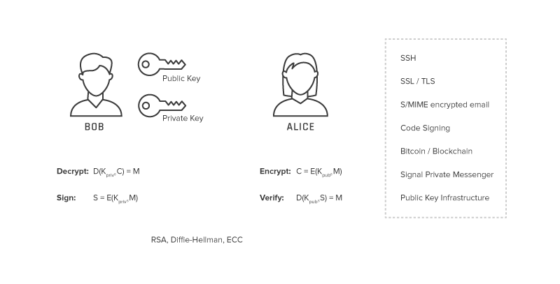
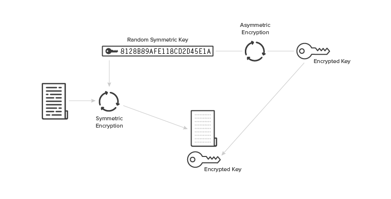
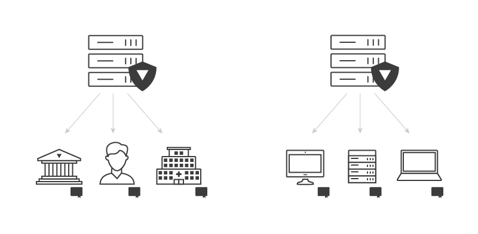
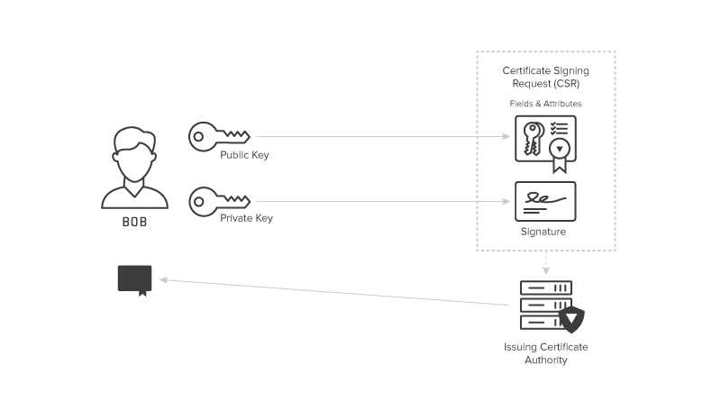
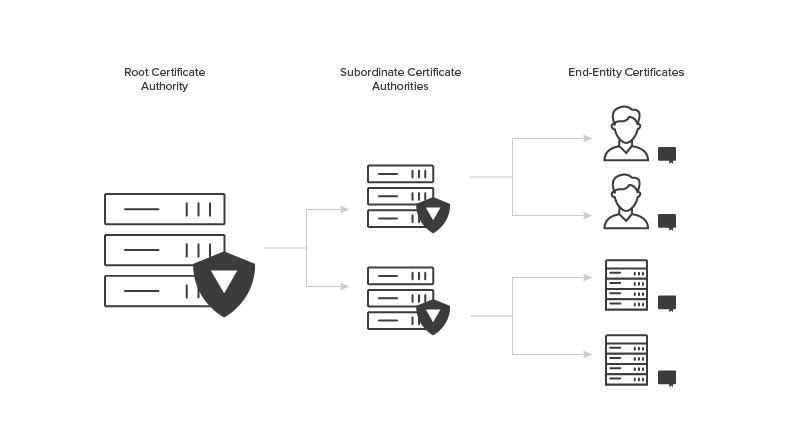
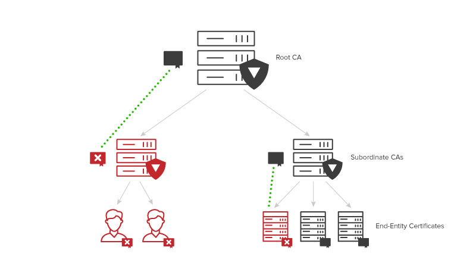
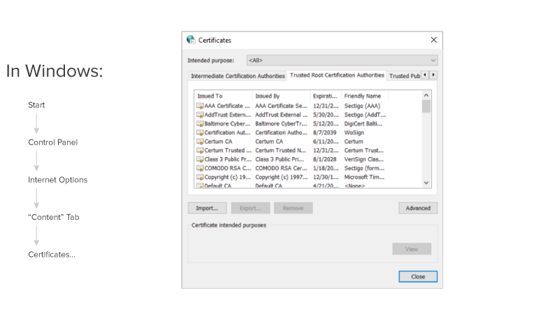

Table of Contents
=================

* [Public Key Infrastructure](#public-key-infrastructure)
   * [What is PKI?](#what-is-pki)
   * [PKI Components](#pki-components)
   * [PKI Terminology](#pki-terminology)
   * [What is PKI's use-case](#what-is-pkis-use-case)
   * [How Does PKI Work?](#how-does-pki-work)
      * [Symmetric Encryption](#symmetric-encryption)
      * [Asymmetric Encryption](#asymmetric-encryption)
      * [Chronological flow of issuing a cert](#chronological-flow-of-issuing-a-cert)
      * [Schematic Demonstration](#schematic-demonstration)
   * [The Emergence of PKI to Govern Encryption Keys](#the-emergence-of-pki-to-govern-encryption-keys)
   * [The Role of Digital Certificates in PKI](#the-role-of-digital-certificates-in-pki)
   * [Introducing Certification Authorities](#introducing-certification-authorities)
   * [How the Certificate Creation Process Works](#how-the-certificate-creation-process-works)
   * [How CA Hierarchies and Root CAs Create Layers of Trust](#how-ca-hierarchies-and-root-cas-create-layers-of-trust)
   * [Root CA Security is of Utmost Importance [Infromation]](#root-ca-security-is-of-utmost-importance-infromation)
   * [Determining the Optimal Level of Tiers in Your PKI’s CA Hierarchy](#determining-the-optimal-level-of-tiers-in-your-pkis-ca-hierarchy)
   * [Managing Revocation Through Certificate Revocation Lists](#managing-revocation-through-certificate-revocation-lists)
   * [Trusted Root Certificates](#trusted-root-certificates)
   * [What are Common Challenges that PKI Solves?](#what-are-common-challenges-that-pki-solves)
   * [Generate self-signed certificate](#generate-self-signed-certificate)
   * [Get a valid cert from letsencrypt](#get-a-valid-cert-from-letsencrypt)
      * [Prerequisites:](#prerequisites)
      * [Steps:](#steps)

<!-- Created by https://github.com/ekalinin/github-markdown-toc -->
# Public Key Infrastructure

## What is PKI?

A public key infrastructure (PKI) is a set of roles, policies, hardware,
software and procedures needed to create, manage, distribute, use, store and
revoke digital certificates and manage public-key encryption. 

The purpose of a PKI is to **facilitate the secure electronic transfer of
information** for a range of network activities . It is required for activities
where simple passwords are an inadequate authentication method and more
rigorous proof is required to confirm the identity of the parties involved in
the communication and to validate the information being transferred.

In cryptography, a PKI is an arrangement that binds public keys with respective
identities of entities (like people and organizations). The binding is
established through a process of registration and issuance of certificates at
and by a certificate authority (CA). Depending on the assurance level of the
binding, this may be carried out by an automated process or under human
supervision. When done over a network, this requires using a secure certificate
enrollment or certificate management protocol such as CMP. 

The PKI role that may be delegated by a CA to assure valid and correct
registration is called a registration authority (RA). Basically, an RA is
responsible for accepting requests for digital certificates and authenticating
the entity making the request.

An entity must be uniquely identifiable within each CA domain on the basis of
information about that entity. A third-party validation authority (VA) can
provide this entity information on behalf of the CA.


## PKI Components

1. **Public Key and Private Key:**
   - **Public Key:** This is a cryptographic key that is shared openly and can be freely distributed. It is used for encryption and verifying digital signatures. When someone wants to send you an encrypted message or verify a signature you created, they use your public key.
   - **Private Key:** This is the secret counterpart to the public key. It must be kept confidential and known only to the owner. The private key is used for decrypting messages that were encrypted with the corresponding public key and for creating digital signatures.

2. **Digital Certificates:**
   - A digital certificate is an electronic document that binds a public key to an individual, device, or service. It contains information about the key, the identity of its owner, and the digital signature of the Certificate Authority (CA) that issued the certificate.
   - Digital certificates serve as a means of verifying the authenticity of the public key and the identity of the certificate holder.

3. **Certificate Authority (CA):**
   - The CA is a trusted entity responsible for issuing digital certificates. It verifies the identity of certificate applicants before issuing certificates to them.
   - CAs establish and vouch for the authenticity of public keys, creating a web of trust. Well-known CAs are included in web browsers and other software, making it easier for users to trust the certificates they issue.

4. **Registration Authority (RA):**
   - The RA is an entity that works with the CA. It is responsible for authenticating users and accepting their requests for digital certificates.
   - While the CA issues certificates, the RA performs the initial identity verification and validation, ensuring that the requester is who they claim to be.

5. **Certificate Revocation List (CRL):**
   - A CRL is a list of certificates that have been revoked by the CA before their scheduled expiration date. Certificates may be revoked if the private key is compromised or if the certificate holder's information changes.
   - Applications can check the CRL to determine if a particular certificate is still valid. This is crucial for maintaining the security of the PKI.

## PKI Terminology

| Term                       | Definition                                                                                                                                                                                                                                      |
|----------------------------|-------------------------------------------------------------------------------------------------------------------------------------------------------------------------------------------------------------------------------------------------|
| **Public Key Infrastructure (PKI)** | The framework and set of standards for managing digital keys and certificates, providing a secure method for exchanging digital information.                                                                                                   |
| **Public Key**             | A cryptographic key shared openly for encryption and verifying digital signatures.                                                                                                                                                               |
| **Private Key**            | A secret key known only to the owner, used for decryption and creating digital signatures.                                                                                                                                                       |
| **Digital Certificate**   | An electronic document binding a public key to an entity, issued by a Certificate Authority (CA).                                                                                                                                              |
| **Certificate Authority (CA)**   | A trusted entity responsible for issuing and managing digital certificates.                                                                                                                                                                     |
| **Registration Authority (RA)**   | An entity working with the CA to authenticate users and accept requests for digital certificates.                                                                                                                                              |
| **Certificate Revocation List (CRL)** | A list maintained by the CA, containing serial numbers of revoked certificates.                                                                                                                                                                |
| **Certificate Signing Request (CSR)** | A request to a CA for a digital certificate, including the public key and requester's information.                                                                                                                                               |
| **Subject**                | The entity (individual, device, or service) for which a digital certificate is issued.                                                                                                                                                           |
| **Issuer**                 | The entity (CA) issuing the digital certificate.                                                                                                                                                                                                |
| **Validity Period**        | The time during which a digital certificate is considered valid.                                                                                                                                                                                |
| **Key Pair**               | A combination of a public key and its corresponding private key.                                                                                                                                                                               |
| **Revocation**             | The process of invalidating a digital certificate before its expiration date.                                                                                                                                                                    |
| **Trust Model**            | The approach used to establish trust in a PKI, often hierarchical with trusted root CAs.                                                                                                                                                         |
| **End Entity**             | The final user or device in a PKI system.                                                                                                                                                                                                       |
| **Intermediate Certificate Authority** | A CA subordinate to a root CA, issuing certificates on behalf of the root CA.                                                                                                                                                                    |
| **Root Certificate**       | The top-level self-signed certificate in a PKI hierarchy used to sign other certificates.                                                                                                                                                        |
| **Cross-Certification**    | A process where two CAs establish trust by issuing certificates for each other.                                                                                                                                                                  |
| **Key Escrow**             | Storing a copy of a user's private key in case it needs to be recovered.                                                                                                                                                                         |
| **Digital Signature**      | A cryptographic technique verifying the authenticity and integrity of digital messages or documents.                                                                                                                                           |

Understanding these terms is crucial for navigating and implementing PKI successfully.


## What is PKI's use-case

Today, organizations rely on PKI to manage security through encryption.
Specifically, the most common form of encryption used today involves a public
key, which anyone can use to encrypt a message, and a private key (also known
as a secret key), which only one person should be able to use to decrypt those
messages. These keys can be used by people, devices, and applications.

PKI security first emerged to help govern encryption keys through
the issuance and management of digital certificates. These **PKI certificates
verify the owner of a private key** and the authenticity of that relationship
going forward to help maintain security. The certificates are akin to a
driver’s license or passport for the digital world.

## How Does PKI Work?

To understand how PKI works, it’s important to go back to the basics that
govern encryption in the first place. 

Building Blocks of Public Key Cryptography:

Cryptographic algorithms are defined, highly complex mathematical formulas used
to encrypt and decrypt messages. They are also the building blocks of PKI
authentication. These algorithms range in complexity and the earliest ones
pre-date modern technology.

### Symmetric Encryption

With symmetric encryption, a message that gets typed in plain text goes through
mathematical permutations to become encrypted. The encrypted message is
difficult to break because the same plain text letter does not always come out
the same in the encrypted message. For example, the message “HHH” would not
encrypt to three of the same characters.

To both encrypt and decrypt the message, you need the same key, hence the name
symmetric encryption. if the distribution channel used to share the key gets
compromised, the whole system for secure messages is broken.

### Asymmetric Encryption

Asymmetric encryption, or asymmetrical cryptography creating two different
cryptographic keys — a private key and a public key.  With asymmetric
encryption, a message still goes through mathematical permutations to become
encrypted but requires a private key (which should be known only to the
recipient) to decrypt and a public key (which can be shared with anyone) to
encrypt a message. 

Here’s how this works in action: 

* Alice wants to send a private message to Bob, so she uses Bob’s public key to
  generate encrypted ciphertext that only Bob’s private key can decrypt. 
* Because only Bob’s private key can decrypt the message, Alice can send it
  knowing that no one else can read it — not even an eavesdropper — so long as
Bob is careful that no one else has his private key.

Asymmetric encryption also makes it possible to take other actions that are
harder to do with symmetric encryption, like digital signatures, which work as
follows: 


* Bob can send a message to Alice and encrypt a signature at the end using his
  private key. 
* When Alice receives the message, she can use Bob’s public key to verify two
  things: 
	* Bob, or someone with Bob’s private key, sent the message 
	* The message was not modified in transit, because if it does get modifi	ed the verification will fail 

In both of these examples, Alice has not generated her own key. Just with a
public key exchange, Alice can send encrypted messages to Bob and verify
documents that Bob has signed. Importantly, these actions are only one-way. To
reverse the actions so Bob can send private messages to Alice and verify her
signature, Alice would have to generate her own private key and share the
corresponding public key.



Today, there are three popular mathematical properties used to generate private
and public keys: RSA, ECC, and Diffie-Hellman. Each uses different algorithms
to generate encryption keys but they all rely on the same basic principles as
far as the relationship between the public key and private key.

Let’s look at the RSA 2048 bit algorithm as an example. This algorithm randomly
generates two prime numbers that are each 1024 bits long and then multiplies
them together. The answer to that equation is the public key, while the two
prime numbers that created the answer are the private key. 

How Symmetric and Asymmetric Encryption Get Used Today:

Both symmetric and asymmetric encryption get used often today. Asymmetric
encryption is much slower than symmetric encryption, so the two are often used
in tandem. For example, someone may encrypt a message using symmetric
encryption and then send the key to decrypt the message using asymmetric
encryption (which speeds up the decryption process since the key is much
smaller than the entire message). 



Asymmetric encryption powers things like: 

* SSH algorithms 
* SSL/TLS 
* S/MIME encrypted email 
* Code signing 
* Bitcoin/Blockchain 
* Signal private messenger 
* Digital signatures

### Chronological flow of issuing a cert

1. **Certificate Request Generation:**
   - An entity, often referred to as the "subject" (individual, device, or service), generates a key pair consisting of a public key and a private key. The subject creates a Certificate Signing Request (CSR), which includes the public key and information about the entity.

2. **Certificate Enrollment:**
   - The subject submits the CSR to the Certificate Authority (CA) or a Registration Authority (RA). The CA may have specific requirements for identity verification before issuing a certificate.

3. **Identity Verification:**
   - The CA or RA performs identity verification to ensure that the entity requesting the certificate is who they claim to be. This process may involve verifying documentation or using other authentication methods.

4. **CSR Validation:**
   - The CA validates the information in the CSR, ensuring that it matches the entity's identity and that the public key is valid.

5. **Certificate Issuance:**
   - Upon successful validation, the CA issues a digital certificate. The certificate includes the public key, information about the subject, the digital signature of the CA, and a validity period.

6. **Certificate Distribution:**
   - The CA sends the issued digital certificate to the subject. Depending on the use case, the certificate may be distributed through various means, such as email, secure download, or a dedicated secure channel.

7. **Certificate Installation:**
   - The subject installs the digital certificate on the intended device or system. This involves associating the private key with the corresponding public key in the certificate.

8. **Certificate Revocation Management:**
   - The CA maintains a Certificate Revocation List (CRL) that includes information about revoked certificates. In case a private key is compromised or the certificate needs to be revoked for other reasons, the CA updates the CRL.

It's important to note that in some cases, especially in large-scale PKI deployments, there might be intermediate steps, such as cross-certification or additional levels of hierarchy involving subordinate CAs.

This chronological flow ensures that digital certificates are issued securely and that the identity of the certificate holder is verified before the certificate is trusted in a public key infrastructure.

### Schematic Demonstration 

```
  +--------------------------+         +----------------------+
  | Certificate Request      |         |  Certificate         |
  | Generation               +-------->|  Enrollment          |
  |                          |         |                      |
  +--------------------------+         +----------------------+
                                                  |
                                                  |
                                                  v
                                       +----------------------+
                                       | Identity             |
                                       | Verification         |
                                       |                      |
                                       +----------------------+
                                                  |
                                                  |
                                                  v
                                       +----------------------+
                                       | CSR Validation       |
                                       |                      |
                                       +----------------------+
                                                  |
                                                  |
                                                  v
                                       +----------------------+
                                       | Certificate Issuance |
                                       |                      |
                                       +----------------------+
                                                  |
                                                  |
                                                  v
                                       +----------------------+
                                       | Certificate          |
                                       | Distribution         |
                                       |                      |
                                       +----------------------+
                                                  |
                                                  |
                                                  v
                                       +----------------------+
                                       | Certificate          |
                                       | Installation         |
                                       |                      |
                                       +----------------------+
                                                  |
                                                  |
                                                  v
                                       +----------------------+
                                       | Certificate          |
                                       | Revocation           |
                                       | Management           |
                                       |                      |
                                       +----------------------+
                                                  |
                                                  |
                                                  v
                                       +----------------------+
                                       | Certificate          |
                                       | Authority (CA)       |
                                       | (Root Level)         |
                                       |                      |
                                       +----------------------+
```

This representation uses boxes to depict each step and arrows to
indicate the chronological flow from one step to the next. Note that
this is a simplified representation, and the actual implementation might
involve additional details and steps.


## The Emergence of PKI to Govern Encryption Keys

Both symmetric and asymmetric encryption have one major challenge: How do you
know that the public key you received actually belongs to the person you think
it does?  

Even with asymmetric encryption, the risk of the “man in the middle” exists.
For example, what if someone intercepted Bob’s public key, made his own private
key, and then generated a new public key for Alice? In this case, Alice would
encrypt messages for Bob, the man in the middle could decrypt them, change them
and then re-encrypt them and neither Alice nor Bob would be any wiser.

PKI resolves this challenge by issuing and governing digital certificates that
confirm the identity of people, devices or applications that own private keys
and the corresponding public keys. In short, PKI assigns identities to keys so
that recipients can accurately verify the owners. This verification gives users
confidence that if they send an encrypted message to that person (or device),
the intended recipient is the one who will actually read it and not anyone else
who may be sitting as a “man in the middle.” 

## The Role of Digital Certificates in PKI

PKI governs encryption keys by issuing and managing digital certificates.
Digital certificates are also called X.509 certificates and PKI certificates.

However, you refer to them, a digital certificate has these qualities:

* Is an electronic equivalent of a driver’s license or passport 
* Contains information about an individual or entity 
* Is issued from a trusted third party 
* Is tamper-resistant 
* Contains information that can prove its authenticity 
* Can be traced back to the issuer 
* Has an expiration date 
* Is presented to someone (or something) for validation

The easiest way to understand how PKI governs digital certificates to verify
identities is to think of it as a digital Department of Motor Vehicle(DMV).
Much like the DMV, PKI introduces a trusted third party to make decisions about
assigning identities to a digital certificate. And much like driver’s licenses,
digital certificates are difficult to spoof, include information that
identifies the owner and has an expiration date. 

## Introducing Certification Authorities

Certification Authorities (CAs) are responsible for creating digital
certificates and own the policies, practices, and procedures for vetting
recipients and issuing the certificates.

Specifically, the owners and operators of a CA determine: 

* Vetting methods for certificate recipients 
* Types of certificates issued 
* Parameters contained within the certificate 
* Security and operations procedures



Once CAs make these determinations, they must formally document their policies.
From there, it’s up to the consumers of certificates to decide how much trust
they want to place in certificates from any given CA. 

## How the Certificate Creation Process Works

The certificate creation process relies heavily on asymmetric encryption and
works as follows: 

* A private key is created and the corresponding public key gets computed 
* The CA requests any identifying attributes of the private key owner and vets
  that information 
* The public key and identifying attributes get encoded into a Certificate
  Signing Request (CSR) 
* The CSR is signed by the key owner to prove possession of that private key 
* The issuing CA validates the request and signs the certificate with the CA’s
  own private key 



Anyone can use the public portion of a certificate to verify that it was
actually issued by the CA by confirming who owns the private key used to sign
the certificate. And, assuming they deem that CA trustworthy, they can verify
that anything they send to the certificate holder will actually go to the
intended recipient and that anything signed using that certificate holder’s
private key was indeed signed by that person/device. 

One important part of this process to note is that the CA itself has its own
private key and corresponding public key, which creates the need for CA
hierarchies. 

## How CA Hierarchies and Root CAs Create Layers of Trust

Since each CA has a certificate of its own, layers of trust get created through
CA hierarchies — in which CAs issue certificates for other CAs. However, this
process is not circular, as there is ultimately a root certificate. Normally,
certificates have an issuer and a subject as two separate parties, but these
are the same parties for root CAs, meaning that root certificates are
self-signed. As a result, people must inherently trust the root certificate
authority to trust any certificates that trace back to it. 



## Root CA Security is of Utmost Importance [Infromation]

All of this makes the security of private keys extra important for CAs. A
private key falling into the wrong hands is bad in any case, but it’s
particularly devastating for CAs, because then someone can issue certificates
fraudulently.  

Security controls and the impact of loss become even more severe as you move up
the chain in a CA hierarchy because there is no way to revoke a root
certificate. Should a root CA become compromised, the organization needs to
make that security breach public. As a result, root CAs have the most stringent
security measures. 

To meet the highest security standards, root CAs should almost never be online.
As a best practice, root CAs should store their private keys in NSA-grade safes
within state of the art data centers with 24/7 security via cameras and
physical guards. All of these measures might seem extreme, but they’re
necessary to protect the authenticity of a root certificate. 

Although a root CA should be offline 99.9% of the time, there are certain
instances where it does need to come online. Specifically, root CAs need to
come online for the creation of public keys, private keys and new certificates
as well as to ensure that its own key material is still legitimate and hasn’t
been damaged or compromised in any way. Ideally, root CAs should run these
tests about 2-4 times a year. 

Finally, it’s important to note that root certificates do expire. Root
certificates typically last for 15-20 years (compared to approximately seven
years for certificates from subordinate CAs). Introducing and building trust in
a new root isn’t easy, but it’s important that these certificates do expire
because the longer they run, the more vulnerable they become to security risks. 

## Determining the Optimal Level of Tiers in Your PKI’s CA Hierarchy

A CA hierarchy typically involves two tiers, following the chain of Root Certificate Authority → Subordinate Certificate Authorities → End-Entity Certificates. 

![PKI-CA-Hierarchy-.png][./assets/PKI-CA-Hierarchy-.png]

A two-tier hierarchy is absolutely necessary at a minimum because a root CA
should be offline 99.9% of the time, which is a difficult standard for
subordinate CAs that regularly issue certificates to meet since they need to be
online to issue new certificates.  

While subordinate CAs do the best they can to protect their certificates, they
carry a much higher security risk than root CAs. Unlike root CAs though,
subordinate CAs do have the ability to revoke certificates, so any security
breach that does happen is easier to recover from than it is for root CAs
(which can’t revoke certificates). 

That said, a two-tier hierarchy is also usually sufficient for security. That’s
because the more tiers that exist within a CA hierarchy, the more difficult
usability and scalability of the PKI becomes because more tiers add complexity
to the policies and procedures governing the PKI. 

## Managing Revocation Through Certificate Revocation Lists

If a subordinate CA gets compromised in any way or wants to revoke a
certificate for any reason, it must publish a revocation list of any issued
certificates that should not be trusted. This list is known as a Certificate
Revocation List (CRL) and is critical to PKI design. 



If a subordinate CA gets compromised in any way or wants to revoke a
certificate for any reason, it must publish a revocation list of any issued
certificates that should not be trusted. This list is known as a Certificate
Revocation List (CRL) and is critical to PKI design. 
	


## Trusted Root Certificates

Today, every device and system that goes online needs to interact with
certificates. This widespread interaction with certificates has led to the
concept of a trusted root certificate within devices and operating systems.  

For example, all Microsoft computers have a trusted root store. Any certificate
that can be traced back to that trusted root store will be automatically
trusted by the computer. Each device and operating system comes with a pre-set
trusted root store, but machine owners can set rules to trust additional
certificates or to not trust certificates that were pre-set as trusted.



## What are Common Challenges that PKI Solves?

A wide variety of use cases exist for PKI. Some of the most common PKI use
cases include: 

* SSL/TLS certificates to secure web browsing experiences and communications 
* Digital signatures on software 
* Restricted access to enterprise intranets and VPNs 
* Password-free Wifi access based on device ownership 
* Email and data encryption

## Generate self-signed certificate

To generate a self-signed certificate with a Certificate Authority (CA),
you can use various tools depending on your system and requirements.
Below, I'll provide a general guide using OpenSSL, a widely used
open-source tool for working with SSL/TLS protocols and certificates.
This example assumes you have OpenSSL installed on your system.

1. **Create a Private Key for the CA:**
   ```bash
   openssl genpkey -algorithm RSA -out ca-key.pem
   ```

2. **Create a Self-Signed Certificate for the CA:**
   ```bash
   openssl req -new -x509 -key ca-key.pem -out ca-cert.pem
   ```

   Follow the prompts to provide information about the CA, such as country, state, organization, etc.

3. **Create a Private Key for the Server:**
   ```bash
   openssl genpkey -algorithm RSA -out server-key.pem
   ```

4. **Create a Certificate Signing Request (CSR) for the Server:**
   ```bash
   openssl req -new -key server-key.pem -out server-csr.pem
   ```

   Again, follow the prompts to provide information about the server.

5. **Sign the Server CSR with the CA:**
   ```bash
   openssl x509 -req -in server-csr.pem -CA ca-cert.pem -CAkey ca-key.pem -out server-cert.pem -CAcreateserial
   ```

   This command signs the server CSR with the CA, producing the server certificate (`server-cert.pem`).

Now, you have a self-signed CA certificate (`ca-cert.pem`) and a signed server certificate (`server-cert.pem`). Keep the private keys (`ca-key.pem` and `server-key.pem`) secure.

## Get a valid cert from `letsencrypt`

Obtaining a certificate with Let's Encrypt is a straightforward process,
and they provide an easy-to-use tool called Certbot for this purpose.
Here are the general steps to get a certificate with Let's Encrypt using
Certbot:

### Prerequisites:
1. Ensure you have a domain name pointing to your server's IP address.
2. Make sure your server is reachable on ports 80 and 443.

### Steps:

1. **Install Certbot:**
   On many systems, Certbot can be installed using package managers. The following commands are examples for various systems:

   - **Ubuntu/Debian:**
     ```bash
     sudo apt-get update
     sudo apt-get install certbot
     ```

   - **CentOS/RHEL:**
     ```bash
     sudo yum install certbot
     ```

   - **Others:**
     Refer to the [Certbot installation guide](https://certbot.eff.org/instructions) for your specific system.

2. **Run Certbot:**
   Execute the following command and follow the prompts:

   ```bash
   sudo certbot certonly --standalone -d yourdomain.com
   ```

   Replace `yourdomain.com` with your actual domain. Certbot will
   temporarily stop your web server, authenticate with Let's Encrypt,
   and obtain the certificate.

3. **Configure Your Web Server:**
   After obtaining the certificate, Certbot will display the path to the certificate files. Update your web server configuration to use these files. For example, for Nginx:

   ```nginx
   server {
       listen 443 ssl;
       server_name yourdomain.com;

       ssl_certificate /etc/letsencrypt/live/yourdomain.com/fullchain.pem;
       ssl_certificate_key /etc/letsencrypt/live/yourdomain.com/privkey.pem;

       # Other SSL configuration...
   }
   ```

4. **Automatic Renewal (Optional):**
   Certificates from Let's Encrypt are valid for 90 days. It's recommended to set up automatic renewal to avoid expiration issues. Certbot can handle this for you.

   Run the following command to test the renewal process:

   ```bash
   sudo certbot renew --dry-run
   ```

   If it runs successfully, you can add a cron job to automatically renew the certificates:

   ```bash
   sudo crontab -e
   ```

   Add the following line to run the renewal check twice a day:

   ```cron
   0 0,12 * * * certbot renew
   ```

   This checks for renewals twice a day but only renews if a certificate is within 30 days of expiration.


Related:
```
* https://www.keyfactor.com/resources/what-is-pki/
* https://en.wikipedia.org/wiki/Public_key_infrastructure
* https://cpl.thalesgroup.com/faq/public-key-infrastructure-pki/what-public-key-infrastructure-pki
```


