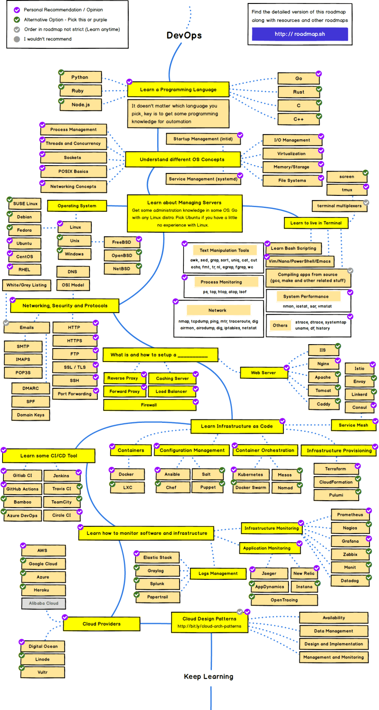

# My Personal journey to become a DevOps engineer

## Roadmap

## Checklist

| Status             | Title         | resources                                                                                                                                                                  |
| ------------------ | ------------- | -------------------------------------------------------------------------------------------------------------------------------------------------------------------------- |
| :heavy_check_mark: | ansible       | [Ansible for DevOps](https://www.amazon.com/Ansible-DevOps-Server-configuration-management-ebook/dp/B08FBLVVFG)                                                            |
| [ ]                | AWX           | [Ansible AWX By Examples](https://www.amazon.com/Ansible-AWX-Examples-real-life-examples-ebook/dp/B0BKQZWDFW/ref=sr_1_1?keywords=awx&qid=1675409595&s=digital-text&sr=1-1) |
| [ ]                | clickhouse    | [Official Docs](https://clickhouse.com/docs)                                                                                                                               |
| :heavy_check_mark: | confluence    |                                                                                                                                                                            |
| :heavy_check_mark: | docker        |                                                                                                                                                                            |
| [ ]                | elasticsearch |                                                                                                                                                                            |
| [ ]                | HAProxy       |                                                                                                                                                                            |
| :heavy_check_mark: | itop          | [Official Docs](https://www.itophub.io/wiki/page)                                                                                                                          |
| :heavy_check_mark: | jira          |                                                                                                                                                                            |
| :heavy_check_mark: | jitsi         |                                                                                                                                                                            |
| [ ]                | kafka         |                                                                                                                                                                            |
| [ ]                | kerio         |                                                                                                                                                                            |
| [ ]                | kibana        |                                                                                                                                                                            |
| :heavy_check_mark: | kubernetes    |                                                                                                                                                                            |
| [ ]                | logstash      |                                                                                                                                                                            |
| :heavy_check_mark: | LVM           |                                                                                                                                                                            |
| :heavy_check_mark: | minio         | [Official Docs](https://min.io/docs/minio/linux/index.html)                                                                                                                |
| [ ]                | mongodb       |                                                                                                                                                                            |
| [ ]                | mysql         |                                                                                                                                                                            |
| :heavy_check_mark: | Nextcloud     |                                                                                                                                                                            |
| :heavy_check_mark: | openLDAP      |                                                                                                                                                                            |
| :heavy_check_mark: | openssh       |                                                                                                                                                                            |
| :heavy_check_mark: | PKI           |                                                                                                                                                                            |
| [ ]                | postgres      |                                                                                                                                                                            |
| [ ]                | powershell    |                                                                                                                                                                            |
| :heavy_check_mark: | raid          |                                                                                                                                                                            |
| [ ]                | redis         |                                                                                                                                                                            |
| :heavy_check_mark: | SSL-TLS       |                                                                                                                                                                            |
| :heavy_check_mark: | syslog        |                                                                                                                                                                            |
| :heavy_check_mark: | vagrant       | [Official Docs](https://developer.hashicorp.com/vagrant/docs)                                                                                                              |
| [ ]                | vector        | [Official Docs](https://vector.dev/docs/reference/)                                                                                                                        |
| :heavy_check_mark: | zabbix        | [Zabbix 6 IT Infrastructure Monitoring Cookbook](https://www.amazon.com/Zabbix-Infrastructure-Monitoring-Cookbook-maintaining-ebook/dp/B09M6VYG1P)                         |
