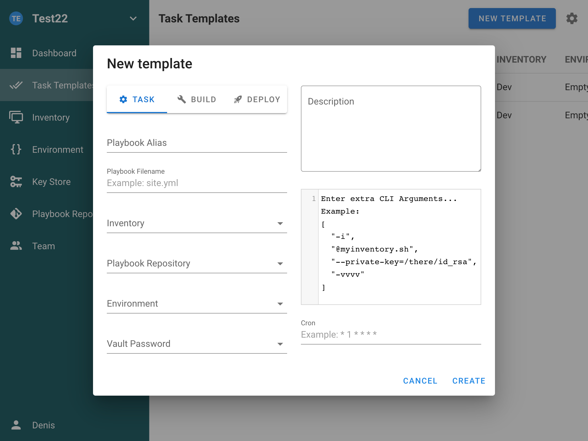
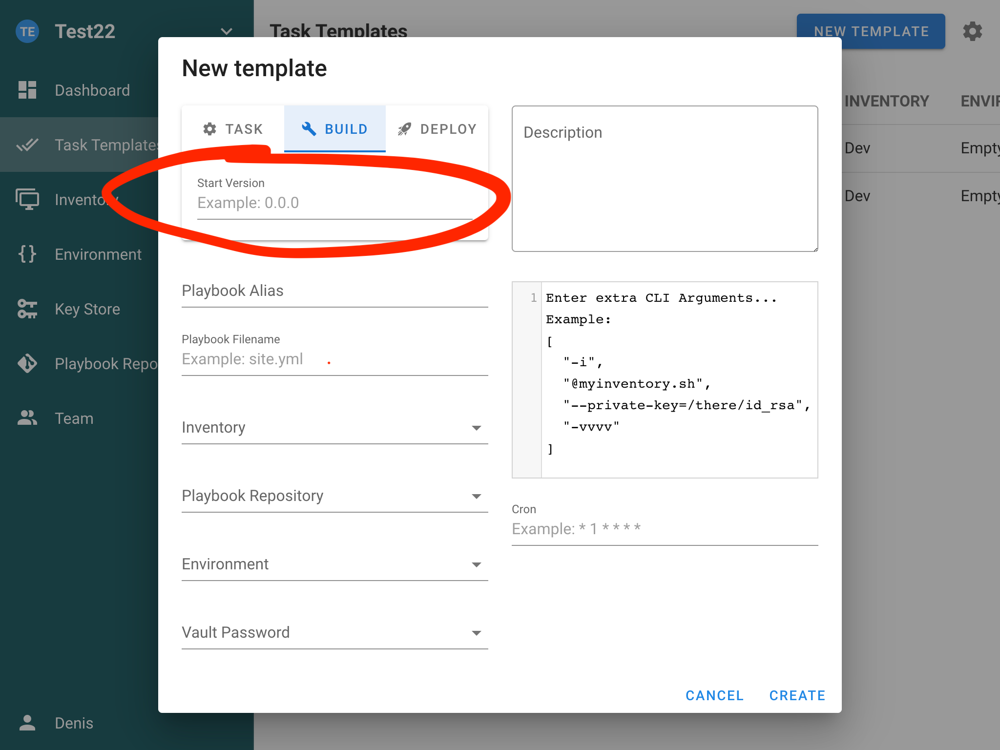
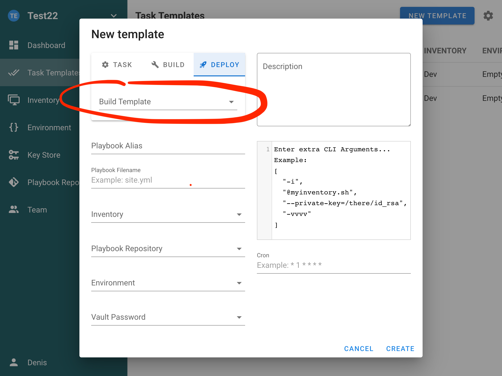

# Ansible Semaphore

## Installation

[Here](https://docs.ansible-semaphore.com/administration-guide/installation) you can find complete installation guide, but I like to use docker
compose, so here it is:

```yaml
services:
  # uncomment this section and comment out the mysql section to use postgres instead of mysql
  #postgres:
  #restart: unless-stopped
  #ports:
  #- 5432:5432
  #image: postgres:14
  #hostname: postgres
  #volumes:
  #  - ./semaphore-postgres:/var/lib/postgresql/data
  #environment:
  #  POSTGRES_USER: semaphore
  #  POSTGRES_PASSWORD: semaphore
  #  POSTGRES_DB: semaphore
  # if you wish to use postgres, comment the mysql service section below
  mysql:
    restart: unless-stopped
    ports:
      - 3306:3306
    image: mysql:8.0
    hostname: mysql
    volumes:
      - ./semaphore-mysql:/var/lib/mysql
    environment:
      MYSQL_RANDOM_ROOT_PASSWORD: "yes"
      MYSQL_DATABASE: semaphore
      MYSQL_USER: semaphore
      MYSQL_PASSWORD: semaphore
  semaphore:
    restart: unless-stopped
    ports:
      - 3000:3000
    image: semaphoreui/semaphore:latest
    environment:
      SEMAPHORE_DB_USER: semaphore
      SEMAPHORE_DB_PASS: semaphore
      SEMAPHORE_DB_HOST: mysql # for postgres, change to: postgres
      SEMAPHORE_DB_PORT: 3306 # change to 5432 for postgres
      SEMAPHORE_DB_DIALECT: mysql
      SEMAPHORE_DB: semaphore
      SEMAPHORE_PLAYBOOK_PATH: /tmp/semaphore/
      SEMAPHORE_ADMIN_PASSWORD: changeme
      SEMAPHORE_ADMIN_NAME: admin
      SEMAPHORE_ADMIN_EMAIL: admin@localhost
      SEMAPHORE_ADMIN: admin
      SEMAPHORE_ACCESS_KEY_ENCRYPTION: gs72mPntFATGJs9qK0pQ0rKtfidlexiMjYCH9gWKhTU=
      SEMAPHORE_LDAP_ACTIVATED: "no" # if you wish to use ldap, set to: 'yes'
      SEMAPHORE_LDAP_HOST: dc01.local.example.com
      SEMAPHORE_LDAP_PORT: "636"
      SEMAPHORE_LDAP_NEEDTLS: "yes"
      SEMAPHORE_LDAP_DN_BIND: "uid=bind_user,cn=users,cn=accounts,dc=local,dc=shiftsystems,dc=net"
      SEMAPHORE_LDAP_PASSWORD: "ldap_bind_account_password"
      SEMAPHORE_LDAP_DN_SEARCH: "dc=local,dc=example,dc=com"
      SEMAPHORE_LDAP_SEARCH_FILTER: "(\u0026(uid=%s)(memberOf=cn=ipausers,cn=groups,cn=accounts,dc=local,dc=example,dc=com))"
    depends_on:
      - mysql # for postgres, change to: postgres
#volumes:
#  semaphore-mysql: # to use postgres, switch to: semaphore-postgres
```

## Explanation

1. **Project:** A project is a place to separate management activity.
1. **Task Templates:** Templates define how to run an Ansible Playbook.
   The task template can be one of the following types:
   1. **Task:** Just runs specified playbooks with specified parameters.
      
   1. **Build:** This type of template should be used to create artifacts.
      The start version of the artifact can be specified in a template
      parameter. Each run increments the artifact version. Semaphore
      doesn't support artifacts out-of-box, it only provides task
      versioning. You should implement the artifact creation yourself.
      Read the article CI/CD to know how to do this.
      
   1. **Deploy:** This type of template should be used to deploy artifacts
      to the destination servers. Each deploy template is associated with
      a build template. This allows you to deploy a specific version of
      the artifact to the servers.
      
1. **Key Store:** The Key Store in Semaphore is used to store credentials
   for accessing remote Repositories, accessing remote hosts, sudo
   credentials, and Ansible vault passwords.
1. **Inventory:** An Inventory is a file that contains a list of hosts
   Ansible will run plays against. An Inventory also stores variables
   that can be used by playbooks. An Inventory can be stored in YAML,
   JSON, or TOML. More information about Inventories can be found in the
   [Ansible Documentation](https://docs.ansible.com/Ansible/latest/user_guide/intro_inventory.html).
1. **Environment:** The Environment section of Semaphore is a place to
   store additional variables for an inventory and must be stored in
   JSON format. All task templates require an environment to be defined
   even if it is empty.
1. **Repositories:** A Repository is a place to store and manage Ansible content like
   playbooks and roles. Semaphore understands Repositories that are:

   - a local Git Repository (git://)
   - a local file system (file://)
   - a remote Git Repository that is accessed over HTTPS (https://), or SSH(ssh://)

All Task Templates require a Repository in order to run.

Related:

```
* https://docs.ansible-semaphore.com/user-guide/projects
```
