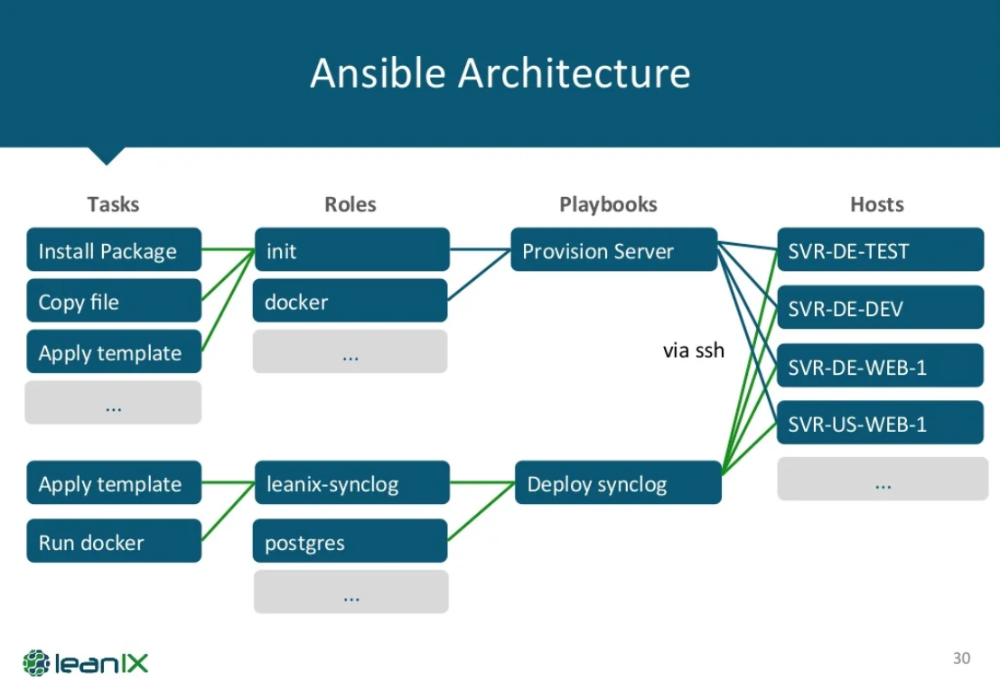
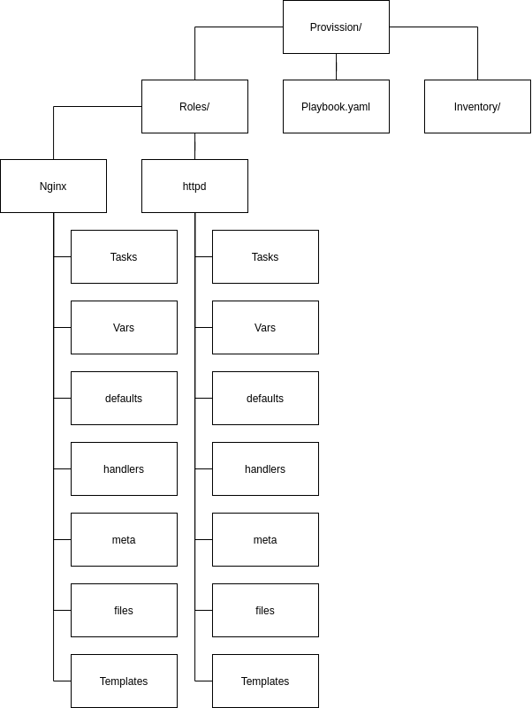

# Introduction to ansible 
Ansible is an automation platform that makes your application and
systems easier to deploy

It support configuration management with examples as below:
* Install and configuration of servers
* Application deployment
* Continuous testing of already installed application
* Orchestration
* Automation

Ansible can handle both Infrastructure as a code(IaaC) and
Configurations as a code(CaaC). 

IaaC ansible can handle the following situations:
1. Install a new package on an existing OS
1. Install an OS on physical server, Virtual server
1. Install Physical/virtual server on bare metal - for example only ILO
	 exists

# Why ansible
1. It's free and open source application
1. Agent-less - No need for agent installation and management, only
	 needs IP and SSH
1. Python/yaml based
1. Highly flexible and configuration management of system
1. Large number of ready to use modules for system management
1. Custom modules can be added if needed
1. Configuration roll-back in case of error
1. Simple and human readable
1. Self documenting

# Introduction to YAML
Yaml includes a markup language with important construct

The design goal and features of Yaml:
1. Matches native data structure languages
1. Yaml data is possible between programming languages
1. Includes data consist data model
1. Easily readable by human
1. Supporting one-direction	processing
1. Ease of implementation and usage

# Ansible architecture




* **Playbook**: It demonstrate what job should run in which host
* **Role**: It's set of task which lead to perform a job
* **Tasks**: Procedure of your desired job

# Ansible playbook structure
In ansible everything places in a provision(a directory).

Directory layout based on [official documentation](https://docs.ansible.com/ansible/2.8/user_guide/playbooks_best_practices.html)
```
production                # inventory file for production servers
staging                   # inventory file for staging environment

group_vars/
   group1.yml             # here we assign variables to particular groups
   group2.yml
host_vars/
   hostname1.yml          # here we assign variables to particular systems
   hostname2.yml

library/                  # if any custom modules, put them here (optional)
module_utils/             # if any custom module_utils to support modules, put them here (optional)
filter_plugins/           # if any custom filter plugins, put them here (optional)

site.yml                  # master playbook
webservers.yml            # playbook for webserver tier
dbservers.yml             # playbook for dbserver tier

roles/
    common/               # this hierarchy represents a "role"
        tasks/            #
            main.yml      #  <-- tasks file can include smaller files if warranted
        handlers/         #
            main.yml      #  <-- handlers file
        templates/        #  <-- files for use with the template resource
            ntp.conf.j2   #  <------- templates end in .j2
        files/            #
            bar.txt       #  <-- files for use with the copy resource
            foo.sh        #  <-- script files for use with the script resource
        vars/             #
            main.yml      #  <-- variables associated with this role
        defaults/         #
            main.yml      #  <-- default lower priority variables for this role
        meta/             #
            main.yml      #  <-- role dependencies
        library/          # roles can also include custom modules
        module_utils/     # roles can also include custom module_utils
        lookup_plugins/   # or other types of plugins, like lookup in this case

    webtier/              # same kind of structure as "common" was above, done for the webtier role
    monitoring/           # ""
    fooapp/               # ""

```
Alternative way:
```
inventories/
   production/
      hosts               # inventory file for production servers
      group_vars/
         group1.yml       # here we assign variables to particular groups
         group2.yml
      host_vars/
         hostname1.yml    # here we assign variables to particular systems
         hostname2.yml

   staging/
      hosts               # inventory file for staging environment
      group_vars/
         group1.yml       # here we assign variables to particular groups
         group2.yml
      host_vars/
         stagehost1.yml   # here we assign variables to particular systems
         stagehost2.yml

library/
module_utils/
filter_plugins/

site.yml
webservers.yml
dbservers.yml

roles/
    common/
    webtier/
    monitoring/
    fooapp/
```

* **Inventory**: Where the ```hosts``` file will place
* **Role**: Where projects directories will place, for example, install
	Apache, install samba, etc.
	* **Task**: It's least minimum that ansible needs regarding work
		properly 
	* **vars** and **defaults**: Where all variables could declare. The
		variables with less changes placed in **defaults**, like version,
		and other variables with more changes, like username or password
		keep in **vars**.
	* **files** and **templates**: Where all files that needed during the
		run process keep in. Immutable files like ```.rpm```, ```.tar.gz```,
		and others placed in **files** and mutable file like config files
		placed in **template**. All files in **template** should have
		```.j2``` file extension.
	* **handlers**: Where placed actions like ```stop```, ```start```,
		```restart```, ```enable```, etc for service that installed or
		modified
	* **meta**: Where placed dependencies and preprocessing in it, for
		example install specific package, or disable ```selinux```

# Hot to run Ansible Playbook with parameters and error handling in playbooks 

```bash
ansible-playbook -i /PATH/TO/<inventory-file-name> <playbook-name>.yml --<switches>
```

**Switches**:
* ```-v```: Verbose for view details(```-v```,```-vv```,```-vvv```)
* ```--tags=<tag-name>```: Run only <tag-name> used into task/main.yml
* ```--tags "<tag-name-1>,<tag-name-2>,..."```: Select tags for RUN
* ```--tags-skip "<tag-name-1>,<tag-name-2>,..."```: Select tags for not RUN 
* ```--step```: (y/n/c) (yes/no/continue) ask to RUN each step
* ```--list-tasks```: List of tasks in yaml file without RUN
* ```--extra-vars <var-name>="<value>"```: Create variable
* ```--syntax-check```: Yaml file syntax check
* ```--check``` (Dry-run mode): Check yaml file without RUN and Download
  make sure it's runnable

# Generate key
To connect to remote servers ansible needs to have a password-less ssh
connection, to do so we need to generate a ssh key:
```bash
ssh-keygen -t rsa
ssh-copy-id root@<remote-address/remote-name>
```
> Note: Remember ansible default user is ```root``` user, so you need to
add generate key for your root user

Know let's test ansible can communicate with hosts
```bash 
ansible -m ping <group-name>/all
```
## Running command on remote with ansible
In ansible we can run our commands on the remote machine via the two
following ways:
1. Ad-hoc commands: something you want to do quick, but don't need to
   save it
   * Parallelism and shell commands
   * File transfer
   * Managing packages
   * Users and groups
   * Deploying from source control
   * Managing services
   * Gathering informations
1. Playbook: Works with yaml files

## Ad-hoc

### Check network connection with ```ping``` module
```bash 
ansible -m ping <group-name>/all
```

### Gathering informations with ```shell``` module
```bash
ansible -m shell -a "<shell-command>" <group-name>/all
```

### Transfer file with ```copy``` module
```bash
ansible -m copy -a "src=<file-path> dest=<file-path> " <group-name>/all
```

### Change file permission with ```file``` module
```bash
ansible -m file -a "dest=<file-path> mode=<chmod>" <group-name>/all
```
for example:
```bash
ansible -m file -a "dest=/root/file.txt mode=0600" all
```
### Managing packages with ```yum``` module
```bash
ansible -m yum -a "name=net-tools state=present"  <group-name>/all
```
> Note: ```state``` demonstrate the ```install/remove``` situation which
```present``` means install the package and ```absent``` means remove
the package

### Creating user with ```user``` module
```bash
ansible -m user -a "name=<username> state=present"  <group-name>/all
```
> Note: ```present``` means create the user and ```absent``` means
remove it

### Deploy from source with ```git``` module
```bash
ansible -m git -a "repo=<repo-url> dest=<destination>"  <group-name>/all
```

### Managing services with ```service``` module
```bash
ansible -m service -a "name=<service-name> state=<state>"  <group-name>/all
```
> Note: states here can be  ```started```, ```stopped```,
```restarted```, and ```reloaded```

### Gathering facts with ```setup``` or ```gather_facts```
```bash
ansible -m setup <group-name>/all
# or
ansible -m gather_facts <group-name>/all
```
## Playbook

### Define and use variables

Variables can be define in the following files
* Playbook 
* vars
* defaults

Variables can be used in the following files
* jinja2
* tasks
* meta
* handlers 

Creating variable in vars and defaults:
```yaml
    <var-name>: <var-value>
```
Creating variable in playbook:
```yaml
vars:
  <var-name>: <var-value>
```

Using the defined variable
```yaml
call:
    

```

# Setup Ansible
To set up ansible you need the following files and directories:

1. ```~/ansible/provision``` directory
1. ```~/ansible/provision/roles``` directory
1. ```~/ansible/provision/inventory``` directory
1. ```~/ansible/provision/project.yml``` file

## Inventory
In this directory we can add hosts that we want to manage as file(s)
```bash
mkdir ~/ansible/provision/inventory/hosts
cat > ~/ansible/provision/inventory/hosts << EOF
# [GROUP_NAM]
# IP_ADDRESS
# DOMAIN_NAME
EOF
```

## Roles
This directory contains seven sub-directories which mentioned before,
they are
1. tasks
1. defaults
1. vars
1. meta
1. templates
1. files
1. handlers

## project.yaml (your playbooks) 
In the ansible root directory we can define various projects as yaml
playbooks and run them when we need:
```bash
ansible-playbook -i inventory/hosts project.yaml
```
> Note: with ```-i``` flag we can pass our desired inventory host file
inside the project.yaml file there is something like:
```yaml
---
- hosts: <group_name in hosts file>
  roles:
    - nginx
```
# Session 3

# Writing task
All ansible modules have an structure as below
```yml
- name: [it's just for clarification, documentation, and it's not mandatory]
  MODULES: [here as hierarchy we should define module's components]
  tags: [it use when we just want to run a block from a playbook]
```

## Creating a directory
```yml
- name: Create a directory
  file:
    path: <dir-path>/<dir-name> # path of the directory we want to create
    state: directory 
    owner: root
    group: root
    mode: 0775
  tags: [createdir]
```
> **Note:** To remove directory use ```state: absent```
> **Note:** To create ```/dir/subdir/subdir/``` user ```recursive: yes```

[More info](https://docs.ansible.com/ansible/latest/collections/ansible/builtin/file_module.html)

## Creating a file
```yml
- name: Create a directory
  file:
    path: <dir-path>/<dir-name> # path of the directory we want to create
    state: touch 
    owner: root
    group: root
    mode: 0775
  tags: [createdir]
```
> **Note:** To remove file use ```state: absent```

> **Note:** In order to run ansible playbook on a windows machine you
need to use ```win_file``` module, like

```yaml
- name: Create a file
  win_file:
    path: C:\Temp\foo.conf
    state: file
```

[More info](https://docs.ansible.com/ansible/latest/collections/ansible/builtin/file_module.html)

## Create a config file and copy form ```templates``` directory

1. Create and copy ```<filename>.conf.j2``` file to /PATH/TO/provision/roles/<project-name>/templates
2. Add the following block in ```..../tasks/main.yaml```
```yaml
- name: <some description>
  template:
    src: <filename>.conf.j2
    dest: /PATH/ON/TARGET/<filename>[.file-extension]
  notify: <some handling action>
  tags: []
```
Real world example:
```yaml
- name: Copy httpd.conf to /etc/httpd/conf
  template:
    src: httpd.conf.j2
    dest: /etc/httpd/conf/httpd.conf
  notify: Restart httpd
  tags: [httpd]
```

> **Note:** If you want to have a backup file form the file that going
to override add ```backup=yes``` in template level

[More info](https://docs.ansible.com/ansible/latest/collections/ansible/builtin/template_module.html)

## Copy file and ```files``` directory
```files``` directory is used to hold type of files which they are
not going to change, at lease soon, like binaries, compressed files, and
etc. 

To copy file ```copy``` module is available and it works by the
following steps:
1. Check the ```files``` directory for the file you are going to use in
   ```yaml``` file
1. Perform the defined task

```yaml
- name: Copy file.gz to /tmp
  copy:
    src: file.gz
    dest: /tmp
  tags: [copy_gz_file]
```

[More info](https://docs.ansible.com/ansible/latest/collections/ansible/builtin/copy_module.html)

## Download file from URL with ```get_url```
This module will download file from a URL and place in given destination

```yaml
- name: Download RPM
  get_url: 
    url: http://URL
    dest: /tmp
  tags: [get_rpm]
```

> **Note:** before running your playbook check the URL with ```wget```
or other similar tools to check URL availability.

[More info](https://docs.ansible.com/ansible/latest/collections/ansible/builtin/get_url_module.html)

## Unzip compressed files with ```unarchive``` module

```yaml
- name: unzip file.gz in /tmp
  unarchive: 
    src: /tmp/file.gz
    dest: /tmp
    copy: no
  tags: [unzip]
```
| src = Ansible | src = Ansible | dest = Host |
| --- | --- | --- |
| copy = no | - | file.gz + unzip |
| copy = yes | file.gz | unzip |

> **Note:** In case of using ```copy: no``` you should give the file
address on the host machine, and vis a versa, if you are using ```copy:
yes``` you should put your file in ```files``` directory.

[More info](https://docs.ansible.com/ansible/latest/collections/ansible/builtin/unarchive_module.html)

## Create group and user
```yaml
- name: create a group
  group:
    name: test
    state: present
  tags: [create_group]
```

```yaml
- name: create a user
  user:
    name: test
    state: present
    comment: test user
    group: test
  tags: [create_user]
```

> **Note:** To delete both user and group just change their state to
```absent```. 

> **Note:** To remove created home directory in case of removing user,
use ```remove: yes```. On the other hand you can use ```create_home:
no``` when you are creating user.

> **Note:** In case of creating a not existing group and user you should
first create group then the user, but in case of removing them you
should fist remove user then group.

[More info](https://docs.ansible.com/ansible/latest/collections/ansible/builtin/user_module.html)
[More info](https://docs.ansible.com/ansible/latest/collections/ansible/builtin/group_module.html)


## Using yum
Installing a package
```yaml
- name: install epe-release
  yum:  
    name: epe-release
    state: present
  tags: [pre_install]
```
Updating a package
```yaml
- name: install epe-release
  yum:  
    name: epe-release
    state: latest
  tags: [update]
```
updating yum
```yaml
- name: yum update
  yum:  
    name: *
    state: latest
  tags: [yum_update]
```
[More info](https://docs.ansible.com/ansible/latest/collections/ansible/builtin/yum_module.html)

## Loops
In ansible loops define like bellow
```yaml
- name: Install many packages
  yum:
    name: "{{ item }}"
    state: latest
  with_items:
    - net-tools
    - vim
  tags: [install_essentials]
```
> **Note:** ```item``` is the only variables loops work with.
> **Note:** In newer versions of ansible ```with_item``` is deprecated
and you should use ```loop``` instead.

Create multiple item in loop
```yaml
- name: more complex item
  module_name:
    name: "{{ item.name }}"
    family: "{{ item.family }}"
    code: "{{ item.code }}"
  with_items:
    - { name: var1, family: var2, code: var3 }
    - { name: var4 }
```

> **Note:** item variables should be written between ```"{{ HERE }}"```
> **Note:** Remember you have to make space between ```:``` and your
value like ```key: value``` 

[More info](https://docs.ansible.com/ansible/latest/user_guide/playbooks_loops.html)

## Service modules
In ansible we can start, stop, enable, disable, and remove services with
```service``` module

Started service:
```yaml
- name: start firewalld
  service:
    name: firewalld
    state: started
  tags: [iptables]
```

Disable service:
```yaml
- name: disable firewalld
  service:
    name: firewalld
    state: stopped
    enabled: no
  ignore_errors: True # When firewalld is stopped
  tags: [iptables]
```

Enable service:
```yaml
- name: enable firewalld
  service:
    name: firewalld
    enabled: yes
  ignore_errors: True # When firewalld is stopped
  tags: [iptables]
```

Remove service:
```yaml
- name: remove firewalld
  service:
    name: firewalld
    state: absent
  tags: [iptables]
```

Restart service:
```yaml
- name: restart firewalld
  service:
    name: firewalld
    state: restarted
  tags: [iptables]
```

Reloaded service:
```yaml
- name: reload firewalld
  service:
    name: firewalld
    state: reloaded
  tags: [iptables]
```

## Run existing shell script with ```shell``` and ```command``` module
```yaml
- name: Running command
  shell: "{{ item }}"
  args:
    chdir: /opt/
  with_items:
    - ./com1
    - ./com2
    - ./com3
  tags: [commands]
```

```yaml
- name: command run
  command: touch /root/test.txt
  tags: [commands]
```

> **Note:** The command module is more secure, because it will not
affected by user's environment.
> **Note:** ```command``` runs the instruction remotely, you can't do
much with output, but ```shell``` do it like it's there and you can do
anything you want like you are logged in to the host.

[More info](https://docs.ansible.com/ansible/latest/collections/ansible/builtin/shell_module.html)

## Conditional loops
```yaml
- name: Create many files in /home
  file:
    path: /home/file{{ item }}
    state: touch
  with_sequence: start=57 end=67
  tags: [touch_many]
```

> **Note:** you can define hope count with ```stride: NUMBER```, for
example create odd indexes.
> **Note:** you cannot use waterfall structure for ```with_sequence```
and you should use the one liner style like above.

## Mysql modules
### Create database
```yaml
-name: create database
 mysql_db:
   name: DBName
   state: present
 tags: [create_db]
```

> **Note:** your msql database should be started.

### Create user
```yaml
-name: Create dbuser
 mysql_user:
   name: <db_name>
   password: <db_password>
   host: "{{ item }}"
   login_user: root
   login_password: ""
   priv: <db_name>.*.ALL
   state: present
 with_item:
   - 127.0.0.1
   - ::1
   - localhost
 tags: [dbuser]
```

### Created related privileges
```yaml
-name: Related privilege tables
 command: 'mysql -ne "{{ item }}"'
 with_items:
   - FLUSH PRIVILEGES
 changed_when: False
 tags: [flush]
```

> **Note:** when you modified the database to apply the changes you
should flush the database

> **Note:** ```changed_when``` responsible to executing the
```command```, when it's ```True``` the command will be execute and vis
a versa.

### Import clean database structure into MyDataBase
Fist you need to copy the database to the host machine
```yaml
-name: copy create.sql.gz
 copy:
   src: create.sql.gz
   dest: /tmp
 tags: [db]
```
then import it
```yaml
-name: import db
 mysql_db:
   state: present
   name: <db_name>
   target: /tmp/create.sql.gz
 tags: [import_db]

```

# Examples

## Example project 1

1. Create a directory to ```/etc/config```
1. Create a directory to ```/etc/config/config.d```
1. Create a file ```stp.conf```
1. Copy ```stp.conf``` file to ```/etc/config/config.d/stp.conf``` with
   backup
1. Create ```.my.stp.file```
1. Copy ```.my.stp.file``` to ```/etc/config```
1. Copy and rename ```zabbix.tar.gz``` to ```/app/source.tar.gz```
1. Unzip ```source.tar.gz``` to ```/apps/``` from host

## Example project 2

1. Create group (g1, g2)
1. Create user (testuser1, testuser2 ) with UID (9902, 9903)
1. Join testuser1 to group g1 and g2, join testuser2 to g1
1. Test on host

## Example project 3

1. Copy 2 config files jinja2 to ```/opt``` without extension file j2

## Example project 4

1. Install maraiadb-server
1. Install Mysql-python
1. Start service


2:13:53
