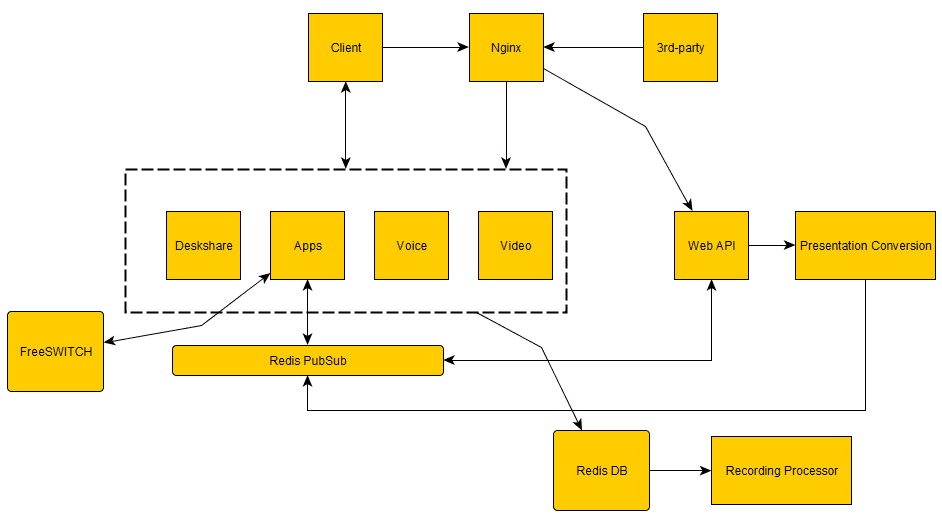
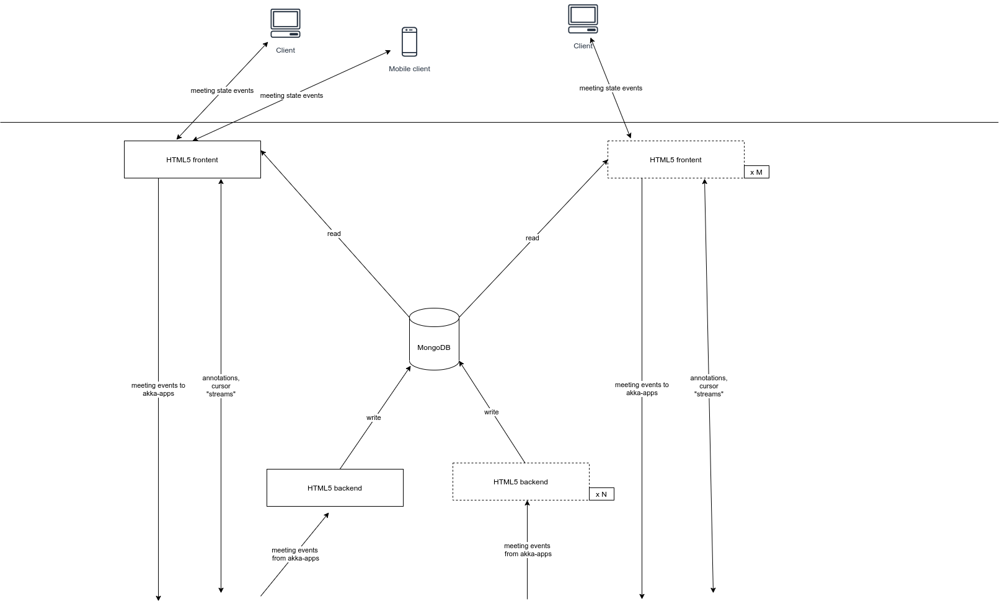
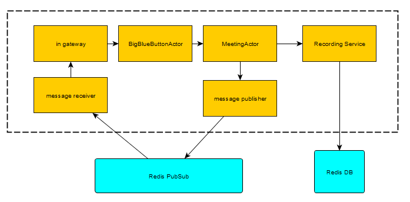
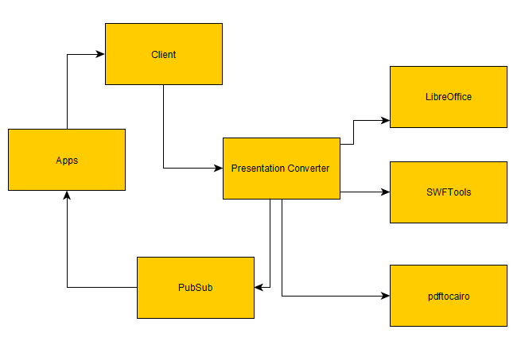
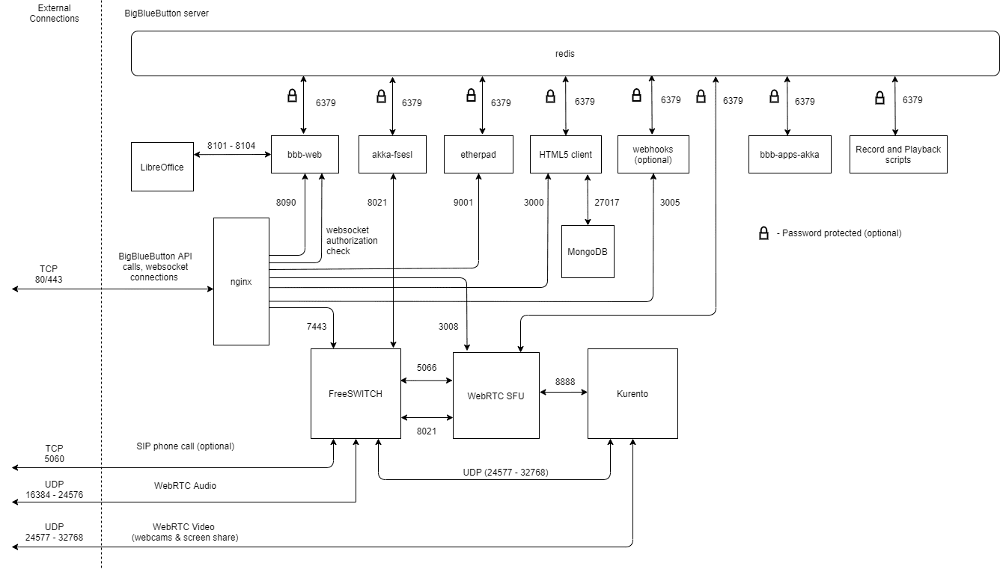

# What is BigBlueButton

BigBlueButton is an open-source web conferencing system designed for
online learning and virtual collaboration. It provides a platform for
hosting virtual classrooms, online meetings, and webinars with a focus
on education. The primary goal of BigBlueButton is to facilitate remote
learning and enhance online teaching experiences.

## Key features

1. **Real-time Collaboration:** BigBlueButton supports real-time
	 collaboration through features like video conferencing, audio
	 conferencing, chat, and interactive whiteboard tools. This allows
	 participants to engage in discussions, ask questions, and collaborate
	 on shared content.

2. **User Roles:**
	 - **Moderator/Presenter:** The person leading the session is
		 typically designated as the moderator or presenter. This role has
		 control over the content sharing, interactive tools, and overall
		 session management.
	 - **Participant:** Participants can join sessions, view shared
		 content, engage in discussions through audio and video, and
		 participate in interactive activities.

3. **Presentation and Content Sharing:** Presenters can share slides,
	 documents, and other educational materials with participants. This is
	 particularly useful for delivering lectures, conducting
	 presentations, and sharing visual content during online classes.

4. **Interactive Whiteboard:** The interactive whiteboard feature
	 enables presenters to draw diagrams, write notes, and illustrate
	 concepts in real time. This enhances the interactive and engaging
	 aspects of online learning.

5. **Recording and Playback:** BigBlueButton allows sessions to be
	 recorded for later playback. This is beneficial for students who may
	 need to review the material or for those who were unable to attend
	 the live session.

6. **Polls and Quizzes:** The platform supports interactive elements
	 such as polls and quizzes, enabling instructors to assess student
	 understanding and gather feedback during live sessions.

7. **Integration with Learning Management Systems (LMS):** BigBlueButton
	 can be integrated with various learning management systems, making it
	 easier for educational institutions to incorporate the platform into
	 their existing online learning environments.

8. **Security Features:**
	 - BigBlueButton includes security features to ensure the privacy and
		 integrity of online sessions. This may include password protection
		 for rooms, waiting rooms for participants, and control over who can
		 access the session.

9. **Community and Support:**
	 - Being an open-source project, BigBlueButton benefits from a
		 community of developers and contributors who actively work on its
		 improvement. The community provides support through forums,
		 documentation, and ongoing development efforts.

10. **Scalability:**
	 - BigBlueButton is designed to be scalable, allowing it to
		 accommodate a varying number of participants in different sessions.
		 This makes it suitable for both small online classes and larger
		 webinars.

11. **Open Source:** Being open source means that the software's source
	 code is freely available and can be modified and customized by users.
	 This fosters community collaboration and allows institutions to adapt
	 the platform to their specific needs.


# BigBlueButton Architecture

**Main Components:

* NGINX
* FreeSWITCH
* Kurento
* Redis
* Node.js
* React.js



## HTML5 client

The HTML5 client is a single page, responsive web application that is
built upon the following components:

* React.js for rendering the user interface in an efficient manner
* WebRTC for sending/receiving audio and video

The HTML5 client connects directly with the BigBlueButton server over
port 443 (SSL), from loading the BigBlueButton client to making a web
socket connection. These connections are all handled by nginx.

The HTML5 server sits behind nginx.

The HTML5 server is built upon

* Meteor.js in ECMA2015 for communication between client and server.
* MongoDB for keeping the state of each BigBlueButton client consistent
	with the BigBlueButton server

The MongoDB database contains information about all meetings on the
server and, in turn, each client connected to a meeting. Each user's
client is only aware of the their meeting's state, such the user's
public and private chat messages sent and received. The client side
subscribes to the published collections on the server side. Updates to
MongoDB on the server side are automatically pushed to MiniMongo on the
client side.



**Frontend(s):**

* receive the ValidateAuthTokenResp event to complete authentication
* collection subscription and publishing
* other DDP events including method calls to send events to akka-apps
* handle completely the Streamer redis events: Cursor, Annotations, External video share
* still require MeetingStarted and MeetingEnded events to create/destroy per-meeting event processing queues

**Backend(s):**

* handle all the non-streamer events
* if more than one backend is running, bbb-web splits the load in round-robin fashion by assigning an instanceId. So individual backends only process redis events for the meetings matching the associated instanceId
* ValidateAuthTokenResp is passed to backends as well, which is needed for the cases where you only have a backend, no frontends - for example dev environments that do not need to care about scaling


> **Note:**
> When you use `sudo bbb-conf --setip <hostname>` or `sudo bbb-conf
> --restart`, `bbb-conf` will run
> `/etc/bigbluebutton/bbb-conf/apply-config.sh` between shutdown and
> restart of the BigBlueButton processes. In this way, you can change
> configuration values of BigBlueButton, or use some of the helper
> functions in `apply-lib.sh`.

## BBB web

BigBlueButton web application is a Java-based application written in
Scala. It implements the BigBlueButton API and holds a copy of the
meeting state.

## Redis PubSub

Redis PubSub provides a communication channel between different
applications running on the BigBlueButton server. # Chronological flow

## Redis DB

When a meeting is recorded, all events are stored in Redis DB. When the
meeting ends, the Recording Processor will take all the recorded events
as well as the different raw (PDF, WAV, FLV) files for processing.

## App akka

BigBlueButton Apps is the main application that pulls together the
different applications to provide real-time collaboration in the
meeting. It provides the list of users, chat, whiteboard, presentations
in a meeting.

### App akka components



The meeting business logic is in the MeetingActor. This is where
information about the meeting is stored and where all messages for a
meeting is processed.

## FreeSWITCH

FreeSWITCH is a piece of software for handling audio.

FreeSWITCH provides the voice conferencing capability in BigBlueButton.
Users are able to join the voice conference through the headset. Users
joining through Google Chrome or Mozilla Firefox are able to take
advantage of higher quality audio by connecting using WebRTC. FreeSWITCH
can also be integrated with VOIP providers so that users who are not
able to join using the headset will be able to call in using their
phone.

## Kurento and WebRTC-SFU

Kurento Media Server KMS is a media server that implements both SFU and
MCU models. KMS is responsible for streaming of webcams, listen-only
audio, and screensharing. The WebRTC-SFU acts as the media controller
handling negotiations and to manage the media streams.


> **Note:**
>
> In the context of Kurento Media Server, SFU (Selective Forwarding
> Unit) and MCU (Multipoint Control Unit) are two different approaches
> to handling real-time media streams in a video conferencing or
> communication system.
> 
> 1. **SFU (Selective Forwarding Unit):**
> 	 - An SFU is a type of media server that receives media streams (such
> 		 as audio and video) from multiple participants in a session and
> 		 selectively forwards (distributes) them to other participants.
> 	 - In an SFU architecture, each participant sends their media stream
> 		 to the SFU, and the SFU then forwards the streams to the other
> 		 participants in the session.
> 	 - SFUs are often used in scenarios where bandwidth considerations are
> 		 important, as each participant only needs to send their media to
> 		 the SFU, which then handles distribution to other participants.
> 
> 2. **MCU (Multipoint Control Unit):**
> 	 - An MCU is a central server that mixes and processes media streams
> 		 from multiple participants before forwarding the combined stream to
> 		 all participants.
> 	 - In an MCU architecture, each participant sends their media stream
> 		 to the central MCU, which then mixes the audio and video streams
> 		 from all participants into a single stream.
> 	 - MCUs are often used when centralized control over the media streams
> 		 is necessary, such as in scenarios where advanced features like
> 		 layout customization, mixing, or additional processing are
> 		 required.
> 
> Kurento Media Server is a WebRTC media server that supports both SFU and
> MCU functionalities. It provides a flexible and extensible platform for
> building real-time communication applications, including video
> conferencing. Depending on the requirements of a particular application,
> developers can choose to configure Kurento to operate in either SFU mode
> or MCU mode.
> 
> It's worth noting that the choice between SFU and MCU depends on factors
> such as bandwidth constraints, scalability requirements, and the desired
> features of the real-time communication application.


## Uploading a presentation

Uploaded presentations go through a conversion process in order to be
displayed inside the client. When the uploaded presentation is an Office
document, it needs to be converted into PDF using LibreOffice. The PDF
document is then converted into scalable vector graphics (SVG) via
`bbb-web`.




[Official Documentation](https://docs.bigbluebutton.org/development/architecture#uploading-a-presentation)

## Internal network connections

The following diagram shows how the various components of BigBlueButton
connect to each other via sockets.



# Installation

## Minimum requirements

* Ubuntu 20.04 64-bit OS running Linux kernel 5.x
* Latest version of docker installed
* 16 GB of memory with swap enabled
* 8 CPU cores, with high single-thread performance
* 500 GB of free disk space (or more) for recordings, or 50GB if session
	recording is disabled on the server.
* TCP ports 80 and 443 are accessible
* UDP ports 16384 - 32768 are accessible
* 250 Mbits/sec bandwidth (symmetrical) or more
* TCP port 80 and 443 are not in use by another web server or reverse
	proxy
* A hostname (such as bbb.example.com) for setup of a SSL certificate
* IPV4 and IPV6 address

> **Note:** If you install BigBlueButton on a virtual machine in the
> cloud, we recommend you choose an instance type that has dedicated
> CPU. These are usually called "compute-intensive" instances.

## Installation

To install BigBlueButton, use
[bbb-install.sh](https://github.com/bigbluebutton/bbb-install/blob/v2.7.x-release/bbb-install.sh)
script.

## Post installation steps

If this server is intended for production, you should also

* [Secure your system -- restrict access to specific
	ports](https://docs.bigbluebutton.org/administration/customize#secure-your-system--restrict-access-to-specific-ports)
* [Configure the server to work behind a
	firewall](https://docs.bigbluebutton.org/administration/firewall-configuration)
	(if you have installed behind a firewall or on a server that has a
	public/private IP address)
* [remove
	Greenlight](https://docs.bigbluebutton.org/greenlight/v3/install#uninstall)
	(if you had it installed and is no longer needed)
* [Set up a TURN server](https://docs.bigbluebutton.org/administration/turn-server) (if your server is on the Internet and you have
	users accessing it from behind restrictive firewalls)
* Test your HTTPS configuration. A well-respected site that can do a
	series of automated tests is https://www.ssllabs.com/ssltest/ - simply
	enter your server's hostname, optionally check the "Do not show
	results" check box if you would like to keep it private, then Submit.
	At time of writing, the configuration shown on this page should
	achieve an "A" ranking in the SSL Labs test page.


See [Official
Documentation](https://docs.bigbluebutton.org/administration/install#pre-installation-checks)
for more information


# Optimizations

Optimizing a BigBlueButton server involves various considerations,
including server configuration, network settings, and application-level
optimizations. Here are some criteria you can focus on:

1. **Server Resources:**
	 - **CPU:** Ensure that your server has sufficient CPU resources to
		 handle concurrent meetings and participants.
	 - **RAM:** Allocate enough RAM to handle the load. BigBlueButton
		 recommends at least 16 GB of RAM.
	 - **Storage:** Ensure you have enough disk space for recordings and
		 other data.

2. **Network Configuration:**
	 - **Bandwidth:** Ensure sufficient bandwidth for audio, video, and
		 data sharing during meetings.
	 - **Firewall Settings:** Allow the necessary ports for BigBlueButton
		- TCP/IP port 22 (for SSH)
		- TCP/IP ports 80/443 (for HTTP/HTTPS)
		- UDP ports in the range 16384 - 32768 (for FreeSWITCH/HTML5 RTP streams)

3. **BigBlueButton Configuration:**
	 - **bbb-conf Tool:** Use the `bbb-conf` script to configure
		 BigBlueButton settings. It can help optimize parameters such as
		 maximum participants, recording settings, etc.
	 - **Nginx Configuration:** Optimize your Nginx server settings for
		 BigBlueButton.

4. **GreenLight Configuration:**
	 - If you're using GreenLight as the front-end, ensure its
		 configuration aligns with your server specifications.

5. **Database Optimization:**
	 - Optimize the database server (usually PostgreSQL) for performance.
		 Adjust cache sizes, connections, etc.

6. **Red5 and Kurento Configuration:**
	 - Tune Red5 (for audio/video) and Kurento (for WebRTC) settings as
		 needed.

7. **Server Security:**
	 - Secure your server by keeping software up-to-date, using strong
		 authentication, and applying security best practices.

8. **Logging and Monitoring:**
	 - Implement logging and monitoring to identify performance
		 bottlenecks and issues.

Now, let's go through a basic example of how you might use the
`bbb-conf` tool to optimize BigBlueButton. Please note that the exact
steps may vary based on your server configuration.

```bash
# SSH into your BigBlueButton server
ssh your_username@your_server_ip

# Switch to root user
sudo su

# Run the bbb-conf tool
bbb-conf --check
bbb-conf --setip your_server_ip

# Follow the prompts to configure settings such as maximum participants, recording options, and others.

# After configuring, restart BigBlueButton services
bbb-conf --restart
```

## Calculating bandwithd

Calculating the required bandwidth per user for a video conferencing
system like BigBlueButton involves considering various factors such as
video quality, audio quality, and additional data sharing during the
meeting. Here's a general guideline for estimating bandwidth per user:

1. **Video Bitrate:**
	 - Video quality is a significant factor. Higher quality video
		 requires more bandwidth.
	 - For standard definition (SD) video, you might allocate around
		 300-500 kbps per participant.
	 - For high definition (HD) video, you might allocate around 1-2 Mbps
		 per participant.

	 > Reduce bandwidth from webcams
	 > You can change the maximum bandwidth settings for each webcam
	 > options (low, medium, high, high definition) by editing
	 > `/usr/share/meteor/bundle/programs/server/assets/app/config/settings.yml`
	 > and modifying the entries for
	 > ```yaml
	 > cameraProfiles:
   >   - id: low
   >     name: Low quality
   >     default: false
   >     bitrate: 100
   >   - id: medium
   >     name: Medium quality
   >     default: true
   >     bitrate: 200
   >   - id: high
   >     name: High quality
   >     default: false
   >     bitrate: 500
   >   - id: hd
   >     name: High definition
   >     default: false
   >     bitrate: 800
	 > ```

	 > **Note:** The settings for bitrate are in kbits/sec (i.e. 100
	 > kbits/sec). After your modify the values, save the file, restart
	 > your BigBlueButton server sudo bbb-conf --restart to have the
	 > settings take effect. The lowest setting allowed for WebRTC is 30
	 > Kbits/sec.
	 
	 > **Disable webcams:** You can disable webcams by setting enableVideo to
	 > false in the settings.yml file for the HTML5 client.
	 
	 > **Disable screen:** sharing You can disable screen sharing by setting
	 > enableScreensharing to false in the settings.yml file for the HTML5
	 > client.
	 
	 > **Change screen sharing quality parameter:** You can defualt width,
	 height, and framerate unser
	 `/usr/local/bigbluebutton/core/scripts/presentation.yml` with
	 `deskshare_output_width`, `deskshare_output_height`, and
	 `deskshare_output_framerate` keys and for **live meetings** change
	 these parameters:
	 * `/etc/bigbluebutton/bbb-html5.yml`: `public.kurento.screenshare.bitrate`
   * `/etc/bigbluebutton/bbb-html5.yml`: `public.kurento.screenshare.constraints`

2. **Audio Bitrate:**
	 - Audio quality contributes to bandwidth usage but is generally much
		 lower than video.
	 - Allocate around 50-100 kbps per participant for audio.

3. **Additional Data Sharing:**
	 - If participants share screens or documents, additional bandwidth is
		 needed.
	 - Allocate extra bandwidth for screen sharing based on the content
		 being shared.

4. **Concurrency:**
	 - Consider the maximum number of concurrent users in a meeting.

	 > You'll need good upstream and downstream bandwidth from the server.
	 > We recommend 1 Gbits/second bandwidth in both directions.
   > 
	 > When sharing a webcam as a moderator, BigBlueButton lets you select
	 > 320x240, 640x480, or 1280x720. For bandwidth calculations, each
	 > resolution corresponds (roughly) to a .25 Mbits/sec, 0.40 Mbits/sec,
	 > and 0.60 Mbits/sec video stream respectively.

	 > **Note:** For compelete guid on calculating bandwith see [Official
	 Documentation](https://docs.bigbluebutton.org/support/faq/#what-are-the-bandwidth-requirements-for-running-a-bigbluebutton-server)

When optimizing bandwidth, you may also want to consider adaptive
bitrate streaming, where the video quality adjusts based on the
participant's network conditions. This can help ensure a smoother
experience for participants with varying internet speeds.

Always monitor your network during real-world usage to make adjustments
based on actual data usage patterns.

## Optimizing Nginx

Optimizing Nginx for your BigBlueButton server involves tuning various
parameters to enhance performance, handle more concurrent connections,
and improve overall responsiveness. Below are some tips to optimize
Nginx:

1. **Worker Processes and Connections:**
	 - Adjust the number of worker processes and connections based on your
		 server's CPU and RAM. The configuration is usually found in the
		 `nginx.conf` file.

    ```nginx
    worker_processes auto;  # Set to the number of CPU cores
    events {
        worker_connections 1024;  # Adjust based on your requirements
    }
    ```

2. **Keepalive Connections:**
	 - Enable keepalive connections to reduce the overhead of establishing
		 a new connection for each request.

    ```nginx
    keepalive_timeout 65;
    ```

3. **Buffers and Timeouts:**
	 - Adjust buffer and timeout settings for improved performance.

    ```nginx
    sendfile on;
    tcp_nopush on;
    tcp_nodelay on;
    client_max_body_size 20M;  # Adjust based on your requirements

    client_body_timeout 12;
    client_header_timeout 12;
    keepalive_timeout 15;
    send_timeout 10;
    ```

4. **Gzip Compression:**
	 - Enable gzip compression to reduce the size of transmitted data.

    ```nginx
    gzip on;
    gzip_disable "msie6";
    gzip_comp_level 6;
    gzip_min_length 1100;
    gzip_buffers 16 8k;
    gzip_proxied any;
    gzip_types text/plain text/css application/json application/javascript application/x-javascript text/xml application/xml application/xml+rss text/javascript;
    ```

5. **Static File Caching:**
   - Implement caching for static files to reduce server load.

    ```nginx
    location ~* \.(jpg|jpeg|png|gif|ico|css|js)$ {
        expires 30d;
        add_header Cache-Control "public, max-age=2592000";
    }
    ```

6. **Connection Handling:**
	 - Adjust settings for handling a large number of concurrent
		 connections.

    ```nginx
    events {
        worker_connections 1024;  # Increase if needed
        multi_accept on;
    }
    ```

7. **Resource Limits:**
   - Set resource limits to avoid overloading the server.

    ```nginx
    worker_rlimit_nofile 8192;  # Adjust based on your requirements
    ```

8. **Logging:**
	 - Optimize logging settings. Consider disabling unnecessary logs for
		 improved performance.

    ```nginx
    access_log off;
    error_log /var/log/nginx/error.log crit;  # Adjust log level as needed
    ```

9. **SSL Configuration:**
	 - If using SSL, consider optimizing SSL settings for better security
		 and performance.

    ```nginx
    ssl_protocols TLSv1.2 TLSv1.3;
    ssl_prefer_server_ciphers off;
    ssl_ciphers 'TLS_AES_128_GCM_SHA256:TLS_AES_256_GCM_SHA384';
    ```

After making changes, always test the configuration and monitor server
performance. Additionally, keep a backup of your Nginx configuration
file before making significant changes. Adjust the settings based on
your server's specific requirements and the traffic patterns on your
BigBlueButton instance.

## MongoDB Optimization

1. **Indexes:**
	 - Ensure that your MongoDB collections are properly indexed to
		 improve query performance. Analyze the queries executed by your
		 BigBlueButton application and create indexes accordingly.

2. **Caching:**
	 - Utilize MongoDB's caching mechanisms to reduce the load on the
		 database. MongoDB has an internal caching system, and you can also
		 consider using an external caching solution.

3. **Connection Pooling:**
	 - Configure connection pooling to reuse database connections,
		 reducing the overhead of opening and closing connections
		 frequently.

   ```yaml
   # Example MongoDB configuration file (mongod.conf)
   net:
     port: 27017
     bindIp: 127.0.0.1
   systemLog:
     destination: file
     path: "/var/log/mongodb/mongod.log"
   processManagement:
     fork: true
   ```

4. **Journaling:**
	 - Adjust the journaling settings based on your requirements.
		 Journaling ensures data durability but may have an impact on write
		 performance.

   ```yaml
   storage:
     journal:
       enabled: true  # Adjust based on your requirements
   ```

5. **Memory Usage:**
	 - Ensure that MongoDB has sufficient memory available. MongoDB relies
		 on memory-mapped files, and having enough RAM can significantly
		 improve performance.

## Redis Optimization

1. **Persistence:**
	 - Adjust the persistence settings based on your use case. Redis
		 offers different persistence options, including RDB snapshots and
		 AOF (Append-Only File).

   ```conf
   # Example Redis configuration file (redis.conf)
   save 900 1
   save 300 10
   save 60 10000
   ```

2. **Memory Usage:**
	 - Monitor and control memory usage in Redis. Set the `maxmemory`
		 configuration to prevent Redis from using too much memory.

   ```conf
   maxmemory 2GB
   maxmemory-policy allkeys-lru
   ```

3. **Connection Pooling:**
	 - Configure connection pooling in Redis to handle multiple client
		 connections efficiently.

   ```conf
   maxclients 1000
   ```

4. **Eviction Policies:**
	 - Choose an appropriate eviction policy (e.g., LRU) based on your use
		 case and data access patterns.

   ```conf
   maxmemory-policy allkeys-lru
   ```

5. **Network Settings:**
   - Adjust network settings to optimize Redis for your environment.

   ```conf
   bind 127.0.0.1
   ```

6. **Security:**
	 - Configure authentication to ensure that only authorized users can
		 access your Redis instance.

   ```conf
   requirepass your_secure_password
   ```

