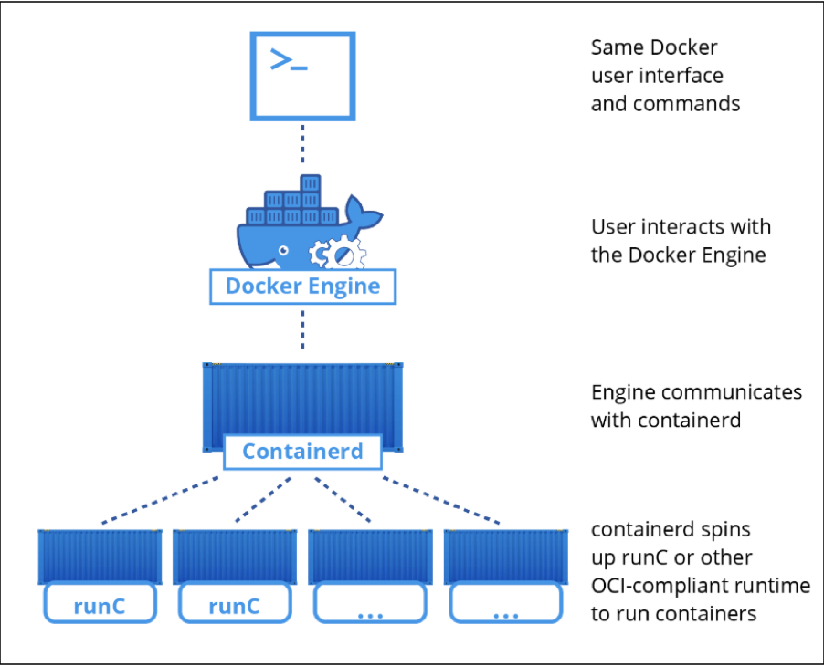
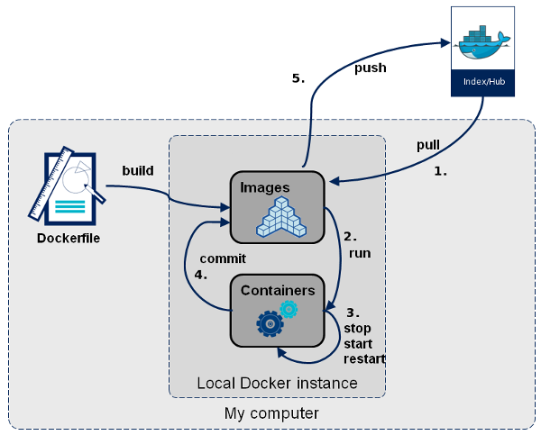
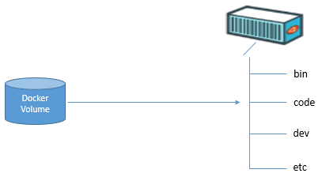
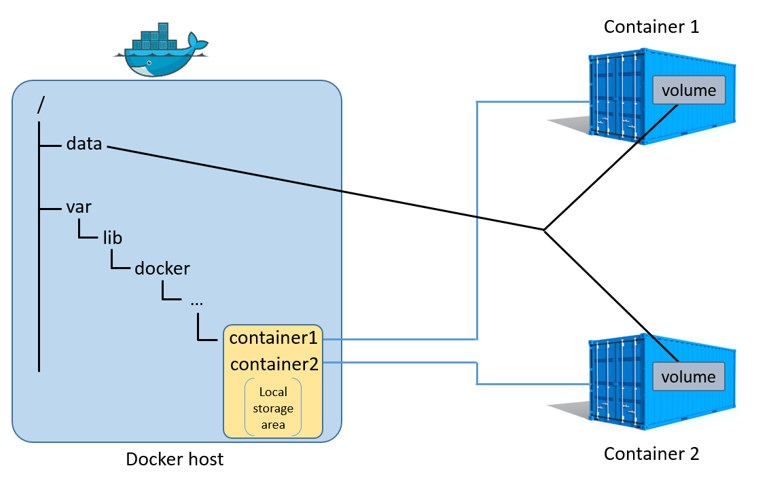
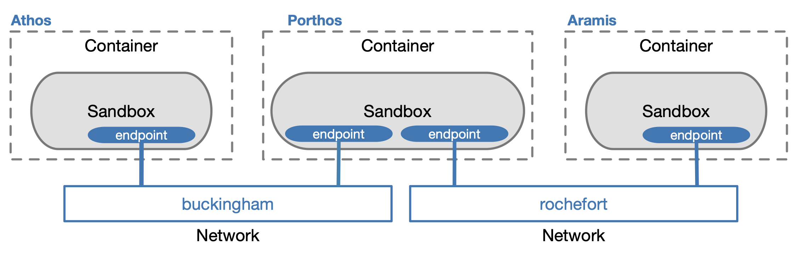
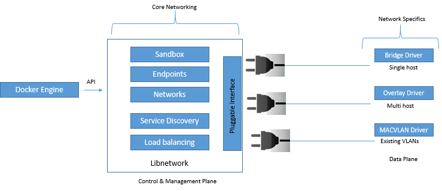
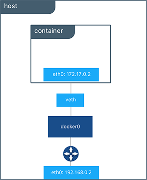
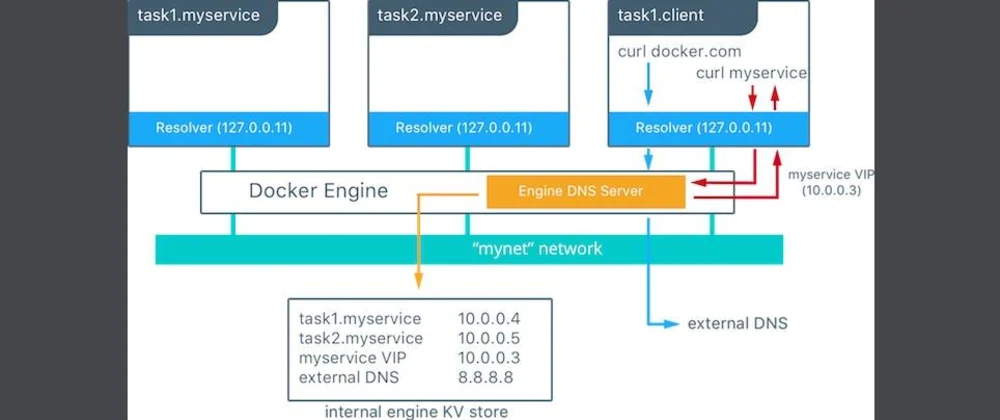

# Session 1

**Note:** Docker offers good solutions to manage microservice based
applications. 

## DevOps
DevOps is a culture, movement or practice that emphasizes the
**collaboration** and **communication** of both software developers and
other IT professionals while **automating the process of software
delivery and infrastructure changes.**  
DevOps is a **cultural** and operational model that fosters
**collaboration** to enable high-performance **IT** to achieve
**business goals**

**Artifact:** It's the production of development side. It can be a jar
file or even a docker image or etc. The operation side deploy the
artifact.

DevOps fills the gap between developers and operation unit. It tends to
find the best and easiest practice that connect development unit and
operation unit(to share the artifact, at least)

## Continues Integration(CI)
CI is a software development practice which frequently refers to
integrating, building and testing code within the development
environment.

Benefits of CI
* If you are going to fail, then fail early
* Increase confidence in the software
* Team communication
* Risk mitigation

CI pipeline
* Build
* Unit tests
* Integration tests

### Continues Delivery(CD)
* Continues Delivery is about putting the release schedule in the hands
of the business, not in the hands of IT.
* Making sure you software is always production ready throughout its
	entire lifecycle that any build could potentially be released to
	users.

Benefits of CD
* It helps in time reduction

CD pipeline
* Review
* Staging
* Production

### Continues Deployment
All the process form	code to production handel by automation
mechanisms, if you do anything manually from staging to production it's
not continues deployment anymore, it's continues delivery.

# Session 2

## Monolithic Architecture
A monolithic architecture is where all required logic and components are
located within one unit (a war, a jar, a single application, one
repository)

## Pros and cons of monolithic architecture
Pros:
* Simple delivery
* Simple test
* Simple deploy

Cons:
* The size of the application can slow down the start-up time
* Difficulty to adopt new and advanced technology. Since changing in
	language or framework affect an entire application
* Maintenance, it's difficult to make change fast and correctly
* Reliability, bug in any module can potentially bring down the entire
	process

## Microservice Architecture
An application is built in smaller, separate pieces. Each service is
developed, tested and deployed independently. This architecture works
with API gateway to communicate with customers and response to their
requests.

### Pros and cons of microservice architecture
Pros:
* Faster and simpler deployment and rollback
- Independent scalable services
* Microservice enables the continues delivery and deployment of large
	and complex applications
* Improve fault isolation
* Technology diversity

Cons:
* Increase network communication
* Additional complexity in testing and distributed system
* Deployment complexity

## What is docker
Docker is a containerization platform that package your application and
all its dependencies together in the form of a docker container to
ensure that your application works seamlessly in any environment

## What is a docker image
A docker image is a collection of all the files that make up an
executable software application. This collection includes the
application plus all the libraries, binaries, and other dependencies
just needed to run the application anywhere.

### Docker image architecture(layered architecture)
* Docker image followed a layered architecture
* Layers are reusable and share
* Rebuilding the image will be faster
* Files in the layers are read-only
* If you chose to alter the content of your image, the only valid docker
	option is adding another layer with the new changes
* Docker images have a parent-child relationship
* The bottom-most image is called the base-image that doesn't have any
	parent

**Note:** We cannot run widows-based containers on Linux, because they
use different kernel. So to run that kind of containers you need to run
that on docker in a windows machine.

### What is a docker container
A container is a runnable instance of an image. It is a standard unit of
software packages up code and all its dependencies, so the application
runs quickly and reliably from one computer environment to another.

### What is a docker registry
It's a place that docker images can be stored in order to publicly or
privately found and accessed. Docker registry can be hosted by a
third-party as a publicly or privately registry like:
1. Docker hub
1. Quay
1. Google container registry
1. AWS container registry

Image registries can contain multiple image repositories. In turn, image
repositories can contain multiple images(also different versions of an
image).

**Note:** Container is a process on your host machine.

## Installing Docker
```bash
yum install -y yum-utils
yum-config-manager --add-repo https://download.docker.com/linux/centos/docker-ce.repo
yum-config-manager --disable docker-ce-edge
yum makecache fast
yum install docker-ce
systemctl enable --now docker
```

## Get information about docker installed version

The following command will only display the version of docker
```bash
docker --version
```

For more information about your docker you should use this command
instead
```bash
docker version
```
According to the previous command you can see docker has a client and a
server part.

In case of you need full information about docker you can use the
following command
```bash
docker info
```

## Get an image from docker registry
The default docker registry is ```docker hub```. To get image use the
following command
```bash
docker pull IMAGE_NAME
```
**Note:** It's a good pracitce not to use the ```latest``` version(tag)
of images in production phase. 

To see the downloaded images
```bash
docker image ls
# or
docker images
```
with ```-a``` option you can see all the images and ```-q``` will just
list image IDs.

## Image naming structure
Each image formed from to part, repository and tag which follow this
stype ```IMAGE_REPO_NAME:IMAGE_TAG```. Each image has a uniqe ID.

## Runing an instace from an image
Until here we just pulled an image from docker official registry, to
creating an instace:
```bash
docker run IMAGE_NAME
```
## Get information about containers

```docker ps``` by default lists the runing containers and get
information about them but, ```-a``` option will show all the
containers. ```-f status=exited``` lists containers with a specific
status,```-f``` stands for filter and ```-q``` list only the container
IDs. Also ```-n=N``` list the ```N``` last containers.

# Session 3
## Manage docker as a non-root user
The docker daemon binds to a unix socket instead of a TCP port. By
default a unix socket owned by root user and other users can only access
it using sudo. The docker daemon always runs as the root user. To solve
this problem you should add your user to the ```docker``` gourp.

```bash
usermod -aG docker $USER
```
**Note:** Only root user can use unix sockets.

## Virtual machine vs Docker

### Differences

| VM | Docker |
| :--: | :--:|
| Each VM runts its OS | All containers share the same kernel of the host |
| Boot up time is in minutes | Containers instantiate in seconds |
| VMs snapshots are sparingly | Images are build incrementally on top of another like layers |
| Not effective diffs, no version control | Image can be diffed and can be version controlled |
| Cannot run more than couple of VMs on an average laptop | Can run many docker containers on a laptop|
| Only one VM can be started from set of VMX and VMDK files | Multiple docker containers can be started from an docker image|

### Similarities

| VM | Docker |
| :--: | :--:|
| Process in one VM cannot see processes in other VMs | Process in one container cannot see processes in other containers |
| Each VM has its own root file system | Each container has its own root file system (not kernel) |
| Each VM gets its own virtual network adapter | Docker can get virtual network adapter | 
| VM is a running instance of physical files(VMX and VMDK) | Containers are running instances of docker image |
| Host OS can be different from guest OS | Host OS can be different from container OS|

## Where should you run docker containers?

### Why run docker on bare-metal
1. Access through bare-metal hardware in apps without relying on
	 pass-through techniques.
1. Have optimal use of system resources. A host can, distirbute use of
	 shared system resources
1. Get bare-metal performance to apps, because there is no hardware
	 emulation layer saparating them from a host server.
1. deply apps inside portable environments that can move easily between
	 host and server
1. Get app isolation

### Why don't run docker on bare-metal
1. Physical server upgrades are difficult
1. Most clouds require VMs
1. Container platforms don't support all hardware and software
	 configurations
1. Containers are OS-dependet
1. Bare-metal servers don't offer rollback features

### Advntages of docker on bare-metal vs VM
1. Fewer layers to manage and simpler trubleshooting
1. High efficiency
1. More containers per server
1. Better, more predictable performance 
1. Lower total costs

## Benefits Docker containers
1. Modularity
1. Free up a huge amount of system resources
1. Speed
1. Portability
1. Reduce potential licencing cost, patching and maintenance of OS
1. Layers and image version control
1. Rollback
1. Rapid deployment
1. Run you application in an isolation and independent environment

## What problems docker solve?
1. Dependencies - dependency hell
1. Improving portability - your desktop your develop environment,
	 company's server, and your company's all can run the same programs.
1. Protecting your computer

## Traditional Linux container (LXC) vs Docker
LXC can run multiple aplications in each container while it 
is recomanded to run only single applications in a docker container.

## Docker Engine
The docker engine the core software that run and manage containers which
follows client-server architecture.

### Docker engine components
* Server: The docker daemon (dockerd)
* Rest API: To instruct docker container what to do
* Command line interface (CLI)

## Older version of dockr
* Docker had two major components:
	* The docker daemon
	* LXC
* The docker daemon was a monolithic binary
* LXC provided the daemon with access to the fundemental
	building-blocks of containers existed in the linux kernel.

## What is cgroups
Cgroups are a kernel mechanism for limiting and measuring the total
resorces usedd by a group of process runing on a system. For example,
you can apply CPU, momory, network, or IO quotas

## What is Namespace
Namespaces are a kernel measuring for limiting the visibility that a
group	of processes have of the rest of the system. For example you can
limit visibility to certain process trees, network interfaces, user IDs
or filesystem mounts.

## Docker engine architecture


* ```runc``` has a single purpose in life -> **Create containers**
* The ```contierd``` purpose in life was to **manage container
	life-cycle** operations -> container life-cycle operations -> start |
	stop | pause | rm ..
* ```shim```: once a container's parent ```runc``` exits, the associated
	containerd, ```shim``` process becomes the **container's parent**.
	some of the responsibilites:
	* Keeping any STDIN and STDOUT stream open
	* Reports the container's exit status back to the daemon.

## Let's run a container
docker run <option> <image>:<tag> <app>
```docker run -it centos:latest /bin/bash```

* ```docker run``` tells the docker daemon to start a new container.
* The ```-it``` flags tell docker to make the container interactive
	and attach our current shell to the container's terminal.
* ```/bin/bash``` is the app we want to run inside the container

**Note:** It's not a good practice not to use ```latest``` tag for the
production.

**Note:** The ```PID 1``` in coniter belongs to the app we pass to the
container

**Note:** You can use container in detach mode by ```-d``` option.

**Note:** You can exit the container witout stop the container with
```ctrl+PQ```

# Session 4

## Daemonless containers
* By removing the code of containers management from the daemon, the
	entire container runtime is decoupled from the Docker daemon.
* It makes it possible to perform maintenance and upgrades on the docker
	daemon without impacting runing containers

### Enable live restore
* By default, when the docker daemon terminates, it shuts down running
	containers
* Live restore: containers remain running if the docker becomes
	unavailable
* Live restore is not supported on windows containers, but it does work
	for linux containers running on docker desktop for windows.

### How to enable live restore
Create/open the following file
```bash
vim /etc/docker/daemon.json
```
add this line
```bash
{
	"live-restore":true
}
```
reload docker daemon
```bsah
systemctl reload docker
```

### Docker components on Linux system
* dockerd - the docker daemon
* docker-containerd - containerd
* docker-containerd-shim - shim
* docker-runc - runc

### Docker daemon responsibilities
* Image management
* Image builds
* REST API
* Authentication
* Security
* Core Networking
* Orchestration

## Storage drivers
Every docker container gets its own area of local storage where all
containers read/write operations occur. This local storage area has been
managed by the storage driver or graphdriver. Some of the storage driver
abvailable for docker on Linux include:
* aufs - the original and the oldest
* overlay2 - probably the best choice for the future
* devicemapper
* btrfs
* zfs

On linux you set the storage driver in ```/etc/docker/daemon.json``` and
the you need to restart the docker service for any changes to take
effect.
```json
{
	"storage-driver":"overlay"
}
```
To change your driver storage 	while you need your images and
containers to be available after change
* Save them with docker save
* Pusht the saved images to a repository
* Chage the storage driver
* Restart docker
* Pull the images locally
* Restart your containers

**Note:** It's a good practice to choose your storage driver 
in design phaze(installation) and before you do anyting with docker.

### Chose which storage diver to ues
| OS | Storage dirver|
| :--- | :-----|
| RHEL with a 4.x kernel or higher + dokcer 17.06 and higher | overlay2|
| RHEL with an older kernel and older docker 	| devicemapper |
| Ubuntu with a 4.x kernel or higher | overlay2 |
| Ubuntu with an earlier kernel | aufs |
| SUSE Linux enterprise server | btrfs |
|

## Docker socket
When you install docker, you get two major components:
* the docker client
* teh docker daemon
On Linux the client talks to the daemon via a local IPC/Unix socket at
/var/run/docker.sock

## ```docker ps``` options
* ```-a``` - list all containers
* ```-q``` - only lists the container IDs
* ```-n=N``` - list the last ```N``` containers
* ```-f``` - fileter the output like ```-f status=exited```
* ```-l``` - the latest container
* ```-s``` - show the size of containers, the value inside the ```()```
	is the image size and the one before it is the container size minuse
	the image size

## Container resource management
By default there is no limitation to resource allocation to the
containers but we can apply limitation on them.

### Memory and Swap
```bash
docker-it -m 400M --memory-swap -1 <image> <app>
```
The container will use 400 Mb of ram and use swap memory as much as it
needs(no limitation)

**Note:** ```--memory-swap``` is the memory and swap altogether, so if
we had 400 Mb of memory and the ```--memory-swap 1G```, the swap memory
will be 600 Mb.

### CPU
```bash
docker ru -it --cpuset-cpus="1,3" <image> <app>
```
The container will use core #1 and #3 of the cpu. You can give range of
cpus too, like ```--cpuset-cpus=1-3```

### Storage
```bash
docker run -it --sotrage-opt size=100G <image> <app>
```
**Note:** You can use this option only on ```overlay2``` sotrage driver
with ```xfs``` back filesystem, other back filesystem, like ext4, are not
supported.

**Note:** You should enable quota on your ```overlay2``` drive with
```xfs``` back filesystem in order to use this featuer

#### Enabling quota
First check if the quota is enabled or not
```bash
mount | grep xfs
```
if it's not open the ```/etc/default/grub``` file, add the following
strind at end of ```GRUB_CMDLINE_LINUX```
```bash
rootflags=uquota,pquota
```
then reconfigure grub
```bash
grub2-mkconfig -o /boot/grub2/grub.cfg
```
then reboot the system.

**Note:** You can monitor resource that containers are using with
```docker stats```

**Note:** ```yes > /dev/null &``` will consume all the cpu, so don't use
it, just in case you want to test your cpu

## Tagging
You can make tags for your desierd image with ```docker tag``` command
```bash
docker tag <source_image[:tag]> <target_image[:tag]> 
```

## Dangling images
Dangling images is an image that is no longer tagged, and appears in
listings as 	<none>:<none>. A common way they occure is when building a
new image and tagging it with an existing tag.

To delete all dangling images
```bash
docker image prune
```
> sometimes in developer builds a docker image and add and ```v2``` tag
on it, then (s)he want to add a feature to the image with the same tag.
in this case the prious version gets a <none> tag and become dangle

## Seraching docker hub from the cli
```bash
docker search <image_name>
```
# Session 5

## Show details of an image or container

```bash
docker inspect <image_name/image_id>
docker inspect <docker_name/docker_id>
```

### Image inspect info
* Id
* Repo tags
* Repo digests - it make our image uniqe all over the repository
* Parent info
* Comment
* Container config
* Graph driver

## Remove image with ```rmi```

Remove a tag (untag) - it doesn't remove any data
```bash
docker rmi <image_name>:<image_tag>
```
**Note:** if you apply the previous command on an image that has only
one tag, the image becam dangle.
**Note:** While an image is using by a container you can't remove it
from disk, even if you stop the container and remove the image by
```-f``` switch and you can't see the image in ```docker images```, the
stoped container will start again.(you can turn the removed image back
to image list by pull the image from the repository again)

## Remove container with ```rm```
```bash
docker rm <container_name>
```
**Note:** If the container that you want to remove is still running, you
can't remove it. You should first stop the container then remove it or
use ```-f``` switch.

**Note:** You can remove all the containers at once with 
```bash
docker rm -f $(docker ps -qa)
```

## Docker attach
Attach local standard input, output, and error stream to a running
container.

```bash
docker attach [option] container
```

**Note:** If a container runs ```bash``` by default, you can execute
command in that container, because it gives you a prumpt, but in general
```attach``` command connect you to the container's iostream.

**Note:** You can only attach to a running container.

## Docker exec
Run a command in a running container
```bash
docker exec [option] container command [ARG]
```
Run command in a working directory in a running container
```bash
docker exec -it -w /home <container_name> ls
```
set an environment variable in the current container bash session
```bash
docker exec -it -e myvar=value <container_name> bash
```
## Docker cp
Copy files/folders between a container and the local filesystem. the
container can be **running** or **stoped**.
```bash
docker cp [Option] <container>:<src_path> <des_path>
docker cp [Option] <src_path> <container>:<des_path>
```
**Note:** To copy a file with its all atributes use ```-a``` swith in cp
command

## Docker stop
Stop one or more containers
```bash
docker stop [Option] <container> [container]
```
**Note:** to stop a container with a delay use ```-t``` option
```bash
docker stop -t 20 <container>
```
**Note:** With ```-t``` option the main process inside the container will recieve
**SIGTERM**, and after a grace period, **SIGKILL*. 

**Note:** If you see ```Exited (137)``` in ```docker ps``` output it
means the container has gotten kill signal.

**Note:** You can monitor a container exit code with ```docker wait
<container>```

Simply you can start any stoped container with ```docker start``` and
restart the with ```docker restart``` command

**Note:** stop/start containers **will not** remove stored data on the
container.

## Environment variables
You can initiate environment variables with ```-e``` option, while you
are running the container. 

Docker automatically set some environement variables when creating Linux
container.
| variable | Value|
| :-----   | :--- |
| HOME | Set based on the value of USER |
| HOSTNAME | The hostname associented with the container |
| PATH | Includes popular directories, such as /usr/local/sbin:/usr/local/bin:/usr/sbin:/usr/bin:/sbin:/bin |
| TERM | xterm if the container is allocated a pesudo-TTY |

**Note:** Docker does not set any environment variables when creatin
windows container.

To set custom env with ```-e```:
```bash
docker run -it -e myenv=123 --name cont centos:latest
```
# Session 6
## Docker log
Fetch the logs of a container
```bash
docker logs [Option] <Container>
```
you can use ```-f``` to follow log output and ```-t``` to show
timestamps.

## Docker event
Get real-time event from the server(Only the last 1000 log events are
returned)
```bash
docker event [Option]
```
For example when you stop a container 4 events happen inorder to do so
1. Container kill
1. Container die
1. Network disconnect
1. Container stop

**Note:** Docker logs and docker events are totally different. Docker
log demonstrates logs on your container whereas docker event shows the
events which are happening on your docker host.

### Docker events examples

```bash
docker events --since '2020-11-26T3:50:20' <container>
docker events --until '2020-11-26T3:50:20' <container>
docker events --since '20m' <container> 
docker events --filter 'event=stop' <container>
docker events --filter 'container=nginx' <container>
docker events --filter 'type=network' <container>
docker events --filter 'type=volume' <container>
docker events --filter 'scope=swarm' <container>
```

## Docker pause/unpause (freez/unfreez)
Pause all processes within one or more containers
```bash
docker pause <container> [container]
```
Unpause all processes within one or more containers
```bash
docker unpause <container> [container]
```

**Note:** When you pause a container, the requests will be send to the
container and the container will receive them, but it won't answer them
- it hase no response, as soon as you unpase the container, it will
	reponse to all requests it received. It's useful when you want to do maintenance and
	you don't want to reponse to your clients during the proccess.

## Docker rename
Rename a container
```bash
docker rename <container> <new_name>
```
## Docker commit
Create a new image from a container's changes
```bash
docker commit [option] <container> [repository[:tag]]
```

Example
```bash
docker commit --change='CMD ["/bin/sh"]' <container> <new_name[:tag]>
```

**Note:** It is better to use Dockerfiles to manage your images in a
documented and maintainable way. Because you can make your changes in a
small file and push it to a version control service and make different
versions.

**Note:** By default, the container being commited and its proccess will
be pause while the image is commited.


## Docker save
Save an archive from the given image with all the nessesary layers
as a ```.tar.gz``` file. In other words it transforms an image to an archive
file.

```bash
docker save -o <name.tar.gz> <container[:tag]>
```
## Docker load
Load ```.tar.gz``` archived image to docker
```bash
docker load -i <name.tar.gz>
# or
docker load < <name.tar.gz>
```

## Docker export
Export a container's filesystem as a tar archive. In the other words it
transforms a container to an archive file.
```bash
docker export [options] <container>
```
Example
```bash
docker export --output="<name.tar>" <container>
# or 
docker export <container> > <name.tar>
```

## Docker import
Import an archived container to docker
```bash
docker import <name.tar>
```
**Note:** When you import an archived file it become dangle image,
because the value of ```Repository``` and ```TAG``` is ```none```, so
you need to assign a tag to it with the following commmand
```bash
docker tag <image_id> <image_name>:<tag>
```

**Note:** You don't need to have building images of exported archive on
the destination host which you want to import that archive.

## Docker flow


## Docker logging
Docker logging is a mechanism to get information from running container.
Docker daemon has a default logging driver which is json-file. To find
the current logging driver you can run docker info as follow:
```bash
docker info --format'{{.LoggingDriver}}'
```
You can chage the default logging driver in
```/etc/docker/daemon.json```. for example to set the driver to
```syslog```:

```json
	{
		"log-driver":"syslog"
	}
```
If the logging driver has configurable options, you can set them in the
```daemon.json```
```json
	{
		"log-driver":"syslog"
		"log-opts":
			{
				"max-size":"10m",
				"max-file":"3",
				"labels":"production_status",
				"env":"os,customer"
			}
	}
```
To run a container with a specific logging dirver use ```--log-driver```
in the docker run command:
```bash
docker run -it --log-driver <logging_driver> alpine sh
```

to find out current logging driver for a running container:
```bash
docker inspect -f '{{.HostConfig.LogConfig.Type}}' <container>
```

Docker provides two modes for delivering messages from the container to
the log dirver:
* direct (defualt) - blocking delivery from container to driver
* non-blocking - delivery that stores log messages in an intermediate
	pre-container ring buffer for consumption by driver. (it's useful for
	those type of applications which has high log generation frequnce, to
	optimise I/O problems)

**Note:** When the buffer is full and new messages is enqueued, the
oldest messages in memory is dropped.

**Note:** You can use ```gelf``` log driver to write log messages into
```graylog``` or ```logstash```

You can use tag log option to customize the log message. For more info
see [here](https://docs.docker.com/config/containers/logging/log_tags/)

**Note:** You can find the defualt log file under
```/var/lib/docker/container/<container_id>/<container_id>-json.log```
as docker does.

## Docker vloume
There are to main catgory of data:
* non-persistent
* Persistent - stuff you need to keep

### non-persistent storage
It's automatically created alongside the container, and it's tied to the
life-cycle of the container. That means deleting the container will
delete this storage and any data on it.

### Persistent storage
The recommaneded way to persist data in containers is using volumes. You
create a volume, then you create a container, and mount the volume into
it. If you delete the container the volume and its data still exist and
available.

By defualt all files created inside a container are stored on a writable
container layer which means:

* The data doesn't presist when the container no longer exist, and it
	can be difficult to get data out of the container if another
	proccess needs it
* The writable 	layer is tightly coupled to the host machine where the
	container is running. You can't easily move the data somewhere else
* Writing into a container's storage layer requier a storage driver to
	manage the filesystem. This extra abstraction reduce the performance
	as compared to using data volumes, which wirte directly to the host
	filesystem

Docker has two options for containers to store files in the host
machine, so that the files are persisted even after the container stops

There are there ways to mount data inside a docker container

* volumes
* bind mount
* tmpfs (only on linux hosts)

[types-of-mounts-volume](./assets/types-of-mounts-volume.png)

### Volumes
Volumes are stored in a part of the host filesystem which is managed by
docker (/var/lib/docker/volume on linux). Non-Docker proccesses should
not modify this part of the filesystem. Volumes are the best way to
persist data in docker.



The ```/code``` directory is a docker volume. Any data written in the
```/code``` directory inside the container will be stored on the volume
and will be exist after the container is deleted. All other directories
use the containers ephemeral local storage.

#### Creating docker volumes

```bash
docker volumes create [options] [volume]
```
Examples
```bash
docker volumes create --name myvol --label testvol
```
**Note:** If a name is not specified, docker generates a random name.

**Note:** Volume names must be unique among drivers.

```bash
docker run -d -v myvol:/data --name mycent centos:lates
```
**Note:** ```-v``` docker_path:container_path:permission(ro,rw)

**Note:** If the ```container_path``` doesn't exist while container
creation, docker will create that path automatically

**Note:** You can get all information about the volume with the hlep of
the following command
```bas
docker volume inspect <volume>
```
**Note:** You can list the existing volumes with ```docker volume ls```
and filter the output by ```-f``` on label, driver, or name criteria

**Note:** You can find all containers which are using specific volume
with the following command
```bash
docker ps --filter volume=<volume_name>
```

#### Removing docker volume
```bahs
docker volume rm <volume>
```

**Note:** You can only remove unused volume, otherwise you can not
remove it, even the container which use that volume is in stop state.

**Note:** You can remove all unused volumes wiht ```docker volume prune```


### Bind mount
Bint mount may be stored anywhere on the host system. Non-Docker
processes on the docker host or a docker container can modify them at
any time.

### tmpfs
tmpgs mounts are stored in the host system's memory only, and are never
written to the host system's filesystem

# Session 7

## Create NFS docker volume
```bash
docke volume create --driver local --opt type=nfs --opt o=addr=<server nfs ip address>,rw --opt device=:<store path on nfs> <NFS_name>
```

## Using --mount flag in docker run command
The --mount flag allows you to mount volumes and host-directories in a
container.

```bash
docker run -itd --name mycent --read-only --mount type=volume,source=myvol,target=/data centos:latest /bin/bash
```

**Note:**
* If the myvol volume does not exist this flag create it automatically.
	(same as ```-v``` flag)
* Even though there is no plan to deprecate ```--volume```, usage of
	```--mount``` is recommended.
* ```--read-only``` mounts the container's root filesystem 	as read only
	prohibiting writes to locations other than the specified volumes for
	the container
* ```type=bind``` the host-path must refer to an existing path on the
	host.

## Sharing volumes



You can write in a single file from different source simultaneously, it
will handle by os. In some case some apps lock the file and you can't do
it.

## Benefits of volumes
Volumes are preferred way to persist data in docker containers and
services.

* Sharing data among multiple running containers
* Volumes are only removed when you explicitly remove them
* Decouple the configuration of the docker host from the container
	runtime
* Store your container's data on a remove host or a cloud provicer,
	rather than locally
* Back up, restore, or migrate data from one docker host to another

**Note:** You can change some container's features by ```docker
update``` commnad - you can not mount volume to a running container

## Volume's advantages over bind mount
* Volume are easier to backup and migrate than bind mounts
* You can manage volumes using docker CLI commnads or the docker API -
	like ```docker volume ls``` or ```docker volume inspect```, ...
* Volumes work on both Linux and Windows containers
* Volumes can be more safely shared amoung multiple containers - in
	terms of security
* Volume diver let you store volumes on remote hosts or cloud providers,
	to encrypt the content of the volume, or to add other functionality
* New volumes can have thier content pre-populated by a container
* If you use ```--mount``` to bind-mount a file or directory that does
	not exist yet on the Docker host, Docker does not automatically create
	it for you, but generates an error

## Tmpfs usage
* When you create a container with a tmpfs mount, the container can
	create files outside the container's writable layer
* As opposed to volumes and bind mounts, a tmpfs mount is temporary, and
	only persists in the host memory. When the container stops, the tmpfs
	mount is removed, and files written there won't be persisted
* This is useful to termporarily sotre senstive files that you don't
	want to persist in either the hsot or the container writable layer.

Limitationas:

* Unlike volumes and bind mounts, you can't share tmpfs between
	containers
* This functionality is only available if you're running docker on Linux

```bash
docker run -id --name mycent --tmpfs /tmp centos:latest
# or
docker run -id --name mycent --mount type=tmpfs,destination=/tmp centos:latest
```

**Note:** ```tmpfs``` does not need source, as it use host memory as its
source

## Docker Networking
Docker networking	comprises three major components:
* The docker Network model (CNM) - the design specification which is an
	open-source pluggable architecture
* Libnetwork - Docker's real-word implementation of the CNM which is
	writtern in Go, and it provides all of Docker'r core networking
	functionality
* Drivers - extend the model by implementing specific network
	topolgies

### The container network model (CNM)
The design guide for Docker networking is the CNM. It defines three
building blocks:

* Sandboxes - An isolated network stack. It includes, Ethernet
	interfaces, ports, routing table, and DNS config
* Endpoints - They are virtual network interfaces. Like normal
	network interfaces, they're responsible for making connections. In the
	case of the CNM, it's the job of the endpoint to connect a sandbox to
	a network
* Network - A software implementation of an 802.1d bridge (more commonly
	known as a switch)



* Container Athos communicate with contaienr Porthos via bukingham
	netwrokd 
* Container Aramis communicate with contaienr Porthos via rochfort
	netwrok 
* Porthos two endpoints cannot communicate with eachother without the
	assistance of a layer 3 router
* If a container needs to connecting to multiple netwroks, it needs
	multiple endpoints.

### Libnetwork
It implements all the three components defined in the CNM. It also
implements native service discovery, ingress-based container load
balancing, and network control plane and management palne functionality

### Driver
Drivers implement the data plane. For example, connectivity and
isolation is all handled by drivers. Each driver is in charge of the
acutal creation and mangement of all resources on the networks it is
responsible for.



### Single-host bridge network

* **Single-host:** It only exist on a sigle docker host and can only
connect containers that are on the same host.
* **Bridge:** It's an implementation of an 802.1d bridge

### Docker network driver types
#### Bridge
The default network driver. They're usually used when your application
is run in standalone containers that needs to comunicate.

#### Host
For standalone containers, remove network isolation between container
and the docker host, and used the host network directly.

#### None
Disable all networking. Usually used in conjunction with a custom
networking driver. None is not available for swarm services.

#### Overlay
Overlay connects multiple docker daemons together and enable swarm
services to communicate with each other. You can use also overlay
netwrok to facilitate communicate between a swarm service and a
standalone container, or between standalone containers on different
docker daemons.

#### Macvlan
Macvlan allows you to assign a MAC address to a container, make it
appear as a physical device on your network. The docker daemon routes to
containers by their MAC address. Using the macvlan network sometimes is
the best choice when dealing with legacy applications that expect to be
directly connected to the physical network, rather than	routed through
the docker host's netwrok stack.

### Docker Network inspect



# Session 8

## Create docke network
```bash
docker network create -d <deeriver_type> <network_name> 
```
**Note:** ```bridge``` is  the default deriver in docker creation

## Join container to a specific network
```bash
docker run -it --name <name> --network <network_name> <image>
```
## Docker default bridge vs user-defined bridge
* User-defined bridges provide automatic **DNS resolution** between
	containers
	* The default bridge network on Linux do not support name resolution via
	  the docker DNS service. All other user-defined bridge network do!
* User-defined bridges provide better **isolation**
	* All contianers without a --network specified, are attached to
		default bridge network. This can be a risk, as unrelated
		stacks/services/continers are then able to communicate.
* Contaiener can be **attached and detached from user-defined networks
	on the fly**
	* During a contianer lifetime, you can connect or disconnect it from
		user-defined networks on the fly. To remove a container from default
		bridge network, you need to stop container and recreate it with
		different network option.

## Connect or disconnect a container to/from network(s)
```bash
docker network connect <network_name> <contianer_name>
docker network disconnect <network_name> <contianer_name>
```

## Port mapping/publishing


* Port mapping let you map container port to a port on Docker host
```bash
docker run -it --name <name> -p <host_port>:<container_port> <image>
```
to show all used port by a container
```bash
docker port <container_name>
```
## Enabale forwarding from docker containers to outside world
By default traffic from containers connceted to the default bridge
network is not forwarded to the outside world. To enable forwarding:
```bash
sysctl net.ipv4.conf.all.forwarding=1
sudo iptables -P FORWARD ACCEPT
```
## Set static IP on containers
```bash
# assign to a created container
docker run -itd --name cent1 centos
docker network create --subnet 192.168.100.0/24 mynet
docker network conncet --ip 192.168.100.10 cent1
# while you creating a new container 
docker run -itd --name cent2 --network mynet --ip 192.168.100.20 centos
```

## Connecting to existing networks(MACVLAN driver)
The ability to containerized apps **to external system and pyshical networks**

Pros of using MACVLAN:
* MACVLAN is good as it doesn't requier port mapping or additional
	bridges - you connceted the container interface to the host interface
	(or a sub-interface)
Cons of using MACVLAN:
* It requiers the host NIC to be in promiscuous mode, which isn't allowd
	on most public cloud platforms
* Assumes we have an existing physical netwrok with two VLANs:
	* VLAN 100: 10.0.0.0/24
	* VLAN 200: 192.168.3.0/24

# Session 9

## Service discovery
Service discovery allows all containers and swarm services to locate
each other with name. The only requierment is that they have to be on the
same netwrok. All docker containers have a local DNS resolver.



**Note:** Service discovery only works for user-defined networks, and
not for default network.

## Nerwork Trubleshooting
If you're having netwrok issue with your application's container, you
can launch netshoot with that container's network namesapce like:
```bash
docker run -it --net contianer:<container_name> nikolaka/netshoot
```
If you think the networking issue is on the host itselt, you can launch
netshoot with that host network namespace:
```bash
docker run -it --net host nikolaka/network
```
### Checking containers network performance
With ```iperf``` you can analyze container's performance
```bash
docker create network perf-test
docker run -itd --name perf-test-a --network perf-test nicolaka/netshoot iperf -s -p 9999
docker run -itd --name perf-test-b --network perf-test nicolaka/netshoot iperf -c perf-test-a -p 9999
docker logs perf-test-a
```
### Check container's ports with ```netstat```
```bash
docker run -d --name mynginx -p 80:80 nginx
docker run -it --network container:mynginx nicolaka/netshoot
netstat -na
```
You can scan a container port with ```nmap``` too, but you need to run a
```--privileged``` container, a continer that has root access to your
host, as bellow
```bash
docker run --it --privileged nicolaka/netshoot nmap -p 1-1024 -dd <contianer_ip> | grep open
```

### Check interface traffic with ```iftop```
```bash
docker run -d --name mynginx -p 80:80 nginx
docker run -it --network container:mynginx nicolaka/netshoot iftop -i eth0
```

### Check containers function with ```ctop```
```bash
docker run -it -v /var/run/docker.socket:/var/run/docker.socket nicolaka/netshoot ctop
```

**Note:** ```netshoot``` needs that volume to get information about
other containers

### Snif containers with ```termshark```
```bash
docker run --cap-add NET_ADMIN --cap-add CAP_NET_RAW -it --network container:<container_network> \
nicolaka/netshoot termshark -i eth0 tcp
```

**Note:** ```netshoot``` needs those capablities to snif traffic with
```termshark```. You can read more about capablities in whitelist
capablity

### Analyzing network using netcat
Check if firewall drop a connction or not
```bash
docker run -d --name mynginx -p 80:80 --netwrok <network_name> nginx
docker -itd --nmae mynetcat --netwrok <network_name> nicolaka/netshoot nc -vz mynginx 80
docker logs mynetcat
```

## Build custom docker image

* A ```Dcokerfile``` is a text document that containes all the commnads a user
could call on the command line to assmble an image.
* The ```docker build``` commnad builds an image from a
	```Dockerfiles```  and a context. The build is run by the Docker
	daemon, not by the CLI. The first thing a build process does is send
	the entire context to the daemon.

**Note:** It's best practice to start with an empty directory as context
and keep your ```Dockerfile``` in that directory. Add only the files
needed for building the ```Dockerfile```.

## Dockerfile instructions

### ```From```
A ```Dockerfile``` must begin with a ```FROM``` instruction. The
```FROM``` instruction specifies the parent image from which you are
building and sets the Base Image.	

**Note:** Docker allows multiple ```FROM``` instructions in a single
```Dockerfile``` in order to create multiple images.

Example:
```bash
mkdir ~/dockerfile_example
echo "FROM centos:latest" >> ~/dockerfile_example/Dockerfile
cd ~/dockerfile_example
docker build -t myimage:v1 .
```
**Note:** ```-t``` will tag/name your image.

**Note:** The ```.``` in ```dcoker build``` command is the path of your
dockerfile

**Note:** In this example the image ID of ```cnetos``` and ```myimage```
will be the same because we did not change the original image.

**Note:** If you want to build your image from scratch you can do the
following:

```dockerfile
FROM scratch
ADD IMAGE_FILE.tar.xz /
```

### ```LABLE```
Labels are some metadata for more information about our image, nothing
more.
```dockerfile
FROM cnetos:laest
LABEL maintainer="name"
LABEL description="This is a simple image"
LABEL version="v1.0"
```

### ```COPY```
It's using in case of your want to copy file or directory from your
docker host to your docker image.

```dockerfile
COPY [--chown=UID:GID] /PATH/TO/FILE/OR/DIR/ON/HOST/NEAR/DOCKERFILE /PATH/TO/FILE/OR/DIR/ON/IMAGE
```

**Note:** If you put ```/``` at the end of the path on image side,
docker will create directory automatically, for example
```dockerfile
COPY test.txt /sabple_dir/
```

### ```ADD```
This instructions copies new files, directories or remote file URLs from
<srs> to <des> 
```dockerfile
ADD [--chown=UID:GID] /PATH/TO/FILE/OR/DIR/ON/HOST/NEAR/DOCKERFILE /PATH/TO/FILE/OR/DIR/ON/IMAGE
```

### ```ADD``` vs ```COPY```

* ```ADD``` allows <src> to be a URL
* If it's a local tar archive in a recognized Compression format
	(identity, bzip2, gzip or xz) then it's unpacked as a directory.
* Resourcese form URLs are not decompressed.
* Using ```COPY``` is recommaneded where the magicof ```ADD``` is not
	required.

### ```RUN```
The ```RUN``` instruction will execute any commands in a new layer on
top of the current image and commit the result.

```dockerfile
RUN <commands> #(shell form)
RUN ["executable","param1","param2"] #(exec form)
```
The default shell is ```/bin/sh -c``` on Linux. To use a different
shell:

```dockerfile
RUN /bin/bash -c 'echo hello'
RUN ["/bin/bash","-c","echo hello"]
```

### ```ENV```
The ```ENV``` instruction set the environment variable <key> to the
<value>.

```dockerfile
ENV <key>=<value>
```
To set a value for a single command:
```dockerfile
RUN <key>=<value> <command>
```

### ```USER```
The ```USER``` instruction set the username (or UID) and optionally
the user group (or GID) to use when running the image and for any,
```RUN```, ```CMD``` and ```ENTRYPOINT``` instructions 

```dockerfile
USER 	<user>[:<group>]
USER 	<UID>[:<GID>]
```
**Note:** Remember you should add the user before you run ```USER```
commnad.
```dockerfile
RUN useradd mohammad
USER mohammad
```
# Session 10

## Continue of Dockerfile instructions

### ```WORKDIR```
It sets the working directory for any ```RUN```, ```CMD```,
```ENTRYPOINT```, ```COPY```, and ```ADD``` instructions.

**Note:** If the working directory doesn't exist, it will be created

### ```VOLUME```
It creates a mount point with the specified name and marks it as holding
externally mounted volumes from native host or other containers.
```dockerfile
VOLUME ["PATH_1","PATH_1"]
```

```dockerfile
VOLUME /myvol_1 
VOLUME ["myvol_1","myvol_2"]
```
**Note:** The host directory is declared at container run-time
```bash
docker -it --name mycent -v /home/test1:myvol_1 -v /home/test1:myvol_2
mycentos:v1
```
### ```EXPOSE```
It inform Docker that the container listens on the specific network port
at **run-time**.
```docker
EXPOSE <port> [<port>/<protocol>...]
```

**Note:** This instruction does not actually publish the port. It
functions as a type of documentation. To actually **publish** the port
when running the container, use ```-p``` flag on ```docker run``` to
publish and map.

### ```CMD``` (considerable)
The main purpose of a ```CMD``` is to provide defaults for an executing
container. These defaults can including an executable, or the can omit
the executable, in which case you must specify an ```ENTRYPOINT``` 
instruction as well.

```dockerfile
CMD ["executable","param_1","param_2"] (preferred form)
CMD ["param_1","param_2"] (as defaults params to ENTRYPOINT)
CMD command param_1 param_2 (shell form)
```

### ```ENTRYPOINT```
It allows you to configure a container that will run as an executable.
```dockerfile
ENTRYPOINT ["executable","param_1","param_2"]
ENTRYPOINT command param_1 param_2
```

**Note:** You cannot **override** an ```ENTRYPOINT``` when starting a
container unless you add the ```--entrypoint``` flag.


#### ```CMD``` and ```ENTRYPOINT```
* If ```CMD``` is used to provide default arguments for the
	```ENTRYPOINT``` instruction, both ```CMD``` and ```ENTRYPOINT```
	instructions should be specified with the JSON format.
* When used in the shell or exec format, the ```CMD``` instruction sets
	the command to be executed when running the image.
* If docker has multiple ```CMD```s, it only applies the instructions
	from the last one.
* If the user specifies arguments to ```docker run``` they will override
	the default specified in ```CMD```

```dockerfile
# for bullet 1
ENTRYPOINT ["/bin/cp"]
CMD ["/mnt/file","/opt/file"]
```

```dockerfile
# for bullet 2
ENTRYPOINT ["ping"]
CMD ["8.8.8.8"]

# to override the default CMD
docker run <image_name>:<tag> 4.2.2.4
```

#### ```CMD``` vs ```ENTRYPOINT```
* Containers are designed for running specific task and process, not for
	hosting and oprating system.
* Once the process stops, the container stops as well
* There are two types of instructions that can define the process
	running in the container:
	* ENTRYPOINT: command to run when container starts.
	* CMD: command to run when container starts or arguments to ENTRYPOINT
		if it exists.
* Docker has a define ENTRYPOINT which is ```/bin/sh -c``` but does not
	have the default command. 

### ```SHELL```
* It allows the default shell used for the shell form of command to be
overriden.
* The default shell on Linux is ```["bin/bash","-c"]```, and on windows
	is ["cmd","/S","/C"]
* The ```SHELL``` instruction must be written in JSON format in
	dockerfile.

```dockerfile
SHELL ["executable","param"]
```
### ```HEALTHCHEACK```
It tells docker how to test a container to ckeck that it is still
working. This can detect cases such as a web server that is stuck an
infinit loop and unable to handle new connections, even though the
server process is still runnign.

```dockerfile
HEALTHCHECK [option] CMD command
```

The options that can be appear before ```CMD```:
1. ```--interval```=DURATION (default: 30s)
1. ```--timeout```=DURATION (default: 30s)
1. ```--start-period```=DURATION (default: 0s)
1. ```--retries```=N (default: 3)

## Dockerfile besr practice

* Incremental (build time)
* Image size
* Maintaiability
* Security
* Consistancy/Repeatability
* Areas of improvement
* Order from least to most frequently changing contect, in case of using
	docker cashed stages.
* Only copy what needed. Avoid ```copy .``` if possible.
* prevent to using outdated package cache
* Remove unnecessary dependencies
* Remve package manager cache
* Use official images when possible
* The ```latest``` tag is a rolling tag. Be specific, to prevent
	unxpected changes in your base image.
* looking for minimal flavors of your image

## Port expose vs port publish

# Session 11

## Docker history

Show the histroy of an image
```bash
docker histroy [option] <image_name>
```

**Note:** You can find out how the image had build in case of you don't
have docker file, and with the help of that write your own.

## Start container automatically

Docker provides restart policies to control whether your containers
starts automatically when they exit , or when docker restarts.

```bash
docker run -it --name <name> --restart [flag] <image:tag>
```

| Flag | Description |
| ---- | ----------- |
| no | Do not automatically restart the container. (default) |
| on-failure | Restart the container if it exits due to an error, which manifests as non-zero exit code.|
| always | Always restarts the container when it stops. If it manualy stoped, it is restarted only when docker daemon restarts on the container itself is manually restarted.|
| unless-stopped | Simillart to always, except that when the container is stopped (manually or otherwise), it is not restared even after docker daemon restarts.|

| Exit code | Description |
| 0 | indicates that the specific container does not have a foreground process attached.|
| 1 | indicates failiure due to application error |
| 137 | indicates that container received SIGTERM |
| 139 | indicates that the container received SIGSEGV. SIGSEGV indicates a segmentation fault. This occurs when a program attempts to access a memory location that it's not allowed to access.|
| 143 | initiates that the container received SIGTERM |
| 126 | indicates permission problem or command is not executable.|
| 127 | indicates posible typo in shell script with unrecognizable character.|
| 225 | indicates that there was an error in running the ENTRYPOINT/CMD.|

## Deploy a registry server

A registry is a storage and contect delivery system, holding name Docker
images, available in different tag versions.

### Run a local registry

```bash
docker run -d -p 5000:5000 --restart=always --name registry registry:2
```

The registry now is ready to use in test environment.

**Note:** When you want to push your image to registry, you should add a
tag to it as the folloing format:
```bash
docker tag <image_name>:<label> <rgistry_address>[:<registry_port>]/<image_name>:<lable>
```
then push that to the repo.
```bash
docker push <rgistry_address>[:<registry_port>]/<image_name>:<lable>
```
### Run a web interface for local docker registry
```bash
docker run -d -p 8080:8080 --restart=alwys --name registry-web --link <registry_container_name> -e REGISTRY_URL=http://registry:5000/v2 -e REGISTRY_NAME=localhost:5000 hyper/docker-registry-web 
```

## Docker Compose

### Installing docker compose on linux

```bash
yum install -y nss curl libcurl
sudo curl -L "https://github.com/docker/compose/releases/download/v2.10.2/docker-compose-$(uname -s)-$(uname -m)" -o /usr/local/bin/docker-compose 
sudo chmod +x /usr/local/bin/docker-compose
sudo ln -s /usr/local/bin/docker-compose /usr/bin/docker-compose
```

**Note:** In ```yaml``` file the lines which start witout any indent or
whitespace called **top level**.

### Write your first ```docker-compose```

write a docker-compose file which runs a flask app with two services
(web and redis). The app is a simple web server that count the number of
visits and store the value in redis.

**Note:** Put your ```docker-compose``` file in a meaningful named
directory, beacuse all the containers which made from your file will get
a prefix which is the directory name. Also the network will create by
compose follows this rule.

```yml
version: '3'
services:
		web:
				build: .
				ports:
						-"5000:5000"
		redis:
				image: "redis:alpine"
```
* This compose file define two services: **web** and **redis**
* The web service use an image that's build from the Dockerfile in the
	current directory. It then binds the container and the host machine to
	exposed port, 5000.
* The **redis** service use a public Redise image pulled from the Docker
	Hub registry.

**Note:** Services defined in compose can call eachother by thier name

**Note:** The previous example is not complete and needs other files.
you can find them [here](https://github.com/mrbooshehri/lab/tree/master/docker/docker_compose/ex_1)

you can run the compose file with the following cammnds:
```bsah
cd /PATH/TO/YOUR/DOCKER-COMPOSE
docker-compse up
# for detached mode
docker-compse up -d
```
### ```docker-compose``` options

You can only use docker-compose options in the directory you have a
compose file

* ```ps```: List of all active containers in related docker-compose
* ```images``` : List of all used images in related docker-compose
* ```top```: It runs top in all of your containers
* ```stop```: It will stop all the contianers
* ```start```: It will stop all the contianers
* ```restart```: It will restart all the contianers
* ```down```: It stop all the contianers then remove them, also remvoe
	the network which was created for the compose
* ```config```: It will check the syntax of ```docker-compose```, if
	your file doesn't have any error it will print it.
* ```pause/unpause```: It pause/unpause all the contianers.
* ```logs```: Print all logs in output, you can use ```-f``` for
	following the log or ```-t``` for time stamping each line

**Note:** By default ```docker-compose down``` won't remove the volumes,
if you want to remove them use the ```-v``` switch:

```bash
docker-compose down -v
```

# Services 12

## Explainging ```docker-compose.yml```

* ```version```: It's mandatory and always place at the first line. This
	defines the version of the compose file format. You should normally
	use the latest. It doesn't represent the version of ```Dockerfile```
	or ```Docker Engine```
* ```services```: Where we define the different application services.
	Compose will deploy each of services as its own contianer
