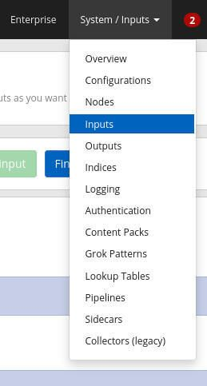
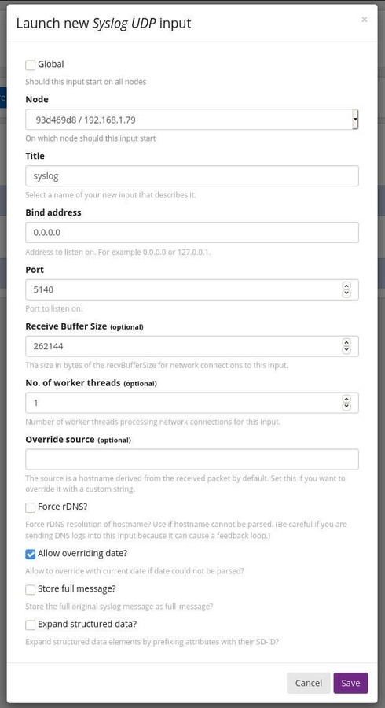

# Graylog

## How to configure Graylog to accept incoming syslog entries

1. Select `inputs` from `system/inputs` on the top menu



2. Click on `Launch new input` and fill out the information



* **Node:** Select the node for the hosting server.
* **Title:** syslog
* **Bind address:** 0.0.0.0
* **Port:** 5140

## How to configure your Linux clients to sent syslog information

1. Create configuration file under `/etc/rsyslog.d/`

```bash
sudo touch /etc/rsyslog.d/90-graylog.conf
```

2. Add the following configuration to the file

For UDP connection (syslogUDP):

```bash
# UDP (single @):
sudo echo "*.* @SERVER:5140;RSYSLOG_SyslogProtocol23Format" > /etc/rsyslog.d/90-graylog.conf
```

For TCP connection (syslogTCP)

```bash
# TCP (double @@):
sudo echo "*.* @@SERVER:5140;RSYSLOG_SyslogProtocol23Format" > /etc/rsyslog.d/90-graylog.conf
```

> **Note:** `SERVER` is the address of your graylog server

3. Restart rsyslog daemon

```bash
sudo systemctl restart rsyslog
```

Related:
```
* https://www.techrepublic.com/article/how-to-add-clients-to-the-graylog-system-log-manager/
* https://go2docs.graylog.org/5-0/getting_in_log_data/ingest_syslog.html
```
