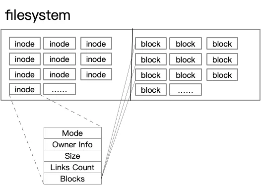

# inode for kids

Imagine you're playing a game where you have a big box full of toys. Each toy has a special sticker on it that tells you its name, what it is (like a car, a doll, or a ball), and where it came from. This sticker is very important because it helps you find your toy when you want to play with it. In Linux, which is like a big computer game, the "toy" is a file, and the "sticker" is called an "inode."

An inode is like a special piece of information that the computer uses to keep track of all the files on your computer. It's not the actual file itself, but it tells the computer where to find the file, how big it is, who owns it, and when it was last changed. It's like the address of your toy in the big box.

Here's what's cool about inodes:

1. **Every file has one**: Just like every toy in your box has a sticker, every file on your computer has an inode.
2. **They help find files quickly**: When you want to play with a specific toy, you don't have to look through the whole box. You just look at the sticker to find out where it is.
3. **They can tell you about the file**: The sticker can tell you not just the name of the toy, but also what it is, how big it is, and when it was last played with.

So, in simple terms, an inode is like a special sticker that helps the computer keep track of all the files, making it easier and faster to find and manage them.

# What is inode

In a Linux system, an inode (index node) is a data structure that stores information about a file or directory, except for its data content and name. Each file or directory on a Linux filesystem has a unique inode. The inode contains metadata about the file or directory, such as its size, owner, access permissions, timestamps (creation, modification, access), and the location of the file's data blocks on the disk.



## Key Components of an Inode:

1. **File Type**: Indicates whether the inode represents a regular file, directory, symbolic link, or other types of special files.

2. **Permissions**: Determines who can read, write, or execute the file or directory. This includes the owner, group, and others.

3. **Owner and Group**: Identifies the user and group that own the file or directory.

4. **Size**: The total size of the file in bytes.

5. **Timestamps**:
   - **Access Time (atime)**: The last time the file was accessed.
   - **Modification Time (mtime)**: The last time the file was modified.
   - **Change Time (ctime)**: The last time the file's metadata (e.g., permissions, owner) was changed.

6. **Link Count**: The number of hard links to the file or directory. A hard link is essentially a reference to the inode. A file can have multiple hard links, allowing it to appear in multiple directories.

7. **Blocks**: A list of disk blocks that store the file's data. The inode points to these blocks, but it does not store the data itself.

## How Inodes Work:

When you create a file or directory, the filesystem assigns an inode to it. The inode is then linked to the file's name in the directory. When you access a file, the filesystem uses the inode to find the file's data blocks on the disk.

## Advantages of Using Inodes:

- **Efficiency**: By storing metadata separately from the file's data, the filesystem can quickly access file information without reading the entire file.
- **Flexibility**: Hard links allow multiple names for the same file, sharing the same inode and data blocks.
- **Recovery**: If a file's name is lost or corrupted, the inode can still be used to access the file's data.

## Limitations:

- **Inode Limit**: Each filesystem has a limit on the number of inodes it can support. This can limit the number of files and directories that can be created.
- **Inode Size**: The size of an inode is fixed, which can limit the amount of metadata that can be stored.


# inode limit

The inode limit in a Linux filesystem is a constraint that determines the maximum number of inodes that can be created on the filesystem. Each file, directory, and other types of files (like symbolic links and device files) require an inode to store their metadata. The inode limit is an important factor in filesystem design because it directly impacts the number of files and directories that can be created on the filesystem.

## Default Inode Limit

The default inode limit varies depending on the filesystem type and the size of the filesystem. For example, when you create a new filesystem, the default inode limit is often set to a percentage of the total number of blocks on the filesystem. This percentage can vary, but a common default might be  1% of the total blocks.

## How Inode Limits Work

When you create a file or directory, the filesystem checks if there are enough inodes available to allocate a new one. If the inode limit is reached, you cannot create more files or directories until some inodes are freed up, typically by deleting files or directories.

## Checking Inode Usage

You can check the current inode usage and the inode limit of a filesystem using the `df` command with the `-i` option. For example:

```bash
df -i
```

This command will display the inode usage (`IUse%`) and the inode limit (`IUse`) for each mounted filesystem.

## Adjusting the Inode Limit

In some cases, you might need to adjust the inode limit of a filesystem. This is typically done when creating a new filesystem, using the `mkfs` command with the `-N` option followed by the desired inode limit. For example:

```bash
mkfs -t ext4 -N  1000000 /dev/sda1
```

This command creates an ext4 filesystem on `/dev/sda1` with a specific inode limit of  1,000,000.

## Considerations

- **Filesystem Type**: Different filesystems may have different methods for setting and adjusting the inode limit.
- **Performance**: Having a large number of inodes can consume more memory and disk space, potentially affecting system performance.
- **Scalability**: The inode limit can be a limiting factor for very large filesystems or systems with a high number of files and directories.

# inode troubleshooting 

Troubleshooting inode-related issues in a Linux system involves identifying and resolving problems that can arise due to inode usage, such as running out of inodes, which prevents new files from being created. Here are some common inode-related troubleshooting steps and considerations:

##  1. Check Inode Usage

First, check the current inode usage and the inode limit on your filesystem. You can do this using the `df` command with the `-i` option:

```bash
df -i
```

This command will show you the percentage of inodes used (`IUse%`) and the total number of inodes (`IUse`) for each mounted filesystem.

##  2. Identify Large Directories

If you're running out of inodes, it might be due to a large number of small files in a single directory. Use the `du` command to find directories that are using a lot of inodes:

```bash
du -a /path/to/directory | sort -n -r | head -n  20
```

This command lists the sizes of files and directories under `/path/to/directory`, sorted in descending order, and shows the top  20 largest.

The following command lists files sorted by the number of inodes they use. It might take some time to complete, especially on large filesystems.

```bash
find / -xdev -printf '%h\n'  2> /dev/null | sort | uniq -c | sort -k  1 -n
```

1. **`find / -xdev -printf '%h\n'`**: This part of the command searches for files starting from the root directory (`/`). The `-xdev` option tells `find` to not descend into directories that are on different filesystems. The `-printf '%h\n'` option prints the directory name (`%h`) for each file found, followed by a newline (`\n`). This effectively lists all directories that contain at least one file.

2. **`2> /dev/null`**: This redirects standard error (`stderr`) to `/dev/null`, effectively silencing error messages. This is useful for ignoring permission denied errors that might occur when `find` tries to access directories it doesn't have permission to read.

3. **`sort`**: This command sorts the output of the `find` command. Since the output consists of directory names, sorting them will group directories together, making the next steps easier.

4. **`uniq -c`**: This command filters out duplicate lines from the sorted output. The `-c` option prefixes lines by the number of occurrences, effectively counting the number of files in each directory.

5. **`sort -k  1 -n`**: Finally, this command sorts the output of `uniq -c` by the first field (the count of files in each directory) in numerical order. This results in a list of directories sorted by the number of files they contain, with the directory containing the most files listed first.

### Purpose and Use Case

This command is useful for identifying directories with a large number of files, which can be helpful for:

- **Disk Space Analysis**: Understanding which directories are consuming the most space.
- **Performance Optimization**: Identifying directories with a high number of files, which might impact filesystem performance.
- **Cleanup and Organization**: Helping to identify directories that might need to be cleaned up or organized.

### Example Output

The output of this command might look something like this:

```
10 /var/log
9 /home/user/Documents
8 /usr/share/icons
...
```

This indicates that the `/var/log` directory contains the most files, followed by `/home/user/Documents`, and so on.

### Note

Running this command on a large filesystem can be resource-intensive and might take a long time to complete. It's generally a good idea to run it during off-peak hours or on a system that's not heavily used.


##  3. Find and Remove Unnecessary Files

Once you've identified directories with a high number of files, you can further investigate to find and remove unnecessary files. Tools like `find` can be used to search for files based on various criteria, such as age or size.

For example, to find files older than  30 days in a directory:

```bash
find /path/to/directory -type f -mtime +30
```

##  4. Increase the Inode Limit

If you've determined that your inode limit is too low for your needs, you might consider increasing it. This is typically done when creating a new filesystem, but it's not possible to increase the inode limit of an existing filesystem without reformatting it.

When creating a new filesystem, you can specify the inode limit using the `-N` option with `mkfs`. For example:

```bash
mkfs -t ext4 -N  1000000 /dev/sda1
```

This command creates an ext4 filesystem on `/dev/sda1` with a specific inode limit of  1,000,000.

##  5. Use Filesystems with Dynamic Inode Allocation

Some filesystems, like XFS and Btrfs, dynamically allocate inodes as needed, which can help avoid running out of inodes. If you're frequently running into inode limits, consider using one of these filesystems for your storage needs.

##  6. Monitor Inode Usage

To prevent future inode-related issues, consider setting up monitoring for inode usage on your filesystems. Tools like `sysstat` can provide useful metrics, and you can use `cron` to schedule regular checks.

##  7. Consult Documentation

If you're dealing with a specific filesystem type or encounter a unique issue, consulting the documentation for that filesystem can provide specific advice and tools for managing inode usage.

