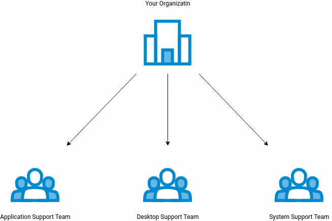

# What is iTop?
iTop, stands for IT Operational Portal, is an Open Source web based application for the day to day operations of an IT environment. iTop was designed with the ITIL best practices in mind but does not dictate any specific process, the application is flexible enough to adapt to your processes whether you want rather informal and pragmatic processes or a strict ITIL aligned behaviour.

This tool is ideal for Help Desk agents, Support engineers, Service managers, IT managers and End-users. Hence it is based on Apache, MySQL and PHP, so you can run it on any operating system that supports those applications like Windows, Linux, MacOS and Solaris as well.

Using iTop you can:

* Document your entire IT infrastructure assets such as servers, applications, network devices, virtual machines, contacts.. etc.
* Manage incidents, user requests, planned outages.
* Document IT services and contracts with external providers including service level agreements.
* Export all the information in a manual or scripted manner.
* Import or synchronize/federate any data from external systems.

# Hardware & Software requirements

Minimum Hardware requirements
|Ticket |created per month |	Console Users 	|CMDB: CIs 	|Servers 	|CPU |	Memory 	Disk for MySQL|
|:----- |:-----|:-----|:-----|:-----|:-----|:-----|
|< 200 	|< 20 	|< 50k 	|An all in one server 	|2vCPU 	4Gb 	|10Gb|
|< 5000 	|< 50 	|< 200k| 	Two servers: Web + MySQL |	4vCPU 	|8Gb |	20Gb|
|> 5000 	|> 50 |	> 200k |	Two servers: Web + MySQL 	|8vCPU 	|16Gb 	|50Gb|

|itop| PHP| 	MySQL| 	MariaDB|
|:-----|:-----|:-----|:-----|
|3.x.x+ |7.4 → 8.2 ? |	5.7+| 	10.3+|


## Install httpd
```bash
yum install -y httpd
```

## Install MariaDB
### Add MariaDB Yum Repository
First you should add the repository under
```/etc/yum.repos.d/MariaDB.repo```

```bash
[mariadb]
name = MariaDB
baseurl = http://yum.mariadb.org/10.6/centos7-amd64
gpgkey=https://yum.mariadb.org/RPM-GPG-KEY-MariaDB
gpgcheck=1
```
### Install MariaDB in CentOS 7
```bash
yum install MariaDB-server MariaDB-client -y
```
### Start and enable the MariaDB service
```bash
systemctl start mariadb
systemctl enable mariadb
systemctl status mariadb
```
### Secure MariaDB in CentOS 7
```bash
mysql_secure_installation
# or mariadb_secure_installation
```

## Install PHP 8
### Add repository
```bash
yum -y install https://dl.fedoraproject.org/pub/epel/epel-release-latest-7.noarch.rpm
yum -y install https://rpms.remirepo.net/enterprise/remi-release-7.rpm
yum -y install yum-utils
yum-config-manager --disable 'remi-php*'
yum-config-manager --enable remi-php80
```

### Install Packages
```bash
yum install php php-mysql php-xml php-cli php-soap php-ldap php-gd php-zip php-json php-mbstring graphviz
```
# Software configuration

## Write permission on temp directory
iTop needs write access to the temp dir (this path is retrieved using
the PHP function ```sys_get_temp_dir()```). Check rights and also the
```openbase_dir``` PHP parameter !

## PHP configuration
Recommanded valuse for ```php.ini```
```php
memory_limit = 256M ; could be increased if needed
max_input_vars = 5000
 
; upload_tmp_dir : should point to a directory with write access
 
; also check those options for attachments (se dedicated chapter below)
; adapt values depending of your preferences!
; - upload_max_filesize
; - max_file_uploads
; - post_max_size
; - max_input_time
```
**Note:** If you're using CLI tools like cron.php, check also the PHP instance used for CLI !

### Attachments upload

|file_uploads|	Set to 1 to allow file upload, to zero to prevent all file uploads.|
|:-----|:----|
|upload_tmp_dir|	The temporary location (on the server) were the uploaded files will be stored. Make sure that this parameter points to a location that is accessible (and writable) by the process running the web server (or by the end users in case of IIS with the Windows built-in authentication) and that there is enough space left.|
|upload_max_filesize|	The maximum size allowed for an uploaded file. The value is expressed in bytes. You can use units like K for kilobytes (=1024 bytes), M for megabytes and G for gigabytes. Example: 4M stands
for 4 megabytes.|
|max_file_uploads|	The maximum number of files that can be uploaded simultaneously in a single web page. iTop should normally upload only one file at a time. You can safely use the default value, which is 20.|
|post_max_size|	The maximum amount of data that can be sent to the server via a POST request. This value MUST BE bigger than upload_max_filesize, since the same request will contain some more information (the title of the document, an operation code…). So it’s better to put a bigger value here. For example, if upload_max_filesize is 4M, then put 5M for post_max_size.|
|memory_limit|	After being uploaded on the server, the file will be read in memory before being stored in the database. Therefore make sure that memory_limit (if enabled) is at least 5 times bigger than
upload_max_filesize.|
|max_input_time|	This value defines the maximum time allowed for the server to read its input. This includes the time spent uploading the files. The default of 60 seconds may be exceeded for uploading big files over slow connections.|

It is good practice to have the following relation between the various settings:

|upload_max_filesize|	<|	post_max_size|	<|	max_allowed_packet|	<| memory_limit|
|:------|:------|:------|:------|:------|:------|:------|
|php.ini||		php.ini||		my.cnf||		php.ini|

## MariaDB configuration 

Create user for ```iTop```
```bash
GRANT ALL PRIVILEGES ON *.* TO 'iTop'@'%' IDENTIFIED BY 'some_password';
FLUSH PRIVILEGES;
```

add the following line to ```/etc/my.cnf```

```bash
innodb_buffer_pool_size = 512M
query_cache_size = 32M
query_cache_limit = 1M
 
innodb_default_row_format = DYNAMIC
innodb_large_prefix = true
 
; max_allowed_packet : should be set to a value bigger than upload_max_filesize in php.ini 
```

# Getting iTop
You can get the latest version of iTop from [here](https://sourceforge.net/projects/itop/files/latest/download)
# Tuning iTop performance
Head over [here](https://www.itophub.io/wiki/page?id=3_0_0%3Aadmin%3Aperformance)

# iTop configuration
## Overview
### Organize the support team
For resolve users request first we need to organize the support team.
Take the picture below  as an example:



Each team should have a responsible manager and some support agents

There are some steps to follow in order to configure the organization in
itop:

1. Create organization 
1. Create users
	1. Managers - Who have top level administration of the software
	1. Agents - Who follow up the customer problem with realted team
	1. Normal User - Who have only portal privilege ,just can login and make a ticket
1. Create teams and add member to them
1. Create service contract - It's a required object and describe the
	 type of service(s) which you provide to the customer , duration of
	 your contract, and other information regarding to your contract with
	 your specific custome
1. Create service families - You can create a category for ralated
	 services like ```IT service```
1. Create service - You should bound a contract to the service you want
	 to add
1. Create service subcategory - A narrow down specification like ```IT
	 service -> Netword support -> Network printers```. In this example
	 ```Network printers``` is subcategory
1. Create service delivery model - Bind support team members to a
	 specific customer. If you don't do this step you won't be able to
	 select any team and assign the ticket to any agent
1. Add support member to delivery model
1. Create iTop users for software login
1. Add permission profile to iTop user

To complete the functionality there some more steps
1. Email notification setup
1. Create trigger
1. Create action
1. Dashboard design
1. User preferences

## Configuration

