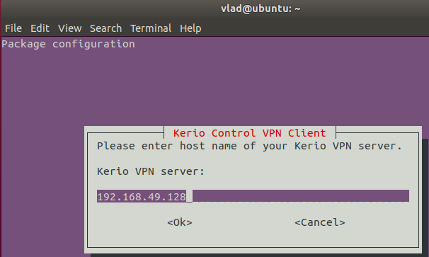
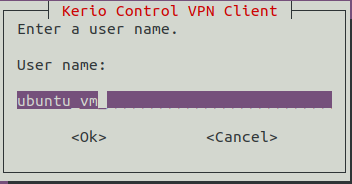
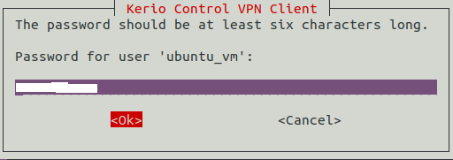
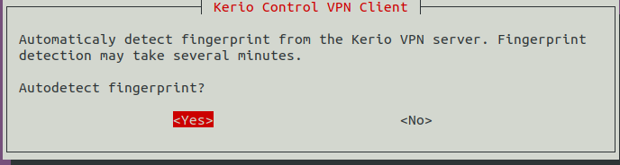

# Install Kerio on Centos

1. Download the latest version of `kerio connect` from [here](http://download.kerio.com/archive/index.php)
1. Install the downloaded package

```bash
yum install kerio-connect-VERSION-linux-x86_64.rpm
```

1. Start the service and check the status

```bash
systemctl enable --now kerio-connect
systemctl status kerio-connect
```

1. Open port on firewall

```bash
firewall-cmd --add-port=4040/tcp --permanent
firewall-cmd --reload
```

1. Login to the admin pannel via `https://your_CentOS_IP:4040/admin`

# Install KerioOS

# Setup kerio client

## Prerequisites

```bash
sudo apt-get install debconf openssl
```

## Installation

To install Kerio Control VPN Client on 32-bit Debian / Ubuntu, execute the following command:

```bash
# sudo dpkg -i kerio-control-vpnclient-###-linux.deb
```

To install Kerio Control VPN Client on 64-bit Debian / Ubuntu, execute the following command:

```bash
# sudo dpkg -i kerio-control-vpnclient-###-linux-amd64.deb
```

> **NOTE:** Replace ### above with the actual version string.

> Please note that there will be no Kerio Control VPN client in the
> Linux app drawer, the entire configuration and management of the
> client is done via CLI.

when the packge successfully installed follow the setup wizard and enter
the realive data to loing to your desire VPN server.

1. Enter the server address



2. Enter your usernaem



3. Enter your password



4. Save fingerprint



## Re-configuration

To configure kerio-control-vpnclient after installation run the
following command and enter the relative data

```bash
dpkg-reconfigure kerio-control-vpnclient
```

Alternatively, it is possible to edit the configuration file `/etc/kerio-kvc.conf` manually

```bash
sudo nano /etc/kerio-kvc.conf
```

After any changes to this file, it is necessary to reload the configuration by executing the following command:

```bash
sudo /etc/init.d/kerio-kvc reload
```
