# Certified Kubernetes Administration (CKA)

**Topics**
* Install and configuration
* Core concepts(Architecture, pods, API, etc.)
* Scheduling
* Logging & Monitoring
* Cluster Administration
* Security
* Storage
* Networking
* Troubleshooting

## Kubernetes Architecture

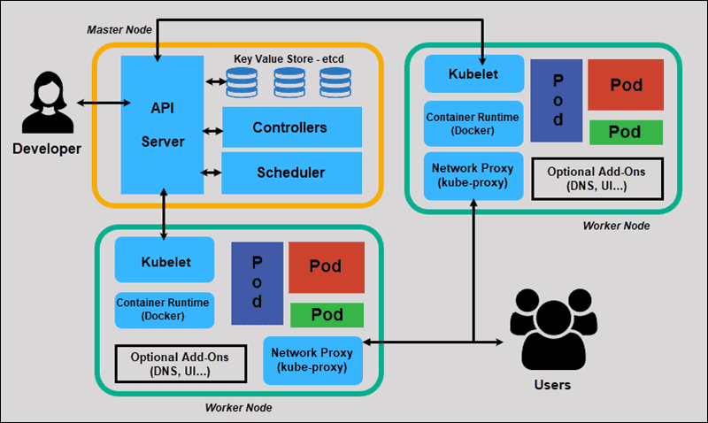

### ```etcd```

It's a key-value database, like a document storage, 
which store all the necessary information of worker nodes. For example
we can find out about nodes and the containers they are running.

### ```kube-scheduler```

It manage which node should accept and run which container. For doing
this important job, kube-scheduler considers several criteria like the
size of the container and the capacity of the worker nodes.

### ```Kube-controller-manager```

This component formed from several manager components. It monitors
worker nodes and makes sure the worker nodes are in the state the should
be in.

It monitors different components and try to keep them in the desired
state.

### ```kube-apiserver```

It's the most important component of Kubernetes because it handles all
the other components of Kubernetes, it handles communication between
worker and master nodes.

It orchestrate all the cluster's operations.

### ```kubelet```

It manages all the activities of the worker node and communicate withe
the master node, with kube-apiserver. It also give information about the worker node which
it's running on it to the master node. This component also exist on the master
node.

### ```Kube-proxy```

It handles communication between all worker nodes, and it guarantee that
proper rules exist to communicate containers on different nodes. It
manage communicate between our applications.

> **Note:** All of components on master nodes can deploy as containers
or systemd services.

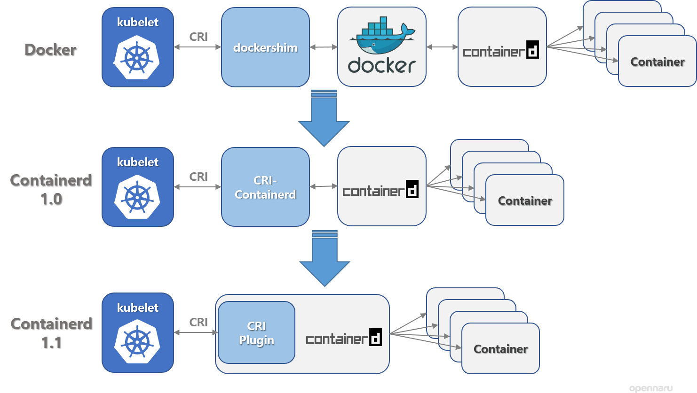
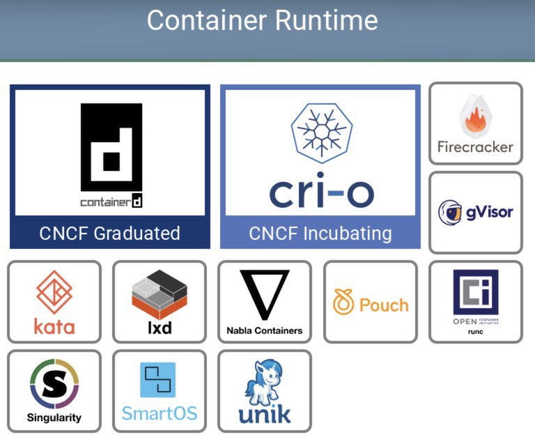


## Deploy k8s cluster

* Production
	1. Kubeadm
	1. KOps
	1. kube-spray
* Training
	1. MiniKube
	1. Docker Desktop
	1. KinD
* Other
  1. Manually

## Ports and protocols
In order to proper functioning you need to open these ports on your
firewalls

On master:
1. 6443/TCP - Kubernetes API server
1. 2379-2380/TCP - etcd server client API
1. 10250/TCP - Kubelet API
1. 10259/TCP - Kube-scheduler
1. 10257/TCP - Kube-controller-manager

On worker:
1. 10250/TCP - Kubelet API
1. 30000-32767/TCP - NodePort Service

## Install and configure K8s

### Pre-configurations

1. Update your Linux distro

```bash
sudo apt update -y
```

2. Set static IP address

```yaml
# vim /etc/netplan/00-installer-config.yaml

# For master
network:
  version: 2
  renderer: networkd
  ethernets:
    enp0s3:
     dhcp4: false
     addresses: [192.168.1.30/24]
     gateway4: 192.168.1.1
     nameservers:
       addresses: [8.8.8.8,8.8.4.4]

# For worker
network:
  version: 2
  renderer: networkd
  ethernets:
    enp0s3:
     dhcp4: false
     addresses: [192.168.1.31/24]
     gateway4: 192.168.1.1
     nameservers:
       addresses: [8.8.8.8,8.8.4.4]
```
3. set hostname

```bash
# For master
hostnamectl set-hostname master-node
# For worker
hostnamectl set-hostname worker-node
```

4. Add hostname of each server in ```/etc/hosts```

In both nodes
```bash
192.168.1.30  master-node
192.168.1.31  worker-node
```
5. Disable swap in both nodes
```bash
swappff -a
sudo sed -i ‘/ swap / s/^\(.*\)$/#\1/g’ /etc/fstab
# or
sed -i '/swap/s/^/#/' /etc/fstab
```

> **Note:** Please check ```/etc/fstab``` to eliminate any probable
problem.

### Install Docker
You can follow the [official docker
documentation](https://docs.docker.com/engine/install/ubuntu/) to
install docker or to install it on ubuntu follow these commands:
```bash
apt-get remove docker docker-engine docker.io containerd runc
apt-get update
apt-get install \
    ca-certificates \
    curl \
    gnupg \
    lsb-release
mkdir -p /etc/apt/keyrings
curl -fsSL https://download.docker.com/linux/ubuntu/gpg | sudo gpg --dearmor -o /etc/apt/keyrings/docker.gpg
echo \
  "deb [arch=$(dpkg --print-architecture) signed-by=/etc/apt/keyrings/docker.gpg] https://download.docker.com/linux/ubuntu \
  $(lsb_release -cs) stable" | sudo tee /etc/apt/sources.list.d/docker.list > /dev/null
apt-get update
apt-get install docker-ce docker-ce-cli containerd.io docker-compose-plugin
systemctl enable --now docker
```

### Install Kubernetes
```bash
curl -s https://packages.cloud.google.com/apt/doc/apt-key.gpg | sudo apt-key add
echo 'deb https://apt.kubernetes.io/ kubernetes-xenial main' | sudo tee /etc/apt/sources.list.d/kubernetes.list
apt-get update -y
sudo apt-get install -y docker.io kubelet kubeadm kubectl containerd
```

> **Note:** To prevent apt from updating kubernetes packages run the
> following command:

```bash
sudo apt-mark hold docker.io kubelet kubeadm kubectl 
```

> **Note:** IF there was a docker permission error while starting docker.
> It can be solved by below command :
```bash
sudo chmod 666 /var/run/docker.sock
```

### Configure master node
```bsah
kubeadm init --pod-network-cidr=192.168.0.0/16 --apiserver-advertise-address=192.168.48.128
```

* ```--pod-network-cidr:``` Specify range of IP addresses for the pod
  network. If set, the control plane will automatically allocate CIDRs
  for every node.
* ```--apiserver-advertise-address:```: The IP address the API Server
  will advertise it's listening on. If not set the default network
  interface will be used.

> **Note:** If you faced with ```docker.io : Depends: containerd (>=
> 1.2.6-0ubuntu1~) ``` error, you need to install ```containerd``` like:
```bash
sudo apt install containerd
```

> **Note:** If you faced with ```kubeadm init running into issue - [ERROR
> CRI]: container runtime is not running``` error, make sure you have
> installed ```docker```, then run the following commands:
```bash
sudo rm /etc/containerd/config.toml
sudo systemctl restart containerd 
```
then run your ```kubeadm init``` command with all your desier flags
again. After it's done copy the output ```token``` and run it in worker
nodes

Now copy the config files into ```$HOME/.kube``` dir

```bash
mkdir -p $HOME/.kube 
cp -i /etc/kubernetes/admin.conf $HOME/.kube/config 
chown $(id -u):$(id -g) $HOME/.kube/config
```

Check all nodes

```bash
kubectl get nodes
```

In the above output, you should see that Master Node is listed as not
ready. Because the cluster does not have a Container Networking
Interface (CNI).

Deploying Calico CNI for the Master Node with the following command:

```bash
curl https://docs.projectcalico.org/manifests/calico.yaml -O
kubectl apply -f calico.yaml
```

### Configure worker node

Just run the join command you've got in the output of ```kubeadm
init```, something like following:
```bash
kubeadm join 192.168.74.137:6443 --token ocbdbr.ghcbi8pw2xgbxqai \
         --discovery-token-ca-cert-hash sha256:11666d5f78f76f3c5b697839460a92eac1f7fd012bcd667d2e879aa5ac6eaa44
```

## Get ```kubectl join```  info

In case of you forgot ```kubectl joing``` information, you can get the
token by issuing the following command on a master node:
```bash
kubeadm token list
```

To get ```--discovery-ca-cert-hash``` run the following command on a
master node:
```bash
openssl x509 -pubkey -in /etc/kubernetes/pki/ca.crt | openssl rsa -pubin \
-outform der 2>/dev/null | openssl dgst -sha256 -hex | sed 's/^.*//'

```

## Node labels

You can assign label to each kubernetes cluster nodes. To see the list
of labels run the following command:
```bash
kubectl get nodes
```
To assign a label run the following command:
```bash
kubectl label node <node-name> kubernetes.io/<key>=<value>
```
> **Note:** ```<node-name>``` available in ```kubectl get nodes```
output.

As an example:
```bash
kubectl label node kube-worker1 kubernetes.io/role=node
```

> **Note:** It's a good practice to install ```kubectl``` on your local
> machine, a machine outside of the cluster in the same network, and
> control the luster with that. Remember you have to copy
>	```/etc/kubernetes/admin.cnf``` in your local environment, in Linux
> environment it's ```~/.kube/config```

> **Note:** you can get cluster information with ```kubectl cluster-info```

# ETCD

ETCD is a distributed reliable key-value store that is simple, secure
and fast. It's listen on port ```2379``` and you can access to the
database with ```etcdctl```.

```bash
etcdctl set key1 value1
etcdctl get key1
```

## ETCD in kubernetes

In the context of a Kubernetes cluster, etcd instances can be deployed
as Pods on the masters.

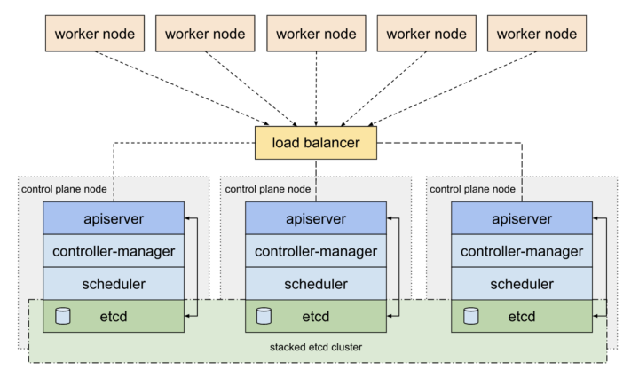

To add an additional level of security and resiliency it can also be
deployed as an external cluster.

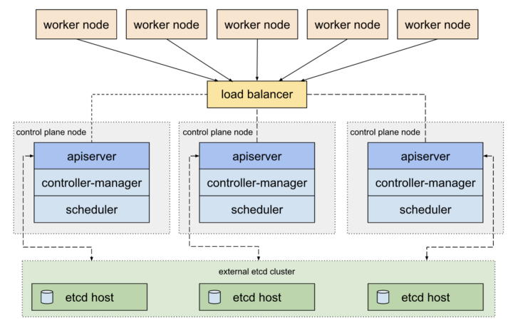

The following sequence diagram, shows the components involved during a
simple Pod creation process. It’s a great illustration of the API Server
and etcd interaction.

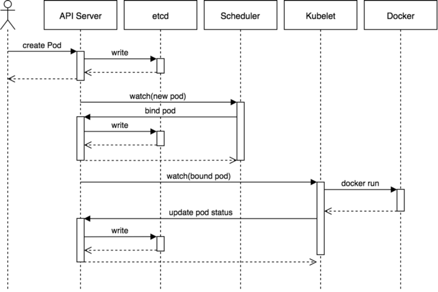

### What kind data ETCD stores?

* Nodes
* PODs
* Configs
* Secrets
* Accounts
* Roles
* Bindings
* Others

For more information head over [here](https://betterprogramming.pub/a-closer-look-at-etcd-the-brain-of-a-kubernetes-cluster-788c8ea759a5)

# Kube API Server

It's the main component of control-plane node, and it monitor all the
components of the cluster and manage them.

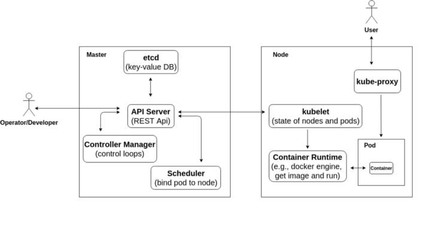

For more information head over [here](https://michalswi.medium.com/introduction-to-kubernetes-api-the-way-to-understand-the-concept-of-kubernetes-operators-ed667385caf4)

> **Note:** if you want to reconfig a node run ```kubeadm reset``` on
that node.

> **Note:** All the cluster's yaml configuration files are under
```/etc/kubernetes/manifest```.


# Kube Control manager

It formed from several components which each component manage and
monitor a resource. For example one of the components watches the status
of nodes, check desired state in a watch loop. In general all the
controllers monitor something in a watch loop, and looking for desired
state.

Controllers list:
1. Deployment controller
1. Namespace controller
1. Endpoint controller
1. cronJob
1. Job controller
1. PV  protection-controller
1. Service account controller
1. Stateful-set controller
1. Replicaset controller
1. Node controller
1. PV-binder controller
1. Replication controller

## Node controller

* ```Node monitor period``` - interval to check nodes status
* ```Node monitor grace period``` - if the node is not in the desired
  state, node controller labels it as ```unreachable```
* ```POD eviction timeout``` - if the node stays ```unreachable``` after
  specified time, node controller terminates all the pods on
  ```unreachable``` node then runs all the pods, that was running on
  the ```unreachable``` node, on the other nodes and change the status
  of the ```unreachable``` node ```not ready```.

## Replication controller

It monitors the status of our replica sets

# Kubelet

It manges the node which it existed on and send reports from the status
of it's node to master node, all the communications perform via
kube-apiserver.

> **Note:** if you get ```not ready``` label in nodes status, one of the
causes could be, kublet service is not running on the node.

# Kube proxy

Because of the IP address assign to a pod is not fixed and it changes
each time a new pod run, there is a ```service``` item that you can
assign a name to it, like db, application, etc. and kube proxy will
store these information, so each time you need to communicate with a
pod, you don't have to remember its IP address, you just need call its
domain name which is the name you used in ```service```

# API Primitives

## Pod

Pods are the smallest deployable units of computing that you can create
and manage in Kubernetes. A Pod (as in a pod of whales or pea pod) is a
group of one or more containers, with shared storage and network
resources, and a specification for how to run the containers. A Pod's
contents are always co-located and co-scheduled, and run in a shared
context. A Pod models an application-specific "logical host": it
contains one or more application containers which are relatively tightly
coupled. In non-cloud contexts, applications executed on the same
physical or virtual machine are analogous to cloud applications executed
on the same logical host.

* Pods usually have a one-to-one relationship to the container that
  running an application
* To scale up , a new pod is created
* To scale down, an existing pod is deleted
* To scaling up an application, a new container is not added to the
  existing pod

### Multi-Container pods

There is no restriction to have a single container in a single pod. A
single pod can have multiple containers but the containers are not
usually of the same kind. For scaling an application we definitely need
to create a new pod. As an example:

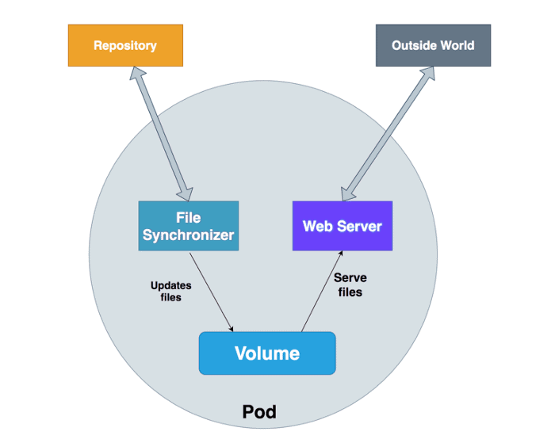

[More info](https://medium.com/bb-tutorials-and-thoughts/kubernetes-learn-sidecar-container-pattern-6d8c21f873d)

### Deploy a pod(imperatively)

```bash
kubectl run nginx --image nginx
```

> **Note:** kubernetes by default uses docker hub as its registry.

### Deploy a pod(via yaml file)

```yaml
apiVersion:
kind:
metadata:
  name:
  lables:
    app:
    type:
spec:
  containers:
    - name:
      image:
```

* **apiVersion** - The version of the API which includes our desired
  object, like pod etc.
* **kind** - The object we want to define, like pod etc.
* **metadata** - Data about the object we defined 
* **spec** - Specification of the object we defined

> **Note:** ```metadata``` and ```spec``` are dictionaries and have
their own key-value.

> More about [API versions](https://kubernetes.io/docs/reference/kubernetes-api/)

### ```kubectl apply``` vs ```kubectl create```

kubectl create is what we call 
[Imperative Management](https://kubernetes.io/docs/tutorials/object-management-kubectl/imperative-object-management-configuration/). On this approach you tell the Kubernetes API what you want to create, replace or delete, not how you want your K8s cluster world to look like. Declarative Management 

kubectl apply is part of the [Declarative
Management](https://kubernetes.io/docs/tutorials/object-management-kubectl/declarative-object-management-configuration/)
approach, where changes that you may have applied to a live object (i.e.
through scale) are "maintained" even if you apply other changes to the
object.

> **Note:** In laymans They do different things. If the resource exists,
```kubectl create``` will error out and ```kubectl apply``` will not error out.

> **Note:** You should put static pod declaration(yaml file) in
```/etc/kubernetes/manifest```, and kubernetes will create the object
four you automatically.

> **Note:** Kubernetes events help you understand how Kubernetes resource
decisions are made and they can be helpful for debugging. [More info](https://www.containiq.com/post/kubernetes-events)

> **Note:** you can delete pod with ```kubectl delete pod <pod-name>```,
but the better practice is using ```kubectl delete -f
<declare-file>.yaml```

> **Note:** To run a pod imperatively you can use ```kubectl run
<pod-name> --image <image_name>```

> **Note:** you can get yaml file of pod by ```kubectl get pod
<pod-name> -o yaml```

> **Note:** You can get information about any object (man-like) by
```kubectl explain <object-name>[.<object-field>]``` like:
```bash
kubectl explain pod
kubectl explain pod.spec
```

> **Note:** You can update a manifest file (yaml file) by ```kubectl
replace <manifest-file>.yaml```

## Replication controller

A ReplicationController ensures that a specified number of pod replicas
are running at any one time. In other words, a ReplicationController
makes sure that a pod or a homogeneous set of pods is always up and
available.

If there are too many pods, the ReplicationController terminates the
extra pods. If there are too few, the ReplicationController starts more
pods. Unlike manually created pods, the pods maintained by a
ReplicationController are automatically replaced if they fail, are
deleted, or are terminated. 

A simple case is to create one ReplicationController object to reliably
run one instance of a Pod indefinitely. A more complex use case is to
run several identical replicas of a replicated service, such as web
servers.

### Structure
```yaml
apiVersion: v1
kind: ReplicationController
metadata:
  name: myapp-rc
  labels:
    app: myapp
    type: front-end
spec:
  template:
# pod specification will set here
    metadata:
      name: myapp
      type: front-end-pod
    spec:
      containers:
      - name: nginx-controller
        image: nginx:1.17
  replicas: 3
```

> **Note:** ```app``` and ```type``` are just example labels and you can
define whatever label you want.

> **Note:** ReplicationController is somehow abandon and it's a better
practice to use ReplicaSet

## ReplicaSet

It's exactly the same to ReplicationController with some changes. It's
recommended to use ReplicaSet instead of ReplicationController.

### Structure
```yaml
apiVersion: apps/v1
kind: ReplicaSet
metadata:
  name: myapp-replicaset
  labels:
    app: myapp
    type: front-end
spec:
  template:
    metadata:
      name: myapp
      labels:
        app: myapp
        type: front-end
    spec:
      containers:
      - name: nginx
        image: nginx:1.17
  replicas: 3
  selector:
    matchLabels:
      type: front-end
```
* **selector** - with ```selector``` ReplicaSet knows which pods should
  be monitored and managed


> **Note:** you can get pods' labels with ```--show-labels``` option at
the end of your ```kubectl get pod``` command.

> **Note:** If you have created some pods without any controller
(ReplicationController, ReplicaSet, etc.) and you want a controller
adopt, monitor, and control them you can prepare a controller manifest
(yaml file) and in place the pods' label in manifest label section. If
the labels be matched, replication controller start to manage those
pods.

> **Note:** If you create a manifest with ```kubectl create``` command,
you should make your changes with ```kubectl replace``` command later,
but if you use ```kubectl apply```, you don't need to change your
approach and make the future changes with the same command.

## Scaling ReplicaSet

There are different ways to do this:
1. Manual - by editing manifest (yaml file) then replace/apply it
> **Note:** This is recommended practice, because other ways won't
effect permanently, it means if the kubernetes load the manifest file
again, it will replicaset according to that file's replicaset value

2. Using ```scale``` command
```bash
kubectl scale --replicas=<number> -f <replicaset-definition>.yaml
# or
kubectl scale --replicas=<number> replicaset <replicaset-name>
```

[Read more about auto-scaling](https://spot.io/resources/kubernetes-autoscaling-3-methods-and-how-to-make-them-great/)

## Deployments

A Deployment provides declarative updates for Pods and ReplicaSets.

You describe a desired state in a Deployment, and the Deployment
Controller changes the actual state to the desired state at a controlled
rate. You can define Deployments to create new ReplicaSets, or to remove
existing Deployments and adopt all their resources with new
Deployments.

Some of deployment use cases:
1. Rolling update
1. Rollback changes
1. Pause/Resume changes


# Namespaces

In Kubernetes, namespaces provides a mechanism for isolating groups of
resources within a single cluster. Names of resources need to be unique
within a namespace, but not across namespaces. Namespace-based scoping
is applicable only for namespaced objects (e.g. Deployments, Services,
etc) and not for cluster-wide objects (e.g. StorageClass, Nodes,
PersistentVolumes, etc).

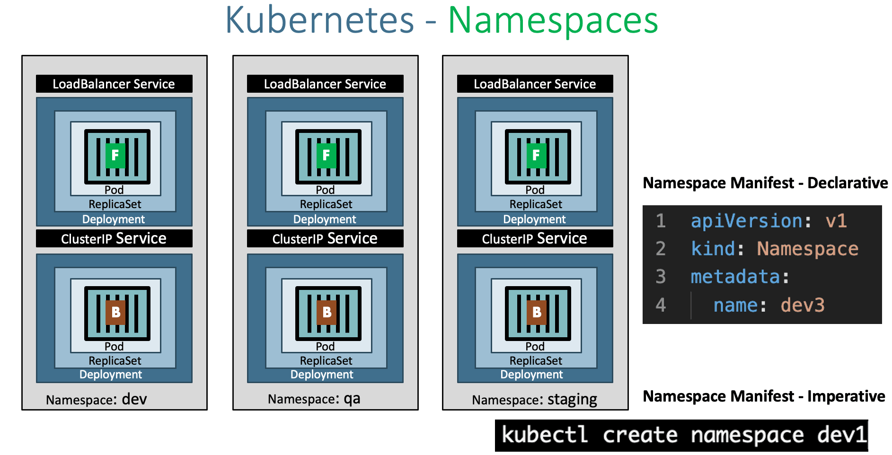

[More info](https://stacksimplify.com/azure-aks/azure-kubernetes-service-namespaces-imperative/)

By default kubernetes initiate the following namespaces on setup time:

1. ```default``` - Kubernetes includes this namespace so that you can start
   using your new cluster without first creating a namespace.
1. ```kube-node-lease``` - This namespace holds Lease objects associated with
   each node. Node leases allow the kubelet to send heartbeats so that
   the control plane can detect node failure.
1. ```kube-public``` - This namespace is readable by all clients (including
   those not authenticated). This namespace is mostly reserved for
   cluster usage, in case that some resources should be visible and
   readable publicly throughout the whole cluster. The public aspect of
   this namespace is only a convention, not a requirement.
1. ```kube-system``` - The namespace for objects created by the Kubernetes
   system.


You can define a namespace in two different ways:
1. Imperative - ```kubectl create namespace <name>```
1. Declarative
```yaml
apiVersion: v1
kind: Namespace
metadata:
  name: <name>

```

## Namespace Resource limit using ResourceQuota 

Resource quotas work like this:

*    Different teams work in different namespaces. This can be enforced
     with [RBAC](https://kubernetes.io/docs/reference/access-authn-authz/rbac/).
*    The administrator creates one ResourceQuota for each namespace.
*    Users create resources (pods, services, etc.) in the namespace, and
     the quota system tracks usage to ensure it does not exceed hard
     resource limits defined in a ResourceQuota.
*    If creating or updating a resource violates a quota constraint, the
     request will fail with HTTP status code 403 FORBIDDEN with a
     message explaining the constraint that would have been violated.
*    If quota is enabled in a namespace for compute resources like cpu
     and memory, users must specify requests or limits for those values;
     otherwise, the quota system may reject pod creation. Hint: Use the
     LimitRanger admission controller to force defaults for pods that
     make no compute resource requirements.

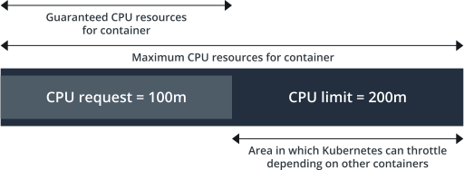
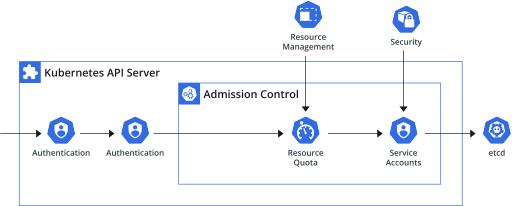
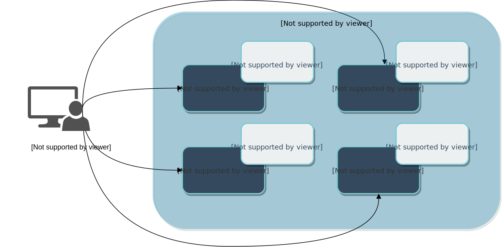

### Structure

```yml
apiVersion: v1
kind: ResourceQuota
metadata:
  name: compute-quota
  namespace: dev
spec:
  hard:
    pods: "10"
    requests.cpu: "4"
    requests.memory: "4Gi"
    limits.cpu: "10"
    limits.memory: "10Gi"

```
[More information](https://kubernetes.io/docs/concepts/policy/resource-quotas/)

> **Note:** You should specify the amount of CPU and memory in pod
section. For example in ```deployment```:
```yaml
...
spec:
...
  template:
  ...
    resources:
      requests:
        cpu: "value"
        memory: "value"
      limits:
        cpu: "value"
        memory: "value"

```
>**Note:** The **requests** section tells us the pod will be created when the
target node has the mentioned resources. And the **limits** section
tells us the maximum resource the pod can use.

# DNS

Kubernetes creates DNS records for Services and Pods. You can contact
Services with consistent DNS names instead of IP addresses.

Kubernetes DNS schedules a DNS Pod and Service on the cluster, and
configures the kubelets to tell individual containers to use the DNS
Service's IP to resolve DNS names.

Every Service defined in the cluster (including the DNS server itself)
is assigned a DNS name. By default, a client Pod's DNS search list
includes the Pod's own namespace and the cluster's default domain.

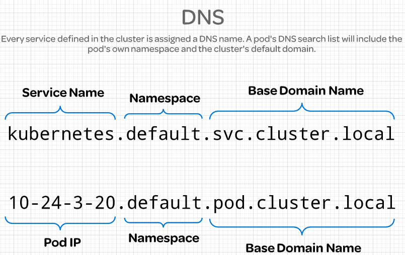

# Services
Each Pod has its own IP address but Pods are ephemeral (destroyed
frequently). When a Pod get restarted, it will have a new IP address (a
new IP address on re-creation). So, it does not make any sense to use
Pods IP addresses. However, the service has its own IP address and even
when a Pod dies the service retains its IP address. Unlike the IP of a
Pod, the IP address of a service is stable. In other words, the
lifecycles of a service and Pod are not connected!

Generally a service:
* Enables communication between various components within and outside of
  the application
* Helps us connect applications together with other applications or
  users.


## Service types

* NodePort: Exposes the service on each Node's public IP at a static
  port. - From outside.

  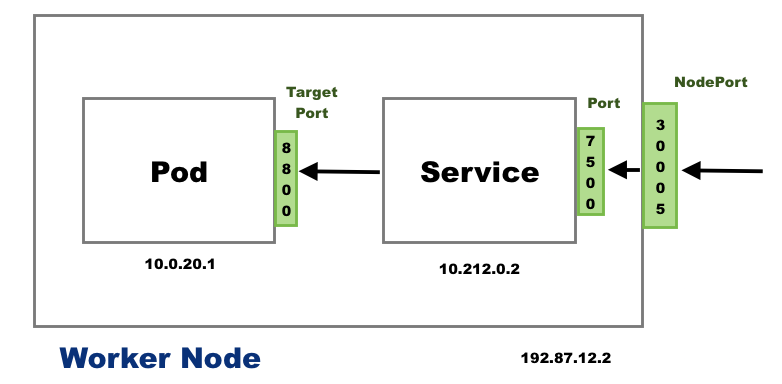

    * ```Port``` exposes the Kubernetes service on the specified port within
      the cluster. Other pods within the cluster can communicate with
      this server on the specified port.
    * ```TargetPort``` is the port on which the service will send requests to,
      that your pod will be listening on. Your application in the
      container will need to be listening on this port also.
    * ```NodePort``` exposes a service externally to the cluster by means of
      the target nodes IP address and the NodePort. NodePort is the
      default setting if the port field is not specified.

* ClusterIP: This is the default service type and we don't have to
  specify a service type. It exposes the service on an internal-cluster
  IP. - From inside (reachable only from within the cluster)

* LoadBalancer: This service type exposes the service via cloud
  provider's LB. The services to which LB will route are created
  automatically. - From outside.
  > **Note:** However, when we want to expose multiple applications
  there are some issues and challenges. For each application:
    * One LB resource (i.e. AWS)
    * At lest one public IP
    * DNS name (CNAME)
Also, there is no centralization of certs and logs.
Ingress comes to the rescue.

* Headless Service: We can create headless service when we specify a
  Service with .spec.clusterIP set to None. This service type can be
  used when
    1. A client wants to communicate with a specific Pod.
    1. Pods want to talk directly with a specific Pod.

So, in those cases, the Pod is not selected randomly (default load
balancing behavior of a service). One example for using the Headless
service type is a stateful application such as database. To talk
directly to a specific Pod, a client makes a DNS lookup. By setting the
clusterIP set to None, the service returns a Pod IP address instead of
the Cluster IP address. Check [Headless Service](https://www.bogotobogo.com/DevOps/Docker/Docker_Kubernetes_Pods_Services_Yaml.php#headless-service).

* Ingress: Ingress, unlike the services listed above, is actually NOT a
  type of service but acts as a router or an entry point to our
  cluster.
Ingress allows simple host or URL based HTTP routing.
An ingress is a core concept of Kubernetes, but is always implemented by a third party proxy.
These implementation is known as ingress controller which is responsible for processing the Ingress Resource information.
Note that the Ingress is just a description of how routing should be performed. The actual logic has to be performed by an "Ingress Controller". So, creating Ingress resources in a Kubernetes cluster won't have any effect until an Ingress Controller is available.

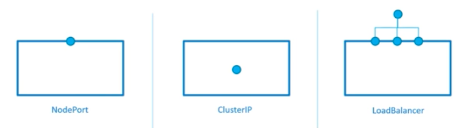

## NodePort Structure

```yaml
apiVersion: v1
kind: Service
metadata:
  name: <name>
spec:
  type: NodePort
  ports:
    - tagetPort: <port-number>
    - port: <port-number>
    - nodePort: <port-number>
  selector:
    <label>: <value>
    <label>: <value>
    ...
```

> **Note:** In ```kubectl describe svc <svc-name>``` there is an
```Endpoints``` values which demonstrates the pods in the backend 

## NodePort Structure

```yaml
apiVersion: v1
kind: Service
metadata:
  name: <name>
spec:
  [type: <service-type>]
  ports:
    - tagetPort: <port-number>
    - port: <port-number>
  selector:
    <label>: <value>
    <label>: <value>
    ...
```

> **Note:** You can forward a service port with ```kubectl port-forward
service/<svc-name> <new-port>:<existing-port>```. It's obvious this
command should use for debugging purposes only.

# Scheduling

## Manual scheduling

If there is no scheduler you should implicitly define a node to run the
pod when your are defining your pod, like:

```yaml
apiVersion: v1
kind: Pod
metadata:
  name: nginx
  labels:
    name: nginx
spec:
  containers:
    - name: nginx
      image: nginx
      ports:
        - containerPort: 8080
  nodeName: <node-name>
```

And if you have a pod without any node to run it, means no
```nodeName``` exists, you need to define a ```Bind``` and assign a node
to that pod, like:

```yaml
apiVersion: v1
kind: Bind
metadata:
  name: nginx
target:
  apiVersion: v1
  kind: Node
  name: <node-name>
```

> **Remember** Pod name and ```Bind``` object name must be the same.

After defining the ```Bind``` object you should convert the ```yaml```
to json and  apply it with curl command only, like:

```bash
curl --header "Content-Type:application/json" --request POST --data
'{"apiVersion:"v1", "kind":"Bind",...}'
http://$SERVER/api/v1/namespace/default/pods/$PODNAME/binding/
```

# Label selectors and annotations

* Labels:
  * Standard method to group things together
  * Are properties attached to each resource/object
* Selectors:
  * Enable user to filter based on some criteria

* Annotations:
  * You can use Kubernetes annotations to attach arbitrary
    non-identifying metadata to objects. Clients such as tools and
    libraries can retrieve this metadata. It's useful **Prometeus**
    service discovery.

# Taints and Toleration

Node affinity is a property of Pods that attracts them to a set of nodes
(either as a preference or a hard requirement). Taints are the opposite
-- they allow a node to repel a set of pods. Tolerations are applied to
pods. Tolerations allow the scheduler to schedule pods with matching
taints. Tolerations allow scheduling but don't guarantee scheduling: the
scheduler also evaluates other parameters as part of its function.
Taints and tolerations work together to ensure that pods are not
scheduled onto inappropriate nodes. One or more taints are applied to a
node; this marks that the node should not accept any pods that do not
tolerate the taints.

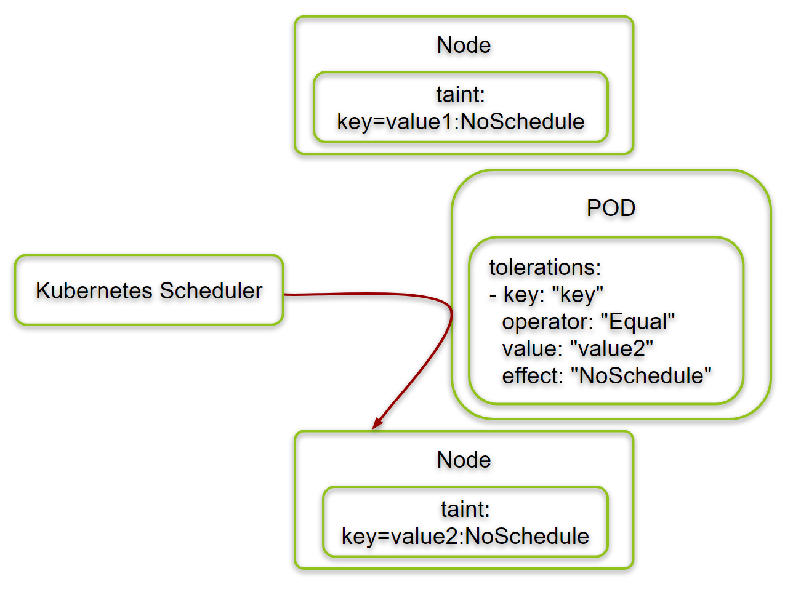

## How to taint a node

```bash
kubectl taint node <node-name> <key>=[<value>]:taint-effect
```

```taint-effect```:
* NoSchdule
  * **New pods** are not schedule on the node
  * **Existing pods** stay
* Prefer NoSchdule
  * Like NoSchdule but are not guaranteed
* NoExecute
  * **New pods** are not schedule on the node
  * **Existing pods** evicted
  
Toleration on pod:
```yaml
...
spec:
...
  containers:
  ....
  tolerations:
  - key: "<key>"
    operator: "Equal"
    value: "<value>"
    effect: "NoSchdule"
```

> **Note:** You can ignore ```value``` only you are using ```Exists``` as
your ```operator``` value.

# NodeSelector

nodeSelector is the simplest recommended form of node selection
constraint. You can add the nodeSelector field to your Pod specification
and specify the node labels you want the target node to have. Kubernetes
only schedules the Pod onto nodes that have each of the labels you
specify.

> It specifies the new pod will run on which node, based on node label.

```yaml
apiVersion: v1
kind: Pod
metadata:
  name: my-app
spec:
  containers:
  - name: my-app
    image: nginx
  nodeSelecotr:
    <node-label-name>: <node-label-value>
    size: large
```

> **Note:** You cannot make **OR** or **NOT** conditions, It's
nodeSelecotr limitation. To solve this problem using **Node Affinity**

> **Note:** To label a node use ```kubectl label node <node-name>
<label-name>``` and to remove the label ```kubectl label node
<node-name> <label-name>-```

# Node Affinity

Node affinity is conceptually similar to nodeSelector, allowing you to
constrain which nodes your Pod can be scheduled on based on node
labels.

> It makes sure that pods are hosted on particular nodes.

## Node Affinity types

*Available
  * requiredDuringSchedualingIgnoredDuringExecution - 
The scheduler can't schedule the Pod unless the rule is met. This
functions like nodeSelector, but with a more expressive syntax.
  * prefeddedDuringSchedualingIgnoredDuringExecution - The scheduler
    tries to find a node that meets the rule. If a matching node is not
    available, the scheduler still schedules the Pod.

* Planned - It's on alpha branch
  * requiredDuringSchedualingRequiredDuringExecution

A brief table view of Node Affinity

| | DuringSchedauling | DuringExecution |
| Type 1 | Required | Ignored |
| Type 2 | Proffered | Ignored |
| Type 3 | Required | Required |

```yaml
apiVersion: v1
kind: Pod
metadata:
  name: my-app
spec:
  containers:
  - name: my-app
    image: nginx
  affinity:
    nodeAffinity:
      requiredDuringSchedualingIgnoredDuringExecution:
        nodeSelectorTerms:
        - matchExpresions:
          - key: <label-name>
            operator: 
            values: In # or other operators like (NotIn, Exists)
            - <label-value>
```


# Node Affinity vs Taints and Tolerations

By ```taint and toleration``` you can limit nodes to run specific pods,
pods still can run on other nodes, and with the help of
```nodeAffinity``` you can decide the pods run on which nodes.


# Resource requirements and limits

* Every pod consumes a set of resources
* Whenever a pod is placed on a node, it consumes resources available to
  the node
* It is k8s scheduler that decide, which node the pod should be placed
  on
* The scheduler considers the amount of resources required by a pod and
  those available on the nodes.
  * If the node has no sufficient resources the scheduler avoids placing
    the pod on that node
  * If there is no sufficient resources available at all, pod wait in
    ```pending``` state, and the reason is mentioned in the ```events```

## Resource request

* The minimum amount of CPU or Memory requested by a Container
* By default k8s assume that each pod requires 0.5(cores of) CPU and 256Mi Memory
* When a scheduler tries to place a pod on a node, it uses this numbers
  to identify which node has sufficient amount of resources 

### CPU

* 0.5 = 500m (milicore)
* 1m is the lowest value 
* 1 CPU is equivalent to 1 vCPU
* The maximum limitation is the maximum amount of CPU the node has

### Memory

* 256Mi = 256*1024*1024
* 256M = 256*1000*1000

| Unit | Full name |
| ---- | --------- |
| G | Gigabyte |
| M | Megabyte |
| K | Kilobyte |
| Gi | Gibibyte |
| Mi | Mibibyte |
| Ki | Kibibyte |


## Resource limits

A docker container has no limit to the resources that it can use, for
example, if a node has 1 CPUs free, a container without limit can use
all of that. By default k8s set 1 vCPU and 512 Mi of memory limits on a
container

## Exceed limits

What happen when a pod exceed beyond its limits?
* CPU: K8s throttles the CPU for the pod
* Memory: K8s terminate the pod (OOM-killed, error message)

> **Note:** By describing node we can find out the node all/available
capacity ```kubectl describe node <node-name>```

> **Note:** It's a best practice to divide memory in three parts, one
for OS processes, one for kubelet, and one for your cluster. Remember if
kubelet stops working the node wont be managed anymore.

> **Note:** It's a standard to define ```resource limit``` and
```resource request``` for all pods, to manage and troubleshooting
better

## How to find out what amount of resources we should allocate?

First we allocate some value, then we start to monitor the pod's
resource usage, and finally allocate the proper value to our pods

# Demon sets

It deploys one pod on each node like bellow:


It can be use for different purposes like monitoring and log viewing.
Its yaml structure is exactly as the same as deployment with small
changes, ```kind``` value is ```DaemonSet``` and there is no ```replicas```

# Static pod

* The kubelet can manage the node independently
* Kubelet periodically checks a specific directory
  (```/etc/kubernetes/manifest```) for files, then read
  them and creates pods on the host
* Kubelet ensure that the pod stays available
  * If the application crashes the kubelet attempts to restart it
* By changing/removing/adding a pod, kubelet changes/removes/adds the
  pod
* The kubelet works at the pod level, it means, only understand pods

> **Note:** In ```/etc/kubernetes/manifest``` only pod(yaml files) can
place. The pods which create by the yaml files under the mentioned
directory called, static pods.

> **Note:** The static pod path could change by changing the address in
```kubelet.service``` under systemd files.

# Logging and monitoring

## Monitor

* Node level metrics
  * The number of the nodes of the cluster
  * How many of them are healthy
  * Performance metrics
    * CPU and Memory
    * Network
    * Disk utilization
* Pod level metrics
  * The number of pods
  * Performance metrics
    * CPU and Memory
    * The number of restarts

### Metric server - A monitoring solution

* Enable monitoring and analyze features foe k8s
* Retrieves metrics from each k8s nodes and pods
* Aggregates and stores metrics in memory
* The metrics exposed by the metric server is used by
  HorizontalPodAutoscaler and VerticalPodAutoscaler
* Metrics are accessible via ```kubectl top``` command

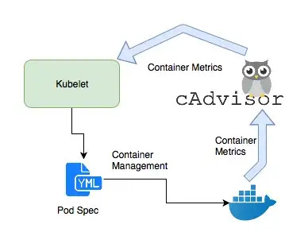

[Official documentations](https://github.com/kubernetes-sigs/metrics-server)

> **Note:** ```kubectl top``` command can apply on both ```node``` and
```pod```

```bash
kubectl top node
kubectl -n <namespace-name> top pod
```

## Managing application logs

* Getting pod logs
```bash
kubectl -n <namespace-name> get logs [-f] <pod-name>
```
* Getting events
```bash
kubectl -n <namespace-name> get events [-c <container-name>]
```

# Application lifecycle management

## Deployment strategies

There are two different ways to setup the deployment
1. Recreate
1. Rolling update

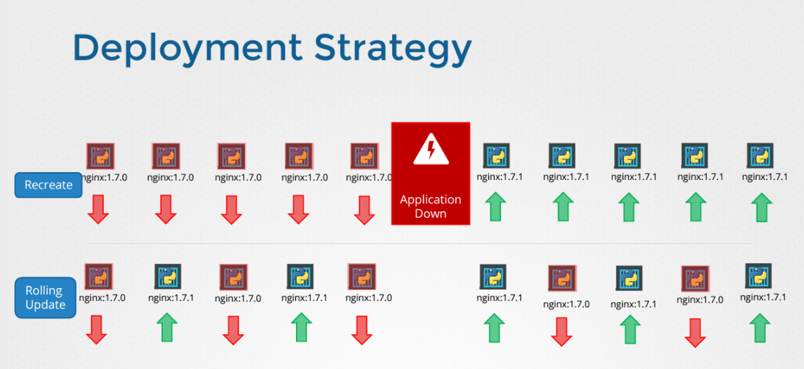

### Some useful commands

* Rollout status
```bash
kubectl rollout status <deployment-name>
```
* Rollout history
```bash
kubectl rollout history <deployment-name>
```

> **Note:** You can get and roll back to last 4 deployment you applied,
it cloud be possible for other replication controllers too, I didn't
checked :)

> **Note:** By adding ```change cause``` annotation in your deployment
file, the ```CHANGE-CAUSE``` column in ```kubectl deployment``` history
will get value, and everything going to be meaningful :D

* Rollback
```bash
kubectl rollout undo deployment <deployment-name> [--to-revision
<number>]
```

# Configure applications

## Commands and arguments

Like dockerfiles, kubernetes containers have ```ENTRYPOINT```s and
```CMD```, named ```Command``` and ```args``` respectively with the same
functionality. 


## Environment variables

Definition:


Types:
* Plain key value
* ConfigMap - In case of having a large number of environments, we can
  define a ConfigMap file and put all the variables in it.
* Secret - In order to pass sensitive, it's a better practice to use
  Secret


### ConfigMap

Imperative implementation
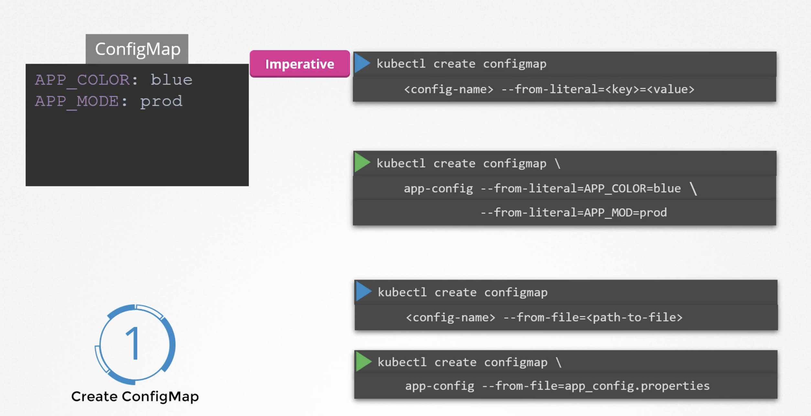

Declarative  implementation
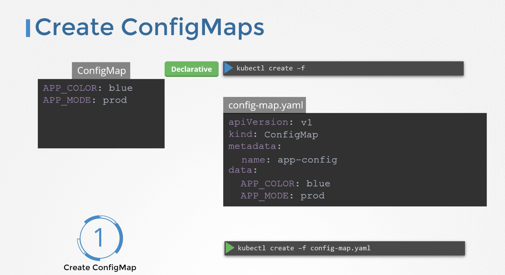

Usage in pod
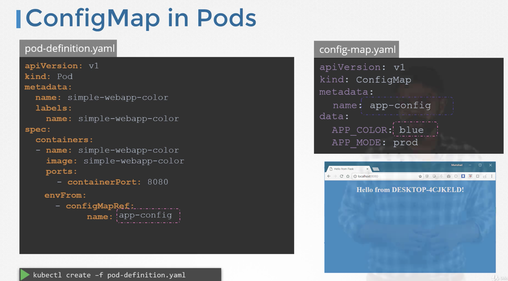


### Secret

Imperative implementation
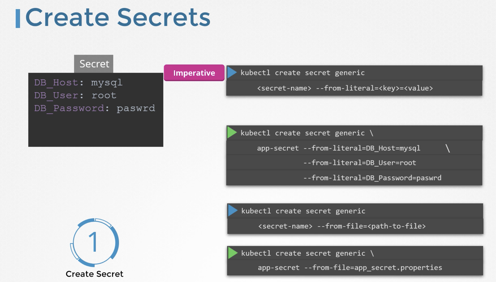

Declarative  implementation


Encoding
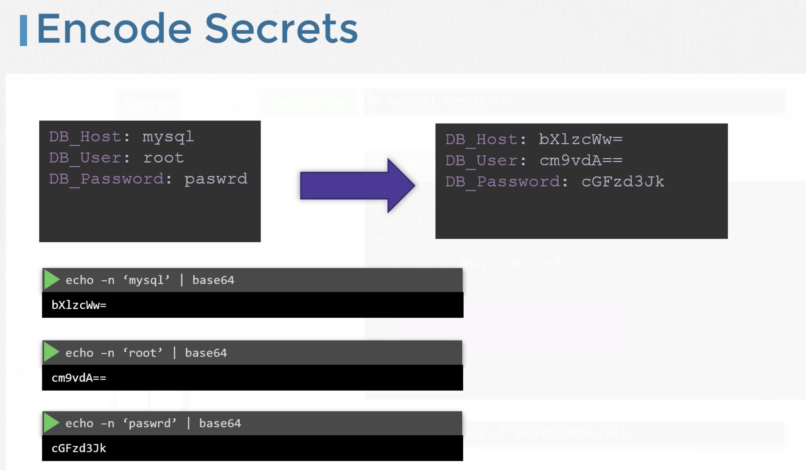

Decoding
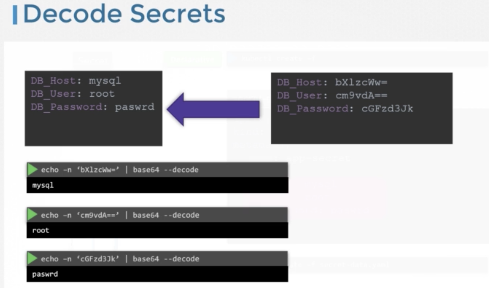


Usage in pod


> **Note:** Like ```configMap``` you can use ```secret``` as env,
single env, or volume.

# Multi-container pods

The multi-container pods are the pods that contain two or more related
containers that share resources like network space, shared volumes, etc
and work together as a single unit. Basically, these helper processes or
containers enhance the main containers by providing additional
functionality.

## Multi-container pods design pattern


[Full article](https://medium.com/bb-tutorials-and-thoughts/understanding-multi-container-pods-12f5780f3956)

# InitContainers

* In the multi-container pods, if one of the containers fails, the pod is
  restarted
* InitContainer run and complete before the app containers are started
* They are executed one by one sequentially - order is important
* They are one-time tasks that are executed at first the pod is created
* The app container starts when all the InitContainer containers are
  successfully done
* If any of the InitContainers fail to complete, the pod is repeatedly
  restart until it succeeds

> **Note:** InitContainer defines in pod level, it's a pod's
specification, so it defines under spec in pod definition and it's
sibling of `containers`

## Use-case

* A process that waits for and external service to be up
* A process that prepares some data for the app containers

# Self-healing applications

## Container probes

* Describe a health check to the performed against the container to
  determine whether it is alive or ready to receive traffic.
* Perform diagnostic periodically by the kubelet on a container
* Type of probes
  * livenessProbe
    * Indicate whether the container is running
    * If it fails kubelet kill the container
  * readinessProbe
    * Indicates weather the container is ready to response to request
    * If it fails, Pod's IP address is removed from the endpoints of all
      services
  * startupProbe
    * Indicate weather the application is started
    * If it fails, the kubelet kill the container
    * When it succeed other probes start to evaluation


Read more about [readiness and liveness](https://vocon-it.com/2019/11/12/cka-labs-17-kubernetes-readiness-and-liveness-probes/)


## Container probe diagnostics

* To perform a diagnostic, the kubelet triggers a handler
* Type of handlers
  * ExecAction
    * Execute a specific command inside the container
  * TCPSocketAction
    * Performs a TCP check against the pod's IP address on a specific
      port
  * HTTPGetAction
    * Perform a HTTP get request against the pod's IP address on a
      specified port and path
      
> **Note:** All probes define in container level, it's a container's
specification, so they define as a child of `containers`, same level
with `image`

# Cluster maintenance 

## Drain

### Why do you need to drain nodes?

There might be different reasons a worker node becomes unusable such as
because of a hardware problem, a cloud provider problem, or if there are
network issues between worker and master node, the Kubernetes master
handles it effectively. But that doesn’t mean it will always be the
case. And this is when you need to drain the nodes and remove all the
pods.

The draining is the process for safely evicting all the pods from a
node. This way, the containers running on the pod terminate gracefully.

### How to properly drain nodes in Kubernetes

1. Mark the node as unschedulable (cordon)

To perform maintenance on a node, you should unschedule and then drain a node.
```bash
kubectl cordon <node-name>
```

> **Note:** Kubernetes taint the cordoned node as ```unschedulable```

2. Drain the node to prepare for maintenance
```bash
kubectl drain <node-name> --grace-period=<seconds> --ignore-deamonsets=true
```

> **Note:** kubectl drain cannot delete Pods not managed by
ReplicationController, ReplicaSet, Job, DaemonSet or StatefulSet. You
need to use --force to override that and by doing that the individual
pods will be deleted permanently.

3. Uncordon the node after maintenance completes
```bash
kubectl uncordon <node-name>
```

> **Note:** A good practice to avoid pods over use resources is
reserving some resources to your OS and some to kubelet.

# K8s release

Kubernetes use semantic versioning in order to version it components.

[versioning](./assets/semantic-versioning.png)

Read more about [semantic versioning](https://semver.org/)

## Cluster upgrading process

### Permissible version skew

In order you want to install kubernetes manually, the hard way!, you
need to pay attention to the components version correlation

[versioning](./assets/assets/kubernetes\ version.png)

> **Note:** Kubernetes always release patches for the last thee minor
versions, so take care your cluster and keep it update.

> **Note:** A recommended way to upgrade a kubernetes cluster is
upgrading it incrementally, it means if your current version is 1.13 and
the latest stable release is 1.17, you should first upgrade to 1.14,
then 1.15, and so on to 1.17 - one minor version per upgrade


> **Note:** It's a good practice to take +1/-1 strategy to drain a
node, it means first of all add a node to your cluster, then drain your
desired node.

### How to upgrade cluster

There are three different upgrade strategies:

* All at once - the fastest way but not the safest with downtime
* -1/+1 - take out a node, upgrade it, take it bake to the cluster.
  There is no downtime but it has the risk of (recourse)overloading 
* +1/-1 - Add a upgraded node to the cluster, take out a node, update
  it, take back to the last node. You can keep or remove the extra node
  you've added to the cluster according to your need. There is no
  downtime or overloading but you need more resources. It's a good
  practice for production environment

During upgrade process you should first upgrade master nodes then the
workers

To dry run:
```bash
kubeadm upgrade plan
```
To apply changes
```bash
kubeadm upgrade apply
```

#### Upgrade master node

```bash
kubectl upgrade plan
apt install kubeadm=<new-version>
kubeadm upgrade apply <new-version>
kubectl get nodes
apt install kubelet=<new-version>
systemctl restart kubelet
kubectl get nodes

```

#### Upgrade master node

```bash
kubectl drain node <node-name>
apt install kubeadm=<new-version>
apt install kubelet=<new-version>
kubectl upgrade node
systemctl restart kubelet
kubelet uncordon node <node-name>
kubectl get nodes

```

## Backup and restore

Backup candidates

* Resource configuration
* ETCD cluster
* Persistent volumes

### Resource configuration
It's a better practice to follow gitops principles and store all the
files on git, but there are another option to take:

```bash
kubectl get all --all-namespaces - o yaml > <desire-name>.yml
```

> **Note:** `all` keyword in the previous command returns all resources
including, services, deployments, deamonset, and others. But it cannot
backup everything on your cluster. There are other tools like [velero](https://velero.io)

### ETCD cluster

#### Backup

You should find the location that etcd store its values there in font of
`--data-dir` by checking the init command running it:

```bash
systemctl cat etcd.serivce
```

There is another way to backup etcd data

```bash
etcdctl snapshot save snabpshot.db \
  --endpoint=https://127.0.0.1:2379 \
  --cacert=/etc/etcd/ca.cert \
  --cert=/etc/etcd/etcd-server.cert \
  --key=/etc/etcd/etcd-server.key
```

To see the status:
```bash
etcdctl snapshot status snabpshot.db
```

#### Restore

1. Stop `kube-apiserver`
```bash
service kube-apiserver stop
```
2. Restore etcd
```bash
etcdctl snapshot save snabpshot.db \
  --data-dir=<backup-path> \
  --initial-cluster master-1=https://<master-1-ip>:2380 master-2=https://<master-2-ip>:2380 \
  --initial-cluster-token etcd-cluster-1 \
  --initial-advertise-peer-urls https://${INTERNAL_IP}:2380
```
> **Note:** `data-dir` and `token` should be new

3. systemctl daemon-reload
4. Restart etcd
```bash
service etcd restart
```
5. Start `kube-apiserver`
```bash
service kube-apiserver start
```

# Installation, configuration, and validation K8s cluster

## Design a K8s cluster

You should consider the following questions in order to design a
cluster suits your need

* Purpose
  * Education
  * Development and testing
  * Hosting production applications
* Cloud or On-Permise?
* Workload
  * How many?
  * What kind?
    * Web
    * Big data
  * Application resource requirements
    * CPU intensive
    * Memory intensive
  * Network traffic
    * Continuous heavy
    * Burst

40:35

# Top Questions

## Why we should define ```template``` in our manifest files?

If any of running pods rashes, the new pod will be created based on
information exists in the ```template``` section. Further more it is
**REQUIRED** :).

# Related

* [Install kubeadm]( https://kubernetes.io/docs/setup/production-environment/tools/kubeadm/install-kubeadm/)
* [Firewall](https://kubernetes.io/docs/reference/ports-and-protocols/)
* [Container runtime prerequisites](https://kubernetes.io/docs/setup/production-environment/container-runtimes/)
* [Containerd](https://github.com/containerd/containerd/blob/main/docs/getting-started.md)
* [Containerd](https://kubernetes.io/docs/setup/production-environment/container-runtimes/#containerd)

