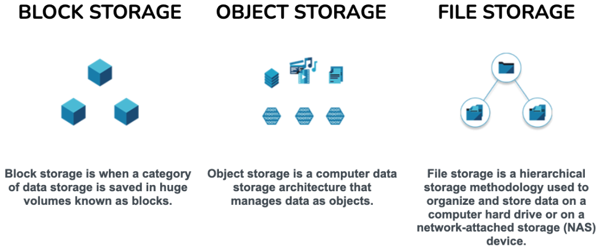
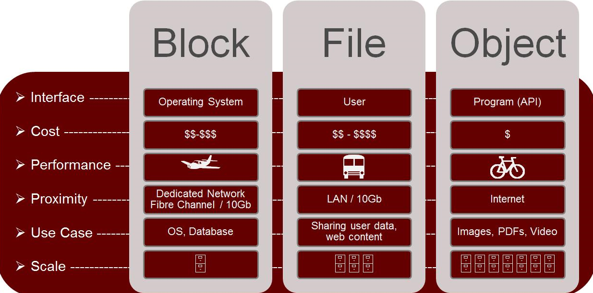
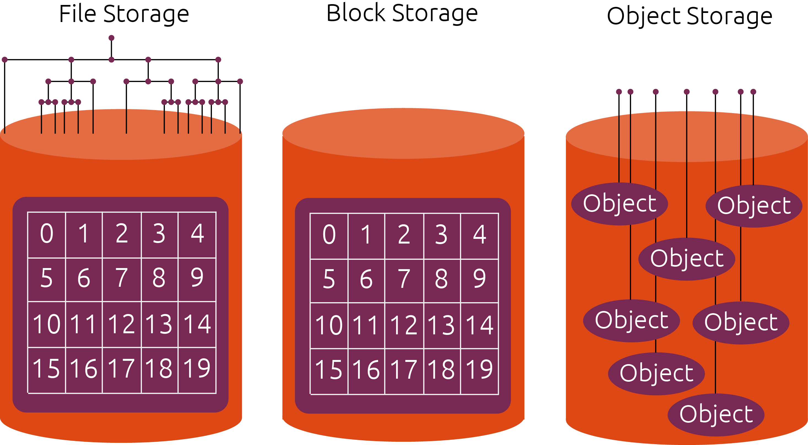

Table of Contents
=================

* [MinIO](#minio)
   * [What is MinIO](#what-is-minio)
   * [How to install MinIO](#how-to-install-minio)
   * [Example scenarios](#example-scenarios)
      * [Single server with 1 disk](#single-server-with-1-disk)
      * [Single server with 4 disks](#single-server-with-4-disks)


# MinIO

## What is MinIO

MinIO is a High Performance Object Storage released under GNU Affero General Public License v3.0. It is API compatible with Amazon S3 cloud storage service. Use MinIO to build high performance infrastructure for machine learning, analytics and application data workloads.

## How to install MinIO

1. Get the latest version
```bash
wget https://dl.minio.io/server/minio/release/linux-amd64/minio
```
2. Set the permission
```bash
chmod u+x minio
```
3. Set the ownership
```bash
chown root:root minio
```
4. Move it to the following directory
```bash
mv minio /usr/local/bin
```
5. Create a user for minio
```bash
useradd minio-user
```
6. Create a directory
```bash
mkdir /tmp/minio
```
7. Set the ownership for the minio directory
```bash
chown -R minio-user:minio-user /tmp/minio
```
8. Configure the minio
```bash
cat > /etc/default/minio << EOF
MINIO_VOLUMES="/tmp/minio/"
MINIO_OPTS="--address 192.168.1.102:9000 --console-address :9001"
EOF
```
**Note:** Check your IP address. You can use the following line, for
cable connections, too:
```bash
ip -br a | grep enp | awk '{print $3}' | cut -d/ -f1
```
**Note:** Minio use random port number for console, you can bind a fix
port number as we did above.

9. Configure the minio service enter into following directory
```bash
cat > /etc/systemd/system/minio.service << EOF
[Unit]
Description=Minio
Documentation=https://docs.minio.io
Wants=network-online.target
After=network-online.target
AssertFileIsExecutable=/usr/local/bin/minio

[Service]
WorkingDirectory=/usr/local/

User=minio-user
Group=minio-user

PermissionsStartOnly=true

EnvironmentFile=-/etc/default/minio
ExecStartPre=/bin/bash -c "[ -n \"\${MINIO_VOLUMES}\" ] || echo \"Variable MINIO_VOLUMES not set in /etc/default/minio\""

ExecStart=/usr/local/bin/minio server \$MINIO_OPTS \$MINIO_VOLUMES

StandardOutput=journal
StandardError=inherit

#Specifies the maximum file descriptor number that can be opened by this process
LimitNOFILE=65536

#Disable timeout logic and wait until process is stopped
TimeoutStopSec=0


#SIGTERM signal is used to stop Minio
KillSignal=SIGTERM

SendSIGKILL=no

SuccessExitStatus=0

[Install]
WantedBy=multi-user.target
EOF
```
11. Reload systemd
```bash
systemctl daemon-reload
```
12. Start and enable the minio service
```bash
systemctl enable minio.service
systemctl start minio.service
```
13. Check the status 
```bash
systemctl status minio.service
```
14. Add minio port to the Firewall
```bash
firewall-cmd --zone=public --add-port={9000/tcp,9001/tcp} --permanent
firewall-cmd --reload
```
15. Open it in any browser
16. Default login credential 
	* Username: minioadmin
	* Password: minioadmin

## Example scenarios

### Single server with 1 disk

The default configuration will start a single server with a single disk. 

### Single server with 4 disks
Edit the configuration file like
```bash
MINIO_VOLUMES="/PATH/TO/minio/data{0...3}"
```
or
```bash
MNIO_VOLUMES="/PATH/TO/minio/foobar /PATH/TO/minio/barfoo /PATH/TO/minio/faabor /PATH/TO/minio/borfaa"
```

## Jail user to bucket with limited access in MinIO portal

1. Create a bucket or use existed bucket
2. Add new policy under ```Administrator > Identity > Policies``` like bellow 
```json
{
    "Version": "2012-10-17",
    "Statement": [
        {
            "Effect": "Allow",
            "Action": [
                "s3:GetObject",
                "s3:ListBucket",
                "s3:PutObject"
            ],
            "Resource": [
                "arn:aws:s3:::<bucket-name>",
                "arn:aws:s3:::<bucket-name>/*"
            ]
        }
    ]
}
```
> **Note:** To see list of all actions see [here](https://min.io/docs/minio/linux/administration/identity-access-management/policy-based-access-control.html)

3. Add new user under ```Administrator > Identity > Users```  and the policy you just added in the previouse step

## MinIO [crashcours](https://www.youtube.com/playlist?list=PLYrn63eEqAzaS7mHcJh7GPOFWcLHLxlfE)

### Different types of storage



## MinIO crachcoures

### Types of storage

1. File Storage: File storage is a storage method that organizes data into a hierarchical structure of files and folders. It is commonly used in traditional file systems and allows for easy organization and retrieval of files. Examples of file storage include local hard drives, network-attached storage (NAS), and file servers.

2. Block Storage: Block storage divides data into fixed-sized blocks and stores them individually. It is commonly used in storage area networks (SAN) and allows for efficient and direct access to specific blocks of data. Examples of block storage include hard disk drives (HDDs), solid-state drives (SSDs), and storage arrays.

3. Object Storage: Object storage organizes data as objects, each with a unique identifier, metadata, and the actual data itself. It is commonly used in cloud storage systems and allows for scalable and flexible storage of unstructured data. Examples of object storage include Amazon S3, Google Cloud Storage, and Azure Blob Storage.

### Compare different types of storage

File Storage:
- Use Cases: File storage is ideal for situations where hierarchical organization and file-level access are important. It is commonly used for file sharing and collaboration, document management systems, and media storage (e.g., photos, videos).
- Example: Storing and sharing files within a local network using a file server.

Block Storage:
- Use Cases: Block storage is suitable for scenarios that require low-level direct access and a high degree of control over data. It is commonly used for databases, virtual machines, and enterprise applications that demand high performance and low latency.
- Example: Configuring a storage area network (SAN) to provide block-level storage for a database server.

Object Storage:
- Use Cases: Object storage is well-suited for scenarios that involve large-scale storage of unstructured or semi-structured data, such as backups, archives, content distribution, and web applications.
- Example: Storing and retrieving multimedia content (images, videos, documents) on a cloud storage platform like Amazon S3 for a web application.

In summary, file storage is best for file-based access and organization, block storage offers direct access and control at the block level, while object storage is designed for scalable, flexible, and cost-effective storage of unstructured data. The choice of storage type depends on the specific requirements and use case of the application or system.





### Why MinIO

1. Compatibility: MinIO is designed to be compatible with the widely adopted Amazon S3 API. This allows you to use existing S3-compatible applications and tools with MinIO without making any significant changes to your code.

2. Scalability: MinIO is built to scale horizontally, meaning you can add more servers to your MinIO cluster as your storage needs grow. This enables you to handle large amounts of data and handle increased traffic and workload.

3. Flexibility: MinIO can be deployed in various environments, including on-premises, in the cloud, or in a hybrid setup. This flexibility allows you to choose the deployment model that best suits your requirements and infrastructure.

4. High Performance: MinIO is designed to provide high performance and low latency for object storage. It leverages modern hardware and technologies to optimize data access and retrieval, making it suitable for use cases that require fast and efficient storage operations.

5. Data Protection: MinIO offers features for data protection and security, such as server-side encryption, access control policies, and versioning. These features help ensure the integrity and confidentiality of your stored data.


### Minio Architectures

1. MinIO Server:
   - A MinIO server is an independent instance that can run on a separate machine or container.
   - Each server acts as a node within the MinIO cluster and is responsible for storing and retrieving objects.
   - It exposes a RESTful API that follows the Amazon S3 API specification, allowing clients to interact with the storage system using familiar S3-compatible tools and libraries.

2. Distributed Mode:
   - In distributed mode, multiple MinIO servers come together to form a single logical storage pool.
   - Objects are divided into smaller parts called "strips" and distributed across the servers in the cluster for load balancing and improved performance.
   - Distributed mode ensures that the storage capacity and workload are evenly distributed across the nodes, allowing for horizontal scaling as more servers are added to the cluster.

3. Erasure Coding:
   - MinIO uses erasure coding techniques to provide data redundancy and protection against failures.
   - Erasure coding splits data into smaller fragments and generates additional parity fragments.
   - The fragments and parity information are distributed across multiple MinIO servers in the cluster.
   - This allows MinIO to reconstruct the original data even if some servers are unavailable or experience failures.
   - Erasure coding reduces the storage overhead compared to simple replication while providing similar levels of data protection.

4. High Availability:
   - MinIO supports various deployment modes to ensure high availability and fault tolerance.
   - In a single-site deployment, multiple MinIO servers are distributed across different physical or virtual machines within a data center.
   - Each server stores a portion of the data, and objects are replicated across multiple servers for redundancy.
   - This setup ensures that if one server fails, the data can still be accessed from other servers in the cluster.
   - In a multi-site deployment, MinIO servers are deployed across multiple data centers or geographic regions, providing geographic redundancy and protection against site-level failures.

5. Gateway Mode:
   - MinIO can also be deployed in Gateway mode, where it acts as a gateway or proxy between clients and other object storage services like Amazon S3 or Azure Blob Storage.
   - In this mode, MinIO translates client requests in the S3 API format to the underlying storage service's API format.
   - Gateway mode allows you to leverage MinIO's compatibility and features while using an existing cloud storage provider, providing a unified interface for accessing different storage backends.

### Best Practices according to offical documentaions

Here are some best practices for using MinIO, based on the official MinIO documentation:

1. Distributed Deployment:
   - Deploy MinIO servers across multiple physical or virtual machines to distribute the storage and workload.
   - Use a load balancer or DNS round-robin to distribute client requests across the MinIO servers.
   - Ensure that the servers have sufficient network bandwidth and low latency for optimal performance.

2. Data Protection and Backup:
   - Enable erasure coding for data protection and efficient storage utilization.
   - Configure the erasure coding scheme based on your desired level of data redundancy and storage efficiency.
   - Regularly backup your MinIO data to an external storage system or a separate MinIO cluster to protect against data loss.

3. Security:
   - Enable data encryption at rest to protect sensitive data stored in MinIO.
   - Use SSL/TLS encryption for data in transit to secure communication between clients and MinIO servers.
   - Implement access control policies to restrict and manage user access to buckets and objects.

4. Monitoring and Metrics:
   - Enable MinIO's built-in metrics and monitoring features to track the performance and health of your MinIO deployment.
   - Utilize monitoring tools like Prometheus and Grafana to visualize and analyze the collected metrics.
   - Set up alerts and notifications to proactively identify and address any issues or anomalies.

5. Scalability and Performance:
   - Monitor the performance of your MinIO cluster and adjust the configuration as needed.
   - Consider adding more MinIO servers to the cluster to meet increased storage and performance requirements.
   - Optimize your MinIO deployment by adjusting parameters like thread pool size, network settings, and buffer sizes.

6. Client Applications:
   - Utilize S3-compatible libraries and tools to interact with MinIO effectively.
   - Leverage multipart upload for large objects to improve upload/download performance and resumability.
   - Take advantage of MinIO's client-side acceleration features like parallelism and multi-threading to optimize data transfer speed.

### Attached Or Network storage?

When it comes to attaching storage or using network storage with MinIO, there are a few considerations to keep in mind:

1. Directly Attached Storage:
   - Directly attaching storage means connecting physical drives directly to the MinIO servers.
   - This approach can provide higher performance and lower latency compared to network storage.
   - It is suitable for scenarios where you have local storage available and want to maximize performance.

2. Network Storage:
   - Network storage refers to using storage devices that are accessed over a network, such as Network Attached Storage (NAS) or Storage Area Network (SAN).
   - Network storage offers scalability, centralized management, and can be easily shared across multiple servers.
   - It is suitable for scenarios where you need shared storage or when you want to separate storage from compute resources.

When deciding between directly attached storage and network storage for MinIO, consider the following factors:

1. Performance: Directly attached storage typically offers better performance due to lower latency and higher bandwidth compared to network storage. If performance is a critical factor for your use case, directly attached storage may be the better choice.

2. Scalability: Network storage provides flexibility and scalability as you can easily add more storage capacity by expanding the storage devices on the network. This can be beneficial if you anticipate significant data growth or require shared storage across multiple MinIO servers.

3. Redundancy and Data Protection: Both directly attached and network storage can offer redundancy and data protection features. Consider the availability and reliability requirements of your data when choosing the storage option. Replication and erasure coding can be used with both types of storage to ensure data durability.

4. Cost: Directly attached storage may require additional hardware costs, such as purchasing physical drives for each MinIO server. Network storage, on the other hand, can be shared among multiple servers, potentially reducing the hardware investment required.
