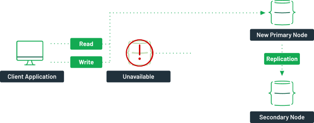
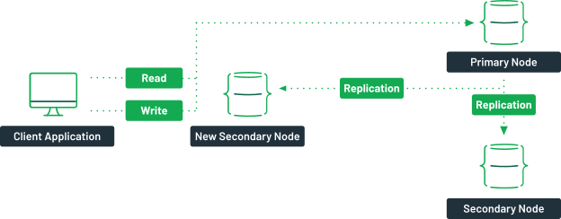

# Install MongoDB Standalone

## Add repo for version 5
```bash
sudo tee /etc/yum.repos.d/mongodb-org-5.0.repo<<EOF
[mongodb-org-5.0]
name=MongoDB Repository
baseurl=https://repo.mongodb.org/yum/redhat/\$releasever/mongodb-org/5.0/x86_64/
gpgcheck=1
enabled=1
gpgkey=https://www.mongodb.org/static/pgp/server-5.0.asc
EOF
```
**Note:** Please consider mongodb version 5 and higher relies on
```
avx
``` 
CPU feature so make sure your CPU has that feature before
installing version 5 or higher, to check:
```bash
grep avx /proc/CPUinfo
```

## Add repo for version 4.4
```bash
sudo tee /etc/yum.repos.d/mongodb-org-4.4.repo<<EOF
[mongodb-org-4.4]
name=MongoDB Repository
baseurl=https://repo.mongodb.org/yum/redhat/7Server/mongodb-org/4.4/x86_64/
gpgcheck=1
enabled=1
gpgkey=https://www.mongodb.org/static/pgp/server-4.4.asc
EOF
```

## Install MongoDB
```bash
yum install mongodb-org
```

## Enable and start service

```bsah
systemctl enable --now monogd
```

# What is a MongoDB Cluster?
In MongoDB, clusters can refer to two different architectures. They can either mean a replica set or a sharded cluster. 

## Replica Sets
A MongoDB replica set is a group of one or more servers containing the
exact copy of the data. While it's technically possible to have one or
two nodes, the recommended minimum is three. A primary node is
responsible for providing your application's read and write operations,
while two secondary nodes contain a replica of the data. 


If the primary node becomes unavailable a new primary node would be picked by an
election process. The new primary node is now responsible for the read
and write operations. 



Once the faulty server comes back online, it will sync up with the
primary node and become a new secondary node in the cluster.



The goal is to provide your application with high availability over your
data. Even in a server failure, your client application can still
connect to the cluster and access the data, reducing the overall
potential downtime.

## Sharded Clusters
A sharded cluster is a way to scale horizontally by distributing your
data across multiple replica sets. When a read or write operation is
performed on a collection, the client sends the request to a router
(mongos). The router will then validate which shard the data is stored
in via the configuration server and send the requests to the specific
cluster.


Each of the shards would contain its own replica set. You should also
have more than one router or configuration server to ensure high
availability. With this type of architecture, you can scale your
database as much as you want without compromising availability or
worrying about storage capacity.

# Deploy a Replica Set

Replica sets should always have an odd number of members. This ensures
that elections will proceed smoothly.

**Tip**
> When possible, use a logical DNS hostname instead of an IP address,
particularly when configuring replica set members or sharded cluster
members. The use of logical DNS hostnames avoids configuration changes
due to IP address changes.

## Network Considerations
* Establish a virtual private network. Ensure that your network topology
	routes all traffic between members within a single site over the local
	area network.
* Configure access control to prevent connections from unknown clients
	to the replica set. 
* Configure networking and firewall rules so that incoming and outgoing
	packets are permitted only on the default MongoDB port and only from
	within your deployment. See the IP Binding considerations.
* Ensure that each member of a replica set is accessible by way of
	resolvable DNS or hostnames. You should either configure your DNS
	names appropriately or set up your systems' 
	```
	/etc/hosts
	``` 
	file to reflect this configuration.

## Configuration

Create the directory where MongoDB stores data files before deploying MongoDB.
Specify the mongod configuration in a configuration file stored in
```
/etc/mongod.conf
```
 or a related location.

## Procedure
The following procedure outlines the steps to deploy a replica set when access control is disabled.
1. Start each member of the replica set with the appropriate options.

For each member, start a mongod instance with the following settings:

    * Set replication.replSetName option to the replica set name. If
			your application connects to more than one replica set, each set
			must have a distinct name.
    * Set net.bindIp option to the hostname/IP or a comma-delimited list
			of hostnames/IPs.
    * Set any other settings as appropriate for your deployment.


Related:
```
* https://www.itzgeek.com/how-tos/linux/centos-how-tos/how-to-install-latest-mongodb-2-6-4-on-centos-7-rhel-7.html
* https://www.mongodb.com/basics/clusters/mongodb-cluster-setup
* https://www.mongodb.com/docs/v4.4/tutorial/convert-standalone-to-replica-set/
* https://www.mongodb.com/docs/manual/tutorial/convert-standalone-to-replica-set/
* https://www.mongodb.com/docs/manual/tutorial/deploy-shard-cluster/
* https://www.mongodb.com/docs/v4.4/tutorial/deploy-shard-cluster/
* https://www.mongodb.com/docs/v4.4/tutorial/convert-shard-standalone-to-shard-replica-set/
* https://www.mongodb.com/docs/v4.4/tutorial/deploy-replica-set/
```
