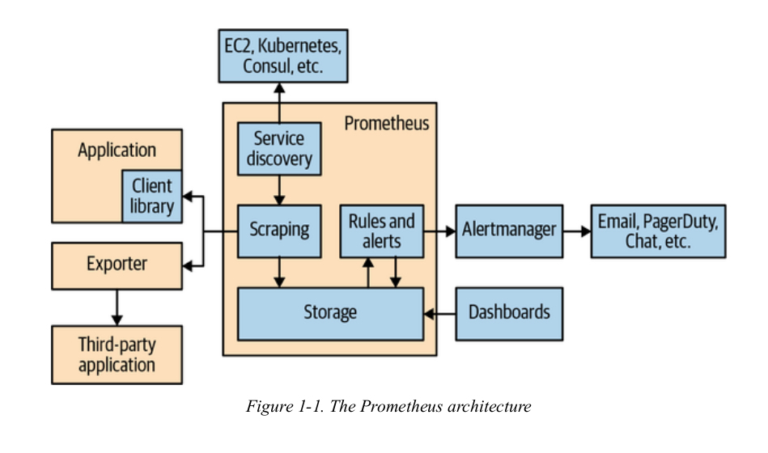
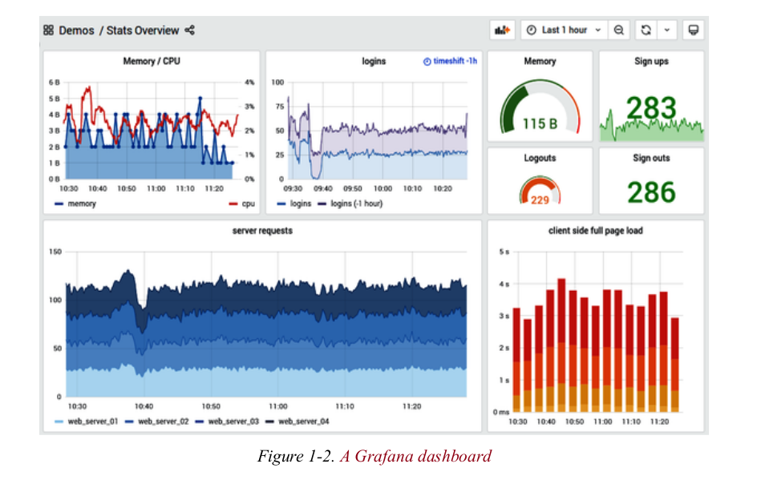

# Prometheus Up & Running

## Chapter 1


### What is monitoring

**Alerting**: The primary goal of monitoring is to identify issues
promptly so that a human operator can intervene. This involves setting
up a monitoring system to notify humans when something goes wrong,
enabling them to address the problem immediately.

**Debugging**: After an alert has been triggered, the next step is for
the notified individual(s) to investigate the issue. This investigation
aims to uncover the root cause of the problem and find a resolution.
Debugging is crucial for maintaining system health and preventing future
occurrences of the same issue.

**Trending**: Beyond immediate alerts and debugging, monitoring systems
also provide insights into long-term trends. These trends, which unfold
over days, weeks, or even months, offer valuable information about
system usage and performance changes. Understanding these trends can
inform strategic decisions, such as capacity planning, and help in
optimizing system design and efficiency.

**Plumbing**: Lastly, it's worth noting that monitoring systems
essentially function as data processing pipelines. In some cases, it
might be practical to repurpose parts of the monitoring system for other
tasks instead of developing a new, specialized solution. Although this
use case extends beyond traditional monitoring, it's a common practice
and thus included here for completeness.

### Categories of Monitoring

Monitoring primarily focuses on capturing and analyzing **events**,
which encompass a wide range of activities within a system. Examples
include HTTP requests/responses, function calls, user actions (like
login), disk writes/reads, network data transfers, and memory allocation
requests. Each event carries **contextual information** relevant to its
occurrence, such as IP addresses, URLs, cookies, user details, response
times, status codes, call stacks, and more.

However, collecting comprehensive data on every event, including all
contextual details, is impractical due to the sheer volume of data
generated. This necessitates strategies to manage and reduce the data
volume to a manageable level while retaining its usefulness for
debugging and performance analysis. Four main approaches are commonly
employed:

1. **Profiling**: Focuses on measuring the performance characteristics
   of applications, identifying bottlenecks and areas for optimization.
2. **Tracing**: Provides a detailed record of the sequence of events
   leading to a particular state or outcome, useful for understanding
   complex interactions within a system.
3. **Logging**: Involves recording significant events and errors
   occurring within a system, offering insights into its operational
   history and aiding in troubleshooting.
4. **Metrics**: Involves collecting numerical data representing various
   aspects of system performance over time, allowing for trend analysis
   and capacity planning.


#### Profiling

**Profiling** is a monitoring approach that acknowledges the
impossibility of continuously capturing full context for every event due
to practical limitations, such as storage constraints. Instead, it
focuses on gathering detailed information for selected periods or
specific aspects of system operation.

- **Tools and Techniques**: Various tools exemplify profiling, including
  `tcpdump` for network traffic analysis and debug builds of binaries
  that track extensive profiling data, such as function call timings.
  However, these methods often come with significant drawbacks, like
  potential disk space exhaustion with `tcpdump` and performance
  degradation with debug builds, making them unsuitable for constant use
  in production environments.

- **Advanced Profiling with eBPF**: Enhanced Berkeley Packet Filters
  (eBPF) in the Linux kernel offer advanced profiling capabilities,
  providing deep insights into kernel events ranging from filesystem
  operations to network anomalies. eBPF stands out for its portability,
  safety, and the unprecedented level of detail it offers, as
  highlighted by experts like Brendan Gregg.

- **Continuous Profiling**: For longer-term monitoring needs, continuous
  profiling emerges as a solution. It addresses the challenge of
  managing large volumes of data by reducing the frequency of profiling,
  thereby maintaining lower overheads. An example is the eBPF-based
  Parca Agent, which operates at a reduced frequency (e.g., 19Hz) to
  collect statistically significant data over minutes rather than
  seconds. This approach aims to balance the need for insightful data on
  CPU time usage and application efficiency with the practicalities of
  data volume and system performance impact.

In essence, profiling serves tactical debugging purposes, offering deep
dives into system behavior during critical periods or for specific
investigations. Continuous profiling extends this capability over longer
durations by optimizing data collection strategies to ensure
sustainability and minimal impact on system performance.


#### Tracing

**Tracing** is a monitoring technique that selectively captures a subset
of events, focusing on those that pass through predefined points of
interest within a system. This method provides insights into the
execution flow and performance characteristics of applications,
particularly regarding latency and resource utilization.

- **Selective Sampling**: Unlike comprehensive event logging, tracing
  samples a fraction of events (e.g., one in a hundred) to maintain
  manageable data volumes and minimize performance impacts. By tracking
  the execution path and timing of sampled events, tracing helps
  identify where programs spend most of their time and which code paths
  contribute significantly to latency.

- **Detailed Function Call Analysis**: Some tracing systems go beyond
  mere snapshots at points of interest, recording detailed timings for
  every function call within the sampled events. This granular approach
  enables analysis of how time is spent interacting with various system
  components, such as databases and caches, offering insights into
  performance variations based on factors like cache hits and misses.

- **Distributed Tracing**: Extends traditional tracing across
  distributed systems by assigning unique IDs to requests traversing
  multiple processes or services. This technique facilitates the
  reconstruction of end-to-end transaction flows across microservices
  architectures, aiding in debugging and optimization. Technologies like
  OpenZipkin and Jaeger exemplify tools designed for distributed
  tracing.

- **Sampling Strategy**: The effectiveness of tracing relies heavily on
  its sampling strategy, which balances the need for detailed insights
  against the constraints of data volume and instrumentation overhead.
  By carefully selecting which events to trace, organizations can gain
  valuable operational insights without overwhelming their monitoring
  infrastructure.

In essence, tracing offers a powerful means to understand complex
application behavior and performance bottlenecks, especially in
distributed environments, through strategic sampling and detailed
analysis of selected events.


#### Logging

Logging involves recording specific events along with some context for
each event, such as incoming HTTP requests or outgoing database calls.
It's crucial to manage the volume of logged data to prevent excessive
resource consumption; typically, around a hundred fields per log entry
is recommended. For instance, a server processing 1,000 requests per
second with log entries containing 100 fields of 10 bytes each would
generate 1 megabyte of data per second. This significant data volume
highlights the importance of efficient logging practices to avoid
overwhelming network bandwidth and storage capacity.

One advantage of logging is its comprehensive nature, allowing for
detailed analysis of individual user interactions with specific API
endpoints without sampling. However, the concept of logging varies
widely among professionals, leading to potential confusion. Logging can
be categorized into four main types: transaction logs, request logs,
application logs, and debug logs. Each type serves different purposes
and has distinct durability and retention needs.

- **Transaction Logs**: Critical for business operations, these logs
  must be securely maintained indefinitely. They typically involve
  financial transactions or essential user-facing functionalities.
- **Request Logs**: Record every HTTP request or database call. While
  important for user features and internal optimization, losing some
  data is not catastrophic.
- **Application Logs**: Focus on the application's processes, including
  startup messages and maintenance tasks. These are usually monitored by
  humans and should be kept minimal during normal operations.
- **Debug Logs**: Highly detailed logs used primarily for debugging. Due
  to their high volume and cost, they are often confined to specific
  debugging scenarios and may not be retained long-term.

It's essential to differentiate between these log types to avoid
combining the high data volumes of debug logs with the stringent
reliability requirements of transaction logs. As systems scale,
separating debug logs for independent management becomes increasingly
necessary. Examples of logging systems include the ELK stack,
OpenSearch, Grafana Loki, and Graylog.


#### Metrics

Metrics focus on tracking aggregations of events over time, ignoring
context to maintain manageable resource usage. A common guideline is to
limit metrics to 10,000 per process. Examples of metrics include the
number of HTTP requests received, time spent handling requests, and
current request count. While some context like URL paths can be
included, using unbounded attributes like user email addresses is
discouraged due to their infinite cardinality.

Metrics excel at identifying system-wide issues, such as latency and
data volume across subsystems, making it easier to pinpoint slowdown
causes. In contrast to logs, metrics can collect data from multiple
sources with limited context, while logs provide detailed information
about specific events but are constrained to fewer fields.

The relationship between logs and metrics reveals a trade-off: metrics
offer broad system insights with limited context, while logs provide
detailed event information with extensive context. Understanding
cardinality - the number of unique values a field can take - is crucial
for effective metrics design.

Prometheus stands out as a metrics-based monitoring system focused on
overall system health, behavior, and performance. It tracks aggregated
data like total requests, average handling times, database calls, cache
hits, and purchase counts within a given timeframe. Individual call
details fall under profiling or logging responsibilities.

Understanding Prometheus' role in the broader monitoring landscape
allows for a comprehensive approach to system observation, complementing
both metrics and logs in maintaining optimal system performance and
troubleshooting efficiency.


### Prometheus Architecture



Prometheus' architecture revolves around discovering and scraping
targets. It begins with service discovery, which identifies instrumented
applications or third-party services accessible through exporters. The
collected data is then stored for future use. Users can leverage this
data in several ways:

1. Dashboards: Utilizing PromQL (Prometheus Query Language), users can
   create visual representations of their system's performance and
   status.

2. Alerts: The Alertmanager component processes alerts based on the
   collected data. It can transform these alerts into various formats,
   including web pages, emails, and other notification methods.

This architecture enables comprehensive monitoring and alerting
capabilities, providing developers and operators with real-time insights
into system performance and potential issues.

#### Client libraries

Client libraries play a crucial role in implementing metrics in
applications. They enable developers to easily add instrumentation to
their codebase, typically requiring only a few lines of code. This
method is known as direct instrumentation.

Prometheus offers official client libraries for several popular
programming languages and runtimes, including Go, Python, Java, Ruby,
and Rust. Additionally, there are numerous third-party libraries
available for other languages like C#, Node.js, Haskell, and Erlang.

These libraries facilitate the creation and collection of metrics within
an application's code, allowing developers to monitor various aspects of
their system's performance and behavior. By leveraging client libraries,
developers can quickly integrate metrics collection into their existing
codebase, enhancing their ability to track and analyze system activity.


> ### OFFICIAL VERSUS UNOFFICIAL
>
> While official client libraries provided by the Prometheus project
> cover many languages, the reality is that many integrations are
> developed by the community as third-party solutions. This is due to
> the vast number of applications and systems that need integration,
> exceeding the resources available to the Prometheus team.
>
> To ensure consistency and quality across these unofficial integrations,
> guidelines are provided for developing them. These guidelines help
> maintain compatibility and functionality similar to official
> integrations, despite being created independently.
>
> Developers should not be deterred by the unofficial nature of these
> integrations. Instead, they should leverage them as valuable additions
> to the Prometheus ecosystem, understanding that they often offer
> specialized capabilities tailored to specific languages or frameworks.
> 
> The availability of third-party integrations demonstrates the active
> community support for Prometheus, contributing to its versatility and
> widespread adoption across different technologies and platforms.

Client libraries handle the intricacies of metric collection, ensuring
thread safety and proper formatting. Unlike event-based monitoring, the
memory usage of client libraries doesn't grow with the number of events,
but rather with the number of defined metrics.

Many client libraries automatically detect and instrument dependencies,
allowing you to gain insights into commonly used libraries like RPC
clients across all your applications. Some libraries provide built-in
metrics for CPU usage and garbage collection statistics.

While primarily supporting Prometheus and OpenMetrics formats, client
libraries offer flexibility. Their APIs can be used to generate metrics
in custom formats or feed data into other monitoring systems. This
openness allows for gradual migration from existing systems to
Prometheus instrumentation.

> ### OpenMetrics 
> OpenMetrics is an open-source monitoring framework that provides a
> common interface for exposing metrics in a variety of languages and
> environments. It provides a standardized way to expose metrics across
> different systems and languages, improving interoperability and
> consistency in monitoring setups.
>
> Key Features
> * Standardized metric exposition format
> * Language-agnostic metric definitions
> * Support for multiple monitoring backends
> * Extensible and customizable

Moreover, client libraries can work with metrics from other systems,
enabling a phased transition to Prometheus. This feature proves valuable
for organizations transitioning from legacy monitoring solutions to
Prometheus-based systems.

#### Exporters

Exporters serve as a solution when direct instrumentation isn't feasible
or possible. They bridge the gap between applications that don't
natively support Prometheus metrics and the monitoring system.

Key characteristics of exporters:

1. **Deployment:** Exporters are deployed alongside the target application.
2. **Data gathering:** They collect metrics from the application.
3. **Format conversion:** They transform data into Prometheus exposition format.
4. **Response:** They return formatted data to Prometheus.

Exporters use custom collectors or ConstMetrics, differing from direct
instrumentation methods.


> ### ConstMetrics 
> ConstMetrics represents metrics that have a constant value across all
> time series instances. This means that regardless of the labels
> attached to the metric, the value remains the same for every instance.
>
> Key Points
> 1. **Constant Value:** The most important characteristic of ConstMetrics
>    is that they have a fixed value for all instances.
> 1. **Label Independence:** Unlike regular metrics, ConstMetrics do not
>    change based on label values. All instances of the metric will have
>    the same value.
> 1. **Efficiency:** ConstMetrics are particularly useful for optimizing
>    queries and storage because they don't need to store separate
>    values for each instance.
> 1. **Query Optimization:** When querying Prometheus, using ConstMetrics
>    can significantly speed up queries since Prometheus doesn't need to
>    fetch actual values for these metrics.

The Prometheus community has created exporters for many applications,
making adoption relatively straightforward. If needed metrics are
missing, users can contribute improvements through pull requests.

Exporters allow monitoring of system components that wouldn't otherwise
support Prometheus natively, such as operating system kernels or
third-party services. They enable comprehensive monitoring across the
entire tech stack, not just instrumented application code.


#### Service discovery

Service discovery plays a crucial role in Prometheus by dynamically
managing the list of applications and exporters to monitor. This is
particularly important in dynamic environments where static lists would
quickly become outdated.

Prometheus integrates with various service discovery mechanisms:

1. Kubernetes
2. EC2
3. Consul
4. Generic options for less common setups

However, simply knowing the machines and services isn't enough.
Prometheus needs to understand how these entities relate to your overall
architecture. This is achieved through relabeling, which maps metadata
from service discovery to monitoring targets and their labels.

Relabeling allows for flexible configuration, accommodating different
organizational approaches to tagging and naming conventions. For
example:

- Tag "Name" might indicate an application
- Tag "app" might represent a different application

By utilizing relabeling, Prometheus can adapt to various service
discovery implementations, ensuring accurate monitoring regardless of
the specific tagging strategy employed in your infrastructure.


#### Scraping

After service discovery and relabeling provide the list of targets,
Prometheus initiates the scraping process to fetch actual metrics. This
occurs through HTTP requests sent to the configured targets, with
responses parsed and stored in Prometheus' database. Useful additional
metrics are added, such as success indicators and scrape durations.
Scrapes typically happen every 10 to 60 seconds for each target,
ensuring continuous visibility into the performance and health of
monitored systems. The frequency can be adjusted based on needs, and
Prometheus handles large numbers of targets efficiently, making it
suitable for complex distributed systems. This periodic scraping enables
ongoing monitoring, providing real-time insights into the state of the
monitored entities.

> ### PULL VERSUS PUSH
> Prometheus operates as a pull-based system, determining when and what
> to scrape based on its configuration. This contrasts with push-based
> systems, where the monitored target controls the monitoring frequency.
> 
> The choice between pull and push models is debated, with proponents of
> each approach presenting valid arguments. However, for Prometheus
> users, it's crucial to understand that the pull model is fundamental
> to its architecture.
> 
> Attempting to force Prometheus into a push-based operation would be
> counterproductive. Instead, users should embrace the pull model,
> recognizing its strengths in terms of centralized control and
> efficient resource utilization.
> 
> Understanding this core aspect of Prometheus is essential for
> effective monitoring strategies. It allows users to leverage
> Prometheus' capabilities fully, optimizing their monitoring setup
> according to the tool's inherent design principles.


#### Storage

Prometheus employs a local, custom database for storing data, eschewing
distributed systems to prioritize reliability and ease of operation.
This approach allows for efficient ingestion of massive amounts of data,
with the latest version capable of handling millions of samples per
second.

The storage system has undergone significant redesigns, with the current
version in Prometheus 2.0 representing the third major iteration. This
design enables monitoring of thousands of machines using a single
Prometheus server.

Prometheus utilizes advanced compression algorithms, achieving
impressive results of 1.3 bytes per sample on real-world data. While an
SSD is highly recommended for optimal performance, it's not strictly
necessary.

This storage architecture combines robustness with scalability, making
Prometheus suitable for monitoring complex, large-scale systems. Its
ability to handle high ingest rates and compress data effectively
contributes to its reputation as a powerful monitoring solution.

#### Dashboards

Prometheus offers HTTP APIs for requesting raw data and evaluating
PromQL queries. These APIs are primarily used for creating graphs and
dashboards. The built-in expression browser is useful for ad-hoc
querying and exploration, but it's not intended as a full-fledged
dashboard system.

Instead, it's strongly recommended to use Grafana for creating comprehensive dashboards. Grafana boasts several advantages:

1. Official Prometheus support: It has native integration with
   Prometheus as a data source.
2. Versatility: It can produce a wide range of dashboard types,
   including the one shown in Figure 1-2.
3. Multi-server support: Grafana can interact with multiple Prometheus
   servers, even within a single dashboard panel.
4. Extensive features: It offers a variety of tools and customization
   options for creating informative and visually appealing dashboards.

Grafana complements Prometheus perfectly, allowing users to leverage the
power of PromQL queries and visualize the resulting data in a
user-friendly manner. This combination enables efficient monitoring and
analysis of complex systems.



#### Relabeling rules

Recording rules and alerts are powerful features in Prometheus that
enhance its capabilities beyond real-time query evaluation. 

Recording rules allow PromQL expressions to be evaluated periodically,
with the results being stored in the database. This pre-computed data
significantly reduces the load on the system when rendering graphs or
performing complex analyses.

Alerting rules operate similarly, evaluating PromQL expressions at
scheduled intervals. When conditions are met, these evaluations trigger
alerts, which are then managed by the Alertmanager.

Both types of rules enable proactive monitoring and automated
decision-making. They allow for the creation of pre-calculated views of
your system's state and the generation of alerts based on predefined
criteria, reducing manual intervention and improving responsiveness to
system changes.

#### Alert Management

The Alertmanager plays a crucial role in managing alerts generated by
Prometheus. It acts as a central hub for receiving alerts from multiple
Prometheus instances and transforming them into various forms of
notifications.

Key features of the Alertmanager include:

1. Aggregation: It can combine related alerts into a single
   notification, reducing noise and improving clarity.
2. Throttling: It helps prevent "pager storms" by limiting the frequency
   of notifications.
3. Routing: Different routing and notification outputs can be configured
   for various teams or departments.
4. Silencing: Alerts can be temporarily disabled to avoid unnecessary
   notifications during planned maintenance or known issues.
5. Notification diversity: It supports a wide range of notification
   channels, including email, Slack, PagerDuty, and more.
6. Customization: The Alertmanager allows for granular control over how
   alerts are presented and managed.
7. Integration: It seamlessly integrates with other incident management
   tools like PagerDuty and ticketing systems.

The Alertmanager's primary function is to prepare alerts for
distribution. For actual incident management and human response
coordination, complementary tools like PagerDuty and ticketing systems
are recommended.


> **TIPS:** Alerts and their thresholds are configured in Prometheus, not in the Alertmanager.

#### Long-Term Storage

Prometheus' local storage approach presents limitations for long-term
data retention. Since it stores data only on the local machine, the
amount of data that can be held is constrained by available disk space.

For short-term monitoring, focusing on the most recent day or so is
sufficient. However, for long-term capacity planning, extended retention
periods are preferable.

Prometheus lacks a built-in clustered storage solution for distributing
data across multiple machines. Instead, it offers remote read and write
APIs that enable other systems to assume this role.

These APIs allow seamless integration with external storage solutions,
enabling PromQL queries to be executed against both local and remote
data. This approach facilitates the use of distributed storage systems
while maintaining the familiar PromQL interface.

Organizations can leverage this capability to create hybrid storage
setups, combining local Prometheus storage with external solutions for
long-term data retention. This strategy enhances Prometheus'
capabilities for large-scale deployments and long-term monitoring needs.


#### What Prometheus Is Not

Prometheus excels in certain areas but falls short in others. Its
suitability depends on the specific monitoring needs:

1. Event logs: Not ideal for storing individual events, as it focuses on aggregated metrics.
2. High-cardinality data: Poor choice for data with high uniqueness, like email addresses or usernames.
3. Operational monitoring: Designed for this purpose, tolerating minor inaccuracies for system stability.
4. Financial applications: Should be used cautiously due to potential trade-offs in accuracy.
5. Basic monitoring: Suitable for running and setting up initial monitoring configurations.

Prometheus prioritizes system stability over absolute precision, aiming
for 99.9% correctness. This approach aligns with operational monitoring
needs but requires careful consideration in sensitive domains like
finance or billing.

The upcoming chapter will guide readers through setting up Prometheus
and conducting basic monitoring tasks, providing hands-on experience
with the tool.


## Chapter 2


# Learning Prometheus hands-on

Learning Prometheus through a hands-on scenario like setting up a Docker
Compose environment with services generating logs, which are then
monitored by Prometheus and visualized with Grafana, is an excellent
approach. This will give you practical experience with these tools and
how they work together. Let's break down the steps and create a Docker
Compose file for this scenario.


## Step-by-Step Thought Process

1. **Docker Compose Setup**: We'll start by defining a Docker Compose file that includes three main services: a log generator service, Prometheus, and Grafana.

2. **Log Generator Service**: For simplicity, we can create a custom Docker image that runs a simple application generating logs at regular intervals. These logs will simulate the kind of data Prometheus might monitor in a real-world scenario.

3. **Prometheus Configuration**: We'll configure Prometheus to scrape logs from our log generator service. This involves setting up a `prometheus.yml` configuration file that defines the target for log scraping.

4. **Grafana Setup**: Finally, we'll set up Grafana to connect to our Prometheus instance so we can visualize the log data through dashboards.

5. **Networking**: Ensure all services are on the same network so they can communicate with each other.

6. **Volumes**: Use Docker volumes for Prometheus and Grafana to persist data across container restarts.

## Key Points to Consider

- **Log Format**: Decide on a simple log format that Prometheus can easily parse.
- **Prometheus Configuration**: Properly configure Prometheus to scrape logs from our service.
- **Grafana Dashboards**: Learn how to create dashboards in Grafana to visualize the log data.

### Docker Compose Implementation

Let's start by creating a simple log generator service. We'll use Python for this example due to its simplicity and wide adoption.

1. **Create a Python Script (`log_generator.py`)**:
```python
import time
import logging

logging.basicConfig(filename='app.log', level=logging.INFO, format='%(asctime)s - %(message)s')

while True:
    logging.info('This is a test log message')
    time.sleep(1)
```

2. **Dockerfile for Log Generator**:
```dockerfile
FROM python:3.8-slim

WORKDIR /app

COPY log_generator.py .

CMD ["python", "./log_generator.py"]
```

3. **Docker Compose File (`docker-compose.yml`)**:
```yaml
version: '3.8'

services:
  log-generator:
    build: .
    volumes:
      - ./log_generator.py:/app/log_generator.py
    networks:
      - monitoring-network

  prometheus:
    image: prom/prometheus:latest
    volumes:
      - ./prometheus.yml:/etc/prometheus/prometheus.yml
    command:
      - '--config.file=/etc/prometheus/prometheus.yml'
    ports:
      - "9090:9090"
    networks:
      - monitoring-network

  grafana:
    image: grafana/grafana:latest
    ports:
      - "3000:3000"
    networks:
      - monitoring-network

networks:
  monitoring-network:
```

4. **Prometheus Configuration File (`prometheus.yml`)**:
```yaml
global:
  scrape_interval:     15s # Set the scrape interval to every 15 seconds.

scrape_configs:
  - job_name: 'log-generator'
    static_configs:
      - targets: ['log-generator:80']
```

# Prometheus Configuration File (`prometheus.yml`)

```yaml
global:
  scrape_interval:     15s # How often Prometheus scrapes targets.
  evaluation_interval: 15s # How often Prometheus evaluates rules.

scrape_configs:
  - job_name: 'log-generator' # Name of the job.
    static_configs:
      - targets: ['log-generator:80'] # Target to scrape. Assuming our log generator exposes logs on port 80.
    metrics_path: '/metrics' # Path where Prometheus expects to find metrics.
    scheme: 'http' # Protocol used to scrape the target.
    relabel_configs: # Optional: Modify labels before scraping.
      - source_labels: [__address__]
        target_label: __param_target
      - source_labels: [__param_target]
        target_label: instance
      - target_label: __address__
        replacement: log-generator:80 # Ensures Prometheus knows where to scrape.

rule_files: # Optional: Path to rule files for alerting or recording rules.
  - "rules.yml"

alerting: # Optional: Configuration for alerting.
  alertmanagers:
    - static_configs:
        - targets: ['alertmanager:9093'] # Assuming Alertmanager is also part of your monitoring stack.

```

## Explanation

- **`global`**: This section defines global settings for Prometheus. 
  - `scrape_interval`: Determines how frequently Prometheus scrapes metrics from targets. In this example, it's set to every 15 seconds.
  - `evaluation_interval`: Specifies how often Prometheus evaluates rules (for alerting or recording). Also set to 15 seconds in this case.

- **`scrape_configs`**: Defines how Prometheus discovers and scrapes targets.
  - `job_name`: A name identifying the job. Useful for distinguishing between different scraping configurations.
  - `static_configs`: Specifies static targets to scrape. Here, we target our log generator service. Note that in a real-world scenario, your log generator might expose metrics on a different port or path, so adjust accordingly.
  - `metrics_path`: The path Prometheus will scrape for metrics. This is often `/metrics` but can vary based on the service being monitored.
  - `scheme`: Specifies whether to scrape over HTTP or HTTPS. Since our log generator likely doesn't use SSL/TLS, we use `http`.
  - `relabel_configs`: Allows for dynamic modification of labels before scraping. This example shows how to ensure Prometheus correctly identifies and scrapes our log generator service. Adjustments might be necessary based on your specific setup.

- **`rule_files`**: Optional. Specifies the location of rule files for alerting or recording rules. This is useful for defining alerts based on the metrics collected.

- **`alerting`**: Optional. Configures how Prometheus sends alerts. This example shows a basic setup pointing to an Alertmanager instance, assuming you have one running as part of your monitoring stack.

Here's a table of all available options in `prometheus.yaml`

| Section          | Option                     | Description                                                                                                                                                                                                 |
|------------------|----------------------------|-------------------------------------------------------------------------------------------------------------------------------------------------------------------------------------------------------------|
| `global`         | `scrape_interval`          | How often Prometheus scrapes targets.                                                                                                                                                                       |
|                  | `evaluation_interval`      | How often Prometheus evaluates rules.                                                                                                                                                                        |
|                  | `external_labels`          | Labels to add to any time series or alerts when communicating with external systems.                                                                                                                           |
|                  | `scrape_configs`           | List of configurations that define where and how Prometheus should scrape metrics.                                                                                                                             |
| `scrape_config`  | `job_name`                 | Name identifying the job.                                                                                                                                                                                   |
|                  | `metrics_path`             | Path to scrape for metrics.                                                                                                                                                                                  |
|                  | `scheme`                   | Protocol scheme to use for scraping (e.g., `http` or `https`).                                                                                                                                                |
|                  | `static_configs`           | Static target configurations.                                                                                                                                                                                |
|                  | `relabel_configs`          | Allows dynamic modification of labels before scraping.                                                                                                                                                         |
|                  | `metric_relabel_configs`   | Allows dynamic modification of metric names and labels before ingestion.                                                                                                                                       |
|                  | `params`                   | Defines query parameters to send with the scrape request.                                                                                                                                                       |
|                  | `basic_auth`, `bearer_token`, `bearer_token_file` | Authentication methods for scraping targets.                                                                                                                                                   |
|                  | `tls_config`               | TLS configuration for scraping over HTTPS.                                                                                                                                                                     |
|                  | `proxy_url`                | URL of an HTTP proxy to use for scraping.                                                                                                                                                                      |
|                  | `honor_labels`             | Controls how Prometheus merges labels from scrapes.                                                                                                                                                             |
|                  | `sample_limit`             | Maximum number of samples to retrieve for each scrape.                                                                                                                                                         |
|                  | `timeout`                  | Scrape timeout.                                                                                                                                                                                              |
| `alerting`       | `alertmanagers`            | Configuration for alertmanager instances.                                                                                                                                                                     |
|                  | `static_configs`           | Static configurations of alertmanager addresses.                                                                                                                                                               |
| `rule_files`     |                          | List of rule files for alerting and recording rules.                                                                                                                                                             |
| `query`          | `max_concurrent_selects`   | Maximum number of concurrent select queries.                                                                                                                                                                  |
|                  | `max_concurrent_range_selects` | Maximum number of concurrent range select queries.                                                                                                                                                          |
|                  | `max_samples`              | Maximum number of samples a single query can return.                                                                                                                                                            |
| `storage_tsdb`   | `path`                     | Data directory for time series storage.                                                                                                                                                                       |
|                  | `wal_compression`          | Enables compression of the write-ahead log.                                                                                                                                                                     |
|                  | `block_size`               | Maximum size of a TSDB block.                                                                                                                                                                                 |
| `remote_write`   |                          | List of remote write configurations.                                                                                                                                                                           |
|                  | `url`                      | URL of the remote endpoint.                                                                                                                                                                                  |
|                  | `remote_timeout`           | Timeout for requests to the remote write endpoint.                                                                                                                                                             |
| `remote_read`    |                          | List of remote read configurations.                                                                                                                                                                            |
|                  | `url`                      | URL of the remote endpoint.                                                                                                                                                                                  |
|                  | `read_recent`              | Whether reads should fetch data from the most recent block.                                                                                                                                                      |
| `web`            | `listen_address`           | Address to listen on for the web interface and API.                                                                                                                                                             |
|                  | `external_url`             | The URL under which Prometheus is externally reachable.                                                                                                                                                         |
|                  | `route_prefix`             | Prefix for the internal server routes.                                                                                                                                                                         |
| `lifecycle`      | `addr`                     | Address to listen on for gRPC.                                                                                                                                                                                |
|                  | `per_serve_probe`          | Whether to perform a health check probe for each scrape.                                                                                                                                                        |

This table provides a high-level overview of the configuration options
available in Prometheus. For detailed descriptions and additional
options, refer to the [official Prometheus documentation](https://prometheus.io/docs/introduction/overview/).


# To install Prometheus on Ubuntu, you can follow these steps:
=======
# Prometheus Up & Running

[reference boox](https://m.media-amazon.com/images/I/81pKaQrnLPL._SL1500_.jpg)

## What is monitoring

**Alerting**: The primary goal of monitoring is to identify issues
promptly so that a human operator can intervene. This involves setting
up a monitoring system to notify humans when something goes wrong,
enabling them to address the problem immediately.

**Debugging**: After an alert has been triggered, the next step is for
the notified individual(s) to investigate the issue. This investigation
aims to uncover the root cause of the problem and find a resolution.
Debugging is crucial for maintaining system health and preventing future
occurrences of the same issue.

**Trending**: Beyond immediate alerts and debugging, monitoring systems
also provide insights into long-term trends. These trends, which unfold
over days, weeks, or even months, offer valuable information about
system usage and performance changes. Understanding these trends can
inform strategic decisions, such as capacity planning, and help in
optimizing system design and efficiency.

**Plumbing**: Lastly, it's worth noting that monitoring systems
essentially function as data processing pipelines. In some cases, it
might be practical to repurpose parts of the monitoring system for other
tasks instead of developing a new, specialized solution. Although this
use case extends beyond traditional monitoring, it's a common practice
and thus included here for completeness.

## Categories of Monitoring

Monitoring primarily focuses on capturing and analyzing **events**, which encompass a wide range of activities within a system. Examples include HTTP requests/responses, function calls, user actions (like login), disk writes/reads, network data transfers, and memory allocation requests. Each event carries **contextual information** relevant to its occurrence, such as IP addresses, URLs, cookies, user details, response times, status codes, call stacks, and more.

However, collecting comprehensive data on every event, including all contextual details, is impractical due to the sheer volume of data generated. This necessitates strategies to manage and reduce the data volume to a manageable level while retaining its usefulness for debugging and performance analysis. Four main approaches are commonly employed:

1. **Profiling**: Focuses on measuring the performance characteristics of applications, identifying bottlenecks and areas for optimization.
2. **Tracing**: Provides a detailed record of the sequence of events leading to a particular state or outcome, useful for understanding complex interactions within a system.
3. **Logging**: Involves recording significant events and errors occurring within a system, offering insights into its operational history and aiding in troubleshooting.
4. **Metrics**: Involves collecting numerical data representing various aspects of system performance over time, allowing for trend analysis and capacity planning.


### Profiling

**Profiling** is a monitoring approach that acknowledges the impossibility of continuously capturing full context for every event due to practical limitations, such as storage constraints. Instead, it focuses on gathering detailed information for selected periods or specific aspects of system operation.

- **Tools and Techniques**: Various tools exemplify profiling, including `tcpdump` for network traffic analysis and debug builds of binaries that track extensive profiling data, such as function call timings. However, these methods often come with significant drawbacks, like potential disk space exhaustion with `tcpdump` and performance degradation with debug builds, making them unsuitable for constant use in production environments.

- **Advanced Profiling with eBPF**: Enhanced Berkeley Packet Filters (eBPF) in the Linux kernel offer advanced profiling capabilities, providing deep insights into kernel events ranging from filesystem operations to network anomalies. eBPF stands out for its portability, safety, and the unprecedented level of detail it offers, as highlighted by experts like Brendan Gregg.

- **Continuous Profiling**: For longer-term monitoring needs, continuous profiling emerges as a solution. It addresses the challenge of managing large volumes of data by reducing the frequency of profiling, thereby maintaining lower overheads. An example is the eBPF-based Parca Agent, which operates at a reduced frequency (e.g., 19Hz) to collect statistically significant data over minutes rather than seconds. This approach aims to balance the need for insightful data on CPU time usage and application efficiency with the practicalities of data volume and system performance impact.

In essence, profiling serves tactical debugging purposes, offering deep dives into system behavior during critical periods or for specific investigations. Continuous profiling extends this capability over longer durations by optimizing data collection strategies to ensure sustainability and minimal impact on system performance.


### Tracing

**Tracing** is a monitoring technique that selectively captures a subset of events, focusing on those that pass through predefined points of interest within a system. This method provides insights into the execution flow and performance characteristics of applications, particularly regarding latency and resource utilization.

- **Selective Sampling**: Unlike comprehensive event logging, tracing samples a fraction of events (e.g., one in a hundred) to maintain manageable data volumes and minimize performance impacts. By tracking the execution path and timing of sampled events, tracing helps identify where programs spend most of their time and which code paths contribute significantly to latency.

- **Detailed Function Call Analysis**: Some tracing systems go beyond mere snapshots at points of interest, recording detailed timings for every function call within the sampled events. This granular approach enables analysis of how time is spent interacting with various system components, such as databases and caches, offering insights into performance variations based on factors like cache hits and misses.

- **Distributed Tracing**: Extends traditional tracing across distributed systems by assigning unique IDs to requests traversing multiple processes or services. This technique facilitates the reconstruction of end-to-end transaction flows across microservices architectures, aiding in debugging and optimization. Technologies like OpenZipkin and Jaeger exemplify tools designed for distributed tracing.

- **Sampling Strategy**: The effectiveness of tracing relies heavily on its sampling strategy, which balances the need for detailed insights against the constraints of data volume and instrumentation overhead. By carefully selecting which events to trace, organizations can gain valuable operational insights without overwhelming their monitoring infrastructure.

In essence, tracing offers a powerful means to understand complex application behavior and performance bottlenecks, especially in distributed environments, through strategic sampling and detailed analysis of selected events.


To install Prometheus on Ubuntu, you can follow these steps:
>>>>>>> 53552e7cc2fd2610cf501dee72bc2fbddf0f222d

1. Download the latest version of Prometheus from the official website using the following command:

```bash
 wget https://github.com/prometheus/prometheus/releases/download/v2.33.1/prometheus-2.33.1.linux-amd64.tar.gz
```

2. Extract the downloaded file using the following command:

```bash
tar xvfz prometheus-2.33.1.linux-amd64.tar.gz
```

3. Move the extracted directory to /usr/local using the following command:

```bash
sudo mv prometheus-2.33.1.linux-amd64 /usr/local/prometheus
```

4. Create a new user for Prometheus using the following command:

```bash
sudo useradd --no-create-home --shell /bin/false prometheus
```

5. Set the ownership of the Prometheus files to the newly created user using the following command:

```bash
sudo chown -R prometheus:prometheus /usr/local/prometheus
```

6. Create libs directory and change the ownership to prometheus

```bash
sudo mkdir /var/lib/prometheus/
sudo chown -R prometheus:prometheus /var/lib/prometheus/
```

7. Create a systemd service file for Prometheus using the following command:

```bash
sudo nano /etc/systemd/system/prometheus.service
```

8. Paste the following configuration into the file:

```
[Unit]
Description=Prometheus
Wants=network-online.target
After=network-online.target

[Service]
User=prometheus
Group=prometheus
Type=simple
ExecStart=/usr/local/prometheus/prometheus --config.file=/usr/local/prometheus/prometheus.yml --storage.tsdb.path=/var/lib/prometheus/
Restart=always

[Install]
WantedBy=multi-user.target
```

Save and close the file.

8. Reload the systemd daemon using the following command:

```bash
sudo systemctl daemon-reload
```

9. Start the Prometheus service using the following command:

```bash
sudo systemctl start prometheus
```

10. Verify that Prometheus is running using the following command:

```bash
sudo systemctl status prometheus
```

11. Enable Prometheus to start at boot time using the following command:

```bash
sudo systemctl enable prometheus
```

That's it! Prometheus should now be installed and running on your Ubuntu system. You can access the Prometheus web interface by opening a web browser and navigating to http://localhost:9090.


Zabbix and Prometheus are both popular open-source monitoring and
alerting solutions used to monitor the performance and health of IT
infrastructure, applications, and services. They have distinct features
and capabilities that cater to different needs. Here's an overview of
each followed by a comparison:

**Zabbix:**
- Zabbix is a comprehensive monitoring solution that offers network
	monitoring, server monitoring, cloud monitoring, application
	monitoring, and more.
- It uses agents to collect data from monitored hosts and devices.
- Provides a user-friendly web interface for configuration, monitoring,
	and alerting.
- Supports various data collection methods, including SNMP, JMX, IPMI,
	agent-based, and more.
- Features a powerful trigger system to define alert conditions and
	actions.
- Offers visualization through graphs, maps, screens, and dashboards.
- Provides built-in reports and analysis tools.
- Supports automation and integrations with external tools and scripts.
- Suitable for medium to large-scale environments with complex
	monitoring needs.

**Prometheus:**
- Prometheus is a monitoring and alerting toolkit specifically designed
	for cloud-native environments and microservices.
- It uses a pull-based model where exporters are used to expose metrics,
	which are then collected by the Prometheus server.
- Employs a query language called PromQL for data querying and
	manipulation.
- Offers dynamic service discovery and automatic target configuration.
- Provides a basic web UI for visualization and querying.
- Designed for scalability and can handle large numbers of time series
	data.
- Integrates well with container orchestration platforms like
	Kubernetes.
- Supports alerting and notification through built-in alert manager.
- Well-suited for monitoring cloud-native applications and
	microservices.

**Comparison:**
- **Data Collection**: Zabbix uses agents for data collection, while
	Prometheus uses exporters to expose metrics.
- **Data Model**: Prometheus uses a time-series data model, whereas
	Zabbix uses a more flexible item-based approach.
- **Query Language**: Zabbix has a built-in query language, while
	Prometheus uses PromQL.
- **Alerting**: Both offer alerting and notification features, but
	Zabbix provides a more advanced trigger system.
- **Visualization**: Zabbix provides a more feature-rich and
	user-friendly visualization interface, while Prometheus offers a basic
	UI.
- **Scalability**: Prometheus is designed with scalability in mind,
	making it suitable for dynamic and large-scale environments.
- **Suitability**: Zabbix is suitable for traditional infrastructure and
	applications, while Prometheus excels in cloud-native and
	microservices environments.

Ultimately, the choice between Zabbix and Prometheus depends on your
specific monitoring needs, infrastructure, and technical preferences.
Zabbix provides a broader range of features, making it suitable for
diverse environments, while Prometheus is well-tailored for modern
cloud-native applications and microservices architectures.


Prometheus is generally considered to be better suited for monitoring
Kubernetes environments. Here's why:

1. **Native Integration**: Prometheus has native integration with
	 Kubernetes, making it easier to monitor Kubernetes components, pods,
	 nodes, and other resources. Kubernetes provides built-in support for
	 exposing metrics, which Prometheus can collect using its exporters.

2. **Dynamic Discovery**: Prometheus can dynamically discover and scrape
	 metrics from Kubernetes services and pods as they are created or
	 destroyed. This is especially useful in Kubernetes environments where
	 the number of instances may change frequently.

3. **PromQL**: Prometheus Query Language (PromQL) allows you to easily
	 query and aggregate metrics from your Kubernetes cluster, helping you
	 gain insights into performance, resource usage, and overall health.

4. **Alerting and Scaling**: Prometheus comes with a built-in alert
	 manager that can trigger alerts based on defined conditions. It's
	 also designed to handle large-scale monitoring environments, which is
	 important in Kubernetes clusters that can scale dynamically.

5. **Exporter Ecosystem**: The Prometheus ecosystem includes a wide
	 range of exporters and integrations for popular Kubernetes
	 components, such as kube-state-metrics, node-exporter, and more. This
	 allows you to monitor various aspects of your Kubernetes cluster out
	 of the box.

6. **Community and Adoption**: Prometheus has gained significant
	 adoption within the Kubernetes community and is widely used for
	 monitoring Kubernetes deployments. This means you'll find ample
	 resources, documentation, and community support.

While Zabbix can also be used to monitor Kubernetes, Prometheus is a
more natural fit due to its design, features, and native integration
with Kubernetes. However, it's important to evaluate both options based
on your specific monitoring requirements and familiarity with the tools
before making a decision.
