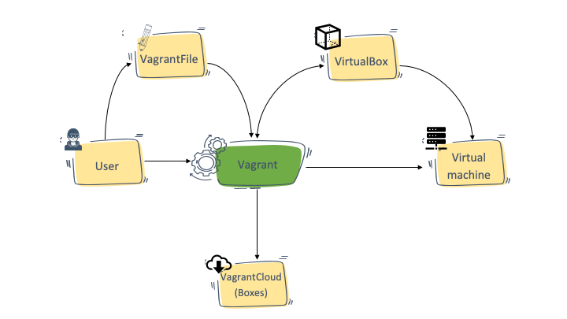

# What is vagrant

It is a wrapper utility that works on top of Virtual machine solutions
like Virtualbox, HyperV, VMware, and also Docker. It abstracts away all
the complex activities involved in managing a VM through the VM
solutions and can automate most of the tasks.

# Vagrant architecture



# Vagrant file

It's like Dockerfile and you can create virtual development environments
from exiting VM images and have all the VM configs.

Sample:
```ruby
# -*- mode: ruby -*-
# vi: set ft=ruby :

Vagrant.configure("2") do |config|

    config.vm.box = "ubuntu/trusty64"
  
    config.vm.network "private_network", ip: "192.168.33.10"
  
    config.vm.provider "virtualbox" do |vb|
      vb.memory = "1024"
    end
end
```

# Vagrant Use Cases

* Development Environments - create identical development environments
	for all the developers in a team.
* Sandboxed environments - for testing purposes

# Vagrantfile options

## Network configuration

### Set IP address (NAT)

```ruby
config.vm.network "private_network", ip: "192.168.33.10"
```
It means, we are enabling the private network and setting the IP address
of the VM to 192.168.33.10.

### Set IP address (bridge)

If you want to enable access to the VM from a different computer on your
wifi network, enable the following option.

```ruby
config.vm.network "public_network"
```
> **Note:** When you bring up the VM, it will ask for the interface to
bridge 

### Port Forward

```ruby
config.vm.network "forwarded_port", guest: 80, host: 8080
```

## Shared Folder

### Default Shared Folder

Every Vagrant VM will have a /vagrant folder. This folder is mounted to
the host folder where you have the Vagrantfile. Meaning, the project
folder you create to have the Vagrantfile will be mounted inside the VM
on /vagrant location.

### Custom Shared Folder Location

```ruby
config.vm.synced_folder "/host/dir/", "/vm/dir"
```

> /host/dir/ is the folder present in the host machine and /vm/dir is
 the location inside the Vagrant VM.

## Custom CPU & Memory 

```ruby
config.vm.provider "virtualbox" do |vb|
    vb.memory = 2048
    vb.cpus = 1
end
```

## Set hostname

```ruby
config.vm.hostname = "myhost.ostechnix.example"
```


## Provisioner

The best thing about Vagrant is that you can add provisioning scripts to
Vagrantfile.

Here is an example of having shell script as provisioner.

```ruby
config.vm.provision "shell", inline: <<-SHELL
    apt-get update
    apt-get install -y apache2
    service apache2 start
  SHELL
```

# Sample Vagrantfiles

## Single VM Vagrantfile

```ruby
# -*- mode: ruby -*-
# vi: set ft=ruby :

Vagrant.configure("2") do |config|

  config.vm.box = "ubuntu/trusty64"

  config.vm.network "private_network", ip: "192.168.33.10"
  config.vm.network "public_network"
  config.vm.network "forwarded_port", guest: 80, host: 8080

  config.vm.synced_folder "code/", "/app/code"

  config.vm.provider "virtualbox" do |vb|
    vb.memory = 2048
    vb.cpus = 1
  end

  config.vm.provision "shell", inline: <<-SHELL
    apt-get update
    apt-get install -y apache2
    service apache2 start
  SHELL
end
```

## Multi VM Vagrantfile

```ruby
Vagrant.configure("2") do |config|
  config.vm.provision "shell", inline: "echo Hello"

  config.vm.define "web" do |web|
    web.vm.box = "ubuntu/trusty64"
    web.vm.network "private_network", ip: "192.168.33.20"
    web.vm.synced_folder "code/", "/app/code"
    web.vm.provider "virtualbox" do |vb|
        vb.memory = 1048
        vb.cpus = 1
    end
  end

  config.vm.define "db" do |db|
    db.vm.box = "ubuntu/trusty64"
    db.vm.network "private_network", ip: "192.168.33.30"
    db.vm.synced_folder "data/", "/db/data"
    db.vm.provider "virtualbox" do |vb|
        vb.memory = 2048
        vb.cpus = 1
    end
  end
end
```

## Multi VM Vagrantfile With Loop

```ruby
Vagrant.configure("2") do |config|

  (2..4).each do |i|
    config.vm.define "vm-#{i}" do |web|
      web.vm.box = "ubuntu/trusty64"
      web.vm.network "private_network", ip: "192.168.33.#{i}", auto_config: false
      web.vm.provision "shell", inline: "echo hello #{i}"
      web.vm.synced_folder "code/", "/app/code"
    end
  end
end
```

# Provisioning

## Shell

### Inline

```ruby
Vagrant.configure("2") do |config|
  config.vm.provision "shell",
    inline: "echo Hello, World"
end
```

### Script
```ruby
$script = <<-SCRIPT
echo I am provisioning...
date > /etc/vagrant_provisioned_at
SCRIPT

Vagrant.configure("2") do |config|
  config.vm.provision "shell", inline: $script
end
```

### External scripts
```ruby
Vagrant.configure("2") do |config|
  config.vm.provision "shell", path: "script.sh"
end
```

### Script with args
```ruby
Vagrant.configure("2") do |config|
  config.vm.provision "shell" do |s|
    s.inline = "echo $1"
    s.args   = ["hello, world!"]
  end
end
```

## File

The Vagrant file provisioner allows you to upload a file or directory
from the host machine to the guest machine.

```ruby
Vagrant.configure("2") do |config|
  # ... other configuration

  config.vm.provision "file", source: "~/.gitconfig", destination: ".gitconfig"
end
```

Related:
```
* https://devopscube.com/vagrant-tutorial-beginners
* https://ostechnix.com/how-to-configure-networking-in-vagrant/
* https://developer.hashicorp.com/vagrant/docs/vagrantfile
* https://developer.hashicorp.com/vagrant/docs/provisioning/basic_usage
* https://developer.hashicorp.com/vagrant/docs/provisioning/shellhttps://developer.hashicorp.com/vagrant/docs/provisioning/shell 
* https://developer.hashicorp.com/vagrant/docs/provisioning/file
* https://developer.hashicorp.com/vagrant/docs/provisioning/ansible_intro 
* https://developer.hashicorp.com/vagrant/docs/provisioning/ansible_local
* https://developer.hashicorp.com/vagrant/docs/provisioning/ansible
* https://developer.hashicorp.com/vagrant/docs/provisioning/ansible_common
* https://developer.hashicorp.com/vagrant/docs/provisioning/podman
* https://developer.hashicorp.com/vagrant/docs/provisioning/docker
```
